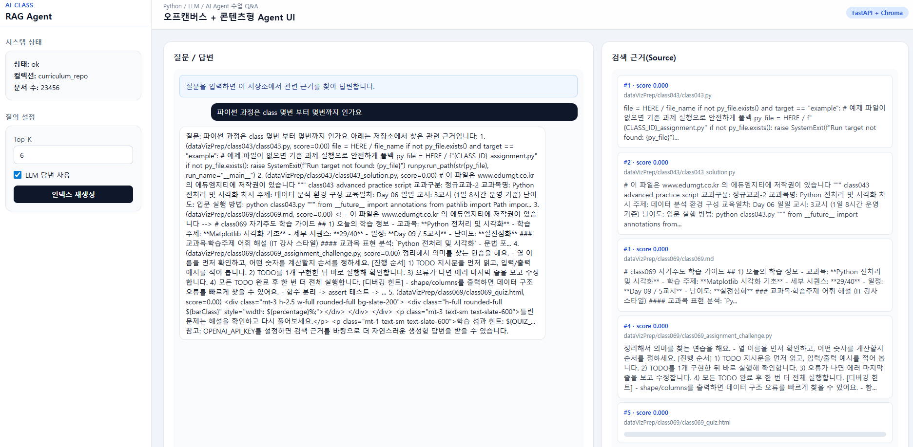

# Agent (RAG + FastAPI + Docker)

이 폴더는 현재 저장소 전체를 RAG로 인덱싱하고, 학습 중 궁금한 내용을 질의응답할 수 있는 FastAPI 기반 AI Agent 서버입니다.

## 1) 아키텍처
- Vector DB: `ChromaDB` (로컬 영속 저장)
- 임베딩: `HashingVectorizer` 기반 로컬 임베딩(모델 다운로드 없이 동작)
- API: `FastAPI`
- FE: Tailwind 기반 오프캔버스 + 콘텐츠 레이아웃 (`/` 경로)
- LLM 응답(선택): `OPENAI_API_KEY` 설정 시 OpenAI 모델 사용
- LLM 키가 없을 때: 검색 근거 기반 요약 답변으로 자동 fallback
- 질의 라우팅: 구조화 질의(`몇번부터 몇번`)는 `curriculum_index.csv` 규칙 기반 정확 응답, 일반 질의는 하이브리드 RAG
- 클래스 힌트 부스팅: 질문에 `class001` 같은 패턴이 있으면 해당 클래스 경로 문서를 우선 검색

흐름:
1. 저장소 파일(`.md`, `.py`, `.html`, `.csv` 등)을 청크 분할
2. ChromaDB에 벡터 저장
3. 질문 입력 시 의도 라우팅(구조화 범위 질의 vs 일반 질의)
4. 일반 질의는 벡터+키워드 하이브리드 재정렬 검색
5. 검색 근거 기반 답변 생성(LLM 또는 fallback)

## 2) 폴더 구성
- `app/main.py`: FastAPI 엔트리포인트 (`/health`, `/v1/ask`, `/v1/reindex`)
- `app/ingest.py`: 저장소 인덱싱 CLI
- `app/rag_engine.py`: 파일 수집/청크/벡터 저장/검색
- `app/agent_service.py`: 답변 생성 로직(LLM + fallback)
- `docker-compose.yml`: Docker 실행 구성
- `Dockerfile`: API 이미지 빌드
- `scripts/start.sh`: 컨테이너 시작 시 인덱싱 + 서버 실행

## 3) Docker로 서빙(권장)

### 3.1 사전 준비
1. `Agent/.env.example` 복사
```bash
cd Agent
cp .env.example .env
```
2. OpenAI 생성형 답변 사용 시 `.env`에 `OPENAI_API_KEY` 입력

### 3.2 빌드 및 실행
```bash
cd Agent
docker compose up -d --build
```

### 3.3 상태 확인
```bash
docker compose ps
curl http://localhost:8000/health
```

정상 응답 예시:
```json
{
  "status": "ok",
  "collection": "curriculum_repo",
  "documents": 12345
}
```

브라우저 UI:
- `http://localhost:8000/` 접속



- 좌측 오프캔버스에서 Top-K, LLM 사용, 재인덱스 제어
- 우측 콘텐츠에서 질문/응답과 source 근거 확인

### 3.4 질문 API 사용
```bash
curl -X POST http://localhost:8000/v1/ask \
  -H "Content-Type: application/json" \
  -d '{
    "question": "class001에서 가상환경을 왜 쓰나요?",
    "top_k": 6,
    "use_llm": true
  }'
```

응답 필드:
- `answer`: 최종 답변
- `sources[]`: 근거 문서 경로/점수/청크
- `mode`: `subject_range` 또는 `rag`
- `matched_subject`: 라우팅 시 매칭된 교과목명(있으면)

### 3.5 인덱스 재생성
저장소 내용이 크게 변경되면 재인덱싱:
```bash
curl -X POST "http://localhost:8000/v1/reindex?force=true"
```

### 3.6 Docker Hub Public 배포(강사용)
아래 예시는 Docker Hub 저장소가 `edumgt/ai-class` 인 경우입니다.

1. Docker Hub 로그인
```bash
docker login
```
2. 이미지 빌드(레포 루트에서 실행)
```bash
cd /path/to/Python-AI_Agent-Class
docker build -f Agent/Dockerfile -t edumgt/ai-class:tagname .
```
3. 태그 추가(권장: 날짜/버전 태그 병행)
```bash
docker tag edumgt/ai-class:tagname edumgt/ai-class:latest
```
4. Public 푸시
```bash
docker push edumgt/ai-class:tagname
docker push edumgt/ai-class:latest
```

권장(로컬 빌드 + Hub 동시 반영 자동화):
```bash
./Agent/scripts/push_dockerhub.sh tagname
```
- 위 스크립트는 항상 `edumgt/ai-class:tagname`과 `edumgt/ai-class:latest`를 함께 push합니다.

푸시 전 필수 설정:
1. Docker Hub에서 `edumgt/ai-class` 저장소를 생성(공개 Public)
2. 로컬 Docker 로그인 계정이 `edumgt` 네임스페이스 push 권한을 가져야 함
3. 로그인 확인
```bash
docker login
docker info | grep Username
```
4. 권한 오류(`denied: requested access to the resource is denied`)가 나면
- 로그인 계정 재확인 (`docker logout && docker login`)
- 저장소명 오타 확인 (`edumgt/ai-class`)
- 조직/팀 권한에서 Write 권한 확인

### 3.7 Docker Hub 이미지 pull 후 실행(수강생용)
수강생은 이 레포를 먼저 클론한 뒤, 아래처럼 이미지 pull 후 실행하면 됩니다.

1. 이미지 pull
```bash
docker pull edumgt/ai-class:tagname
```
2. 컨테이너 실행(레포 경로 마운트 + 벡터DB 볼륨 생성)
```bash
cd /path/to/Python-AI_Agent-Class
docker volume create agent_vector_db
docker run -d \
  --name curriculum-rag-agent \
  -p 8000:8000 \
  -e REPO_ROOT=/srv/repo \
  -e VECTOR_DB_PATH=/srv/vector_db \
  -e VECTOR_COLLECTION=curriculum_repo \
  -e OPENAI_API_KEY=YOUR_KEY_OPTIONAL \
  -v "$(pwd)":/srv/repo:ro \
  -v agent_vector_db:/srv/vector_db \
  edumgt/ai-class:tagname
```
3. 동작 확인
```bash
curl http://localhost:8000/health
```
4. 중지/재시작
```bash
docker stop curriculum-rag-agent
docker start curriculum-rag-agent
```

> Windows PowerShell의 경우 마운트 경로는 `-v "${PWD}:/srv/repo:ro"` 형태를 사용하세요.

## 4) 로컬(비 Docker) 실행
```bash
cd Agent
python3 -m venv .venv
source .venv/bin/activate
pip install -r requirements.txt
python -m app.ingest --repo-root .. --db-path ./data/chroma --collection curriculum_repo
uvicorn app.main:app --host 0.0.0.0 --port 8000
```

> 로컬 실행 시 `REPO_ROOT`를 `..`(저장소 루트)로 맞추거나 CLI 인자를 사용하세요.

## 5) 운영 팁
- 첫 실행은 인덱싱 시간이 걸릴 수 있음(파일 수 많음)
- 벡터DB는 Docker 볼륨 `agent_vector_db`에 저장되어 재시작 후 재사용
- LLM 호출 실패 시 자동으로 검색 기반 fallback 답변 제공
- 질의 품질 향상 팁:
  - 클래스 ID 포함: `class001`, `class320` 등
  - 파일명 포함: `class001.md`, `class001_quiz.html`
  - 주제 키워드 포함: `가상환경`, `RAG`, `PromptTemplate`

## 6) 문제 해결
- `documents`가 0이면:
  - `docker compose logs -f agent-api`로 인덱싱 로그 확인
  - `/v1/reindex?force=true` 재실행
- `OpenAI` 오류가 나면:
  - `.env`의 `OPENAI_API_KEY` 값 확인
  - 키 없이도 `use_llm=false` 또는 fallback으로 동작
- 포트 충돌 시:
  - `docker-compose.yml`의 `8000:8000` 앞 포트 변경

## 7) 확장 아이디어
- 메타데이터에 `class_id`, `subject`를 추가해 필터 검색
- `/v1/ask`에 `subject`/`class_range` 필터 도입
- 프론트엔드 채팅 UI(예: Streamlit/Next.js) 연동
