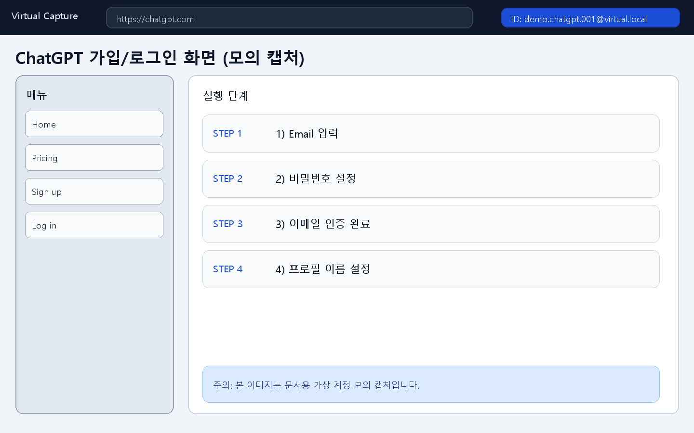
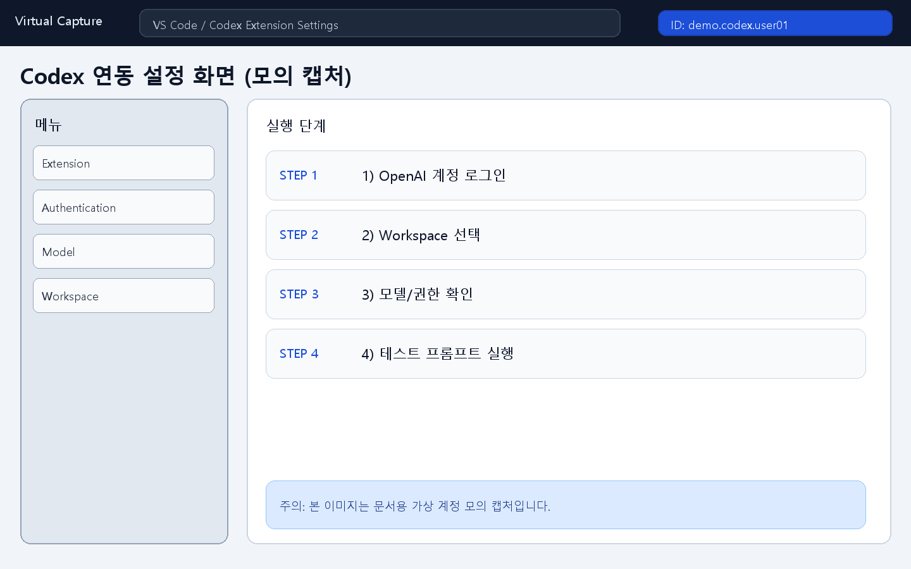
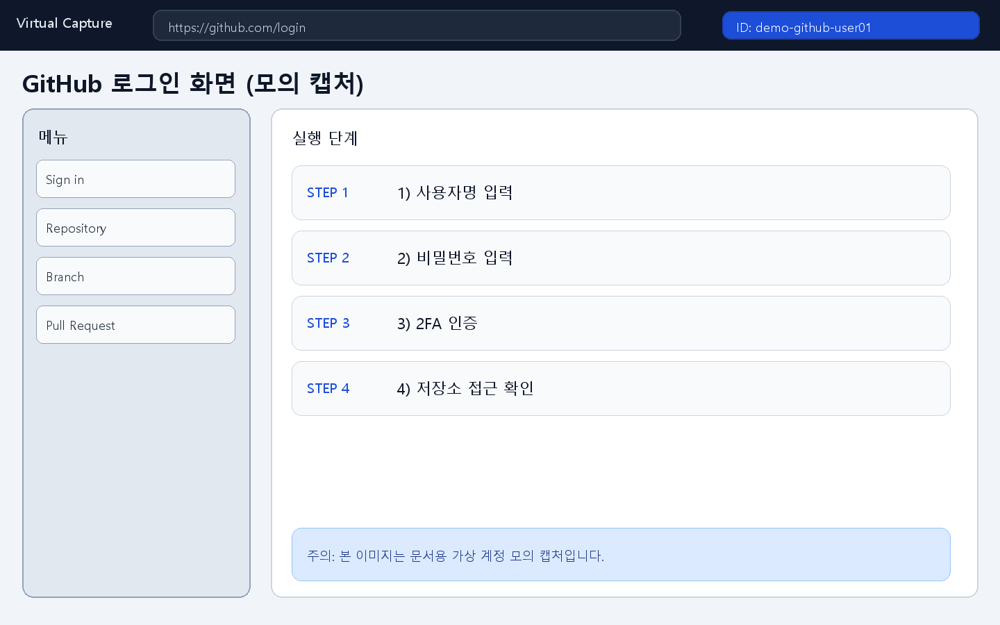
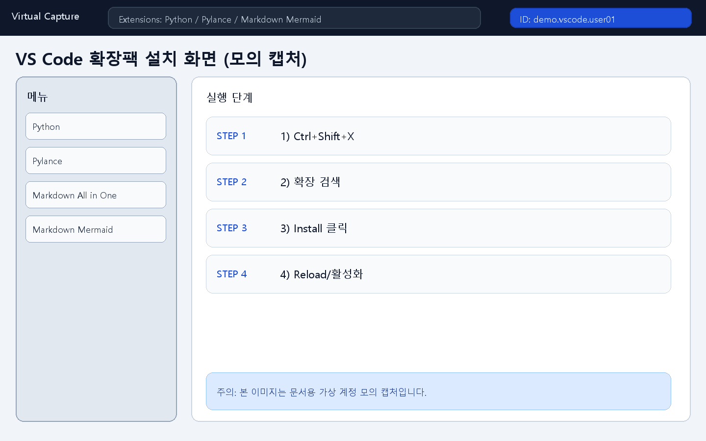
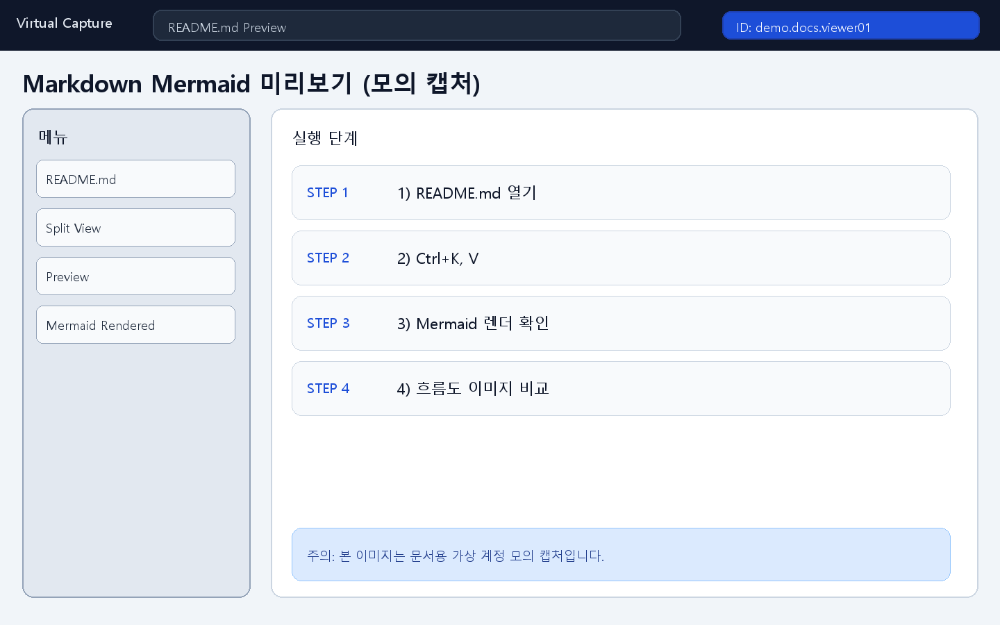
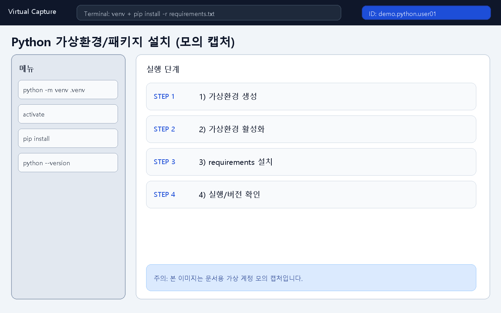
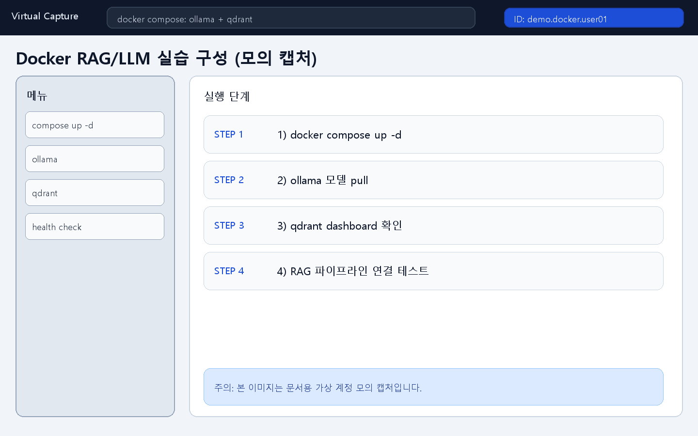

<!-- 이 파일은 www.edumgt.co.kr 의 에듀엠지티에 저작권이 있습니다 -->
# Python · AI Agent Curriculum (class001 ~ class500)

첨부 커리큘럼의 **정규교과 500시간** 기준으로 세분화한 교육 저장소입니다.  
프로젝트 과정은 제외되며, `class001`부터 `class500`까지 차시별 학습 자료를 제공합니다.

## 1) 현재까지 반영된 핵심 작업
- 500개 차시 `classXXX.md` 자동 정비
- 교과목/학습주제 용어 해설(문법, 한글·한자, 영어, 기술 설명) 반영
- 각 차시별 **서로 다른 Mermaid Flowchart** 생성
- 각 차시별 Flow를 **PNG 캡처 이미지(`classXXX_flow.png`)**로 생성 및 md 참조 연결
- 예제/퀴즈/런처/과제 파일 체계 정비

## 2) 기술 스택
- Language: `Python 3.10+` (권장 3.11)
- Data/ML: `numpy`, `pandas`, `matplotlib`, `scikit-learn`
- AI/LLM: `langchain`, `langchain-community`
- Speech: `pyttsx3`, `SpeechRecognition`
- Utility: `requests`, `Pillow`
- Docs: `Markdown`, `Mermaid`
- Dev Tools: `VS Code`, `Git`, `GitHub`, `ChatGPT`, `Codex`
- Optional Infra: `Docker`, `Docker Compose` (RAG/LLM 실습용)

## 3) 저장소 구조
- `class001/` ~ `class500/`
  - `classXXX.md`: 자기주도 학습 가이드(개념, 실습, 퀴즈 안내)
  - `classXXX_flow.png`: 해당 차시 흐름도 PNG
  - `classXXX.py`: 실행 런처
  - `classXXX_example.py`: 예제 코드
  - `classXXX_solution.py`: 정답 코드
  - `classXXX_assignment.py`: 과제 디스패처
  - `classXXX_assignment_basic.py`: 기본 과제
  - `classXXX_assignment_advanced.py`: 심화 과제
  - `classXXX_assignment_challenge.py`: 챌린지 과제
  - `classXXX_quiz.html`: 5문항 퀴즈
  - `instructor_notes.md`: 강사용 해설서
- `tools/`: 콘텐츠 재생성/검증 스크립트
- `curriculum_index.csv`: 전체 차시 인덱스
- `INSTRUCTOR_GUIDE.md`: 강의 운영 가이드
- `AUTOGRADING.md`, `SUBMISSION_GRADING_GUIDE.md`: 채점/제출 가이드

## 4) 사전 준비 (필수 설치)

### 4.1 VS Code 설치
1. https://code.visualstudio.com 접속
2. 운영체제별 설치 파일 다운로드/설치
3. 실행 후 `File > Open Folder`로 저장소 열기

### 4.2 GitHub 가입
1. https://github.com 가입
2. 이메일 인증
3. 프로필 기본 설정(사용자명/이메일)

### 4.3 ChatGPT 가입
1. https://chatgpt.com 접속
2. 이메일 또는 소셜 계정으로 가입
3. 계정 인증 완료 후 기본 프로필 설정
4. 프로젝트 학습용 대화 폴더(예: `Python-AI-Agent-Class`)를 만들어 관리

### 4.4 Git 설치 및 초기 설정
1. https://git-scm.com/downloads 설치
2. 버전 확인
```bash
git --version
```
3. 사용자 정보 등록
```bash
git config --global user.name "YOUR_NAME"
git config --global user.email "YOUR_EMAIL@example.com"
```

### 4.5 Python 설치
1. https://www.python.org/downloads 설치
2. Windows 설치 시 `Add Python to PATH` 체크
3. 버전 확인
```bash
python --version
```

### 4.6 Docker Desktop 설치 (선택, RAG/LLM 실습용)
1. https://www.docker.com/products/docker-desktop 설치
2. 실행 후 버전 확인
```bash
docker --version
docker compose version
```

### 4.7 Codex 연동 방법
아래는 일반적인 연동 절차입니다. 사용 중인 IDE/플러그인 배포 형태에 따라 메뉴명은 다를 수 있습니다.

1. VS Code에서 Codex 관련 확장(또는 에이전트 통합 기능) 설치
2. 확장 설정에서 `Sign in` 또는 `API Key` 입력 방식 선택
3. OpenAI 계정으로 로그인하거나 API Key 등록
4. Workspace(현재 저장소) 권한/모델 설정 확인
5. 테스트 프롬프트로 연결 상태 점검

API Key 사용 시(선택):
```bash
# Windows PowerShell
$env:OPENAI_API_KEY="YOUR_KEY"

# Linux/macOS
export OPENAI_API_KEY="YOUR_KEY"
```

## 5) VS Code 권장 확장팩
- `Python` (`ms-python.python`)
- `Pylance` (`ms-python.vscode-pylance`)
- `Jupyter` (`ms-toolsai.jupyter`) - 선택
- `Markdown All in One` (`yzhang.markdown-all-in-one`)
- `Markdown Preview Mermaid Support` (`bierner.markdown-mermaid`)
- `Docker` (`ms-azuretools.vscode-docker`) - Docker 실습 시
- `Git Graph` (`mhutchie.git-graph`) - 선택

설치 방법:
1. VS Code 좌측 Extensions (`Ctrl+Shift+X`)
2. 확장 이름 검색
3. `Install`

## 5-1) 솔루션/플랫폼 화면 캡처 (가상 아이디 모의)
보안/개인정보 보호를 위해 아래 이미지는 **가상 아이디 기반 모의 캡처**입니다.

### ChatGPT 가입/로그인


### Codex 연동 설정


### GitHub 로그인/저장소 접근


### VS Code 확장팩 설치


### Markdown Mermaid 미리보기


### Python 가상환경/라이브러리 설치


### Docker 기반 RAG/LLM 실습 구성


## 6) Markdown/MD 이해 및 뷰어

### 6.1 md 파일 의미
- `.md`는 Markdown 문서 포맷
- 코드, 표, 체크리스트, Mermaid 다이어그램을 텍스트 기반으로 관리

### 6.2 md 파일 보기
- VS Code에서 파일 열고 `Ctrl+Shift+V` (미리보기)
- 또는 `Ctrl+K` 후 `V` (옆 미리보기)

### 6.3 Mermaid 사용/가입 안내
- Mermaid 자체 사용은 **가입이 필요 없음**
- VS Code 미리보기 또는 GitHub 렌더링으로 바로 확인 가능
- 선택: 협업형 편집이 필요하면 https://www.mermaidchart.com 가입 사용 가능

## 7) 환경 구성 (가상환경 + 라이브러리 설치)

### 7.1 Windows PowerShell
```powershell
cd C:\DevOps\Python-AI_Agent-Class
python -m venv .venv
.\.venv\Scripts\Activate.ps1
python -m pip install --upgrade pip
pip install -r requirements.txt
```

### 7.2 Linux/macOS (bash)
```bash
cd /path/to/Python-AI_Agent-Class
python3 -m venv .venv
source .venv/bin/activate
python -m pip install --upgrade pip
pip install -r requirements.txt
```

## 8) `requirements.txt` 구성과 의미
현재 파일은 “실전/심화 과제 수행에 필요한 선택 패키지” 중심입니다.

```txt
pandas>=2.0
numpy>=1.26
matplotlib>=3.8
scikit-learn>=1.4
requests>=2.31
pyttsx3>=2.90
SpeechRecognition>=3.10
langchain>=0.3
langchain-community>=0.3
Pillow>=10.0
```

패키지 용도:
- `pandas`, `numpy`: 데이터 전처리/수치 계산
- `matplotlib`: 시각화
- `scikit-learn`: ML 기초 실습
- `requests`: API 호출
- `pyttsx3`, `SpeechRecognition`: TTS/STT 실습
- `langchain`, `langchain-community`: LLM/체인/RAG 실습
- `Pillow`: 이미지 생성/처리(Flow PNG 생성 포함)

관리 팁:
- 새 라이브러리 설치 후 동기화
```bash
pip install package_name
pip freeze > requirements.txt
```
- 팀 작업 시 버전 범위를 명시해 재현성 확보

## 9) Git/GitHub 기본 사용법

### 9.1 최초 클론
```bash
git clone <REPO_URL>
cd Python-AI_Agent-Class
```

### 9.2 기본 작업 루프
```bash
git checkout -b feature/readme-update
git status
git add README.md
git commit -m "docs: expand onboarding and setup guide"
git push -u origin feature/readme-update
```

### 9.3 최신 반영
```bash
git checkout main
git pull origin main
```

## 10) 학습 시작 명령
빠른 실행:
```bash
python class001/class001.py
```

기본 과제:
```bash
python class001/class001_assignment.py
```

심화 과제:
```bash
CLASS_TIER=advanced python class001/class001_assignment.py
```

챌린지 과제:
```bash
CLASS_TIER=challenge python class001/class001_assignment.py
```

자동채점:
```bash
python grade_class.py class001 --tier basic
python grade_all.py --tier basic
```

## 11) Mermaid/Flow 재생성 관련
차시 자료 재생성 스크립트:
```bash
python tools/rebuild_self_study_materials.py
```

실행 시 수행 작업:
- class별 md 갱신
- class별 Mermaid flow 갱신
- class별 PNG(`classXXX_flow.png`) 재생성

README용 모의 캡처 이미지 재생성:
```bash
python tools/generate_readme_mock_screenshots.py
```

## 12) RAG/LLM 실습용 Docker 구성 가이드

아래는 로컬 실습 권장 구성 예시입니다.
- LLM 서버: `Ollama`
- 벡터DB: `Qdrant`

예시 `docker-compose.yml`:
```yaml
services:
  ollama:
    image: ollama/ollama:latest
    container_name: ollama
    ports:
      - "11434:11434"
    volumes:
      - ollama_data:/root/.ollama
    restart: unless-stopped

  qdrant:
    image: qdrant/qdrant:latest
    container_name: qdrant
    ports:
      - "6333:6333"
      - "6334:6334"
    volumes:
      - qdrant_data:/qdrant/storage
    restart: unless-stopped

volumes:
  ollama_data:
  qdrant_data:
```

실행:
```bash
docker compose up -d
docker compose ps
```

모델 다운로드(예: Llama 계열):
```bash
docker compose exec ollama ollama pull llama3.1:8b
```

연동용 추가 패키지(필요 시):
```bash
pip install langchain-ollama qdrant-client sentence-transformers
```

기본 연결 확인:
- Ollama: `http://localhost:11434`
- Qdrant: `http://localhost:6333/dashboard`

## 13) 운영 방식
- 권장 수업 흐름: **설명 10분 + 실습 30분 + 정리 10분**
- 일 운영 기준: **하루 8시간**

## 14) GitHub Actions
푸시/PR 시 자동 실행:
- Python 문법 체크
- 기본 자동채점 샘플 실행
- 저장소 구조 확인

워크플로우 파일:
- `.github/workflows/autograde.yml`

## 15) 권장 브랜치 운영
- `main`: 배포/기준 브랜치
- `develop`: 통합 개발 브랜치
- `feature/class-xxx-*`: 차시별 수정 브랜치

## 16) 라이선스
본 교육 자료의 저작권 및 라이선스 권한은 **에듀엠지티**에 있습니다.  
교육, 사내공유, 외부배포, 상용활용 등 형태와 관계없이 사용 전 **사전고지(사전 안내/승인 절차)**가 필요합니다.
