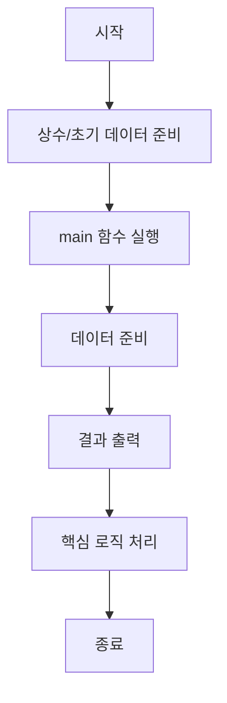

<!-- 이 파일은 www.edumgt.co.kr 의 에듀엠지티에 저작권이 있습니다 -->
# class054 자기주도 학습 가이드

## 1) 오늘의 학습 정보
- 교과목: **Python 전처리 및 시각화**
- 학습 주제: **결측치/이상치 처리**
- 세부 시퀀스: **14/40**
- 일정: **Day 07 / 6교시**
- 난이도: **기초응용**

## 2) 이전에 배운 내용 (복습)
- 이전 차시: **class053 / 결측치/이상치 처리** (Day 07 / 5교시)
- 복습 연결: 이전에 배운 **결측치/이상치 처리** 를 떠올리며, 오늘 **결측치/이상치 처리** 와 어떤 점이 이어지는지 비교해 보세요.

## 3) 주제를 아주 쉽게 이해하기
- 한 줄 설명: 표 형태 데이터를 정리하고, 눈으로 이해하기 쉽게 만드는 방법을 배워요.
- 왜 배우나요?: 정리된 데이터는 실수를 줄여 주고, 중요한 패턴을 빨리 발견하게 도와줘요.

### 핵심 개념 3가지
1. 데이터는 수집 후 바로 쓰지 않고 먼저 정리(전처리)해야 해요.
2. 열(column) 이름을 명확하게 두면 분석 과정이 쉬워져요.
3. 평균, 합계 같은 간단한 통계로도 큰 힌트를 얻을 수 있어요.

### 비유로 이해하기
- 지저분한 책상을 정리하면 필요한 물건을 빨리 찾을 수 있는 것과 같아요.

## 4) 실습 환경 만들기 (항상 먼저)
아래 명령은 **처음 한 번** 준비해 두면 이후 학습이 쉬워집니다.

### Windows PowerShell
```powershell
cd C:\DevOps\Python-AI_Agent-Class
python -m venv .venv
.\.venv\Scripts\Activate.ps1
python -m pip install --upgrade pip
pip install -r requirements.txt
```

### Linux/macOS (bash)
```bash
cd /path/to/Python-AI_Agent-Class
python3 -m venv .venv
source .venv/bin/activate
python -m pip install --upgrade pip
pip install -r requirements.txt
```

## 5) 오늘의 예제 코드
- 예제 파일: `class054_example.py`
- 실행 명령:
```bash
python class054/class054_example.py
```

<!-- AUTO-GENERATED: TECH_STACK_FLOW START -->
### 기술 스택
- 언어: `Python 3`
- 실행: `CLI` (`python class054/class054_example.py`)
- 주요 문법: `함수`, `조건문`, `반복문`, `출력(print)`
- 사용 모듈: `datetime`

### 실습 example.py 동작 원리 (Mermaid Flowchart)

<!-- AUTO-GENERATED: TECH_STACK_FLOW END -->

### 예제 코드를 볼 때 집중할 포인트
1. 입력이 무엇인지 먼저 찾기
2. 처리 규칙(함수/조건/반복) 확인하기
3. 출력 결과가 목표와 맞는지 점검하기

## 6) 퀴즈로 복습하기 (5문항)
- 퀴즈 파일: `class054_quiz.html`
- 브라우저에서 열기:
```bash
class054/class054_quiz.html
```
- 버튼 설명:
1. `채점하기`: 현재 선택한 답으로 점수를 계산해요.
2. `다시풀기`: 선택을 모두 지우고 처음부터 다시 풀어요.

## 7) 혼자 실습 순서 (초등학생 버전)
1. 코드를 한 번 그대로 실행해요.
2. 숫자/문장 값을 1개 바꿔요.
3. 결과가 왜 바뀌었는지 한 줄로 적어요.
4. 함수를 1개 더 만들어 작은 기능을 추가해요.

### 실습 미션
1. 예제 데이터를 보고 어떤 열이 있는지 소리 내어 읽어 봐요.
2. 점수/길이 같은 숫자 열의 평균을 직접 계산해 봐요.
3. 출력 순서를 바꿔서 내가 보기 편한 리포트를 만들어 봐요.

## 8) 스스로 점검 체크리스트
- [ ] 데이터 항목 이름을 정확히 이해했다.
- [ ] 정리 전/정리 후 차이를 설명할 수 있다.
- [ ] 평균/최댓값/최솟값 중 1개 이상을 계산했다.

## 9) 막히면 이렇게 해결해요
1. 에러 메시지 마지막 줄을 먼저 읽어요.
2. 함수 이름과 괄호 짝을 확인해요.
3. `print()`를 넣어 중간 값을 확인해요.
4. 그래도 안 되면 어제 성공한 코드와 한 줄씩 비교해요.

## 10) 학습 후 다음에 배울 내용
- 다음 차시: **class055 / 결측치/이상치 처리** (Day 07 / 7교시)
- 미리보기: 다음 차시 전에 **결측치/이상치 처리** 핵심 코드 1개를 다시 실행해 두면 결측치/이상치 처리 학습이 더 쉬워집니다.

## 11) 다음 차시 연결
- 다음 차시에서는 더 큰 데이터에서도 같은 정리 원칙을 적용해 볼 거예요.
- 오늘 코드를 복사하지 말고, 직접 다시 작성해 보세요.
