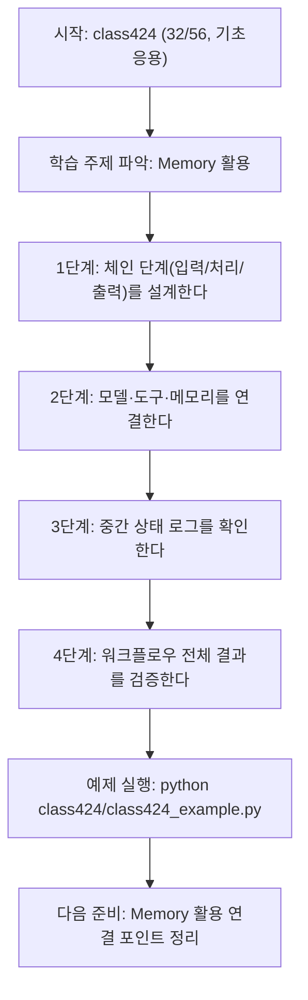
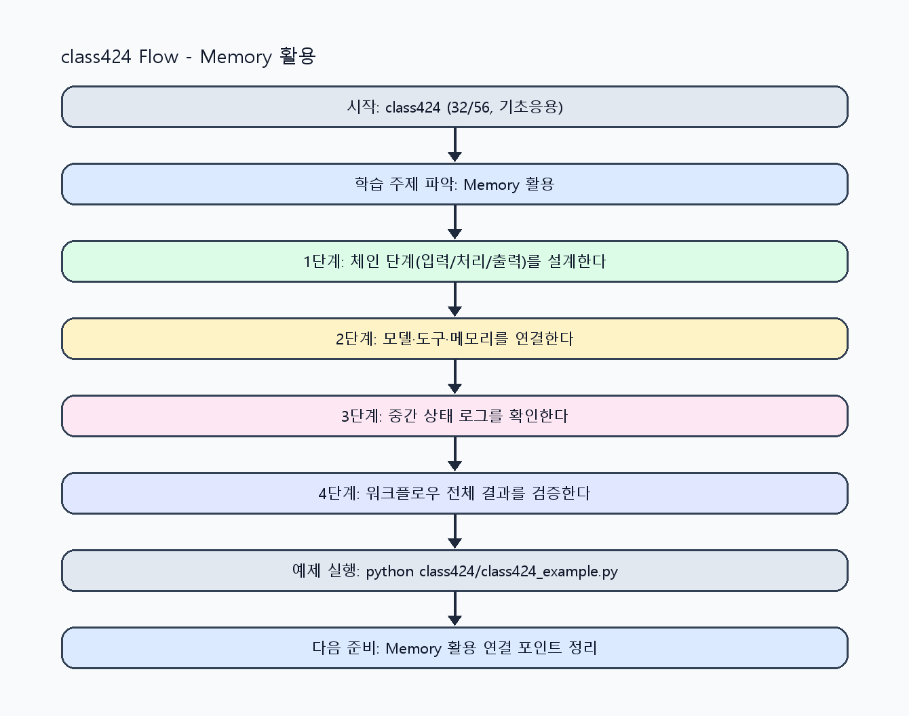

<!-- 이 파일은 www.edumgt.co.kr 의 에듀엠지티에 저작권이 있습니다 -->
# class424 자기주도 학습 가이드

## 1) 오늘의 학습 정보
- 교과목: **Langchain 활용하기**
- 학습 주제: **Memory 활용**
- 세부 시퀀스: **32/56**
- 일정: **Day 53 / 8교시**
- 난이도: **기초응용**

### 교과목·학습주제 어휘 해설 (IT 강사 스타일)
#### 교과목 표현 분석: `Langchain 활용하기`
- 문법 포인트: 동사 어간 + '-기' 명사형 구조입니다. 학습 행동 자체를 주제로 명사화한 표현입니다.
- 기술 포인트: 체인 기반 워크플로우를 구성해 서비스형 AI를 구현하는 교과목입니다.
| 용어 | 문법/품사 | 한글·한자 | 영어 | 기술 설명 |
| --- | --- | --- | --- | --- |
| `LangChain` | 고유명사(프레임워크명) | LangChain (한자 없음) | LangChain | LLM 애플리케이션을 체인/도구 기반으로 구성하는 프레임워크입니다. |
| `활용` | 명사/동사 어근 | 활용 (活用) | utilization | 이론이나 도구를 실제 문제 해결 맥락에 적용하는 행위입니다. |

#### 학습주제 표현 분석: `Memory 활용`
- 문법 포인트: 핵심 개념 명사를 중심으로 한 명사구 구조입니다.
- 기술 포인트: 이번 차시는 `Memory 활용` 용어를 중심으로 문제 정의, 코드 구현, 결과 검증까지 연결합니다.
| 용어 | 문법/품사 | 한글·한자 | 영어 | 기술 설명 |
| --- | --- | --- | --- | --- |
| `Memory` | 명사(영어) | Memory (한자 없음) | memory | 대화/상태 정보를 보존해 문맥 일관성을 높이는 저장 장치입니다. |
| `활용` | 명사/동사 어근 | 활용 (活用) | utilization | 이론이나 도구를 실제 문제 해결 맥락에 적용하는 행위입니다. |

## 2) 이전에 배운 내용 (복습)
- 이전 차시: **class423 / Memory 활용** (Day 53 / 7교시)
- 복습 연결: 이전에 배운 **Memory 활용** 를 떠올리며, 오늘 **Memory 활용** 와 어떤 점이 이어지는지 비교해 보세요.

## 3) 주제를 아주 쉽게 이해하기
- 한 줄 설명: 작은 작업들을 순서대로 연결해 큰 AI 작업을 만드는 방법을 배워요.
- 왜 배우나요?: 체인 구조를 쓰면 반복 가능한 워크플로우를 만들 수 있어요.

### 핵심 개념 3가지
1. 입력 -> 처리 -> 출력의 단계를 명확히 분리해요.
2. 각 단계 함수는 한 가지 책임만 갖게 만들어요.
3. 체인 중간 결과를 기록하면 디버깅이 쉬워져요.

### 비유로 이해하기
- 샌드위치를 만들 때 재료 준비, 굽기, 포장을 단계별로 나누는 것과 같아요.

## 4) 실습 환경 만들기 (항상 먼저)
아래 명령은 **처음 한 번** 준비해 두면 이후 학습이 쉬워집니다.

### Windows PowerShell
```powershell
cd C:\DevOps\Python-AI_Agent-Class
python -m venv .venv
.\.venv\Scripts\Activate.ps1
python -m pip install --upgrade pip
pip install -r requirements.txt
```

### Linux/macOS (bash)
```bash
cd /path/to/Python-AI_Agent-Class
python3 -m venv .venv
source .venv/bin/activate
python -m pip install --upgrade pip
pip install -r requirements.txt
```

## 5) 오늘의 예제 코드
- 예제 파일: `class424_example.py`
- 실행 명령:
```bash
python class424/class424_example.py
```

<!-- AUTO-GENERATED: TECH_STACK_FLOW START -->
### 기술 스택
- 언어: `Python 3`
- 실행: `CLI` (`python class424/class424_example.py`)
- 주요 문법: `단계 함수`, `체인 구성`, `중간 상태 점검`, `출력(print)`
- 학습 포커스: `Memory 활용`

### 실습 example.py 동작 원리 (Mermaid Flowchart)


### Flow PNG 캡처

<!-- AUTO-GENERATED: TECH_STACK_FLOW END -->

### 예제 코드를 볼 때 집중할 포인트
1. 입력이 무엇인지 먼저 찾기
2. 처리 규칙(함수/조건/반복) 확인하기
3. 출력 결과가 목표와 맞는지 점검하기

## 6) 퀴즈로 복습하기 (5문항)
- 퀴즈 파일: `class424_quiz.html`
- 브라우저에서 열기:
```bash
class424/class424_quiz.html
```
- 버튼 설명:
1. `채점하기`: 현재 선택한 답으로 점수를 계산해요.
2. `다시풀기`: 선택을 모두 지우고 처음부터 다시 풀어요.

## 7) 혼자 실습 순서 (초등학생 버전)
1. 코드를 한 번 그대로 실행해요.
2. 숫자/문장 값을 1개 바꿔요.
3. 결과가 왜 바뀌었는지 한 줄로 적어요.
4. 함수를 1개 더 만들어 작은 기능을 추가해요.

### 실습 미션
1. 예제의 단계 함수를 하나씩 실행해 중간 결과를 확인해요.
2. 중간 단계에 로그 문장을 추가해 흐름을 추적해요.
3. 새 단계 하나를 넣어 체인을 확장해 봐요.

## 8) 스스로 점검 체크리스트
- [ ] 단계별 입력/출력을 설명할 수 있다.
- [ ] 중간 결과를 출력해 흐름을 확인했다.
- [ ] 단계 순서를 바꿨을 때 변화도 실험했다.

## 9) 막히면 이렇게 해결해요
1. 에러 메시지 마지막 줄을 먼저 읽어요.
2. 함수 이름과 괄호 짝을 확인해요.
3. `print()`를 넣어 중간 값을 확인해요.
4. 그래도 안 되면 어제 성공한 코드와 한 줄씩 비교해요.

## 10) 학습 후 다음에 배울 내용
- 다음 차시: **class425 / Memory 활용** (Day 54 / 1교시)
- 미리보기: 다음 차시 전에 **Memory 활용** 핵심 코드 1개를 다시 실행해 두면 Memory 활용 학습이 더 쉬워집니다.

## 11) 다음 차시 연결
- 다음 차시에서는 체인에 검색과 메모리를 결합해 볼 거예요.
- 오늘 코드를 복사하지 말고, 직접 다시 작성해 보세요.
