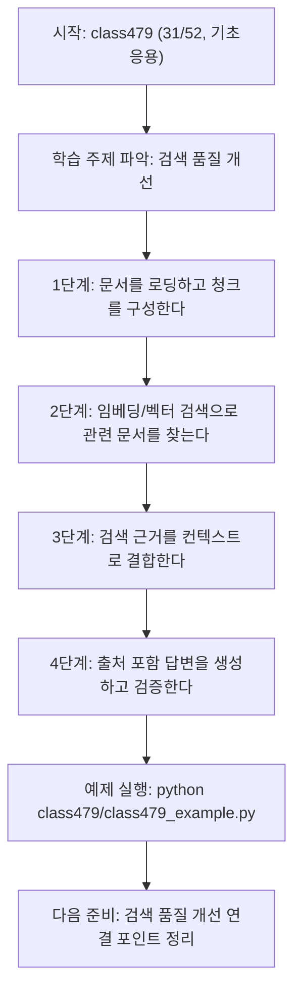
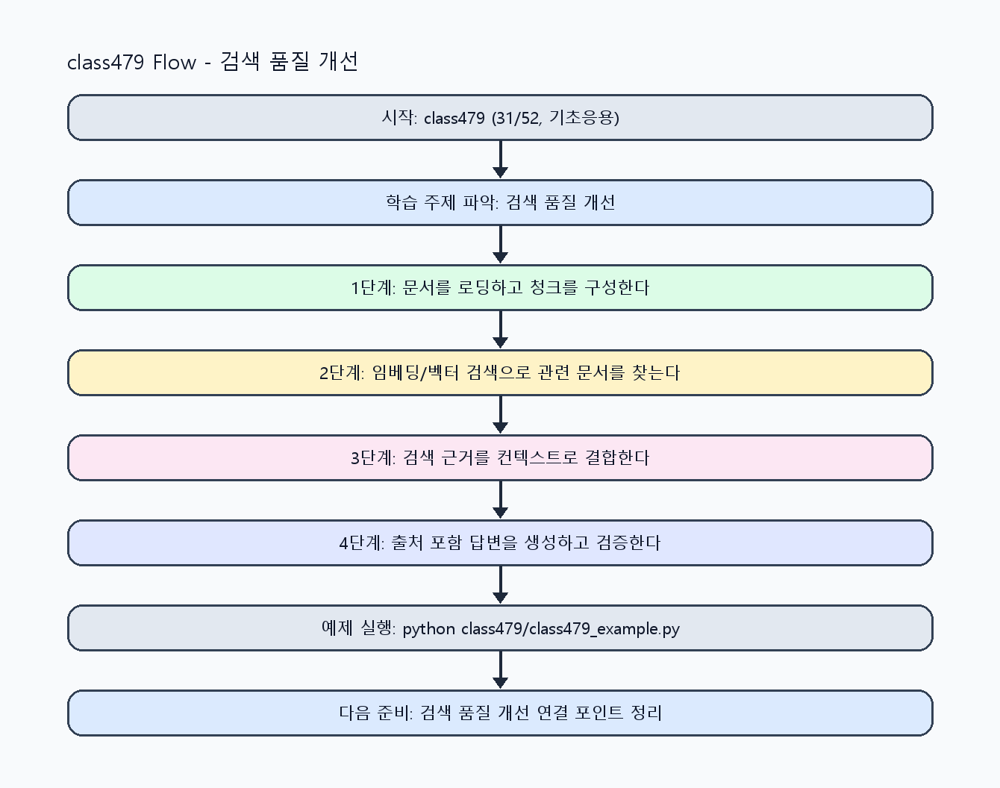

<!-- 이 파일은 www.edumgt.co.kr 의 에듀엠지티에 저작권이 있습니다 -->
# class479 자기주도 학습 가이드

## 1) 오늘의 학습 정보
- 교과목: **RAG(Retrieval-Augmented Generation)**
- 학습 주제: **검색 품질 개선**
- 세부 시퀀스: **31/52**
- 일정: **Day 60 / 7교시**
- 난이도: **기초응용**

### 교과목·학습주제 어휘 해설 (IT 강사 스타일)
#### 교과목 표현 분석: `RAG(Retrieval-Augmented Generation)`
- 문법 포인트: 핵심 개념 명사를 중심으로 한 명사구 구조입니다.
- 기술 포인트: 검색 근거를 결합해 신뢰도 높은 답변을 만드는 RAG 교과목입니다.
| 용어 | 문법/품사 | 한글·한자 | 영어 | 기술 설명 |
| --- | --- | --- | --- | --- |
| `RAG` | 약어명사 | RAG (한자 없음) | Retrieval-Augmented Generation | 검색 결과를 근거로 생성 품질과 신뢰도를 높이는 구조입니다. |
| `Retrieval-Augmented` | 복합 형용어 | Retrieval-Augmented (한자 없음) | retrieval-augmented | 검색 결과를 생성 과정에 보강한다는 RAG 핵심 속성입니다. |
| `Generation` | 명사(영어) | Generation (한자 없음) | generation | 모델이 새 출력 텍스트를 만들어내는 단계입니다. |

#### 학습주제 표현 분석: `검색 품질 개선`
- 문법 포인트: 핵심 개념 명사를 중심으로 한 명사구 구조입니다.
- 기술 포인트: 이번 차시는 `검색 품질 개선` 용어를 중심으로 문제 정의, 코드 구현, 결과 검증까지 연결합니다.
| 용어 | 문법/품사 | 한글·한자 | 영어 | 기술 설명 |
| --- | --- | --- | --- | --- |
| `검색` | 명사 | 검색 (搜索) | retrieval/search | 질문과 유사한 문서를 찾는 단계로 RAG 품질을 좌우합니다. |
| `품질` | 명사(기술 개념어) | 품질 (한자 없음) | (context-specific) | 용어 `품질`: 이번 학습주제에서 정의해야 할 핵심 개념 용어입니다. |
| `개선` | 명사(기술 개념어) | 개선 (한자 없음) | (context-specific) | 용어 `개선`: 이번 학습주제에서 정의해야 할 핵심 개념 용어입니다. |

## 2) 이전에 배운 내용 (복습)
- 이전 차시: **class478 / 검색 품질 개선** (Day 60 / 6교시)
- 복습 연결: 이전에 배운 **검색 품질 개선** 를 떠올리며, 오늘 **검색 품질 개선** 와 어떤 점이 이어지는지 비교해 보세요.

## 3) 주제를 아주 쉽게 이해하기
- 한 줄 설명: 질문과 관련된 자료를 먼저 찾고, 그 자료를 바탕으로 답하는 방법을 배워요.
- 왜 배우나요?: 기억만으로 답하는 것보다 자료를 근거로 답하면 더 정확하고 믿을 수 있어요.

### 핵심 개념 3가지
1. 검색 단계에서 질문과 비슷한 문서를 찾아요.
2. 찾은 문서를 컨텍스트로 넣어 답변을 생성해요.
3. 출처를 함께 보여 주면 답의 신뢰도가 올라가요.

### 비유로 이해하기
- 시험 문제를 풀 때 교과서 해당 페이지를 먼저 찾고 답을 쓰는 방식과 같아요.

## 4) 실습 환경 만들기 (항상 먼저)
아래 명령은 **처음 한 번** 준비해 두면 이후 학습이 쉬워집니다.

### Windows PowerShell
```powershell
cd C:\DevOps\Python-AI_Agent-Class
python -m venv .venv
.\.venv\Scripts\Activate.ps1
python -m pip install --upgrade pip
pip install -r requirements.txt
```

### Linux/macOS (bash)
```bash
cd /path/to/Python-AI_Agent-Class
python3 -m venv .venv
source .venv/bin/activate
python -m pip install --upgrade pip
pip install -r requirements.txt
```

## 5) 오늘의 예제 코드
- 예제 파일: `class479_example.py`
- 실행 명령:
```bash
python class479/class479_example.py
```

<!-- AUTO-GENERATED: TECH_STACK_FLOW START -->
### 기술 스택
- 언어: `Python 3`
- 실행: `CLI` (`python class479/class479_example.py`)
- 주요 문법: `검색 함수`, `유사도 계산`, `근거 결합`, `출력(print)`
- 학습 포커스: `검색 품질 개선`

### 실습 example.py 동작 원리 (Mermaid Flowchart)


### Flow PNG 캡처

<!-- AUTO-GENERATED: TECH_STACK_FLOW END -->

### 예제 코드를 볼 때 집중할 포인트
1. 입력이 무엇인지 먼저 찾기
2. 처리 규칙(함수/조건/반복) 확인하기
3. 출력 결과가 목표와 맞는지 점검하기

## 6) 퀴즈로 복습하기 (5문항)
- 퀴즈 파일: `class479_quiz.html`
- 브라우저에서 열기:
```bash
class479/class479_quiz.html
```
- 버튼 설명:
1. `채점하기`: 현재 선택한 답으로 점수를 계산해요.
2. `다시풀기`: 선택을 모두 지우고 처음부터 다시 풀어요.

## 7) 혼자 실습 순서 (초등학생 버전)
1. 코드를 한 번 그대로 실행해요.
2. 숫자/문장 값을 1개 바꿔요.
3. 결과가 왜 바뀌었는지 한 줄로 적어요.
4. 함수를 1개 더 만들어 작은 기능을 추가해요.

### 실습 미션
1. 예제 문서 목록에서 질문과 가장 비슷한 문서를 찾아요.
2. 검색 결과 1~2개만 사용해 요약 답변을 만드세요.
3. 출처 문장 번호를 함께 출력해 근거를 표시해요.

## 8) 스스로 점검 체크리스트
- [ ] 질문과 문서의 연결 기준을 설명할 수 있다.
- [ ] 검색 결과와 최종 답변을 구분해서 출력했다.
- [ ] 근거(출처)를 답변에 포함했다.

## 9) 막히면 이렇게 해결해요
1. 에러 메시지 마지막 줄을 먼저 읽어요.
2. 함수 이름과 괄호 짝을 확인해요.
3. `print()`를 넣어 중간 값을 확인해요.
4. 그래도 안 되면 어제 성공한 코드와 한 줄씩 비교해요.

## 10) 학습 후 다음에 배울 내용
- 다음 차시: **class480 / 검색 품질 개선** (Day 60 / 8교시)
- 미리보기: 다음 차시 전에 **검색 품질 개선** 핵심 코드 1개를 다시 실행해 두면 검색 품질 개선 학습이 더 쉬워집니다.

## 11) 다음 차시 연결
- 다음 차시에서는 검색 품질을 높이는 인덱싱 전략을 배워요.
- 오늘 코드를 복사하지 말고, 직접 다시 작성해 보세요.
