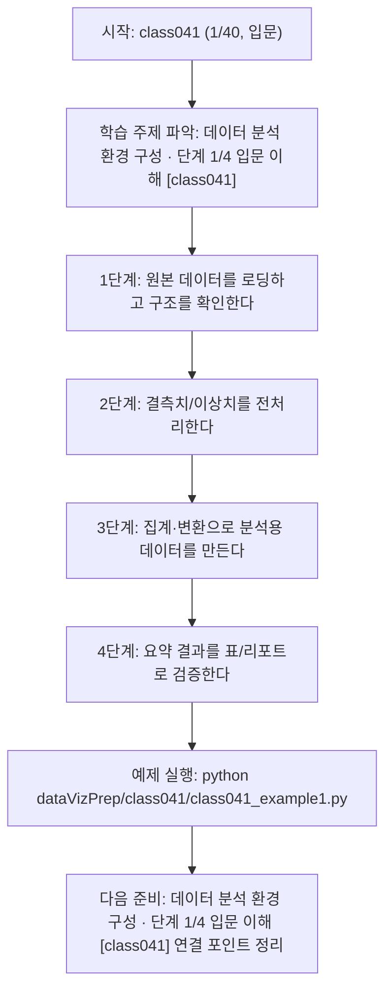
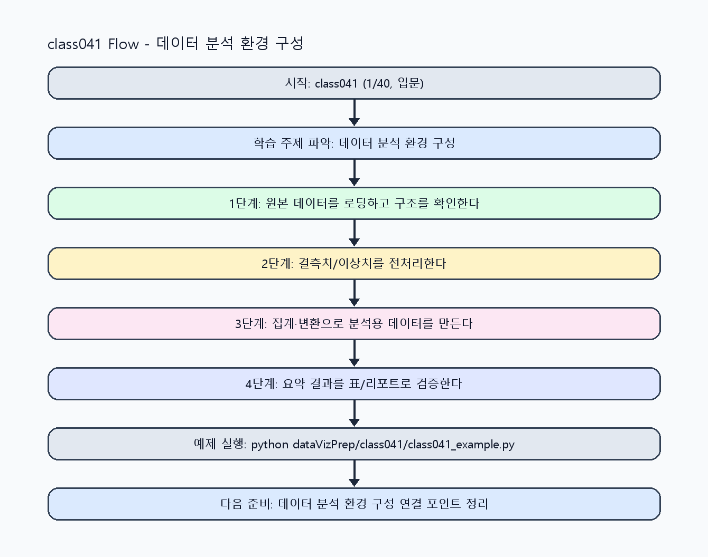

<!-- 이 파일은 www.edumgt.co.kr 의 에듀엠지티에 저작권이 있습니다 -->
# class041 자기주도 학습 가이드

## 1) 오늘의 학습 정보
- 교과목: **Python 전처리 및 시각화**
- 학습 주제: **데이터 분석 환경 구성 · 단계 1/4 입문 이해 [class041]**
- 학습 주제 진행: **데이터 분석 환경 구성 · 단계 1/4 입문 이해 [class041] (총 4시간 중 1시간차)**
- 세부 시퀀스: **1/40**
- 일정: **Day 06 / 1교시**
- 최종 목표: **Agent 폴더의 실제 시스템 구성요소를 구현·연동·운영할 수 있는 개발자 역량 확보**
- 난이도: **입문**

### 교과목·학습주제 어휘 해설 (IT 강사 스타일)
#### 교과목 표현 분석: `Python 전처리 및 시각화`
- 문법 포인트: 명사구를 연결어 '및'으로 병렬 연결한 구조입니다. 동등한 학습 범위를 함께 제시합니다.
- 기술 포인트: 데이터 전처리와 시각화를 통해 분석 가능한 정보로 바꾸는 교과목입니다.
| 용어 | 문법/품사 | 한글·한자 | 영어 | 기술 설명 |
| --- | --- | --- | --- | --- |
| `Python` | 고유명사(언어명) | Python (한자 없음) | Python | 데이터 처리와 AI 실습에 널리 쓰이는 범용 프로그래밍 언어입니다. |
| `전처리` | 명사 | 전처리 (前處理) | preprocessing | 원시 데이터를 모델이 다루기 쉬운 형태로 정리하는 단계입니다. |
| `시각화` | 명사 | 시각화 (視覺化) | visualization | 숫자 데이터를 그래프와 차트로 표현해 패턴을 해석하는 과정입니다. |

#### 학습주제 표현 분석: `데이터 분석 환경 구성 · 단계 1/4 입문 이해 [class041]`
- 문법 포인트: 핵심 개념 명사를 중심으로 한 명사구 구조입니다.
- 기술 포인트: 이번 차시는 `데이터 분석 환경 구성 · 단계 1/4 입문 이해 [class041]`를 중심으로 같은 주제 내에서 단계적으로 고도화된 구현을 수행합니다.
| 용어 | 문법/품사 | 한글·한자 | 영어 | 기술 설명 |
| --- | --- | --- | --- | --- |
| `데이터` | 명사(외래어) | 데이터 (한자 없음) | data | 분석, 학습, 추론의 입력이 되는 관측값 집합입니다. |
| `분석` | 명사 | 분석 (分析) | analysis | 데이터를 분해해 의미 있는 결론을 도출하는 과정입니다. |
| `환경` | 명사(기술 개념어) | 환경 (한자 없음) | (context-specific) | 용어 `환경`: 이번 학습주제에서 정의해야 할 핵심 개념 용어입니다. |
| `구성` | 명사(기술 개념어) | 구성 (한자 없음) | (context-specific) | 용어 `구성`: 이번 학습주제에서 정의해야 할 핵심 개념 용어입니다. |

## 2) 이전에 배운 내용 (복습)
- 이전 차시: **class040 / API 명세서와 개발자 문서화 · 단계 2/2 운영 최적화 [class040]** (Day 05 / 8교시)
- 복습 연결: 이전에 배운 **API 명세서와 개발자 문서화 · 단계 2/2 운영 최적화 [class040]** 를 떠올리며, 오늘 **데이터 분석 환경 구성 · 기초 정리 요구사항 정제 (차시 01) [class041]** 와 어떤 점이 이어지는지 비교해 보세요.

## 3) 주제를 아주 쉽게 이해하기
- 한 줄 설명: 데이터 분석 환경 구성를 단계 1/4(입문 이해) 수준으로 고도화해 구현하는 차시입니다.
- 왜 배우나요?: 동일 주제를 반복하더라도 단계별 난이도를 높여 실무 수준의 문제 해결력을 만들기 위해서입니다.

### 핵심 개념 3가지
1. `데이터 분석 환경 구성`의 핵심 입력/출력 구조를 단계 1/4 기준으로 명확히 정의합니다.
2. `입문 이해` 수준에서 필요한 구현 패턴(검증, 예외, 로깅, 성능)을 코드에 반영합니다.
3. 이전 단계 결과를 재사용해 다음 단계로 확장 가능한 구조로 리팩터링합니다.

### 비유로 이해하기
- 기초 공정에서 시작해 품질검사와 운영튜닝까지 단계적으로 완성도를 올리는 제조 라인과 같습니다.
## 4) 실습 환경 만들기 (항상 먼저)
아래 명령은 **처음 한 번** 준비해 두면 이후 학습이 쉬워집니다.

### Windows PowerShell
```powershell
cd C:\DevOps\Python-AI_Agent-Class
python -m venv .venv
.\.venv\Scripts\Activate.ps1
python -m pip install --upgrade pip
pip install -r requirements.txt
```

### Linux/macOS (bash)
```bash
cd /path/to/Python-AI_Agent-Class
python3 -m venv .venv
source .venv/bin/activate
python -m pip install --upgrade pip
pip install -r requirements.txt
```

## 5) 오늘의 예제 코드
- 예제 파일: `class041_example1.py`
- 실행 명령:
```bash
python dataVizPrep/class041/class041_example1.py
```


<!-- AUTO-GENERATED: OS_COMMANDS START -->
## 5-1) 운영체제별 실행 명령 예시
### PowerShell (Windows)
```powershell
cd C:\DevOps\Python-AI_Agent-Class
python .\dataVizPrep\class041\class041.py
python .\dataVizPrep\class041\class041_example1.py
python .\dataVizPrep\class041\class041_assignment.py
start .\dataVizPrep\class041\class041_quiz.html
```

### WSL Ubuntu (bash)
```bash
cd /mnt/c/DevOps/Python-AI_Agent-Class
python3 dataVizPrep/class041/class041.py
python3 dataVizPrep/class041/class041_example1.py
python3 dataVizPrep/class041/class041_assignment.py
explorer.exe "$(wslpath -w 'dataVizPrep/class041/class041_quiz.html')"
```

### run_class/run_day 스크립트 연동 (WSL bash)
```bash
./run_class.sh class041
./run_day.sh 6 launcher
```
<!-- AUTO-GENERATED: OS_COMMANDS END -->

<!-- AUTO-GENERATED: TECH_STACK_FLOW START -->
### 기술 스택
- 언어: `Python 3`
- 실행: `CLI` (`python dataVizPrep/class041/class041_example1.py`)
- 주요 문법: `함수`, `리스트/딕셔너리`, `집계 로직`, `출력(print)`
- 학습 포커스: `데이터 분석 환경 구성 · 단계 1/4 입문 이해 [class041]`

### 실습 example1.py 동작 원리 (Mermaid Flowchart)


### Flow PNG 캡처

<!-- AUTO-GENERATED: TECH_STACK_FLOW END -->

### 예제 코드를 볼 때 집중할 포인트
1. 입력이 무엇인지 먼저 찾기
2. 처리 규칙(함수/조건/반복) 확인하기
3. 출력 결과가 목표와 맞는지 점검하기

## 6) 퀴즈로 복습하기 (5문항)
- 퀴즈 파일: `class041_quiz.html`
- 브라우저에서 열기:
```bash
dataVizPrep/class041/class041_quiz.html
```
- 버튼 설명:
1. `채점하기`: 현재 선택한 답으로 점수를 계산해요.
2. `다시풀기`: 선택을 모두 지우고 처음부터 다시 풀어요.

## 7) 혼자 실습 순서 (초등학생 버전)
1. 코드를 한 번 그대로 실행해요.
2. 숫자/문장 값을 1개 바꿔요.
3. 결과가 왜 바뀌었는지 한 줄로 적어요.
4. 함수를 1개 더 만들어 작은 기능을 추가해요.

### 실습 미션
1. `데이터 분석 환경 구성` 단계 1/4 목표 기능을 코드로 구현하고 실행 로그를 남기세요.
2. `입문 이해` 관점에서 실패 케이스 1개 이상을 재현하고 대응 코드를 추가하세요.
3. 이전 단계 코드와 비교해 변경점(입력/처리/출력)을 3줄로 정리하세요.

## 8) 스스로 점검 체크리스트
- [ ] 데이터 항목 이름을 정확히 이해했다.
- [ ] 정리 전/정리 후 차이를 설명할 수 있다.
- [ ] 평균/최댓값/최솟값 중 1개 이상을 계산했다.

## 9) 막히면 이렇게 해결해요
1. 에러 메시지 마지막 줄을 먼저 읽어요.
2. 함수 이름과 괄호 짝을 확인해요.
3. `print()`를 넣어 중간 값을 확인해요.
4. 그래도 안 되면 어제 성공한 코드와 한 줄씩 비교해요.

## 10) 학습 후 다음에 배울 내용
- 다음 차시: **class042 / 데이터 분석 환경 구성 · 단계 2/4 기초 구현 [class042]** (Day 06 / 2교시)
- 미리보기: 다음 차시 전에 **데이터 분석 환경 구성 · 단계 1/4 입문 이해 [class041]** 핵심 코드 1개를 다시 실행해 두면 데이터 분석 환경 구성 · 단계 2/4 기초 구현 [class042] 학습이 더 쉬워집니다.

## 11) 다음 차시 연결
- 다음 차시에서는 더 큰 데이터에서도 같은 정리 원칙을 적용해 볼 거예요.
- 오늘 코드를 복사하지 말고, 직접 다시 작성해 보세요.
