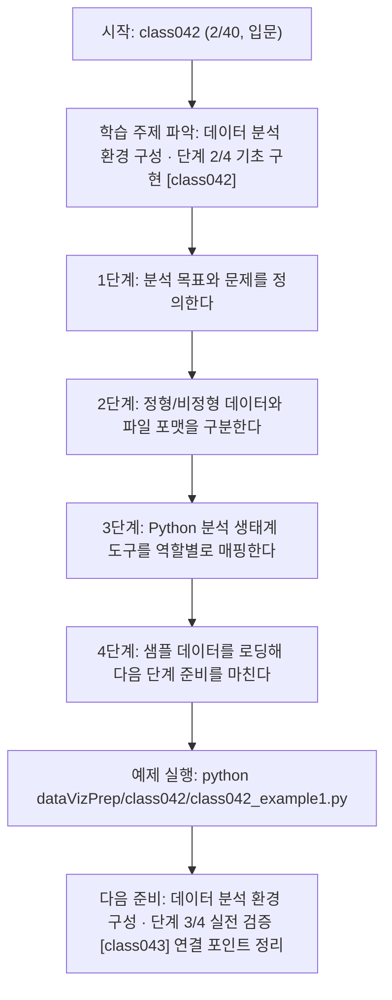
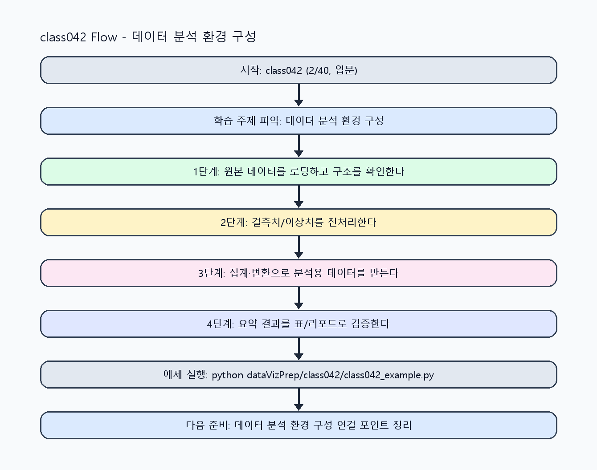

<!-- 이 파일은 www.edumgt.co.kr 의 에듀엠지티에 저작권이 있습니다 -->
# class042 자기주도 학습 가이드

## 1) 오늘의 학습 정보
- 교과목: **Python 전처리 및 시각화**
- 학습 주제: **데이터 분석 환경 구성 · 단계 2/4 기초 구현 [class042]**
- 세부 시퀀스: **2/40**
- 일정: **Day 06 / 2교시**
- 난이도: **입문**

### 교과목·학습주제 어휘 해설 (IT 강사 스타일)
#### 교과목 표현 분석: `Python 전처리 및 시각화`
- 문법 포인트: 명사구를 연결어 '및'으로 병렬 연결한 구조입니다. 동등한 학습 범위를 함께 제시합니다.
- 기술 포인트: 데이터 전처리와 시각화를 통해 분석 가능한 정보로 바꾸는 교과목입니다.
| 용어 | 문법/품사 | 한글·한자 | 영어 | 기술 설명 |
| --- | --- | --- | --- | --- |
| `Python` | 고유명사(언어명) | Python (한자 없음) | Python | 데이터 처리와 AI 실습에 널리 쓰이는 범용 프로그래밍 언어입니다. |
| `전처리` | 명사 | 전처리 (前處理) | preprocessing | 원시 데이터를 모델이 다루기 쉬운 형태로 정리하는 단계입니다. |
| `시각화` | 명사 | 시각화 (視覺化) | visualization | 숫자 데이터를 그래프와 차트로 표현해 패턴을 해석하는 과정입니다. |

#### 학습주제 표현 분석: `데이터 분석 환경 구성 · 단계 2/4 기초 구현 [class042]`
- 문법 포인트: 핵심 개념 명사를 중심으로 한 명사구 구조입니다.
- 기술 포인트: 이번 차시는 `데이터 분석 환경 구성 · 단계 2/4 기초 구현 [class042]` 용어를 중심으로 문제 정의, 코드 구현, 결과 검증까지 연결합니다.
| 용어 | 문법/품사 | 한글·한자 | 영어 | 기술 설명 |
| --- | --- | --- | --- | --- |
| `데이터` | 명사(외래어) | 데이터 (한자 없음) | data | 분석, 학습, 추론의 입력이 되는 관측값 집합입니다. |
| `분석` | 명사 | 분석 (分析) | analysis | 데이터를 분해해 의미 있는 결론을 도출하는 과정입니다. |
| `환경` | 명사(기술 개념어) | 환경 (한자 없음) | (context-specific) | 용어 `환경`: 이번 학습주제에서 정의해야 할 핵심 개념 용어입니다. |
| `구성` | 명사(기술 개념어) | 구성 (한자 없음) | (context-specific) | 용어 `구성`: 이번 학습주제에서 정의해야 할 핵심 개념 용어입니다. |
| `단계` | 명사(기술 개념어) | 단계 (한자 없음) | (context-specific) | 용어 `단계`: 이번 학습주제에서 정의해야 할 핵심 개념 용어입니다. |
| `기초` | 명사(기술 개념어) | 기초 (한자 없음) | (context-specific) | 용어 `기초`: 이번 학습주제에서 정의해야 할 핵심 개념 용어입니다. |

## 2) 이전에 배운 내용 (복습)
- 이전 차시: **class041 / 데이터 분석 환경 구성 · 단계 1/4 입문 이해 [class041]** (Day 06 / 1교시)
- 복습 연결: 이전에 배운 **데이터 분석 환경 구성 · 단계 1/4 입문 이해 [class041]** 를 떠올리며, 오늘 **데이터 분석 환경 구성 · 단계 2/4 기초 구현 [class042]** 와 어떤 점이 이어지는지 비교해 보세요.

## 3) 주제를 아주 쉽게 이해하기
- 한 줄 설명: 데이터 분석 전체 흐름과 분석용 Python 도구 지형을 한 번에 정리하는 차시입니다.
- 왜 배우나요?: 데이터 형태와 파일 구조를 구분하지 못하면 이후 NumPy/Pandas 실습에서 전처리 방향을 잘못 잡기 쉽습니다.

### 핵심 개념 3가지
1. `데이터 분석 프로세스`는 문제 정의 -> 수집 -> 정제 -> 분석 -> 시각화 -> 공유 순서로 진행합니다.
2. `정형/비정형 데이터`를 구분해야 적절한 저장 형식과 처리 도구를 선택할 수 있습니다.
3. `CSV/Excel/JSON` 구조 차이와 Python 생태계(NumPy/Pandas/Matplotlib)를 이해해야 실습이 연결됩니다.

### 비유로 이해하기
- 지저분한 책상을 정리하면 필요한 물건을 빨리 찾을 수 있는 것과 같아요.

## 4) 실습 환경 만들기 (항상 먼저)
아래 명령은 **처음 한 번** 준비해 두면 이후 학습이 쉬워집니다.

### Windows PowerShell
```powershell
cd C:\DevOps\Python-AI_Agent-Class
python -m venv .venv
.\.venv\Scripts\Activate.ps1
python -m pip install --upgrade pip
pip install -r requirements.txt
```

### Linux/macOS (bash)
```bash
cd /path/to/Python-AI_Agent-Class
python3 -m venv .venv
source .venv/bin/activate
python -m pip install --upgrade pip
pip install -r requirements.txt
```

## 5) 오늘의 예제 코드
- 예제 파일: `class042_example1.py`
- 실행 명령:
```bash
python dataVizPrep/class042/class042_example1.py
```

### example1~example5 단계별 테스트 확장
1. example1: 데이터 분석 프로세스와 파일 구조(CSV/JSON) 기본 흐름을 확인한다.
2. example2: 정형/비정형 데이터 사례를 추가해 분류 기준을 점검한다.
3. example3: 포맷 오류/누락 입력을 넣어 로딩 실패 케이스를 재현한다.
4. example4: 분석 도구(NumPy/Pandas/Matplotlib) 매핑을 비교해 정리한다.
5. example5: 실습 환경 재현 체크리스트와 운영 점검을 마무리한다.

<!-- AUTO-GENERATED: TECH_STACK_FLOW START -->
### 기술 스택
- 언어: `Python 3`
- 실행: `CLI` (`python dataVizPrep/class042/class042_example1.py`)
- 주요 문법: `함수`, `리스트/딕셔너리`, `집계 로직`, `출력(print)`
- 학습 포커스: `데이터 분석 환경 구성 · 단계 2/4 기초 구현 [class042]`

### 실습 example1.py 동작 원리 (Mermaid Flowchart)


### Flow PNG 캡처

<!-- AUTO-GENERATED: TECH_STACK_FLOW END -->

### 예제 코드를 볼 때 집중할 포인트
1. 데이터 유형(정형/비정형)에 맞는 처리 도구를 선택했는지 확인하기
2. CSV/Excel/JSON 구조 차이를 컬럼/중첩 기준으로 설명할 수 있는지 점검하기
3. 분석 프로세스 단계와 실행 코드가 대응되는지 확인하기

## 6) 퀴즈로 복습하기 (10문항)
- 퀴즈 파일: `class042_quiz.html`
- 브라우저에서 열기:
```bash
dataVizPrep/class042/class042_quiz.html
```
- 버튼 설명:
1. `채점하기`: 현재 선택한 답으로 점수를 계산해요.
2. `다시풀기`: 선택을 모두 지우고 처음부터 다시 풀어요.

## 7) 혼자 실습 순서 (초등학생 버전)
1. 코드를 한 번 그대로 실행해요.
2. 숫자/문장 값을 1개 바꿔요.
3. 결과가 왜 바뀌었는지 한 줄로 적어요.
4. 함수를 1개 더 만들어 작은 기능을 추가해요.

### 실습 미션
1. 같은 샘플 데이터를 CSV/JSON 형태로 준비해 구조 차이를 비교하세요.
2. 정형 데이터와 비정형 데이터 예시를 2개씩 분류해 보세요.
3. 분석 프로세스 각 단계에서 어떤 Python 라이브러리를 쓸지 매핑해 보세요.

## 8) 스스로 점검 체크리스트
- [ ] 문제 정의부터 시각화까지 분석 프로세스를 순서대로 설명할 수 있다.
- [ ] 정형/비정형 데이터 차이를 예시와 함께 설명할 수 있다.
- [ ] CSV/Excel/JSON 파일 구조 특징과 사용 시점을 구분할 수 있다.

## 9) 막히면 이렇게 해결해요
1. 에러 메시지 마지막 줄을 먼저 읽어요.
2. 함수 이름과 괄호 짝을 확인해요.
3. `print()`를 넣어 중간 값을 확인해요.
4. 그래도 안 되면 어제 성공한 코드와 한 줄씩 비교해요.

## 10) 학습 후 다음에 배울 내용
- 다음 차시: **class043 / 데이터 분석 환경 구성 · 단계 3/4 실전 검증 [class043]** (Day 06 / 3교시)
- 미리보기: 다음 차시 전에 **데이터 분석 환경 구성 · 단계 2/4 기초 구현 [class042]** 핵심 코드 1개를 다시 실행해 두면 데이터 분석 환경 구성 · 단계 3/4 실전 검증 [class043] 학습이 더 쉬워집니다.

## 11) 다음 차시 연결
- 다음 차시에서는 NumPy 배열 연산으로 전처리 계산의 기본기를 다집니다.
- 오늘 코드를 복사하지 말고, 직접 다시 작성해 보세요.
