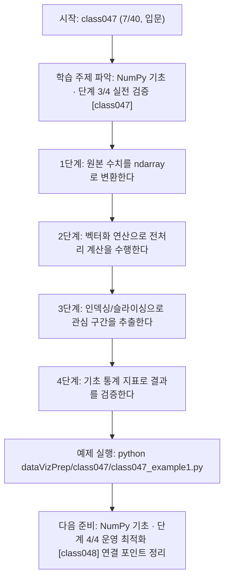
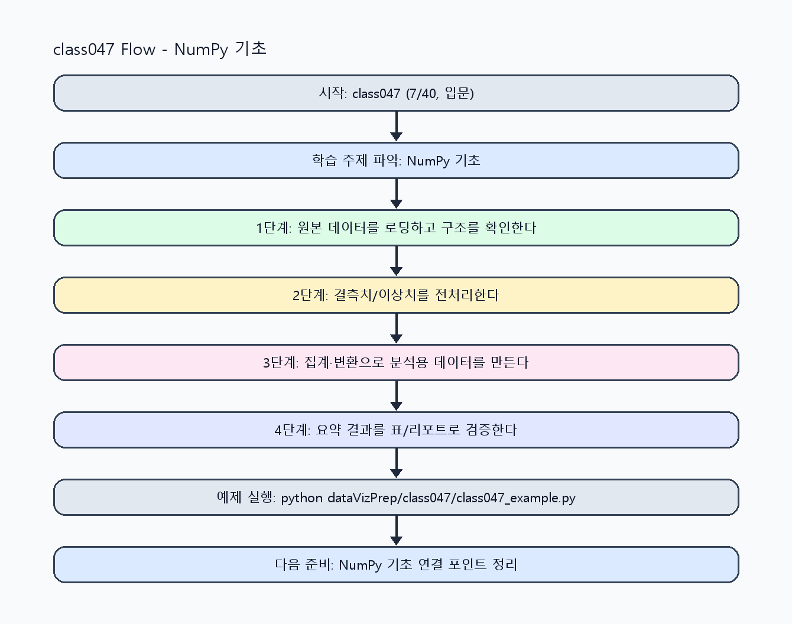

<!-- 이 파일은 www.edumgt.co.kr 의 에듀엠지티에 저작권이 있습니다 -->
# class047 자기주도 학습 가이드

## 1) 오늘의 학습 정보
- 교과목: **Python 전처리 및 시각화**
- 학습 주제: **NumPy 기초 · 단계 3/4 실전 검증 [class047]**
- 세부 시퀀스: **7/40**
- 일정: **Day 06 / 7교시**
- 난이도: **입문**

### 교과목·학습주제 어휘 해설 (IT 강사 스타일)
#### 교과목 표현 분석: `Python 전처리 및 시각화`
- 문법 포인트: 명사구를 연결어 '및'으로 병렬 연결한 구조입니다. 동등한 학습 범위를 함께 제시합니다.
- 기술 포인트: 데이터 전처리와 시각화를 통해 분석 가능한 정보로 바꾸는 교과목입니다.
| 용어 | 문법/품사 | 한글·한자 | 영어 | 기술 설명 |
| --- | --- | --- | --- | --- |
| `Python` | 고유명사(언어명) | Python (한자 없음) | Python | 데이터 처리와 AI 실습에 널리 쓰이는 범용 프로그래밍 언어입니다. |
| `전처리` | 명사 | 전처리 (前處理) | preprocessing | 원시 데이터를 모델이 다루기 쉬운 형태로 정리하는 단계입니다. |
| `시각화` | 명사 | 시각화 (視覺化) | visualization | 숫자 데이터를 그래프와 차트로 표현해 패턴을 해석하는 과정입니다. |

#### 학습주제 표현 분석: `NumPy 기초 · 단계 3/4 실전 검증 [class047]`
- 문법 포인트: 핵심 개념 명사를 중심으로 한 명사구 구조입니다.
- 기술 포인트: 이번 차시는 `NumPy 기초 · 단계 3/4 실전 검증 [class047]` 용어를 중심으로 문제 정의, 코드 구현, 결과 검증까지 연결합니다.
| 용어 | 문법/품사 | 한글·한자 | 영어 | 기술 설명 |
| --- | --- | --- | --- | --- |
| `NumPy` | 고유명사(라이브러리명) | NumPy (한자 없음) | NumPy | 배열 연산과 선형대수 계산을 위한 파이썬 핵심 라이브러리입니다. |
| `기초` | 명사(기술 개념어) | 기초 (한자 없음) | (context-specific) | 용어 `기초`: 이번 학습주제에서 정의해야 할 핵심 개념 용어입니다. |
| `단계` | 명사(기술 개념어) | 단계 (한자 없음) | (context-specific) | 용어 `단계`: 이번 학습주제에서 정의해야 할 핵심 개념 용어입니다. |
| `실전` | 명사(기술 개념어) | 실전 (한자 없음) | (context-specific) | 용어 `실전`: 이번 학습주제에서 정의해야 할 핵심 개념 용어입니다. |
| `검증` | 명사 | 검증 (檢證) | validation | 결과가 요구사항과 기준을 만족하는지 확인하는 절차입니다. |
| `class047` | 영문 기술명/약어 | class047 (한자 없음) | class047 | 용어 `class047`: 이번 차시에서 쓰이는 핵심 기술 용어입니다. |

## 2) 이전에 배운 내용 (복습)
- 이전 차시: **class046 / NumPy 기초 · 단계 2/4 기초 구현 [class046]** (Day 06 / 6교시)
- 복습 연결: 이전에 배운 **NumPy 기초 · 단계 2/4 기초 구현 [class046]** 를 떠올리며, 오늘 **NumPy 기초 · 단계 3/4 실전 검증 [class047]** 와 어떤 점이 이어지는지 비교해 보세요.

## 3) 주제를 아주 쉽게 이해하기
- 한 줄 설명: 배열(Array) 기반 연산으로 빠르고 일관된 수치 처리를 익히는 차시입니다.
- 왜 배우나요?: 리스트 반복문보다 ndarray 벡터화 연산을 이해해야 데이터 처리 성능과 코드 가독성을 함께 확보할 수 있습니다.

### 핵심 개념 3가지
1. `배열(Array)`은 동일 타입 수치를 연속 메모리로 관리해 계산 효율을 높입니다.
2. `list`와 `ndarray` 차이를 이해해야 벡터화 연산, 브로드캐스팅, 타입 변환을 정확히 다룰 수 있습니다.
3. `인덱싱/슬라이싱`과 `기초 통계(mean/std/min/max)`는 NumPy 분석의 기본 조작입니다.

### 비유로 이해하기
- 지저분한 책상을 정리하면 필요한 물건을 빨리 찾을 수 있는 것과 같아요.

## 4) 실습 환경 만들기 (항상 먼저)
아래 명령은 **처음 한 번** 준비해 두면 이후 학습이 쉬워집니다.

### Windows PowerShell
```powershell
cd C:\DevOps\Python-AI_Agent-Class
python -m venv .venv
.\.venv\Scripts\Activate.ps1
python -m pip install --upgrade pip
pip install -r requirements.txt
```

### Linux/macOS (bash)
```bash
cd /path/to/Python-AI_Agent-Class
python3 -m venv .venv
source .venv/bin/activate
python -m pip install --upgrade pip
pip install -r requirements.txt
```

## 5) 오늘의 예제 코드
- 예제 파일: `class047_example1.py`
- 실행 명령:
```bash
python dataVizPrep/class047/class047_example1.py
```

### example1~example5 단계별 테스트 확장
1. example1: 기본 배열 생성과 기초 통계를 실행한다.
2. example2: list와 ndarray 연산 차이를 비교한다.
3. example3: 이상치/음수 입력으로 벡터화 결과를 검증한다.
4. example4: 인덱싱/슬라이싱 조합으로 부분 분석을 수행한다.
5. example5: 여러 케이스 통계를 비교해 운영 기준을 점검한다.

<!-- AUTO-GENERATED: TECH_STACK_FLOW START -->
### 기술 스택
- 언어: `Python 3`
- 실행: `CLI` (`python dataVizPrep/class047/class047_example1.py`)
- 주요 문법: `함수`, `리스트/딕셔너리`, `집계 로직`, `출력(print)`
- 학습 포커스: `NumPy 기초 · 단계 3/4 실전 검증 [class047]`

### 실습 example1.py 동작 원리 (Mermaid Flowchart)


### Flow PNG 캡처

<!-- AUTO-GENERATED: TECH_STACK_FLOW END -->

### 예제 코드를 볼 때 집중할 포인트
1. 벡터화 연산이 반복문 대비 어떤 이점을 주는지 확인하기
2. 인덱싱/슬라이싱 범위가 경계값에서 안전한지 점검하기
3. 통계 지표 해석이 입력 분포 변화와 연결되는지 확인하기

## 6) 퀴즈로 복습하기 (10문항)
- 퀴즈 파일: `class047_quiz.html`
- 브라우저에서 열기:
```bash
dataVizPrep/class047/class047_quiz.html
```
- 버튼 설명:
1. `채점하기`: 현재 선택한 답으로 점수를 계산해요.
2. `다시풀기`: 선택을 모두 지우고 처음부터 다시 풀어요.

## 7) 혼자 실습 순서 (초등학생 버전)
1. 코드를 한 번 그대로 실행해요.
2. 숫자/문장 값을 1개 바꿔요.
3. 결과가 왜 바뀌었는지 한 줄로 적어요.
4. 함수를 1개 더 만들어 작은 기능을 추가해요.

### 실습 미션
1. 같은 계산을 list 반복문과 ndarray 벡터화 방식으로 각각 실행해 비교하세요.
2. 인덱싱/슬라이싱으로 부분 배열을 추출하고 값이 어떻게 바뀌는지 확인하세요.
3. 평균/분산/표준편차를 여러 테스트 세트로 계산해 분포 차이를 해석하세요.

## 8) 스스로 점검 체크리스트
- [ ] list와 ndarray의 연산 차이를 코드로 설명할 수 있다.
- [ ] 벡터화 연산을 사용해 반복문을 줄이는 방법을 적용했다.
- [ ] 인덱싱/슬라이싱과 기초 통계를 조합해 결과를 검증했다.

## 9) 막히면 이렇게 해결해요
1. 에러 메시지 마지막 줄을 먼저 읽어요.
2. 함수 이름과 괄호 짝을 확인해요.
3. `print()`를 넣어 중간 값을 확인해요.
4. 그래도 안 되면 어제 성공한 코드와 한 줄씩 비교해요.

## 10) 학습 후 다음에 배울 내용
- 다음 차시: **class048 / NumPy 기초 · 단계 4/4 운영 최적화 [class048]** (Day 06 / 8교시)
- 미리보기: 다음 차시 전에 **NumPy 기초 · 단계 3/4 실전 검증 [class047]** 핵심 코드 1개를 다시 실행해 두면 NumPy 기초 · 단계 4/4 운영 최적화 [class048] 학습이 더 쉬워집니다.

## 11) 다음 차시 연결
- 다음 차시에서는 Pandas Series/DataFrame으로 표 데이터 조작을 확장합니다.
- 오늘 코드를 복사하지 말고, 직접 다시 작성해 보세요.
