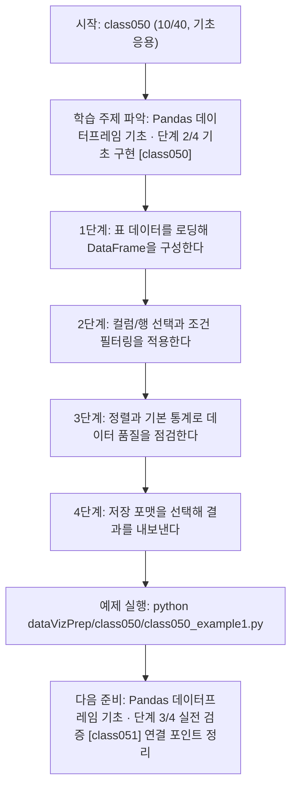
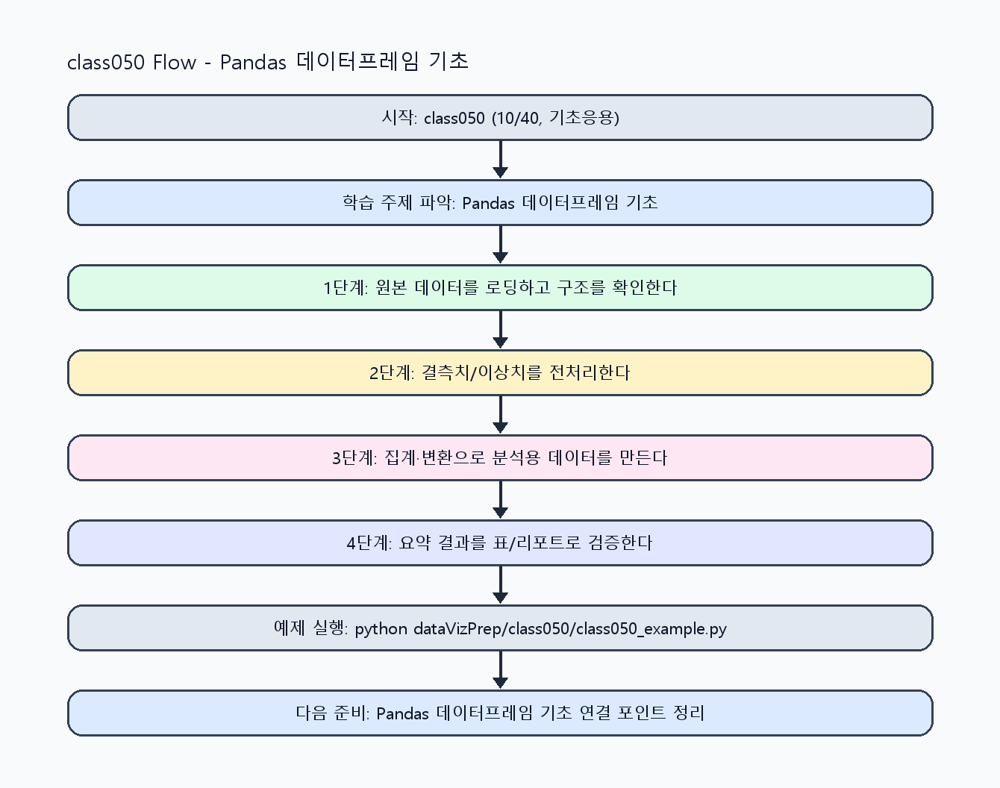

<!-- 이 파일은 www.edumgt.co.kr 의 에듀엠지티에 저작권이 있습니다 -->
# class050 자기주도 학습 가이드

## 1) 오늘의 학습 정보
- 교과목: **Python 전처리 및 시각화**
- 학습 주제: **Pandas 데이터프레임 기초 · 단계 2/4 기초 구현 [class050]**
- 세부 시퀀스: **10/40**
- 일정: **Day 07 / 2교시**
- 난이도: **기초응용**

### 교과목·학습주제 어휘 해설 (IT 강사 스타일)
#### 교과목 표현 분석: `Python 전처리 및 시각화`
- 문법 포인트: 명사구를 연결어 '및'으로 병렬 연결한 구조입니다. 동등한 학습 범위를 함께 제시합니다.
- 기술 포인트: 데이터 전처리와 시각화를 통해 분석 가능한 정보로 바꾸는 교과목입니다.
| 용어 | 문법/품사 | 한글·한자 | 영어 | 기술 설명 |
| --- | --- | --- | --- | --- |
| `Python` | 고유명사(언어명) | Python (한자 없음) | Python | 데이터 처리와 AI 실습에 널리 쓰이는 범용 프로그래밍 언어입니다. |
| `전처리` | 명사 | 전처리 (前處理) | preprocessing | 원시 데이터를 모델이 다루기 쉬운 형태로 정리하는 단계입니다. |
| `시각화` | 명사 | 시각화 (視覺化) | visualization | 숫자 데이터를 그래프와 차트로 표현해 패턴을 해석하는 과정입니다. |

#### 학습주제 표현 분석: `Pandas 데이터프레임 기초 · 단계 2/4 기초 구현 [class050]`
- 문법 포인트: 핵심 개념 명사를 중심으로 한 명사구 구조입니다.
- 기술 포인트: 이번 차시는 `Pandas 데이터프레임 기초` 핵심 개념을 코드 구현, 결과 해석, 점검 기준으로 연결합니다.
| 용어 | 문법/품사 | 한글·한자 | 영어 | 기술 설명 |
| --- | --- | --- | --- | --- |
| `Pandas` | 고유명사(라이브러리명) | Pandas (한자 없음) | pandas | 테이블형 데이터 조작과 분석에 특화된 파이썬 라이브러리입니다. |
| `데이터프레임` | 명사(복합 외래어) | 데이터프레임 (한자 없음) | DataFrame | 행/열 기반 표 데이터를 다루는 판다스의 핵심 자료구조입니다. |
| `Series` | 영문 기술명/약어 | Series (한자 없음) | Series | 이번 차시 맥락: Series와 DataFrame으로 표 데이터를 읽고, 필터링하고, 정렬하는 기본기를 익히는 차시입니다. 이를 기준으로 `Series`를 코드와 결과 해석에 연결합니다. |
| `DataFrame` | 영문 기술명/약어 | DataFrame (한자 없음) | DataFrame | 이번 차시 맥락: Series와 DataFrame으로 표 데이터를 읽고, 필터링하고, 정렬하는 기본기를 익히는 차시입니다. 이를 기준으로 `DataFrame`를 코드와 결과 해석에 연결합니다. |
| `데이터` | 명사(외래어) | 데이터 (한자 없음) | data | 분석, 학습, 추론의 입력이 되는 관측값 집합입니다. |
| `로딩` | 명사(주제 핵심 용어) | 로딩 (한자 없음) | (topic-specific) | 이번 차시 맥락: 실무 데이터 분석은 CSV/Excel/JSON 로딩 이후 행·열 선택과 조건 필터링이 핵심 반복 작업입니다. 이를 기준으로 `로딩`를 코드와 결과 해석에 연결합니다. |

## 2) 이전에 배운 내용 (복습)
- 이전 차시: **class049 / Pandas 데이터프레임 기초 · 단계 1/4 입문 이해 [class049]** (Day 07 / 1교시)
- 복습 연결: 이전에 배운 **Pandas 데이터프레임 기초 · 단계 1/4 입문 이해 [class049]** 를 떠올리며, 오늘 **Pandas 데이터프레임 기초 · 단계 2/4 기초 구현 [class050]** 와 어떤 점이 이어지는지 비교해 보세요.

## 3) 주제를 아주 쉽게 이해하기
- 한 줄 설명: Series와 DataFrame으로 표 데이터를 읽고, 필터링하고, 정렬하는 기본기를 익히는 차시입니다.
- 왜 배우나요?: 실무 데이터 분석은 CSV/Excel/JSON 로딩 이후 행·열 선택과 조건 필터링이 핵심 반복 작업입니다.

### 핵심 개념 3가지
1. `Series`는 1차원, `DataFrame`은 2차원 표 구조로 Pandas 분석의 중심 자료구조입니다.
2. `데이터 로딩/저장`과 `행·열 선택`을 정확히 해야 전처리 오류를 줄일 수 있습니다.
3. `조건 필터링/정렬/기초 통계`는 데이터 상태를 빠르게 점검하는 기본 루틴입니다.

### 비유로 이해하기
- 지저분한 책상을 정리하면 필요한 물건을 빨리 찾을 수 있는 것과 같아요.

## 4) 실습 환경 만들기 (항상 먼저)
아래 명령은 **처음 한 번** 준비해 두면 이후 학습이 쉬워집니다.

### Windows PowerShell
```powershell
cd C:\DevOps\Python-AI_Agent-Class
python -m venv .venv
.\.venv\Scripts\Activate.ps1
python -m pip install --upgrade pip
pip install -r requirements.txt
```

### Linux/macOS (bash)
```bash
cd /path/to/Python-AI_Agent-Class
python3 -m venv .venv
source .venv/bin/activate
python -m pip install --upgrade pip
pip install -r requirements.txt
```

## 5) 오늘의 예제 코드
- 예제 파일: `class050_example1.py`
- 실행 명령:
```bash
python dataVizPrep/class050/class050_example1.py
```

### example1~example5 단계별 테스트 확장
1. example1: Series/DataFrame 기본 조작을 실행한다.
2. example2: 행/열 선택과 조건 필터링을 확장한다.
3. example3: 문자열 숫자/결측 입력으로 정제 로직을 검증한다.
4. example4: 정렬/기초 통계 결과를 비교한다.
5. example5: 로딩-정제-저장 전체 흐름을 점검한다.

<!-- AUTO-GENERATED: TECH_STACK_FLOW START -->
### 기술 스택
- 언어: `Python 3`
- 실행: `CLI` (`python dataVizPrep/class050/class050_example1.py`)
- 주요 문법: `함수`, `리스트/딕셔너리`, `집계 로직`, `출력(print)`
- 학습 포커스: `Pandas 데이터프레임 기초 · 단계 2/4 기초 구현 [class050]`

### 실습 example1.py 동작 원리 (Mermaid Flowchart)


### Flow PNG 캡처

<!-- AUTO-GENERATED: TECH_STACK_FLOW END -->

### 예제 코드를 볼 때 집중할 포인트
1. 선택/필터 조건이 분석 질문과 정확히 대응되는지 확인하기
2. 정렬 기준 컬럼과 오름/내림차순 의도가 명확한지 점검하기
3. 기초 통계 수치로 이상 패턴을 먼저 발견했는지 확인하기

## 6) 퀴즈로 복습하기 (10문항)
- 퀴즈 파일: `class050_quiz.html`
- 브라우저에서 열기:
```bash
dataVizPrep/class050/class050_quiz.html
```
- 버튼 설명:
1. `채점하기`: 현재 선택한 답으로 점수를 계산해요.
2. `다시풀기`: 선택을 모두 지우고 처음부터 다시 풀어요.

## 7) 혼자 실습 순서 (초등학생 버전)
1. 코드를 한 번 그대로 실행해요.
2. 숫자/문장 값을 1개 바꿔요.
3. 결과가 왜 바뀌었는지 한 줄로 적어요.
4. 함수를 1개 더 만들어 작은 기능을 추가해요.

### 실습 미션
1. CSV/JSON 데이터를 로딩하고 컬럼/행 구조를 출력해 확인하세요.
2. 컬럼 선택, 행 선택, 조건 필터링을 각각 수행해 결과 차이를 비교하세요.
3. 정렬과 describe 기반 통계를 함께 출력해 데이터 상태를 요약하세요.

## 8) 스스로 점검 체크리스트
- [ ] Series와 DataFrame의 역할 차이를 설명할 수 있다.
- [ ] 행/열 선택과 조건 필터링을 혼합해 필요한 데이터만 추출했다.
- [ ] 정렬 전후 결과와 기초 통계 변화를 해석할 수 있다.

## 9) 막히면 이렇게 해결해요
1. 에러 메시지 마지막 줄을 먼저 읽어요.
2. 함수 이름과 괄호 짝을 확인해요.
3. `print()`를 넣어 중간 값을 확인해요.
4. 그래도 안 되면 어제 성공한 코드와 한 줄씩 비교해요.

## 10) 학습 후 다음에 배울 내용
- 다음 차시: **class051 / Pandas 데이터프레임 기초 · 단계 3/4 실전 검증 [class051]** (Day 07 / 3교시)
- 미리보기: 다음 차시 전에 **Pandas 데이터프레임 기초 · 단계 2/4 기초 구현 [class050]** 핵심 코드 1개를 다시 실행해 두면 Pandas 데이터프레임 기초 · 단계 3/4 실전 검증 [class051] 학습이 더 쉬워집니다.

## 11) 다음 차시 연결
- 다음 차시에서는 결측/중복/타입 이슈를 해결하는 데이터 정제로 넘어갑니다.
- 오늘 코드를 복사하지 말고, 직접 다시 작성해 보세요.
