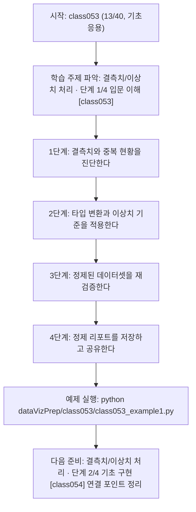
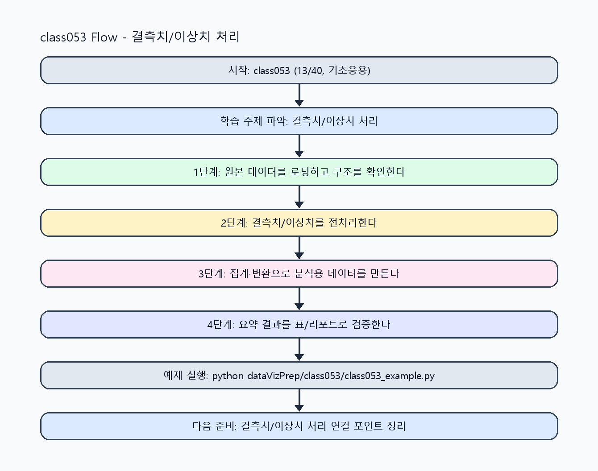

<!-- 이 파일은 www.edumgt.co.kr 의 에듀엠지티에 저작권이 있습니다 -->
# class053 자기주도 학습 가이드

## 1) 오늘의 학습 정보
- 교과목: **Python 전처리 및 시각화**
- 학습 주제: **결측치/이상치 처리 · 단계 1/4 입문 이해 [class053]**
- 세부 시퀀스: **13/40**
- 일정: **Day 07 / 5교시**
- 난이도: **기초응용**

### 교과목·학습주제 어휘 해설 (IT 강사 스타일)
#### 교과목 표현 분석: `Python 전처리 및 시각화`
- 문법 포인트: 명사구를 연결어 '및'으로 병렬 연결한 구조입니다. 동등한 학습 범위를 함께 제시합니다.
- 기술 포인트: 데이터 전처리와 시각화를 통해 분석 가능한 정보로 바꾸는 교과목입니다.
| 용어 | 문법/품사 | 한글·한자 | 영어 | 기술 설명 |
| --- | --- | --- | --- | --- |
| `Python` | 고유명사(언어명) | Python (한자 없음) | Python | 데이터 처리와 AI 실습에 널리 쓰이는 범용 프로그래밍 언어입니다. |
| `전처리` | 명사 | 전처리 (前處理) | preprocessing | 원시 데이터를 모델이 다루기 쉬운 형태로 정리하는 단계입니다. |
| `시각화` | 명사 | 시각화 (視覺化) | visualization | 숫자 데이터를 그래프와 차트로 표현해 패턴을 해석하는 과정입니다. |

#### 학습주제 표현 분석: `결측치/이상치 처리 · 단계 1/4 입문 이해 [class053]`
- 문법 포인트: 핵심 개념 명사를 중심으로 한 명사구 구조입니다.
- 기술 포인트: 이번 차시는 `결측치/이상치 처리 · 단계 1/4 입문 이해 [class053]` 용어를 중심으로 문제 정의, 코드 구현, 결과 검증까지 연결합니다.
| 용어 | 문법/품사 | 한글·한자 | 영어 | 기술 설명 |
| --- | --- | --- | --- | --- |
| `결측치` | 명사 | 결측치 (缺測値) | missing value | 값이 비어 있거나 측정되지 않은 데이터 항목입니다. |
| `이상치` | 명사 | 이상치 (異常値) | outlier | 분포에서 비정상적으로 벗어난 값으로 모델 품질에 영향이 큽니다. |
| `처리` | 명사(기술 개념어) | 처리 (한자 없음) | (context-specific) | 용어 `처리`: 이번 학습주제에서 정의해야 할 핵심 개념 용어입니다. |
| `단계` | 명사(기술 개념어) | 단계 (한자 없음) | (context-specific) | 용어 `단계`: 이번 학습주제에서 정의해야 할 핵심 개념 용어입니다. |
| `입문` | 명사(기술 개념어) | 입문 (한자 없음) | (context-specific) | 용어 `입문`: 이번 학습주제에서 정의해야 할 핵심 개념 용어입니다. |
| `이해` | 명사(기술 개념어) | 이해 (한자 없음) | (context-specific) | 용어 `이해`: 이번 학습주제에서 정의해야 할 핵심 개념 용어입니다. |

## 2) 이전에 배운 내용 (복습)
- 이전 차시: **class052 / Pandas 데이터프레임 기초 · 단계 4/4 운영 최적화 [class052]** (Day 07 / 4교시)
- 복습 연결: 이전에 배운 **Pandas 데이터프레임 기초 · 단계 4/4 운영 최적화 [class052]** 를 떠올리며, 오늘 **결측치/이상치 처리 · 단계 1/4 입문 이해 [class053]** 와 어떤 점이 이어지는지 비교해 보세요.

## 3) 주제를 아주 쉽게 이해하기
- 한 줄 설명: 결측치, 중복, 이상치를 정리해 분석 가능한 깨끗한 데이터셋을 만드는 차시입니다.
- 왜 배우나요?: 정제 규칙이 없으면 평균·모델 성능·시각화 해석이 왜곡됩니다.

### 핵심 개념 3가지
1. `결측치 처리`와 `중복 데이터 제거`는 분석 품질을 지키는 기본 방어선입니다.
2. `데이터 타입 변환`을 먼저 맞춰야 집계/비교/정렬이 올바르게 동작합니다.
3. `이상치 처리 기준`은 제외/보정 여부를 일관성 있게 결정해야 합니다.

### 비유로 이해하기
- 지저분한 책상을 정리하면 필요한 물건을 빨리 찾을 수 있는 것과 같아요.

## 4) 실습 환경 만들기 (항상 먼저)
아래 명령은 **처음 한 번** 준비해 두면 이후 학습이 쉬워집니다.

### Windows PowerShell
```powershell
cd C:\DevOps\Python-AI_Agent-Class
python -m venv .venv
.\.venv\Scripts\Activate.ps1
python -m pip install --upgrade pip
pip install -r requirements.txt
```

### Linux/macOS (bash)
```bash
cd /path/to/Python-AI_Agent-Class
python3 -m venv .venv
source .venv/bin/activate
python -m pip install --upgrade pip
pip install -r requirements.txt
```

## 5) 오늘의 예제 코드
- 예제 파일: `class053_example1.py`
- 실행 명령:
```bash
python dataVizPrep/class053/class053_example1.py
```

### example1~example5 단계별 테스트 확장
1. example1: 결측치/이상치 기본 처리 규칙을 실행한다.
2. example2: 중복 제거와 타입 변환 케이스를 추가한다.
3. example3: 잘못된 포맷 입력으로 실패 경로를 점검한다.
4. example4: 정제 전후 지표 변화를 비교한다.
5. example5: 품질 기준과 복구 절차를 운영 관점으로 점검한다.

<!-- AUTO-GENERATED: TECH_STACK_FLOW START -->
### 기술 스택
- 언어: `Python 3`
- 실행: `CLI` (`python dataVizPrep/class053/class053_example1.py`)
- 주요 문법: `함수`, `리스트/딕셔너리`, `집계 로직`, `출력(print)`
- 학습 포커스: `결측치/이상치 처리 · 단계 1/4 입문 이해 [class053]`

### 실습 example1.py 동작 원리 (Mermaid Flowchart)


### Flow PNG 캡처

<!-- AUTO-GENERATED: TECH_STACK_FLOW END -->

### 예제 코드를 볼 때 집중할 포인트
1. 정제 규칙이 데이터 손실을 과도하게 만들지 않는지 확인하기
2. 타입 변환 실패를 조용히 무시하지 않고 추적하는지 점검하기
3. 정제 전후 수치 비교로 개선 효과를 검증했는지 확인하기

## 6) 퀴즈로 복습하기 (10문항)
- 퀴즈 파일: `class053_quiz.html`
- 브라우저에서 열기:
```bash
dataVizPrep/class053/class053_quiz.html
```
- 버튼 설명:
1. `채점하기`: 현재 선택한 답으로 점수를 계산해요.
2. `다시풀기`: 선택을 모두 지우고 처음부터 다시 풀어요.

## 7) 혼자 실습 순서 (초등학생 버전)
1. 코드를 한 번 그대로 실행해요.
2. 숫자/문장 값을 1개 바꿔요.
3. 결과가 왜 바뀌었는지 한 줄로 적어요.
4. 함수를 1개 더 만들어 작은 기능을 추가해요.

### 실습 미션
1. 결측치 처리 전후 행 수와 결측 개수를 비교하세요.
2. 중복 행 제거와 타입 변환(int/float/datetime) 결과를 점검하세요.
3. 이상치 기준을 바꿔 통계 지표가 어떻게 달라지는지 확인하세요.

## 8) 스스로 점검 체크리스트
- [ ] 결측/중복/이상치 처리 기준을 문장으로 설명할 수 있다.
- [ ] 타입 변환 실패 행을 분리해 로그로 남겼다.
- [ ] 정제 전후 핵심 통계를 비교해 품질 개선 근거를 제시했다.

## 9) 막히면 이렇게 해결해요
1. 에러 메시지 마지막 줄을 먼저 읽어요.
2. 함수 이름과 괄호 짝을 확인해요.
3. `print()`를 넣어 중간 값을 확인해요.
4. 그래도 안 되면 어제 성공한 코드와 한 줄씩 비교해요.

## 10) 학습 후 다음에 배울 내용
- 다음 차시: **class054 / 결측치/이상치 처리 · 단계 2/4 기초 구현 [class054]** (Day 07 / 6교시)
- 미리보기: 다음 차시 전에 **결측치/이상치 처리 · 단계 1/4 입문 이해 [class053]** 핵심 코드 1개를 다시 실행해 두면 결측치/이상치 처리 · 단계 2/4 기초 구현 [class054] 학습이 더 쉬워집니다.

## 11) 다음 차시 연결
- 다음 차시에서는 문자열/날짜/컬럼명을 표준화해 가공 준비를 마무리합니다.
- 오늘 코드를 복사하지 말고, 직접 다시 작성해 보세요.
