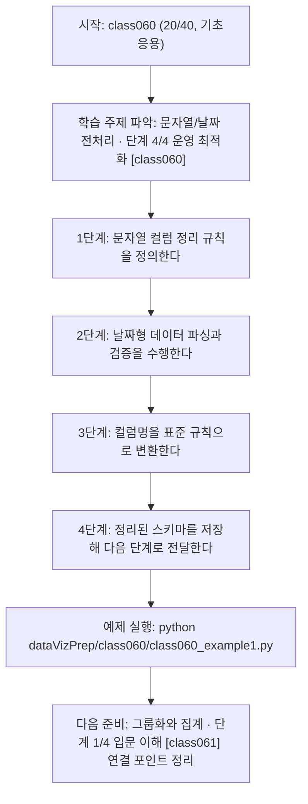
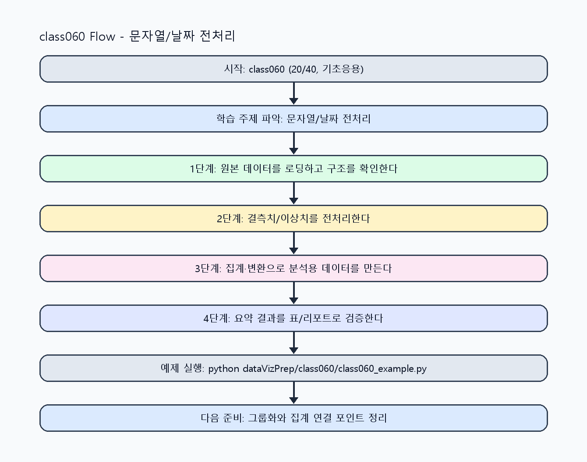

<!-- 이 파일은 www.edumgt.co.kr 의 에듀엠지티에 저작권이 있습니다 -->
# class060 자기주도 학습 가이드

## 1) 오늘의 학습 정보
- 교과목: **Python 전처리 및 시각화**
- 학습 주제: **문자열/날짜 전처리 · 단계 4/4 운영 최적화 [class060]**
- 세부 시퀀스: **20/40**
- 일정: **Day 08 / 4교시**
- 난이도: **기초응용**

### 교과목·학습주제 어휘 해설 (IT 강사 스타일)
#### 교과목 표현 분석: `Python 전처리 및 시각화`
- 문법 포인트: 명사구를 연결어 '및'으로 병렬 연결한 구조입니다. 동등한 학습 범위를 함께 제시합니다.
- 기술 포인트: 데이터 전처리와 시각화를 통해 분석 가능한 정보로 바꾸는 교과목입니다.
| 용어 | 문법/품사 | 한글·한자 | 영어 | 기술 설명 |
| --- | --- | --- | --- | --- |
| `Python` | 고유명사(언어명) | Python (한자 없음) | Python | 데이터 처리와 AI 실습에 널리 쓰이는 범용 프로그래밍 언어입니다. |
| `전처리` | 명사 | 전처리 (前處理) | preprocessing | 원시 데이터를 모델이 다루기 쉬운 형태로 정리하는 단계입니다. |
| `시각화` | 명사 | 시각화 (視覺化) | visualization | 숫자 데이터를 그래프와 차트로 표현해 패턴을 해석하는 과정입니다. |

#### 학습주제 표현 분석: `문자열/날짜 전처리 · 단계 4/4 운영 최적화 [class060]`
- 문법 포인트: 핵심 개념 명사를 중심으로 한 명사구 구조입니다.
- 기술 포인트: 이번 차시는 `문자열/날짜 전처리 · 단계 4/4 운영 최적화 [class060]` 용어를 중심으로 문제 정의, 코드 구현, 결과 검증까지 연결합니다.
| 용어 | 문법/품사 | 한글·한자 | 영어 | 기술 설명 |
| --- | --- | --- | --- | --- |
| `문자열` | 명사 | 문자열 (文字列) | string | 텍스트 데이터를 표현하는 기본 자료형입니다. |
| `날짜` | 명사 | 날짜 (날짜) | date | 시간 축 분석과 정렬/집계에 필요한 시계열 데이터입니다. |
| `전처리` | 명사 | 전처리 (前處理) | preprocessing | 원시 데이터를 모델이 다루기 쉬운 형태로 정리하는 단계입니다. |
| `단계` | 명사(기술 개념어) | 단계 (한자 없음) | (context-specific) | 용어 `단계`: 이번 학습주제에서 정의해야 할 핵심 개념 용어입니다. |
| `운영` | 명사(기술 개념어) | 운영 (한자 없음) | (context-specific) | 용어 `운영`: 이번 학습주제에서 정의해야 할 핵심 개념 용어입니다. |
| `최적화` | 명사(기술 개념어) | 최적화 (한자 없음) | (context-specific) | 용어 `최적화`: 이번 학습주제에서 정의해야 할 핵심 개념 용어입니다. |

## 2) 이전에 배운 내용 (복습)
- 이전 차시: **class059 / 문자열/날짜 전처리 · 단계 3/4 실전 검증 [class059]** (Day 08 / 3교시)
- 복습 연결: 이전에 배운 **문자열/날짜 전처리 · 단계 3/4 실전 검증 [class059]** 를 떠올리며, 오늘 **문자열/날짜 전처리 · 단계 4/4 운영 최적화 [class060]** 와 어떤 점이 이어지는지 비교해 보세요.

## 3) 주제를 아주 쉽게 이해하기
- 한 줄 설명: 문자열 정리와 날짜형 변환, 컬럼명 정규화로 일관된 분석 스키마를 만드는 차시입니다.
- 왜 배우나요?: 공백·대소문자·날짜 포맷·컬럼명 불일치를 정리하지 않으면 join/groupby 단계에서 오류가 반복됩니다.

### 핵심 개념 3가지
1. `문자열 정리`는 공백/특수문자/대소문자 규칙을 통일하는 작업입니다.
2. `날짜형 데이터 처리`는 파싱 포맷과 시계열 기준 컬럼을 명확히 해야 합니다.
3. `컬럼명 정리`는 snake_case 등 규칙을 고정해 후속 코드 안정성을 높입니다.

### 비유로 이해하기
- 지저분한 책상을 정리하면 필요한 물건을 빨리 찾을 수 있는 것과 같아요.

## 4) 실습 환경 만들기 (항상 먼저)
아래 명령은 **처음 한 번** 준비해 두면 이후 학습이 쉬워집니다.

### Windows PowerShell
```powershell
cd C:\DevOps\Python-AI_Agent-Class
python -m venv .venv
.\.venv\Scripts\Activate.ps1
python -m pip install --upgrade pip
pip install -r requirements.txt
```

### Linux/macOS (bash)
```bash
cd /path/to/Python-AI_Agent-Class
python3 -m venv .venv
source .venv/bin/activate
python -m pip install --upgrade pip
pip install -r requirements.txt
```

## 5) 오늘의 예제 코드
- 예제 파일: `class060_example1.py`
- 실행 명령:
```bash
python dataVizPrep/class060/class060_example1.py
```

### example1~example5 단계별 테스트 확장
1. example1: 문자열 정리와 날짜 파싱 기본 케이스를 실행한다.
2. example2: 다양한 날짜/문자열 형식을 추가해 규칙을 검증한다.
3. example3: 파싱 실패 입력을 넣어 예외 처리를 점검한다.
4. example4: 컬럼명 정리와 스키마 표준화를 비교한다.
5. example5: 전처리 로그/체크리스트를 운영 기준으로 정리한다.

<!-- AUTO-GENERATED: TECH_STACK_FLOW START -->
### 기술 스택
- 언어: `Python 3`
- 실행: `CLI` (`python dataVizPrep/class060/class060_example1.py`)
- 주요 문법: `함수`, `리스트/딕셔너리`, `집계 로직`, `출력(print)`
- 학습 포커스: `문자열/날짜 전처리 · 단계 4/4 운영 최적화 [class060]`

### 실습 example1.py 동작 원리 (Mermaid Flowchart)


### Flow PNG 캡처

<!-- AUTO-GENERATED: TECH_STACK_FLOW END -->

### 예제 코드를 볼 때 집중할 포인트
1. 문자열 정리 규칙이 누락 없이 적용되는지 확인하기
2. 날짜 파싱 실패를 빠르게 탐지할 수 있는지 점검하기
3. 컬럼명 표준화 후 참조 오류가 없는지 확인하기

## 6) 퀴즈로 복습하기 (10문항)
- 퀴즈 파일: `class060_quiz.html`
- 브라우저에서 열기:
```bash
dataVizPrep/class060/class060_quiz.html
```
- 버튼 설명:
1. `채점하기`: 현재 선택한 답으로 점수를 계산해요.
2. `다시풀기`: 선택을 모두 지우고 처음부터 다시 풀어요.

## 7) 혼자 실습 순서 (초등학생 버전)
1. 코드를 한 번 그대로 실행해요.
2. 숫자/문장 값을 1개 바꿔요.
3. 결과가 왜 바뀌었는지 한 줄로 적어요.
4. 함수를 1개 더 만들어 작은 기능을 추가해요.

### 실습 미션
1. 문자열 컬럼을 strip/lower/replace로 정리해 보세요.
2. 여러 날짜 형식을 하나의 datetime 포맷으로 통일하세요.
3. 컬럼명을 일괄 변환하고 전후 스키마를 비교하세요.

## 8) 스스로 점검 체크리스트
- [ ] 문자열 정리 규칙을 함수로 재사용 가능하게 만들었다.
- [ ] 날짜 파싱 성공/실패 건수를 분리해 확인했다.
- [ ] 컬럼명 규칙을 통일해 후속 코드 가독성을 높였다.

## 9) 막히면 이렇게 해결해요
1. 에러 메시지 마지막 줄을 먼저 읽어요.
2. 함수 이름과 괄호 짝을 확인해요.
3. `print()`를 넣어 중간 값을 확인해요.
4. 그래도 안 되면 어제 성공한 코드와 한 줄씩 비교해요.

## 10) 학습 후 다음에 배울 내용
- 다음 차시: **class061 / 그룹화와 집계 · 단계 1/4 입문 이해 [class061]** (Day 08 / 5교시)
- 미리보기: 다음 차시 전에 **문자열/날짜 전처리 · 단계 4/4 운영 최적화 [class060]** 핵심 코드 1개를 다시 실행해 두면 그룹화와 집계 · 단계 1/4 입문 이해 [class061] 학습이 더 쉬워집니다.

## 11) 다음 차시 연결
- 다음 차시에서는 파생변수, groupby, aggregation으로 데이터 가공을 확장합니다.
- 오늘 코드를 복사하지 말고, 직접 다시 작성해 보세요.
