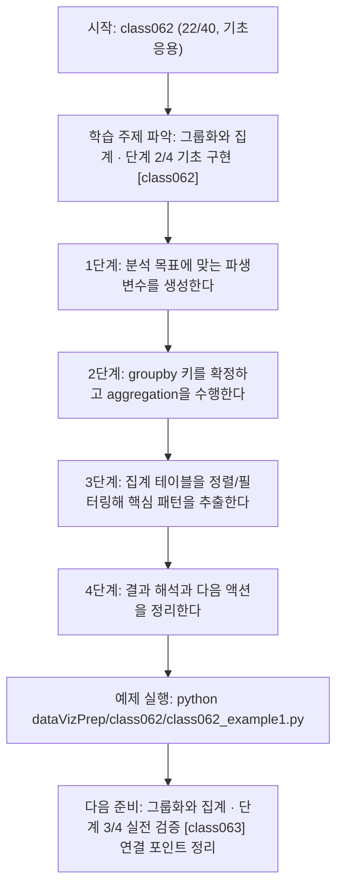
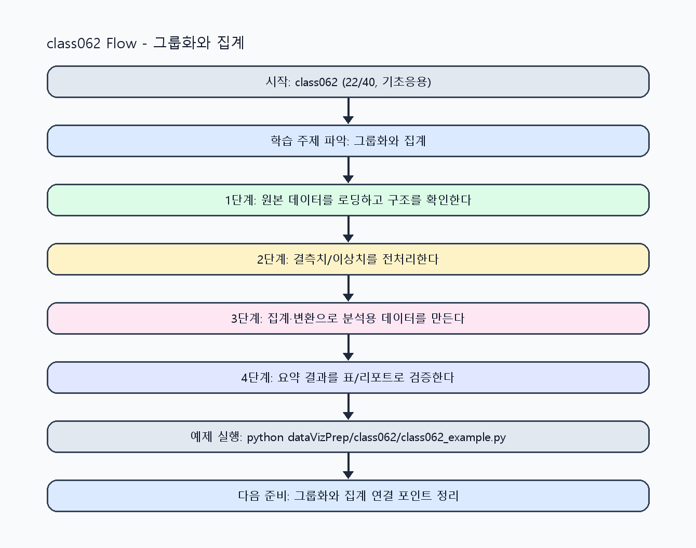

<!-- 이 파일은 www.edumgt.co.kr 의 에듀엠지티에 저작권이 있습니다 -->
# class062 자기주도 학습 가이드

## 1) 오늘의 학습 정보
- 교과목: **Python 전처리 및 시각화**
- 학습 주제: **그룹화와 집계 · 단계 2/4 기초 구현 [class062]**
- 세부 시퀀스: **22/40**
- 일정: **Day 08 / 6교시**
- 난이도: **기초응용**

### 교과목·학습주제 어휘 해설 (IT 강사 스타일)
#### 교과목 표현 분석: `Python 전처리 및 시각화`
- 문법 포인트: 명사구를 연결어 '및'으로 병렬 연결한 구조입니다. 동등한 학습 범위를 함께 제시합니다.
- 기술 포인트: 데이터 전처리와 시각화를 통해 분석 가능한 정보로 바꾸는 교과목입니다.
| 용어 | 문법/품사 | 한글·한자 | 영어 | 기술 설명 |
| --- | --- | --- | --- | --- |
| `Python` | 고유명사(언어명) | Python (한자 없음) | Python | 데이터 처리와 AI 실습에 널리 쓰이는 범용 프로그래밍 언어입니다. |
| `전처리` | 명사 | 전처리 (前處理) | preprocessing | 원시 데이터를 모델이 다루기 쉬운 형태로 정리하는 단계입니다. |
| `시각화` | 명사 | 시각화 (視覺化) | visualization | 숫자 데이터를 그래프와 차트로 표현해 패턴을 해석하는 과정입니다. |

#### 학습주제 표현 분석: `그룹화와 집계 · 단계 2/4 기초 구현 [class062]`
- 문법 포인트: 명사와 명사를 대등하게 묶는 병렬 명사구 구조입니다.
- 기술 포인트: 이번 차시는 `그룹화와 집계 · 단계 2/4 기초 구현 [class062]` 용어를 중심으로 문제 정의, 코드 구현, 결과 검증까지 연결합니다.
| 용어 | 문법/품사 | 한글·한자 | 영어 | 기술 설명 |
| --- | --- | --- | --- | --- |
| `그룹화` | 명사 | 그룹화 (그룹化) | grouping | 공통 키 기준으로 데이터를 묶어 집계 가능한 형태로 만듭니다. |
| `집계` | 명사 | 집계 (集計) | aggregation | 합계, 평균, 개수 등 통계량을 계산하는 단계입니다. |
| `단계` | 명사(기술 개념어) | 단계 (한자 없음) | (context-specific) | 용어 `단계`: 이번 학습주제에서 정의해야 할 핵심 개념 용어입니다. |
| `기초` | 명사(기술 개념어) | 기초 (한자 없음) | (context-specific) | 용어 `기초`: 이번 학습주제에서 정의해야 할 핵심 개념 용어입니다. |
| `구현` | 명사 | 구현 (具現) | implementation | 설계를 실제 코드와 시스템 동작으로 구체화하는 과정입니다. |
| `class062` | 영문 기술명/약어 | class062 (한자 없음) | class062 | 용어 `class062`: 이번 차시에서 쓰이는 핵심 기술 용어입니다. |

## 2) 이전에 배운 내용 (복습)
- 이전 차시: **class061 / 그룹화와 집계 · 단계 1/4 입문 이해 [class061]** (Day 08 / 5교시)
- 복습 연결: 이전에 배운 **그룹화와 집계 · 단계 1/4 입문 이해 [class061]** 를 떠올리며, 오늘 **그룹화와 집계 · 단계 2/4 기초 구현 [class062]** 와 어떤 점이 이어지는지 비교해 보세요.

## 3) 주제를 아주 쉽게 이해하기
- 한 줄 설명: 파생변수를 만들고 groupby/aggregation으로 의미 있는 지표를 만드는 차시입니다.
- 왜 배우나요?: 원본 데이터를 그대로 보는 것보다 그룹 단위 집계가 의사결정에 직접 쓰이는 인사이트를 제공합니다.

### 핵심 개념 3가지
1. `파생변수 생성`은 원본 컬럼을 업무 지표로 바꾸는 핵심 전처리입니다.
2. `groupby`와 `aggregation`은 집단별 합계/평균/개수 등 패턴을 드러냅니다.
3. `집계 결과 검증`은 분모/분자 오류와 그룹 누락을 줄이는 필수 단계입니다.

### 비유로 이해하기
- 지저분한 책상을 정리하면 필요한 물건을 빨리 찾을 수 있는 것과 같아요.

## 4) 실습 환경 만들기 (항상 먼저)
아래 명령은 **처음 한 번** 준비해 두면 이후 학습이 쉬워집니다.

### Windows PowerShell
```powershell
cd C:\DevOps\Python-AI_Agent-Class
python -m venv .venv
.\.venv\Scripts\Activate.ps1
python -m pip install --upgrade pip
pip install -r requirements.txt
```

### Linux/macOS (bash)
```bash
cd /path/to/Python-AI_Agent-Class
python3 -m venv .venv
source .venv/bin/activate
python -m pip install --upgrade pip
pip install -r requirements.txt
```

## 5) 오늘의 예제 코드
- 예제 파일: `class062_example1.py`
- 실행 명령:
```bash
python dataVizPrep/class062/class062_example1.py
```

### example1~example5 단계별 테스트 확장
1. example1: groupby/aggregation 기본 집계를 실행한다.
2. example2: 파생변수를 추가해 그룹 축을 확장한다.
3. example3: 누락/오류 입력을 포함해 집계 방어 로직을 점검한다.
4. example4: 그룹별 지표 비교 리포트를 생성한다.
5. example5: 운영 기준(품질 임계치/회귀 테스트)을 점검한다.

<!-- AUTO-GENERATED: TECH_STACK_FLOW START -->
### 기술 스택
- 언어: `Python 3`
- 실행: `CLI` (`python dataVizPrep/class062/class062_example1.py`)
- 주요 문법: `함수`, `리스트/딕셔너리`, `집계 로직`, `출력(print)`
- 학습 포커스: `그룹화와 집계 · 단계 2/4 기초 구현 [class062]`

### 실습 example1.py 동작 원리 (Mermaid Flowchart)


### Flow PNG 캡처

<!-- AUTO-GENERATED: TECH_STACK_FLOW END -->

### 예제 코드를 볼 때 집중할 포인트
1. 파생변수와 그룹 키가 질문 의도에 맞는지 확인하기
2. aggregation 결과에 누락 그룹이 없는지 점검하기
3. 집계 결과 해석이 수치 근거와 연결되는지 확인하기

## 6) 퀴즈로 복습하기 (10문항)
- 퀴즈 파일: `class062_quiz.html`
- 브라우저에서 열기:
```bash
dataVizPrep/class062/class062_quiz.html
```
- 버튼 설명:
1. `채점하기`: 현재 선택한 답으로 점수를 계산해요.
2. `다시풀기`: 선택을 모두 지우고 처음부터 다시 풀어요.

## 7) 혼자 실습 순서 (초등학생 버전)
1. 코드를 한 번 그대로 실행해요.
2. 숫자/문장 값을 1개 바꿔요.
3. 결과가 왜 바뀌었는지 한 줄로 적어요.
4. 함수를 1개 더 만들어 작은 기능을 추가해요.

### 실습 미션
1. 파생변수(예: month, bucket)를 생성해 분석 축을 추가하세요.
2. groupby + agg로 그룹별 합계/평균/건수를 계산하세요.
3. 원본 샘플과 집계 결과를 대조해 계산 정확도를 검증하세요.

## 8) 스스로 점검 체크리스트
- [ ] 파생변수 정의 이유를 분석 질문과 연결해 설명할 수 있다.
- [ ] groupby 키와 agg 함수 선택 근거를 제시할 수 있다.
- [ ] 집계 결과를 원본 데이터와 대조해 검증했다.

## 9) 막히면 이렇게 해결해요
1. 에러 메시지 마지막 줄을 먼저 읽어요.
2. 함수 이름과 괄호 짝을 확인해요.
3. `print()`를 넣어 중간 값을 확인해요.
4. 그래도 안 되면 어제 성공한 코드와 한 줄씩 비교해요.

## 10) 학습 후 다음에 배울 내용
- 다음 차시: **class063 / 그룹화와 집계 · 단계 3/4 실전 검증 [class063]** (Day 08 / 7교시)
- 미리보기: 다음 차시 전에 **그룹화와 집계 · 단계 2/4 기초 구현 [class062]** 핵심 코드 1개를 다시 실행해 두면 그룹화와 집계 · 단계 3/4 실전 검증 [class063] 학습이 더 쉬워집니다.

## 11) 다음 차시 연결
- 다음 차시에서는 merge/join/pivot으로 여러 테이블을 결합해 분석 폭을 넓힙니다.
- 오늘 코드를 복사하지 말고, 직접 다시 작성해 보세요.
