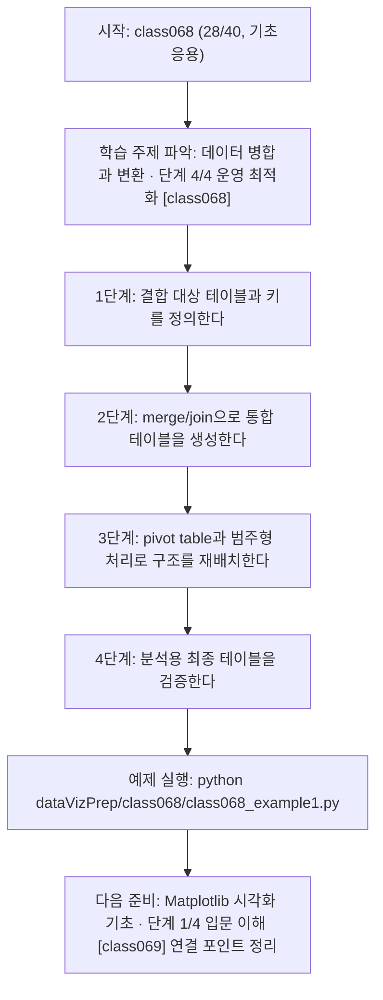
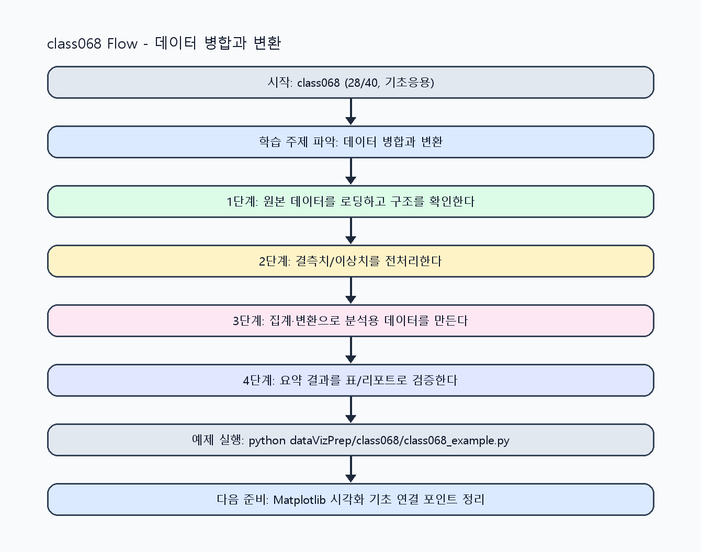

<!-- 이 파일은 www.edumgt.co.kr 의 에듀엠지티에 저작권이 있습니다 -->
# class068 자기주도 학습 가이드

## 1) 오늘의 학습 정보
- 교과목: **Python 전처리 및 시각화**
- 학습 주제: **데이터 병합과 변환 · 단계 4/4 운영 최적화 [class068]**
- 세부 시퀀스: **28/40**
- 일정: **Day 09 / 4교시**
- 난이도: **기초응용**

### 교과목·학습주제 어휘 해설 (IT 강사 스타일)
#### 교과목 표현 분석: `Python 전처리 및 시각화`
- 문법 포인트: 명사구를 연결어 '및'으로 병렬 연결한 구조입니다. 동등한 학습 범위를 함께 제시합니다.
- 기술 포인트: 데이터 전처리와 시각화를 통해 분석 가능한 정보로 바꾸는 교과목입니다.
| 용어 | 문법/품사 | 한글·한자 | 영어 | 기술 설명 |
| --- | --- | --- | --- | --- |
| `Python` | 고유명사(언어명) | Python (한자 없음) | Python | 데이터 처리와 AI 실습에 널리 쓰이는 범용 프로그래밍 언어입니다. |
| `전처리` | 명사 | 전처리 (前處理) | preprocessing | 원시 데이터를 모델이 다루기 쉬운 형태로 정리하는 단계입니다. |
| `시각화` | 명사 | 시각화 (視覺化) | visualization | 숫자 데이터를 그래프와 차트로 표현해 패턴을 해석하는 과정입니다. |

#### 학습주제 표현 분석: `데이터 병합과 변환 · 단계 4/4 운영 최적화 [class068]`
- 문법 포인트: 명사와 명사를 대등하게 묶는 병렬 명사구 구조입니다.
- 기술 포인트: 이번 차시는 `데이터 병합과 변환` 핵심 개념을 코드 구현, 결과 해석, 점검 기준으로 연결합니다.
| 용어 | 문법/품사 | 한글·한자 | 영어 | 기술 설명 |
| --- | --- | --- | --- | --- |
| `데이터` | 명사(외래어) | 데이터 (한자 없음) | data | 분석, 학습, 추론의 입력이 되는 관측값 집합입니다. |
| `병합` | 명사 | 병합 (倂合) | merge | 여러 데이터 소스를 키 기준으로 결합하는 작업입니다. |
| `변환` | 명사 | 변환 (變換) | transformation | 데이터 스키마, 타입, 값 표현을 목적에 맞게 바꾸는 과정입니다. |
| `merge` | 영문 기술명/약어 | merge (한자 없음) | merge | 이번 차시 맥락: merge/join과 pivot table, 범주형 처리로 분석 테이블을 재구성하는 차시입니다. 이를 기준으로 `merge`를 코드와 결과 해석에 연결합니다. |
| `join` | 영문 기술명/약어 | join (한자 없음) | join | 이번 차시 맥락: merge/join과 pivot table, 범주형 처리로 분석 테이블을 재구성하는 차시입니다. 이를 기준으로 `join`를 코드와 결과 해석에 연결합니다. |
| `pivot` | 영문 기술명/약어 | pivot (한자 없음) | pivot | 이번 차시 맥락: merge/join과 pivot table, 범주형 처리로 분석 테이블을 재구성하는 차시입니다. 이를 기준으로 `pivot`를 코드와 결과 해석에 연결합니다. |

## 2) 이전에 배운 내용 (복습)
- 이전 차시: **class067 / 데이터 병합과 변환 · 단계 3/4 실전 검증 [class067]** (Day 09 / 3교시)
- 복습 연결: 이전에 배운 **데이터 병합과 변환 · 단계 3/4 실전 검증 [class067]** 를 떠올리며, 오늘 **데이터 병합과 변환 · 단계 4/4 운영 최적화 [class068]** 와 어떤 점이 이어지는지 비교해 보세요.

## 3) 주제를 아주 쉽게 이해하기
- 한 줄 설명: merge/join과 pivot table, 범주형 처리로 분석 테이블을 재구성하는 차시입니다.
- 왜 배우나요?: 실무 데이터는 여러 소스에 흩어져 있어 병합·피벗·범주형 정리가 있어야 최종 리포트를 만들 수 있습니다.

### 핵심 개념 3가지
1. `merge/join`은 키 기반으로 테이블을 결합해 분석 범위를 확장합니다.
2. `pivot table`은 행·열 관점을 바꿔 패턴을 빠르게 비교하게 합니다.
3. `범주형 데이터 처리`는 코드/라벨/순서 정보를 명확히 관리하는 작업입니다.

### 비유로 이해하기
- 지저분한 책상을 정리하면 필요한 물건을 빨리 찾을 수 있는 것과 같아요.

## 4) 실습 환경 만들기 (항상 먼저)
아래 명령은 **처음 한 번** 준비해 두면 이후 학습이 쉬워집니다.

### Windows PowerShell
```powershell
cd C:\DevOps\Python-AI_Agent-Class
python -m venv .venv
.\.venv\Scripts\Activate.ps1
python -m pip install --upgrade pip
pip install -r requirements.txt
```

### Linux/macOS (bash)
```bash
cd /path/to/Python-AI_Agent-Class
python3 -m venv .venv
source .venv/bin/activate
python -m pip install --upgrade pip
pip install -r requirements.txt
```

## 5) 오늘의 예제 코드
- 예제 파일: `class068_example1.py`
- 실행 명령:
```bash
python dataVizPrep/class068/class068_example1.py
```

### example1~example5 단계별 테스트 확장
1. example1: merge/join 기본 결합을 실행한다.
2. example2: join 방식(inner/left) 차이를 비교한다.
3. example3: 키 누락/중복 케이스로 오류 경로를 점검한다.
4. example4: pivot table과 범주형 변환 결과를 비교한다.
5. example5: 결합 품질 지표와 운영 체크리스트를 점검한다.

<!-- AUTO-GENERATED: TECH_STACK_FLOW START -->
### 기술 스택
- 언어: `Python 3`
- 실행: `CLI` (`python dataVizPrep/class068/class068_example1.py`)
- 주요 문법: `함수`, `리스트/딕셔너리`, `집계 로직`, `출력(print)`
- 학습 포커스: `데이터 병합과 변환 · 단계 4/4 운영 최적화 [class068]`

### 실습 example1.py 동작 원리 (Mermaid Flowchart)


### Flow PNG 캡처

<!-- AUTO-GENERATED: TECH_STACK_FLOW END -->

### 예제 코드를 볼 때 집중할 포인트
1. 병합 키 누락/중복으로 인한 행 손실이 없는지 확인하기
2. pivot 결과가 비교 목적에 맞는 축으로 구성됐는지 점검하기
3. 범주형 순서/라벨이 시각화와 일관되는지 확인하기

## 6) 퀴즈로 복습하기 (10문항)
- 퀴즈 파일: `class068_quiz.html`
- 브라우저에서 열기:
```bash
dataVizPrep/class068/class068_quiz.html
```
- 버튼 설명:
1. `채점하기`: 현재 선택한 답으로 점수를 계산해요.
2. `다시풀기`: 선택을 모두 지우고 처음부터 다시 풀어요.

## 7) 혼자 실습 순서 (초등학생 버전)
1. 코드를 한 번 그대로 실행해요.
2. 숫자/문장 값을 1개 바꿔요.
3. 결과가 왜 바뀌었는지 한 줄로 적어요.
4. 함수를 1개 더 만들어 작은 기능을 추가해요.

### 실습 미션
1. inner/left join 결과 행 수를 비교해 차이를 확인하세요.
2. pivot table로 지표를 재배치해 읽기 쉬운 구조를 만드세요.
3. 범주형 컬럼을 category로 변환하고 정렬/집계 결과를 비교하세요.

## 8) 스스로 점검 체크리스트
- [ ] join 방식 선택 근거와 데이터 손실 여부를 설명할 수 있다.
- [ ] pivot table 전후 구조 차이를 해석할 수 있다.
- [ ] 범주형 처리 후 집계 결과가 의도대로 정렬되는지 검증했다.

## 9) 막히면 이렇게 해결해요
1. 에러 메시지 마지막 줄을 먼저 읽어요.
2. 함수 이름과 괄호 짝을 확인해요.
3. `print()`를 넣어 중간 값을 확인해요.
4. 그래도 안 되면 어제 성공한 코드와 한 줄씩 비교해요.

## 10) 학습 후 다음에 배울 내용
- 다음 차시: **class069 / Matplotlib 시각화 기초 · 단계 1/4 입문 이해 [class069]** (Day 09 / 5교시)
- 미리보기: 다음 차시 전에 **데이터 병합과 변환 · 단계 4/4 운영 최적화 [class068]** 핵심 코드 1개를 다시 실행해 두면 Matplotlib 시각화 기초 · 단계 1/4 입문 이해 [class069] 학습이 더 쉬워집니다.

## 11) 다음 차시 연결
- 다음 차시에서는 EDA 관점에서 분포·상관·가설 검증으로 해석력을 강화합니다.
- 오늘 코드를 복사하지 말고, 직접 다시 작성해 보세요.
