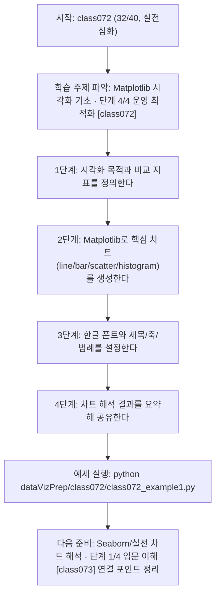
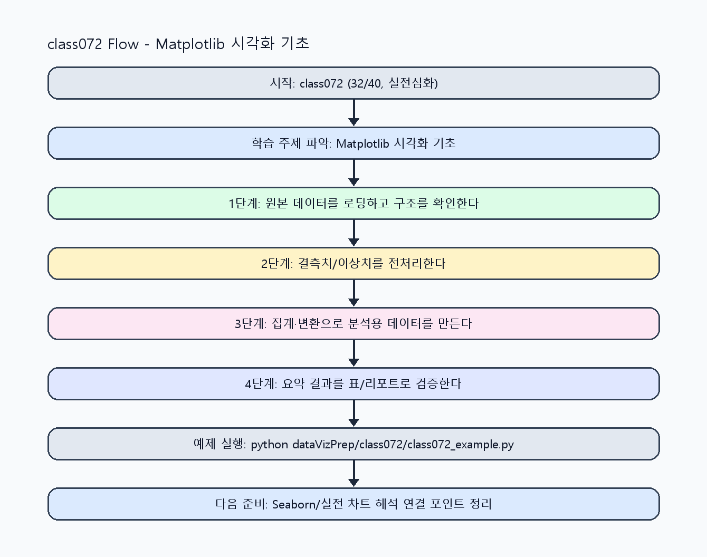

<!-- 이 파일은 www.edumgt.co.kr 의 에듀엠지티에 저작권이 있습니다 -->
# class072 자기주도 학습 가이드

## 1) 오늘의 학습 정보
- 교과목: **Python 전처리 및 시각화**
- 학습 주제: **Matplotlib 시각화 기초 · 단계 4/4 운영 최적화 [class072]**
- 세부 시퀀스: **32/40**
- 일정: **Day 09 / 8교시**
- 난이도: **실전심화**

### 교과목·학습주제 어휘 해설 (IT 강사 스타일)
#### 교과목 표현 분석: `Python 전처리 및 시각화`
- 문법 포인트: 명사구를 연결어 '및'으로 병렬 연결한 구조입니다. 동등한 학습 범위를 함께 제시합니다.
- 기술 포인트: 데이터 전처리와 시각화를 통해 분석 가능한 정보로 바꾸는 교과목입니다.
| 용어 | 문법/품사 | 한글·한자 | 영어 | 기술 설명 |
| --- | --- | --- | --- | --- |
| `Python` | 고유명사(언어명) | Python (한자 없음) | Python | 데이터 처리와 AI 실습에 널리 쓰이는 범용 프로그래밍 언어입니다. |
| `전처리` | 명사 | 전처리 (前處理) | preprocessing | 원시 데이터를 모델이 다루기 쉬운 형태로 정리하는 단계입니다. |
| `시각화` | 명사 | 시각화 (視覺化) | visualization | 숫자 데이터를 그래프와 차트로 표현해 패턴을 해석하는 과정입니다. |

#### 학습주제 표현 분석: `Matplotlib 시각화 기초 · 단계 4/4 운영 최적화 [class072]`
- 문법 포인트: 핵심 개념 명사를 중심으로 한 명사구 구조입니다.
- 기술 포인트: 이번 차시는 `Matplotlib 시각화 기초` 핵심 개념을 코드 구현, 결과 해석, 점검 기준으로 연결합니다.
| 용어 | 문법/품사 | 한글·한자 | 영어 | 기술 설명 |
| --- | --- | --- | --- | --- |
| `Matplotlib` | 고유명사(라이브러리명) | Matplotlib (한자 없음) | Matplotlib | 파이썬 기본 시각화 라이브러리로 정적 그래프 생성에 강점이 있습니다. |
| `시각화` | 명사 | 시각화 (視覺化) | visualization | 숫자 데이터를 그래프와 차트로 표현해 패턴을 해석하는 과정입니다. |
| `원칙` | 명사(주제 핵심 용어) | 원칙 (한자 없음) | (topic-specific) | 이번 차시 맥락: 시각화 원칙과 Matplotlib 기본 문법으로 line/bar/scatter/histogram 차트를 다루는 차시입니다. 이를 기준으로 `원칙`를 코드와 결과 해석에 연결합니다. |
| `문법` | 명사(주제 핵심 용어) | 문법 (한자 없음) | (topic-specific) | 이번 차시 맥락: 시각화 원칙과 Matplotlib 기본 문법으로 line/bar/scatter/histogram 차트를 다루는 차시입니다. 이를 기준으로 `문법`를 코드와 결과 해석에 연결합니다. |
| `한글` | 명사(주제 핵심 용어) | 한글 (한자 없음) | (topic-specific) | 이번 차시 맥락: `한글 폰트/제목/축/범례` 설정은 실무 리포트 가독성과 재현성의 핵심입니다. 이를 기준으로 `한글`를 코드와 결과 해석에 연결합니다. |
| `폰트` | 명사(주제 핵심 용어) | 폰트 (한자 없음) | (topic-specific) | 이번 차시 맥락: 적절한 차트와 폰트/축/범례 설정이 있어야 데이터 해석이 왜곡되지 않고 전달됩니다. 이를 기준으로 `폰트`를 코드와 결과 해석에 연결합니다. |

## 2) 이전에 배운 내용 (복습)
- 이전 차시: **class071 / Matplotlib 시각화 기초 · 단계 3/4 실전 검증 [class071]** (Day 09 / 7교시)
- 복습 연결: 이전에 배운 **Matplotlib 시각화 기초 · 단계 3/4 실전 검증 [class071]** 를 떠올리며, 오늘 **Matplotlib 시각화 기초 · 단계 4/4 운영 최적화 [class072]** 와 어떤 점이 이어지는지 비교해 보세요.

## 3) 주제를 아주 쉽게 이해하기
- 한 줄 설명: 시각화 원칙과 Matplotlib 기본 문법으로 line/bar/scatter/histogram 차트를 다루는 차시입니다.
- 왜 배우나요?: 적절한 차트와 폰트/축/범례 설정이 있어야 데이터 해석이 왜곡되지 않고 전달됩니다.

### 핵심 개념 3가지
1. `시각화 원칙`은 목적에 맞는 차트 선택, 왜곡 없는 축, 명확한 라벨링입니다.
2. `Matplotlib 기본 문법`으로 line/bar/scatter/histogram을 구현할 수 있어야 합니다.
3. `한글 폰트/제목/축/범례` 설정은 실무 리포트 가독성과 재현성의 핵심입니다.

### 비유로 이해하기
- 지저분한 책상을 정리하면 필요한 물건을 빨리 찾을 수 있는 것과 같아요.

## 4) 실습 환경 만들기 (항상 먼저)
아래 명령은 **처음 한 번** 준비해 두면 이후 학습이 쉬워집니다.

### Windows PowerShell
```powershell
cd C:\DevOps\Python-AI_Agent-Class
python -m venv .venv
.\.venv\Scripts\Activate.ps1
python -m pip install --upgrade pip
pip install -r requirements.txt
```

### Linux/macOS (bash)
```bash
cd /path/to/Python-AI_Agent-Class
python3 -m venv .venv
source .venv/bin/activate
python -m pip install --upgrade pip
pip install -r requirements.txt
```

## 5) 오늘의 예제 코드
- 예제 파일: `class072_example1.py`
- 실행 명령:
```bash
python dataVizPrep/class072/class072_example1.py
```

### example1~example5 단계별 테스트 확장
1. example1: line/bar/scatter/histogram 기본 차트를 실행한다.
2. example2: 축 범위/단위를 바꿔 해석 차이를 확인한다.
3. example3: 이상치/음수 입력으로 왜곡 가능성을 점검한다.
4. example4: 한글 폰트와 제목/축/범례 설정을 표준화한다.
5. example5: 차트 출력 실패 대비 fallback/로그를 점검한다.

<!-- AUTO-GENERATED: TECH_STACK_FLOW START -->
### 기술 스택
- 언어: `Python 3`
- 실행: `CLI` (`python dataVizPrep/class072/class072_example1.py`)
- 주요 문법: `함수`, `리스트/딕셔너리`, `집계 로직`, `출력(print)`
- 학습 포커스: `Matplotlib 시각화 기초 · 단계 4/4 운영 최적화 [class072]`

### 실습 example1.py 동작 원리 (Mermaid Flowchart)


### Flow PNG 캡처

<!-- AUTO-GENERATED: TECH_STACK_FLOW END -->

### 예제 코드를 볼 때 집중할 포인트
1. 차트 유형 선택이 질문 의도(추세/비교/분포)에 맞는지 확인하기
2. 한글 폰트/라벨/범례 설정 누락으로 가독성이 떨어지지 않는지 점검하기
3. 축 스케일이 과도한 왜곡을 만들지 않는지 확인하기

## 6) 퀴즈로 복습하기 (10문항)
- 퀴즈 파일: `class072_quiz.html`
- 브라우저에서 열기:
```bash
dataVizPrep/class072/class072_quiz.html
```
- 버튼 설명:
1. `채점하기`: 현재 선택한 답으로 점수를 계산해요.
2. `다시풀기`: 선택을 모두 지우고 처음부터 다시 풀어요.

## 7) 혼자 실습 순서 (초등학생 버전)
1. 코드를 한 번 그대로 실행해요.
2. 숫자/문장 값을 1개 바꿔요.
3. 결과가 왜 바뀌었는지 한 줄로 적어요.
4. 함수를 1개 더 만들어 작은 기능을 추가해요.

### 실습 미션
1. 동일 데이터로 line/bar/scatter/histogram을 각각 그려 차이를 비교하세요.
2. 한글 폰트를 적용해 제목/축/범례가 깨지지 않는지 확인하세요.
3. 축 범위/단위를 바꿔 해석이 어떻게 달라지는지 기록하세요.

## 8) 스스로 점검 체크리스트
- [ ] line/bar/scatter/histogram 4개 차트를 모두 실행했다.
- [ ] 한글 폰트 적용 후 제목·축 라벨·범례가 정상 출력된다.
- [ ] 차트 유형 선택 이유를 데이터 특성과 연결해 설명할 수 있다.

## 9) 막히면 이렇게 해결해요
1. 에러 메시지 마지막 줄을 먼저 읽어요.
2. 함수 이름과 괄호 짝을 확인해요.
3. `print()`를 넣어 중간 값을 확인해요.
4. 그래도 안 되면 어제 성공한 코드와 한 줄씩 비교해요.

## 10) 학습 후 다음에 배울 내용
- 다음 차시: **class073 / Seaborn/실전 차트 해석 · 단계 1/4 입문 이해 [class073]** (Day 10 / 1교시)
- 미리보기: 다음 차시 전에 **Matplotlib 시각화 기초 · 단계 4/4 운영 최적화 [class072]** 핵심 코드 1개를 다시 실행해 두면 Seaborn/실전 차트 해석 · 단계 1/4 입문 이해 [class073] 학습이 더 쉬워집니다.

## 11) 다음 차시 연결
- 다음 차시에서는 Matplotlib 결과를 Seaborn 스타일/통계 시각화로 확장합니다.
- 오늘 코드를 복사하지 말고, 직접 다시 작성해 보세요.
