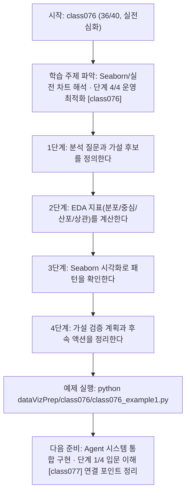
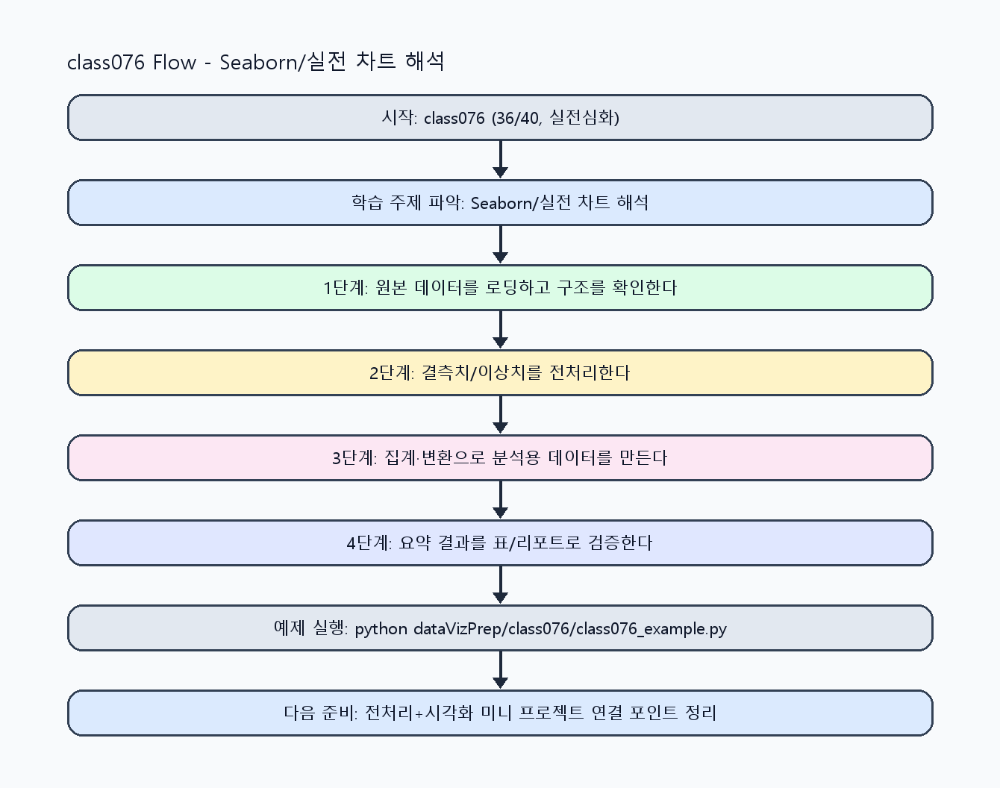

<!-- 이 파일은 www.edumgt.co.kr 의 에듀엠지티에 저작권이 있습니다 -->
# class076 자기주도 학습 가이드

## 1) 오늘의 학습 정보
- 교과목: **Python 전처리 및 시각화**
- 학습 주제: **Seaborn/실전 차트 해석 · 단계 4/4 운영 최적화 [class076]**
- 세부 시퀀스: **36/40**
- 일정: **Day 10 / 4교시**
- 난이도: **실전심화**

### 교과목·학습주제 어휘 해설 (IT 강사 스타일)
#### 교과목 표현 분석: `Python 전처리 및 시각화`
- 문법 포인트: 명사구를 연결어 '및'으로 병렬 연결한 구조입니다. 동등한 학습 범위를 함께 제시합니다.
- 기술 포인트: 데이터 전처리와 시각화를 통해 분석 가능한 정보로 바꾸는 교과목입니다.
| 용어 | 문법/품사 | 한글·한자 | 영어 | 기술 설명 |
| --- | --- | --- | --- | --- |
| `Python` | 고유명사(언어명) | Python (한자 없음) | Python | 데이터 처리와 AI 실습에 널리 쓰이는 범용 프로그래밍 언어입니다. |
| `전처리` | 명사 | 전처리 (前處理) | preprocessing | 원시 데이터를 모델이 다루기 쉬운 형태로 정리하는 단계입니다. |
| `시각화` | 명사 | 시각화 (視覺化) | visualization | 숫자 데이터를 그래프와 차트로 표현해 패턴을 해석하는 과정입니다. |

#### 학습주제 표현 분석: `Seaborn/실전 차트 해석 · 단계 4/4 운영 최적화 [class076]`
- 문법 포인트: 핵심 개념 명사를 중심으로 한 명사구 구조입니다.
- 기술 포인트: 이번 차시는 `Seaborn/실전 차트 해석 · 단계 4/4 운영 최적화 [class076]` 용어를 중심으로 문제 정의, 코드 구현, 결과 검증까지 연결합니다.
| 용어 | 문법/품사 | 한글·한자 | 영어 | 기술 설명 |
| --- | --- | --- | --- | --- |
| `Seaborn` | 고유명사(라이브러리명) | Seaborn (한자 없음) | Seaborn | 통계 시각화를 고수준 API로 제공하는 Matplotlib 기반 라이브러리입니다. |
| `실전` | 명사(기술 개념어) | 실전 (한자 없음) | (context-specific) | 용어 `실전`: 이번 학습주제에서 정의해야 할 핵심 개념 용어입니다. |
| `차트` | 명사(외래어) | 차트 (한자 없음) | chart | 데이터를 시각적 기호로 표현한 그래프 결과물입니다. |
| `해석` | 명사(기술 개념어) | 해석 (한자 없음) | (context-specific) | 용어 `해석`: 이번 학습주제에서 정의해야 할 핵심 개념 용어입니다. |
| `단계` | 명사(기술 개념어) | 단계 (한자 없음) | (context-specific) | 용어 `단계`: 이번 학습주제에서 정의해야 할 핵심 개념 용어입니다. |
| `운영` | 명사(기술 개념어) | 운영 (한자 없음) | (context-specific) | 용어 `운영`: 이번 학습주제에서 정의해야 할 핵심 개념 용어입니다. |

## 2) 이전에 배운 내용 (복습)
- 이전 차시: **class075 / Seaborn/실전 차트 해석 · 단계 3/4 실전 검증 [class075]** (Day 10 / 3교시)
- 복습 연결: 이전에 배운 **Seaborn/실전 차트 해석 · 단계 3/4 실전 검증 [class075]** 를 떠올리며, 오늘 **Seaborn/실전 차트 해석 · 단계 4/4 운영 최적화 [class076]** 와 어떤 점이 이어지는지 비교해 보세요.

## 3) 주제를 아주 쉽게 이해하기
- 한 줄 설명: 탐색적 데이터 분석(EDA) 관점에서 분포·통계·상관·패턴·가설을 다루는 차시입니다.
- 왜 배우나요?: EDA를 통해 문제를 정의하고 가설을 세워야 모델링과 보고서 품질이 높아집니다.

### 핵심 개념 3가지
1. `EDA`는 데이터 분포 파악, 평균/중앙값/표준편차 확인, 상관관계 탐색의 반복입니다.
2. `데이터 패턴 찾기`를 통해 문제 정의를 구체화하고 가설을 세울 수 있습니다.
3. `Seaborn`은 통계 시각화로 가설 검증 전 단서를 빠르게 찾게 해줍니다.

### 비유로 이해하기
- 지저분한 책상을 정리하면 필요한 물건을 빨리 찾을 수 있는 것과 같아요.

## 4) 실습 환경 만들기 (항상 먼저)
아래 명령은 **처음 한 번** 준비해 두면 이후 학습이 쉬워집니다.

### Windows PowerShell
```powershell
cd C:\DevOps\Python-AI_Agent-Class
python -m venv .venv
.\.venv\Scripts\Activate.ps1
python -m pip install --upgrade pip
pip install -r requirements.txt
```

### Linux/macOS (bash)
```bash
cd /path/to/Python-AI_Agent-Class
python3 -m venv .venv
source .venv/bin/activate
python -m pip install --upgrade pip
pip install -r requirements.txt
```

## 5) 오늘의 예제 코드
- 예제 파일: `class076_example1.py`
- 실행 명령:
```bash
python dataVizPrep/class076/class076_example1.py
```

### example1~example5 단계별 테스트 확장
1. example1: 분포/관계 차트로 EDA 기본 점검을 수행한다.
2. example2: 평균/중앙값/표준편차 비교를 확장한다.
3. example3: 상관관계와 이상 패턴을 탐지한다.
4. example4: 문제 정의와 가설 문장을 데이터로 검증한다.
5. example5: EDA 리포트 자동화와 운영 점검을 수행한다.

<!-- AUTO-GENERATED: TECH_STACK_FLOW START -->
### 기술 스택
- 언어: `Python 3`
- 실행: `CLI` (`python dataVizPrep/class076/class076_example1.py`)
- 주요 문법: `함수`, `리스트/딕셔너리`, `집계 로직`, `출력(print)`
- 학습 포커스: `Seaborn/실전 차트 해석 · 단계 4/4 운영 최적화 [class076]`

### 실습 example1.py 동작 원리 (Mermaid Flowchart)


### Flow PNG 캡처

<!-- AUTO-GENERATED: TECH_STACK_FLOW END -->

### 예제 코드를 볼 때 집중할 포인트
1. EDA 결과가 문제 정의와 직접 연결되는지 확인하기
2. 시각 패턴과 통계 수치를 함께 근거로 제시했는지 점검하기
3. 가설 문장이 측정 가능 지표로 검증 가능한지 확인하기

## 6) 퀴즈로 복습하기 (10문항)
- 퀴즈 파일: `class076_quiz.html`
- 브라우저에서 열기:
```bash
dataVizPrep/class076/class076_quiz.html
```
- 버튼 설명:
1. `채점하기`: 현재 선택한 답으로 점수를 계산해요.
2. `다시풀기`: 선택을 모두 지우고 처음부터 다시 풀어요.

## 7) 혼자 실습 순서 (초등학생 버전)
1. 코드를 한 번 그대로 실행해요.
2. 숫자/문장 값을 1개 바꿔요.
3. 결과가 왜 바뀌었는지 한 줄로 적어요.
4. 함수를 1개 더 만들어 작은 기능을 추가해요.

### 실습 미션
1. 분포 차트로 평균/중앙값/표준편차를 해석하세요.
2. 상관 차트(scatter/heatmap)로 변수 관계를 점검하세요.
3. 발견한 패턴을 바탕으로 가설 1개 이상을 문장으로 작성하세요.

## 8) 스스로 점검 체크리스트
- [ ] 평균·중앙값·표준편차를 데이터 분포와 함께 해석했다.
- [ ] 상관관계 수치와 시각 패턴을 함께 설명할 수 있다.
- [ ] 문제 정의와 가설 설정을 데이터 근거로 제시했다.

## 9) 막히면 이렇게 해결해요
1. 에러 메시지 마지막 줄을 먼저 읽어요.
2. 함수 이름과 괄호 짝을 확인해요.
3. `print()`를 넣어 중간 값을 확인해요.
4. 그래도 안 되면 어제 성공한 코드와 한 줄씩 비교해요.

## 10) 학습 후 다음에 배울 내용
- 다음 차시: **class077 / Agent 시스템 통합 구현 · 단계 1/4 입문 이해 [class077]** (Day 10 / 5교시)
- 미리보기: 다음 차시 전에 **Seaborn/실전 차트 해석 · 단계 4/4 운영 최적화 [class076]** 핵심 코드 1개를 다시 실행해 두면 Agent 시스템 통합 구현 · 단계 1/4 입문 이해 [class077] 학습이 더 쉬워집니다.

## 11) 다음 차시 연결
- 다음 차시에서는 시각화와 전처리를 묶어 Agent 시스템 통합 구현으로 연결합니다.
- 오늘 코드를 복사하지 말고, 직접 다시 작성해 보세요.
