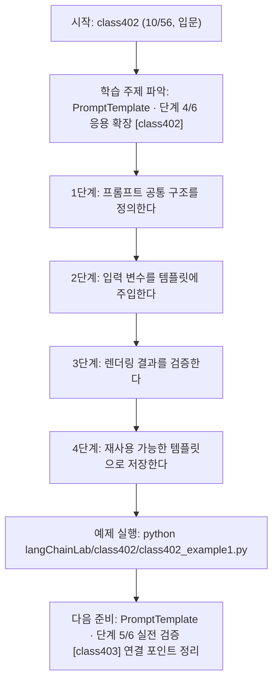
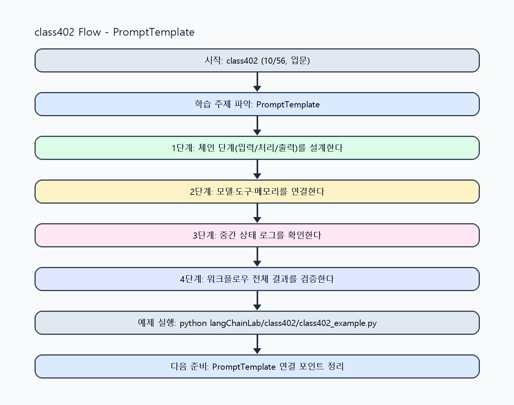

<!-- 이 파일은 www.edumgt.co.kr 의 에듀엠지티에 저작권이 있습니다 -->
# class402 자기주도 학습 가이드

## 1) 오늘의 학습 정보
- 교과목: **Langchain 활용하기**
- 학습 주제: **PromptTemplate · 단계 4/6 응용 확장 [class402]**
- 세부 시퀀스: **10/56**
- 일정: **Day 51 / 2교시**
- 난이도: **입문**

### 교과목·학습주제 어휘 해설 (IT 강사 스타일)
#### 교과목 표현 분석: `Langchain 활용하기`
- 문법 포인트: 동사 어간 + '-기' 명사형 구조입니다. 학습 행동 자체를 주제로 명사화한 표현입니다.
- 기술 포인트: 체인 기반 워크플로우를 구성해 서비스형 AI를 구현하는 교과목입니다.
| 용어 | 문법/품사 | 한글·한자 | 영어 | 기술 설명 |
| --- | --- | --- | --- | --- |
| `LangChain` | 고유명사(프레임워크명) | LangChain (한자 없음) | LangChain | LLM 애플리케이션을 체인/도구 기반으로 구성하는 프레임워크입니다. |
| `활용` | 명사/동사 어근 | 활용 (活用) | utilization | 이론이나 도구를 실제 문제 해결 맥락에 적용하는 행위입니다. |

#### 학습주제 표현 분석: `PromptTemplate · 단계 4/6 응용 확장 [class402]`
- 문법 포인트: 핵심 개념 명사를 중심으로 한 명사구 구조입니다.
- 기술 포인트: 이번 차시는 `PromptTemplate · 단계 4/6 응용 확장 [class402]` 용어를 중심으로 문제 정의, 코드 구현, 결과 검증까지 연결합니다.
| 용어 | 문법/품사 | 한글·한자 | 영어 | 기술 설명 |
| --- | --- | --- | --- | --- |
| `PromptTemplate` | 복합명사(클래스명) | PromptTemplate (한자 없음) | PromptTemplate | 변수 기반 프롬프트를 재사용 가능하게 만드는 템플릿 구성요소입니다. |
| `단계` | 명사(기술 개념어) | 단계 (한자 없음) | (context-specific) | 용어 `단계`: 이번 학습주제에서 정의해야 할 핵심 개념 용어입니다. |
| `응용` | 명사(기술 개념어) | 응용 (한자 없음) | (context-specific) | 용어 `응용`: 이번 학습주제에서 정의해야 할 핵심 개념 용어입니다. |
| `확장` | 명사(기술 개념어) | 확장 (한자 없음) | (context-specific) | 용어 `확장`: 이번 학습주제에서 정의해야 할 핵심 개념 용어입니다. |
| `class402` | 영문 기술명/약어 | class402 (한자 없음) | class402 | 용어 `class402`: 이번 차시에서 쓰이는 핵심 기술 용어입니다. |

## 2) 이전에 배운 내용 (복습)
- 이전 차시: **class401 / PromptTemplate · 단계 3/6 응용 확장 [class401]** (Day 51 / 1교시)
- 복습 연결: 이전에 배운 **PromptTemplate · 단계 3/6 응용 확장 [class401]** 를 떠올리며, 오늘 **PromptTemplate · 단계 4/6 응용 확장 [class402]** 와 어떤 점이 이어지는지 비교해 보세요.

## 3) 주제를 아주 쉽게 이해하기
- 한 줄 설명: PromptTemplate의 변수 주입, 템플릿 재사용, 사용자 입력 연결, 구조화 프롬프트 관리를 다루는 차시입니다.
- 왜 배우나요?: 프롬프트를 하드코딩하면 재사용과 테스트가 어렵고, 입력 변경 시 오류가 쉽게 발생합니다.

### 핵심 개념 3가지
1. `변수 주입`은 사용자 입력을 안전하게 템플릿에 연결하는 핵심 방식입니다.
2. `템플릿 재사용`은 동일 작업(요약/질의응답/분류)을 일관된 품질로 반복 실행하게 합니다.
3. `구조화 프롬프트 관리`는 역할, 목표, 제약조건, 출력형식을 템플릿 레벨에서 표준화하는 작업입니다.

### 비유로 이해하기
- 샌드위치를 만들 때 재료 준비, 굽기, 포장을 단계별로 나누는 것과 같아요.

## 4) 실습 환경 만들기 (항상 먼저)
아래 명령은 **처음 한 번** 준비해 두면 이후 학습이 쉬워집니다.

### Windows PowerShell
```powershell
cd C:\DevOps\Python-AI_Agent-Class
python -m venv .venv
.\.venv\Scripts\Activate.ps1
python -m pip install --upgrade pip
pip install -r requirements.txt
```

### Linux/macOS (bash)
```bash
cd /path/to/Python-AI_Agent-Class
python3 -m venv .venv
source .venv/bin/activate
python -m pip install --upgrade pip
pip install -r requirements.txt
```

## 5) 오늘의 예제 코드
- 예제 파일: `class402_example1.py`
- 실행 명령:
```bash
python langChainLab/class402/class402_example1.py
```

### example1~example5 단계별 테스트 확장
1. example1: 변수 주입 기반 PromptTemplate를 작성한다.
2. example2: 사용자 입력을 연결해 템플릿 재사용성을 검증한다.
3. example3: 구조화 프롬프트 누락/오류 케이스를 점검한다.
4. example4: 템플릿 버전별 출력 품질을 비교한다.
5. example5: 프롬프트 템플릿 관리 기준을 정리한다.

<!-- AUTO-GENERATED: TECH_STACK_FLOW START -->
### 기술 스택
- 언어: `Python 3`
- 실행: `CLI` (`python langChainLab/class402/class402_example1.py`)
- 주요 문법: `PromptTemplate 문자열`, `입력 변수 dict`, `템플릿 렌더 함수`, `형식 제약조건`
- 학습 포커스: `PromptTemplate · 단계 4/6 응용 확장 [class402]`

### 실습 example1.py 동작 원리 (Mermaid Flowchart)


### Flow PNG 캡처

<!-- AUTO-GENERATED: TECH_STACK_FLOW END -->

### 예제 코드를 볼 때 집중할 포인트
1. 입력 변수 누락/오타가 없는지 확인하기
2. 템플릿이 과도한 결합 없이 여러 태스크에 재사용되는지 점검하기
3. 출력 형식 제약이 템플릿에 반영되는지 확인하기

## 6) 퀴즈로 복습하기 (10문항)
- 퀴즈 파일: `class402_quiz.html`
- 브라우저에서 열기:
```bash
langChainLab/class402/class402_quiz.html
```
- 버튼 설명:
1. `채점하기`: 현재 선택한 답으로 점수를 계산해요.
2. `다시풀기`: 선택을 모두 지우고 처음부터 다시 풀어요.

## 7) 혼자 실습 순서 (초등학생 버전)
1. 코드를 한 번 그대로 실행해요.
2. 숫자/문장 값을 1개 바꿔요.
3. 결과가 왜 바뀌었는지 한 줄로 적어요.
4. 함수를 1개 더 만들어 작은 기능을 추가해요.

### 실습 미션
1. 하드코딩 프롬프트를 PromptTemplate 기반으로 바꿔 보세요.
2. 입력 변수 2개 이상(question, context 등)를 주입해 결과를 비교하세요.
3. 템플릿 버전을 분리해 재사용 가능한 프롬프트 집합을 구성하세요.

## 8) 스스로 점검 체크리스트
- [ ] PromptTemplate 변수 주입 방식을 적용했다.
- [ ] 템플릿 재사용 구조(함수/클래스)를 만들었다.
- [ ] 사용자 입력과 구조화 프롬프트를 안전하게 연결했다.

## 9) 막히면 이렇게 해결해요
1. 에러 메시지 마지막 줄을 먼저 읽어요.
2. 함수 이름과 괄호 짝을 확인해요.
3. `print()`를 넣어 중간 값을 확인해요.
4. 그래도 안 되면 어제 성공한 코드와 한 줄씩 비교해요.

## 10) 학습 후 다음에 배울 내용
- 다음 차시: **class403 / PromptTemplate · 단계 5/6 실전 검증 [class403]** (Day 51 / 3교시)
- 미리보기: 다음 차시 전에 **PromptTemplate · 단계 4/6 응용 확장 [class402]** 핵심 코드 1개를 다시 실행해 두면 PromptTemplate · 단계 5/6 실전 검증 [class403] 학습이 더 쉬워집니다.

## 11) 다음 차시 연결
- 다음 차시에서는 Model 연결과 핵심 구성요소 연계를 통해 실제 체인 실행을 시작합니다.
- 오늘 코드를 복사하지 말고, 직접 다시 작성해 보세요.
