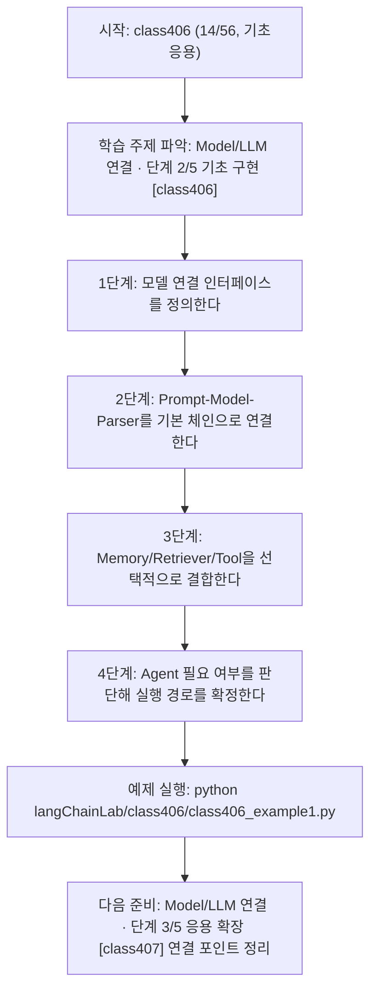
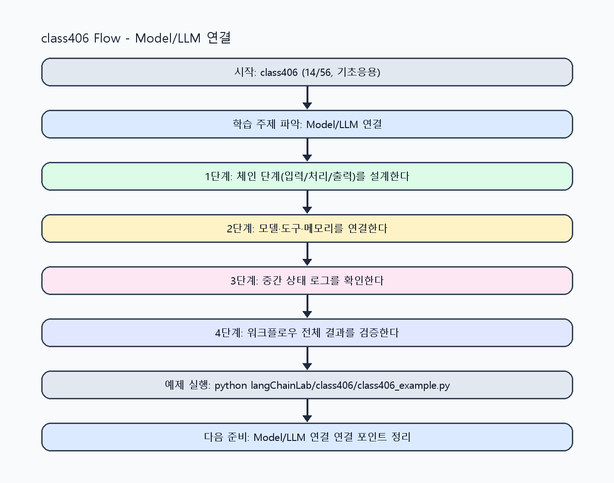

<!-- 이 파일은 www.edumgt.co.kr 의 에듀엠지티에 저작권이 있습니다 -->
# class406 자기주도 학습 가이드

## 1) 오늘의 학습 정보
- 교과목: **Langchain 활용하기**
- 학습 주제: **Model/LLM 연결 · 단계 2/5 기초 구현 [class406]**
- 세부 시퀀스: **14/56**
- 일정: **Day 51 / 6교시**
- 난이도: **기초응용**

### 교과목·학습주제 어휘 해설 (IT 강사 스타일)
#### 교과목 표현 분석: `Langchain 활용하기`
- 문법 포인트: 동사 어간 + '-기' 명사형 구조입니다. 학습 행동 자체를 주제로 명사화한 표현입니다.
- 기술 포인트: 체인 기반 워크플로우를 구성해 서비스형 AI를 구현하는 교과목입니다.
| 용어 | 문법/품사 | 한글·한자 | 영어 | 기술 설명 |
| --- | --- | --- | --- | --- |
| `LangChain` | 고유명사(프레임워크명) | LangChain (한자 없음) | LangChain | LLM 애플리케이션을 체인/도구 기반으로 구성하는 프레임워크입니다. |
| `활용` | 명사/동사 어근 | 활용 (活用) | utilization | 이론이나 도구를 실제 문제 해결 맥락에 적용하는 행위입니다. |

#### 학습주제 표현 분석: `Model/LLM 연결 · 단계 2/5 기초 구현 [class406]`
- 문법 포인트: 핵심 개념 명사를 중심으로 한 명사구 구조입니다.
- 기술 포인트: 이번 차시는 `Model/LLM 연결` 핵심 개념을 코드 구현, 결과 해석, 점검 기준으로 연결합니다.
| 용어 | 문법/품사 | 한글·한자 | 영어 | 기술 설명 |
| --- | --- | --- | --- | --- |
| `Model` | 영문 기술명/약어 | Model (한자 없음) | Model | 이번 차시 맥락: Model 연결을 중심으로 LangChain 핵심 구성요소(Model, PromptTemplate, Chain, Output Parser, Memory, Retriever, Tool, Agent)를 한 번에 정리하는 차시입니다. 이를 기준으로 `Model`를 코드와 결과 해석에 연결합니다. |
| `LLM` | 약어명사 | LLM (한자 없음) | Large Language Model | 대규모 텍스트로 사전학습된 생성형 언어 모델입니다. |
| `연결` | 명사(주제 핵심 용어) | 연결 (한자 없음) | (topic-specific) | 이번 차시 맥락: Model 연결을 중심으로 LangChain 핵심 구성요소(Model, PromptTemplate, Chain, Output Parser, Memory, Retriever, Tool, Agent)를 한 번에 정리하는 차시입니다. 이를 기준으로 `연결`를 코드와 결과 해석에 연결합니다. |
| `PromptTemplate` | 복합명사(클래스명) | PromptTemplate (한자 없음) | PromptTemplate | 변수 기반 프롬프트를 재사용 가능하게 만드는 템플릿 구성요소입니다. |
| `Chain` | 명사(영어) | Chain (한자 없음) | chain | 여러 처리 단계를 순차 연결한 실행 파이프라인입니다. |
| `Output` | 영문 기술명/약어 | Output (한자 없음) | Output | 이번 차시 맥락: Model 연결을 중심으로 LangChain 핵심 구성요소(Model, PromptTemplate, Chain, Output Parser, Memory, Retriever, Tool, Agent)를 한 번에 정리하는 차시입니다. 이를 기준으로 `Output`를 코드와 결과 해석에 연결합니다. |

## 2) 이전에 배운 내용 (복습)
- 이전 차시: **class405 / Model/LLM 연결 · 단계 1/5 입문 이해 [class405]** (Day 51 / 5교시)
- 복습 연결: 이전에 배운 **Model/LLM 연결 · 단계 1/5 입문 이해 [class405]** 를 떠올리며, 오늘 **Model/LLM 연결 · 단계 2/5 기초 구현 [class406]** 와 어떤 점이 이어지는지 비교해 보세요.

## 3) 주제를 아주 쉽게 이해하기
- 한 줄 설명: Model 연결을 중심으로 LangChain 핵심 구성요소(Model, PromptTemplate, Chain, Output Parser, Memory, Retriever, Tool, Agent)를 한 번에 정리하는 차시입니다.
- 왜 배우나요?: 구성요소를 따로 이해하면 실제 앱 설계에서 연결 순서와 책임 경계를 놓치기 쉽습니다.

### 핵심 개념 3가지
1. `Model`은 생성/추론을 담당하고, `PromptTemplate`은 입력 형식을 표준화합니다.
2. `Chain`은 단계 실행 흐름을 만들고, `Output Parser`는 후처리 가능한 구조를 보장합니다.
3. `Memory/Retriever/Tool/Agent`는 대화 문맥, 검색 근거, 외부 기능 호출, 동적 실행 의사결정을 담당합니다.

### 비유로 이해하기
- 샌드위치를 만들 때 재료 준비, 굽기, 포장을 단계별로 나누는 것과 같아요.

## 4) 실습 환경 만들기 (항상 먼저)
아래 명령은 **처음 한 번** 준비해 두면 이후 학습이 쉬워집니다.

### Windows PowerShell
```powershell
cd C:\DevOps\Python-AI_Agent-Class
python -m venv .venv
.\.venv\Scripts\Activate.ps1
python -m pip install --upgrade pip
pip install -r requirements.txt
```

### Linux/macOS (bash)
```bash
cd /path/to/Python-AI_Agent-Class
python3 -m venv .venv
source .venv/bin/activate
python -m pip install --upgrade pip
pip install -r requirements.txt
```

## 5) 오늘의 예제 코드
- 예제 파일: `class406_example1.py`
- 실행 명령:
```bash
python langChainLab/class406/class406_example1.py
```

### example1~example5 단계별 테스트 확장
1. example1: Model-Prompt-Chain 최소 연결을 실행한다.
2. example2: OutputParser/Memory/Retriever 연결을 확장한다.
3. example3: Tool/Agent 분기 조건 실패 케이스를 점검한다.
4. example4: 구성요소 조합별 성능/복잡도를 비교한다.
5. example5: 핵심 구성요소 선택 기준을 문서화한다.

<!-- AUTO-GENERATED: TECH_STACK_FLOW START -->
### 기술 스택
- 언어: `Python 3`
- 실행: `CLI` (`python langChainLab/class406/class406_example1.py`)
- 주요 문법: `모델 호출 함수`, `체인 오케스트레이션`, `파서 연동`, `구성요소 라우팅`
- 학습 포커스: `Model/LLM 연결 · 단계 2/5 기초 구현 [class406]`

### 실습 example1.py 동작 원리 (Mermaid Flowchart)


### Flow PNG 캡처

<!-- AUTO-GENERATED: TECH_STACK_FLOW END -->

### 예제 코드를 볼 때 집중할 포인트
1. 구성요소 간 책임이 겹치지 않는지 확인하기
2. 모델 출력이 Parser 입력 스키마와 일치하는지 점검하기
3. Agent를 과도하게 사용하지 않고 단순 체인으로 해결 가능한지 확인하기

## 6) 퀴즈로 복습하기 (10문항)
- 퀴즈 파일: `class406_quiz.html`
- 브라우저에서 열기:
```bash
langChainLab/class406/class406_quiz.html
```
- 버튼 설명:
1. `채점하기`: 현재 선택한 답으로 점수를 계산해요.
2. `다시풀기`: 선택을 모두 지우고 처음부터 다시 풀어요.

## 7) 혼자 실습 순서 (초등학생 버전)
1. 코드를 한 번 그대로 실행해요.
2. 숫자/문장 값을 1개 바꿔요.
3. 결과가 왜 바뀌었는지 한 줄로 적어요.
4. 함수를 1개 더 만들어 작은 기능을 추가해요.

### 실습 미션
1. Model 호출 전/후 PromptTemplate, Parser를 연결한 최소 체인을 구성하세요.
2. Memory와 Retriever를 연결해 입력 컨텍스트를 확장하세요.
3. Tool/Agent 개요 수준에서 어떤 상황에 어떤 구성요소를 붙일지 매핑하세요.

## 8) 스스로 점검 체크리스트
- [ ] 핵심 구성요소 8개의 역할을 설명할 수 있다.
- [ ] Model 중심 체인에서 Parser/Memory/Retriever 연결 흐름을 구현했다.
- [ ] Agent를 언제 쓰고 언제 쓰지 않을지 기준을 설명할 수 있다.

## 9) 막히면 이렇게 해결해요
1. 에러 메시지 마지막 줄을 먼저 읽어요.
2. 함수 이름과 괄호 짝을 확인해요.
3. `print()`를 넣어 중간 값을 확인해요.
4. 그래도 안 되면 어제 성공한 코드와 한 줄씩 비교해요.

## 10) 학습 후 다음에 배울 내용
- 다음 차시: **class407 / Model/LLM 연결 · 단계 3/5 응용 확장 [class407]** (Day 51 / 7교시)
- 미리보기: 다음 차시 전에 **Model/LLM 연결 · 단계 2/5 기초 구현 [class406]** 핵심 코드 1개를 다시 실행해 두면 Model/LLM 연결 · 단계 3/5 응용 확장 [class407] 학습이 더 쉬워집니다.

## 11) 다음 차시 연결
- 다음 차시에서는 Output Parser를 통해 문자열/JSON 출력을 구조화합니다.
- 오늘 코드를 복사하지 말고, 직접 다시 작성해 보세요.
