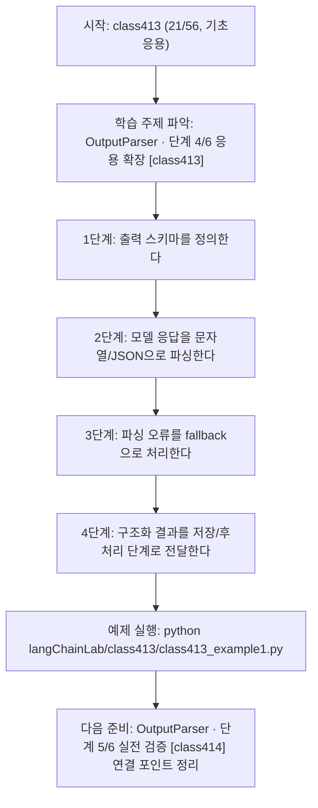
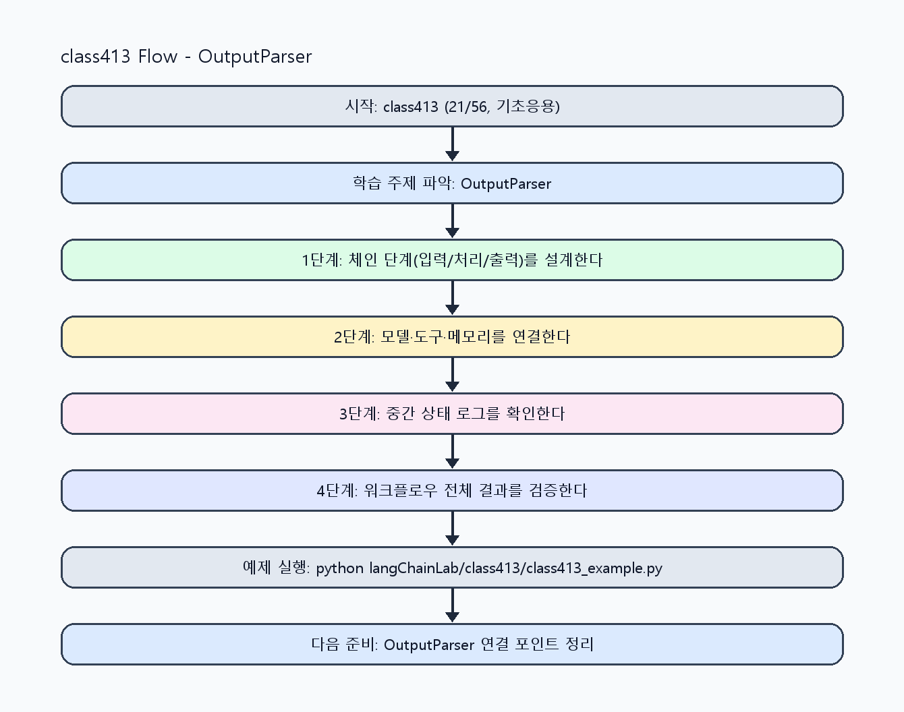

<!-- 이 파일은 www.edumgt.co.kr 의 에듀엠지티에 저작권이 있습니다 -->
# class413 자기주도 학습 가이드

## 1) 오늘의 학습 정보
- 교과목: **Langchain 활용하기**
- 학습 주제: **OutputParser · 단계 4/6 응용 확장 [class413]**
- 세부 시퀀스: **21/56**
- 일정: **Day 52 / 5교시**
- 난이도: **기초응용**

### 교과목·학습주제 어휘 해설 (IT 강사 스타일)
#### 교과목 표현 분석: `Langchain 활용하기`
- 문법 포인트: 동사 어간 + '-기' 명사형 구조입니다. 학습 행동 자체를 주제로 명사화한 표현입니다.
- 기술 포인트: 체인 기반 워크플로우를 구성해 서비스형 AI를 구현하는 교과목입니다.
| 용어 | 문법/품사 | 한글·한자 | 영어 | 기술 설명 |
| --- | --- | --- | --- | --- |
| `LangChain` | 고유명사(프레임워크명) | LangChain (한자 없음) | LangChain | LLM 애플리케이션을 체인/도구 기반으로 구성하는 프레임워크입니다. |
| `활용` | 명사/동사 어근 | 활용 (活用) | utilization | 이론이나 도구를 실제 문제 해결 맥락에 적용하는 행위입니다. |

#### 학습주제 표현 분석: `OutputParser · 단계 4/6 응용 확장 [class413]`
- 문법 포인트: 핵심 개념 명사를 중심으로 한 명사구 구조입니다.
- 기술 포인트: 이번 차시는 `OutputParser · 단계 4/6 응용 확장 [class413]` 용어를 중심으로 문제 정의, 코드 구현, 결과 검증까지 연결합니다.
| 용어 | 문법/품사 | 한글·한자 | 영어 | 기술 설명 |
| --- | --- | --- | --- | --- |
| `OutputParser` | 복합명사(클래스명) | OutputParser (한자 없음) | OutputParser | 모델 출력을 지정된 구조(JSON 등)로 파싱하는 구성요소입니다. |
| `단계` | 명사(기술 개념어) | 단계 (한자 없음) | (context-specific) | 용어 `단계`: 이번 학습주제에서 정의해야 할 핵심 개념 용어입니다. |
| `응용` | 명사(기술 개념어) | 응용 (한자 없음) | (context-specific) | 용어 `응용`: 이번 학습주제에서 정의해야 할 핵심 개념 용어입니다. |
| `확장` | 명사(기술 개념어) | 확장 (한자 없음) | (context-specific) | 용어 `확장`: 이번 학습주제에서 정의해야 할 핵심 개념 용어입니다. |
| `class413` | 영문 기술명/약어 | class413 (한자 없음) | class413 | 용어 `class413`: 이번 차시에서 쓰이는 핵심 기술 용어입니다. |

## 2) 이전에 배운 내용 (복습)
- 이전 차시: **class412 / OutputParser · 단계 3/6 응용 확장 [class412]** (Day 52 / 4교시)
- 복습 연결: 이전에 배운 **OutputParser · 단계 3/6 응용 확장 [class412]** 를 떠올리며, 오늘 **OutputParser · 단계 4/6 응용 확장 [class413]** 와 어떤 점이 이어지는지 비교해 보세요.

## 3) 주제를 아주 쉽게 이해하기
- 한 줄 설명: 문자열 응답 파싱, JSON 처리, 구조화 결과 저장, 후처리 자동화를 다루는 차시입니다.
- 왜 배우나요?: LLM 응답을 그대로 쓰면 서비스 연동 시 파싱 오류와 후처리 비용이 크게 증가합니다.

### 핵심 개념 3가지
1. `문자열 파싱`은 응답 텍스트에서 필요한 필드를 추출하는 기본 단계입니다.
2. `JSON 출력 처리`는 후속 시스템(API/DB)과 안정적으로 연결하기 위한 표준 방식입니다.
3. `구조화 저장`과 `후처리 자동화`는 체인의 마지막 품질 보증 단계입니다.

### 비유로 이해하기
- 샌드위치를 만들 때 재료 준비, 굽기, 포장을 단계별로 나누는 것과 같아요.

## 4) 실습 환경 만들기 (항상 먼저)
아래 명령은 **처음 한 번** 준비해 두면 이후 학습이 쉬워집니다.

### Windows PowerShell
```powershell
cd C:\DevOps\Python-AI_Agent-Class
python -m venv .venv
.\.venv\Scripts\Activate.ps1
python -m pip install --upgrade pip
pip install -r requirements.txt
```

### Linux/macOS (bash)
```bash
cd /path/to/Python-AI_Agent-Class
python3 -m venv .venv
source .venv/bin/activate
python -m pip install --upgrade pip
pip install -r requirements.txt
```

## 5) 오늘의 예제 코드
- 예제 파일: `class413_example1.py`
- 실행 명령:
```bash
python langChainLab/class413/class413_example1.py
```

### example1~example5 단계별 테스트 확장
1. example1: 문자열 응답 파싱을 실행한다.
2. example2: JSON 출력 파싱과 스키마 검증을 추가한다.
3. example3: 파싱 실패 fallback 처리 케이스를 점검한다.
4. example4: 구조화 저장/후처리 자동화를 비교한다.
5. example5: 파싱 안정성 운영 기준을 정리한다.

<!-- AUTO-GENERATED: TECH_STACK_FLOW START -->
### 기술 스택
- 언어: `Python 3`
- 실행: `CLI` (`python langChainLab/class413/class413_example1.py`)
- 주요 문법: `문자열 파서`, `JSON 파서`, `스키마 검증`, `후처리 함수`
- 학습 포커스: `OutputParser · 단계 4/6 응용 확장 [class413]`

### 실습 example1.py 동작 원리 (Mermaid Flowchart)


### Flow PNG 캡처

<!-- AUTO-GENERATED: TECH_STACK_FLOW END -->

### 예제 코드를 볼 때 집중할 포인트
1. JSON 키 누락/타입 오류를 탐지하는지 확인하기
2. 파싱 실패 시 전체 체인이 중단되지 않는지 점검하기
3. 구조화 결과가 후처리 요구사항과 일치하는지 확인하기

## 6) 퀴즈로 복습하기 (10문항)
- 퀴즈 파일: `class413_quiz.html`
- 브라우저에서 열기:
```bash
langChainLab/class413/class413_quiz.html
```
- 버튼 설명:
1. `채점하기`: 현재 선택한 답으로 점수를 계산해요.
2. `다시풀기`: 선택을 모두 지우고 처음부터 다시 풀어요.

## 7) 혼자 실습 순서 (초등학생 버전)
1. 코드를 한 번 그대로 실행해요.
2. 숫자/문장 값을 1개 바꿔요.
3. 결과가 왜 바뀌었는지 한 줄로 적어요.
4. 함수를 1개 더 만들어 작은 기능을 추가해요.

### 실습 미션
1. 문자열 응답에서 핵심 필드를 파싱해 dict로 변환하세요.
2. JSON 응답 강제와 파싱 실패 fallback을 구현하세요.
3. 파싱 결과를 저장 가능한 구조로 변환해 후처리 자동화를 점검하세요.

## 8) 스스로 점검 체크리스트
- [ ] 문자열/JSON 파싱을 모두 실행했다.
- [ ] 파싱 실패 예외 처리(fallback)를 구현했다.
- [ ] 구조화 결과를 저장/후처리에 연결했다.

## 9) 막히면 이렇게 해결해요
1. 에러 메시지 마지막 줄을 먼저 읽어요.
2. 함수 이름과 괄호 짝을 확인해요.
3. `print()`를 넣어 중간 값을 확인해요.
4. 그래도 안 되면 어제 성공한 코드와 한 줄씩 비교해요.

## 10) 학습 후 다음에 배울 내용
- 다음 차시: **class414 / OutputParser · 단계 5/6 실전 검증 [class414]** (Day 52 / 6교시)
- 미리보기: 다음 차시 전에 **OutputParser · 단계 4/6 응용 확장 [class413]** 핵심 코드 1개를 다시 실행해 두면 OutputParser · 단계 5/6 실전 검증 [class414] 학습이 더 쉬워집니다.

## 11) 다음 차시 연결
- 다음 차시에서는 Chain 구성 패턴(단일/순차/다단계)을 본격적으로 확장합니다.
- 오늘 코드를 복사하지 말고, 직접 다시 작성해 보세요.
