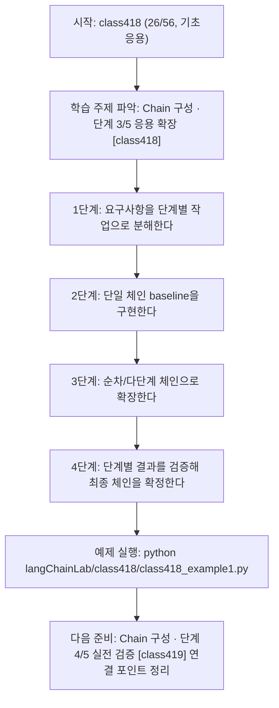
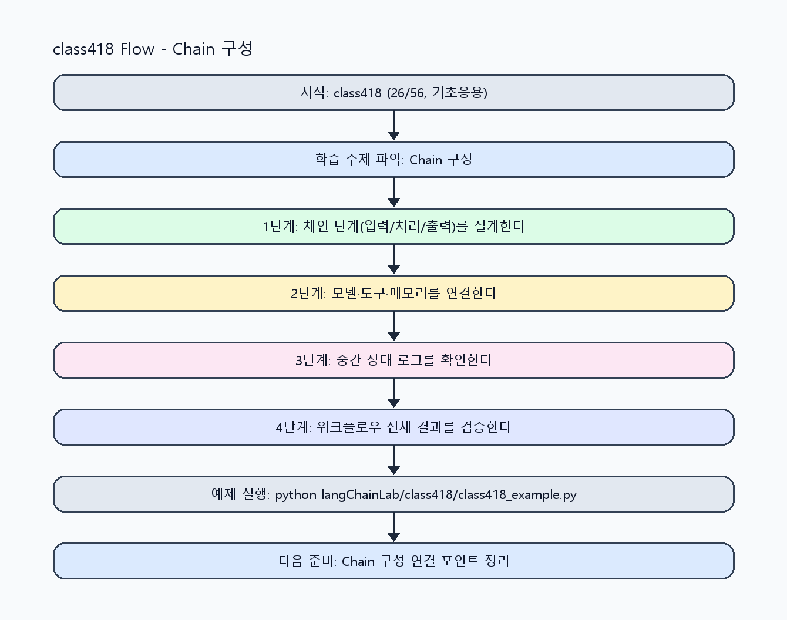

<!-- 이 파일은 www.edumgt.co.kr 의 에듀엠지티에 저작권이 있습니다 -->
# class418 자기주도 학습 가이드

## 1) 오늘의 학습 정보
- 교과목: **Langchain 활용하기**
- 학습 주제: **Chain 구성 · 단계 3/5 응용 확장 [class418]**
- 세부 시퀀스: **26/56**
- 일정: **Day 53 / 2교시**
- 난이도: **기초응용**

### 교과목·학습주제 어휘 해설 (IT 강사 스타일)
#### 교과목 표현 분석: `Langchain 활용하기`
- 문법 포인트: 동사 어간 + '-기' 명사형 구조입니다. 학습 행동 자체를 주제로 명사화한 표현입니다.
- 기술 포인트: 체인 기반 워크플로우를 구성해 서비스형 AI를 구현하는 교과목입니다.
| 용어 | 문법/품사 | 한글·한자 | 영어 | 기술 설명 |
| --- | --- | --- | --- | --- |
| `LangChain` | 고유명사(프레임워크명) | LangChain (한자 없음) | LangChain | LLM 애플리케이션을 체인/도구 기반으로 구성하는 프레임워크입니다. |
| `활용` | 명사/동사 어근 | 활용 (活用) | utilization | 이론이나 도구를 실제 문제 해결 맥락에 적용하는 행위입니다. |

#### 학습주제 표현 분석: `Chain 구성 · 단계 3/5 응용 확장 [class418]`
- 문법 포인트: 핵심 개념 명사를 중심으로 한 명사구 구조입니다.
- 기술 포인트: 이번 차시는 `Chain 구성` 핵심 개념을 코드 구현, 결과 해석, 점검 기준으로 연결합니다.
| 용어 | 문법/품사 | 한글·한자 | 영어 | 기술 설명 |
| --- | --- | --- | --- | --- |
| `Chain` | 명사(영어) | Chain (한자 없음) | chain | 여러 처리 단계를 순차 연결한 실행 파이프라인입니다. |
| `단일` | 명사(주제 핵심 용어) | 단일 (한자 없음) | (topic-specific) | 이번 차시 맥락: 단일 체인, 순차 체인, 다단계 처리로 입력→변환→생성 흐름을 설계하는 차시입니다. 이를 기준으로 `단일`를 코드와 결과 해석에 연결합니다. |
| `체인` | 명사(외래어) | 체인 (한자 없음) | chain | 입력 전처리, 검색, 생성, 후처리 단계를 목적에 맞게 연결한 LLM 실행 흐름입니다. |
| `순차` | 명사(주제 핵심 용어) | 순차 (한자 없음) | (topic-specific) | 이번 차시 맥락: 단일 체인, 순차 체인, 다단계 처리로 입력→변환→생성 흐름을 설계하는 차시입니다. 이를 기준으로 `순차`를 코드와 결과 해석에 연결합니다. |
| `다단계` | 명사(주제 핵심 용어) | 다단계 (한자 없음) | (topic-specific) | 이번 차시 맥락: 단일 체인, 순차 체인, 다단계 처리로 입력→변환→생성 흐름을 설계하는 차시입니다. 이를 기준으로 `다단계`를 코드와 결과 해석에 연결합니다. |

## 2) 이전에 배운 내용 (복습)
- 이전 차시: **class417 / Chain 구성 · 단계 2/5 기초 구현 [class417]** (Day 53 / 1교시)
- 복습 연결: 이전에 배운 **Chain 구성 · 단계 2/5 기초 구현 [class417]** 를 떠올리며, 오늘 **Chain 구성 · 단계 3/5 응용 확장 [class418]** 와 어떤 점이 이어지는지 비교해 보세요.

## 3) 주제를 아주 쉽게 이해하기
- 한 줄 설명: 단일 체인, 순차 체인, 다단계 처리로 입력→변환→생성 흐름을 설계하는 차시입니다.
- 왜 배우나요?: 복잡한 LLM 작업은 단일 호출보다 단계 분해 체인이 품질, 디버깅, 재사용 측면에서 유리합니다.

### 핵심 개념 3가지
1. `단일 체인`은 빠른 실험에 적합하며 흐름이 단순합니다.
2. `순차 체인`은 전 단계 결과를 다음 단계 입력으로 전달하는 구조입니다.
3. `다단계 처리`는 전처리/검색/생성/검증을 명시적으로 분리해 안정성을 높입니다.

### 비유로 이해하기
- 샌드위치를 만들 때 재료 준비, 굽기, 포장을 단계별로 나누는 것과 같아요.

## 4) 실습 환경 만들기 (항상 먼저)
아래 명령은 **처음 한 번** 준비해 두면 이후 학습이 쉬워집니다.

### Windows PowerShell
```powershell
cd C:\DevOps\Python-AI_Agent-Class
python -m venv .venv
.\.venv\Scripts\Activate.ps1
python -m pip install --upgrade pip
pip install -r requirements.txt
```

### Linux/macOS (bash)
```bash
cd /path/to/Python-AI_Agent-Class
python3 -m venv .venv
source .venv/bin/activate
python -m pip install --upgrade pip
pip install -r requirements.txt
```

## 5) 오늘의 예제 코드
- 예제 파일: `class418_example1.py`
- 실행 명령:
```bash
python langChainLab/class418/class418_example1.py
```

### example1~example5 단계별 테스트 확장
1. example1: 단일 체인 baseline을 실행한다.
2. example2: 순차 체인으로 입력→변환→생성 흐름을 확장한다.
3. example3: 다단계 처리 중 실패 단계를 재현해 점검한다.
4. example4: 체인 조합별 품질/지연을 비교한다.
5. example5: 체인 설계 체크리스트를 정리한다.

<!-- AUTO-GENERATED: TECH_STACK_FLOW START -->
### 기술 스택
- 언어: `Python 3`
- 실행: `CLI` (`python langChainLab/class418/class418_example1.py`)
- 주요 문법: `step 함수`, `순차 오케스트레이터`, `상태 전달(dict)`, `단계별 로그`
- 학습 포커스: `Chain 구성 · 단계 3/5 응용 확장 [class418]`

### 실습 example1.py 동작 원리 (Mermaid Flowchart)


### Flow PNG 캡처

<!-- AUTO-GENERATED: TECH_STACK_FLOW END -->

### 예제 코드를 볼 때 집중할 포인트
1. 각 단계가 단일 책임을 가지는지 확인하기
2. 단계 간 입력 스키마 호환성을 점검하기
3. 체인 길이 증가 시 지연/오류 전파를 점검하기

## 6) 퀴즈로 복습하기 (10문항)
- 퀴즈 파일: `class418_quiz.html`
- 브라우저에서 열기:
```bash
langChainLab/class418/class418_quiz.html
```
- 버튼 설명:
1. `채점하기`: 현재 선택한 답으로 점수를 계산해요.
2. `다시풀기`: 선택을 모두 지우고 처음부터 다시 풀어요.

## 7) 혼자 실습 순서 (초등학생 버전)
1. 코드를 한 번 그대로 실행해요.
2. 숫자/문장 값을 1개 바꿔요.
3. 결과가 왜 바뀌었는지 한 줄로 적어요.
4. 함수를 1개 더 만들어 작은 기능을 추가해요.

### 실습 미션
1. 단일 체인과 순차 체인을 같은 입력으로 실행해 비교하세요.
2. 입력→변환→생성 3단계 흐름을 함수 단위로 분리하세요.
3. 체인 단계별 로그를 남겨 병목과 실패 지점을 찾으세요.

## 8) 스스로 점검 체크리스트
- [ ] 단일 체인과 순차 체인의 차이를 코드로 설명했다.
- [ ] 다단계 처리 흐름을 구현했다.
- [ ] 단계별 입출력 로그로 흐름을 검증했다.

## 9) 막히면 이렇게 해결해요
1. 에러 메시지 마지막 줄을 먼저 읽어요.
2. 함수 이름과 괄호 짝을 확인해요.
3. `print()`를 넣어 중간 값을 확인해요.
4. 그래도 안 되면 어제 성공한 코드와 한 줄씩 비교해요.

## 10) 학습 후 다음에 배울 내용
- 다음 차시: **class419 / Chain 구성 · 단계 4/5 실전 검증 [class419]** (Day 53 / 3교시)
- 미리보기: 다음 차시 전에 **Chain 구성 · 단계 3/5 응용 확장 [class418]** 핵심 코드 1개를 다시 실행해 두면 Chain 구성 · 단계 4/5 실전 검증 [class419] 학습이 더 쉬워집니다.

## 11) 다음 차시 연결
- 다음 차시에서는 Memory를 연결해 대화형 응답의 문맥 일관성을 높입니다.
- 오늘 코드를 복사하지 말고, 직접 다시 작성해 보세요.
