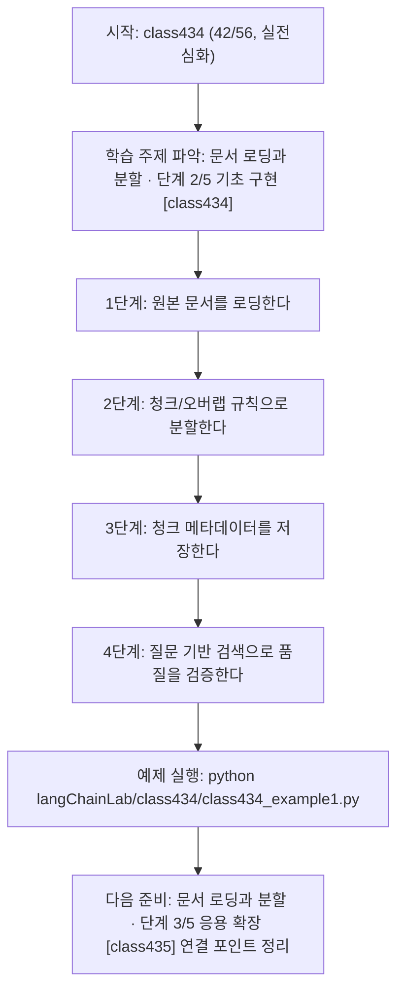
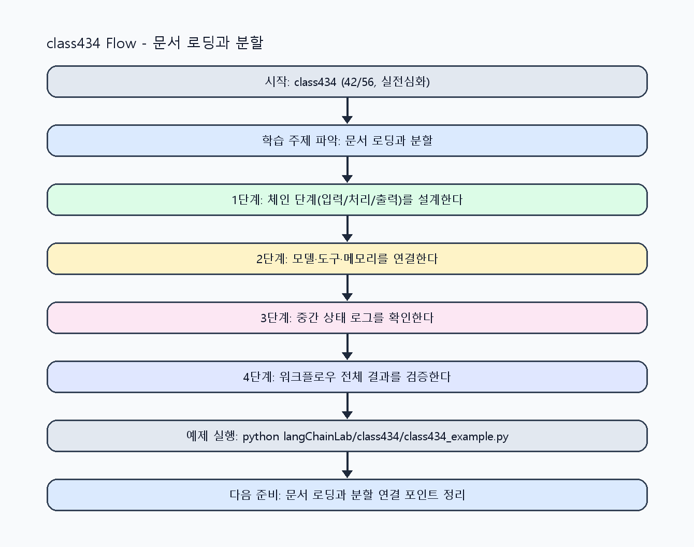

<!-- 이 파일은 www.edumgt.co.kr 의 에듀엠지티에 저작권이 있습니다 -->
# class434 자기주도 학습 가이드

## 1) 오늘의 학습 정보
- 교과목: **Langchain 활용하기**
- 학습 주제: **문서 로딩과 분할 · 단계 2/5 기초 구현 [class434]**
- 세부 시퀀스: **42/56**
- 일정: **Day 55 / 2교시**
- 난이도: **실전심화**

### 교과목·학습주제 어휘 해설 (IT 강사 스타일)
#### 교과목 표현 분석: `Langchain 활용하기`
- 문법 포인트: 동사 어간 + '-기' 명사형 구조입니다. 학습 행동 자체를 주제로 명사화한 표현입니다.
- 기술 포인트: 체인 기반 워크플로우를 구성해 서비스형 AI를 구현하는 교과목입니다.
| 용어 | 문법/품사 | 한글·한자 | 영어 | 기술 설명 |
| --- | --- | --- | --- | --- |
| `LangChain` | 고유명사(프레임워크명) | LangChain (한자 없음) | LangChain | LLM 애플리케이션을 체인/도구 기반으로 구성하는 프레임워크입니다. |
| `활용` | 명사/동사 어근 | 활용 (活用) | utilization | 이론이나 도구를 실제 문제 해결 맥락에 적용하는 행위입니다. |

#### 학습주제 표현 분석: `문서 로딩과 분할 · 단계 2/5 기초 구현 [class434]`
- 문법 포인트: 명사와 명사를 대등하게 묶는 병렬 명사구 구조입니다.
- 기술 포인트: 이번 차시는 `문서 로딩과 분할` 핵심 개념을 코드 구현, 결과 해석, 점검 기준으로 연결합니다.
| 용어 | 문법/품사 | 한글·한자 | 영어 | 기술 설명 |
| --- | --- | --- | --- | --- |
| `문서` | 명사 | 문서 (文書) | document | RAG 검색과 근거 생성에 사용하는 텍스트 단위 데이터입니다. |
| `로딩` | 명사(주제 핵심 용어) | 로딩 (한자 없음) | (topic-specific) | 이번 차시 맥락: 문서 로딩과 청크 분할을 통해 Retriever가 사용할 검색 단위를 만드는 차시입니다. 이를 기준으로 `로딩`를 코드와 결과 해석에 연결합니다. |
| `분할` | 명사(주제 핵심 용어) | 분할 (한자 없음) | (topic-specific) | 이번 차시 맥락: 문서 로딩과 청크 분할을 통해 Retriever가 사용할 검색 단위를 만드는 차시입니다. 이를 기준으로 `분할`를 코드와 결과 해석에 연결합니다. |
| `Retriever` | 영문 기술명/약어 | Retriever (한자 없음) | Retriever | 이번 차시 맥락: 문서 로딩과 청크 분할을 통해 Retriever가 사용할 검색 단위를 만드는 차시입니다. 이를 기준으로 `Retriever`를 코드와 결과 해석에 연결합니다. |

## 2) 이전에 배운 내용 (복습)
- 이전 차시: **class433 / 문서 로딩과 분할 · 단계 1/5 입문 이해 [class433]** (Day 55 / 1교시)
- 복습 연결: 이전에 배운 **문서 로딩과 분할 · 단계 1/5 입문 이해 [class433]** 를 떠올리며, 오늘 **문서 로딩과 분할 · 단계 2/5 기초 구현 [class434]** 와 어떤 점이 이어지는지 비교해 보세요.

## 3) 주제를 아주 쉽게 이해하기
- 한 줄 설명: 문서 로딩과 청크 분할을 통해 Retriever가 사용할 검색 단위를 만드는 차시입니다.
- 왜 배우나요?: 문서를 통째로 넣으면 검색 품질이 떨어지고, 적절한 분할이 있어야 RAG 품질이 안정됩니다.

### 핵심 개념 3가지
1. `문서 로딩`은 다양한 소스(PDF, txt, web)에서 텍스트를 표준화하는 단계입니다.
2. `문서 분할`은 의미 단위 청크를 만들어 검색 정확도와 응답 근거성을 높입니다.
3. `Retriever 기반`은 청크 품질과 메타데이터 설계에 크게 의존합니다.

### 비유로 이해하기
- 샌드위치를 만들 때 재료 준비, 굽기, 포장을 단계별로 나누는 것과 같아요.

## 4) 실습 환경 만들기 (항상 먼저)
아래 명령은 **처음 한 번** 준비해 두면 이후 학습이 쉬워집니다.

### Windows PowerShell
```powershell
cd C:\DevOps\Python-AI_Agent-Class
python -m venv .venv
.\.venv\Scripts\Activate.ps1
python -m pip install --upgrade pip
pip install -r requirements.txt
```

### Linux/macOS (bash)
```bash
cd /path/to/Python-AI_Agent-Class
python3 -m venv .venv
source .venv/bin/activate
python -m pip install --upgrade pip
pip install -r requirements.txt
```

## 5) 오늘의 예제 코드
- 예제 파일: `class434_example1.py`
- 실행 명령:
```bash
python langChainLab/class434/class434_example1.py
```

### example1~example5 단계별 테스트 확장
1. example1: 문서 로딩과 청크 분할 baseline을 실행한다.
2. example2: 청크 크기/오버랩을 바꿔 검색 품질을 비교한다.
3. example3: 청크 메타데이터 누락 케이스를 점검한다.
4. example4: Retriever 기반 검색 결과를 분석한다.
5. example5: RAG 연계 전 준비 체크리스트를 정리한다.

<!-- AUTO-GENERATED: TECH_STACK_FLOW START -->
### 기술 스택
- 언어: `Python 3`
- 실행: `CLI` (`python langChainLab/class434/class434_example1.py`)
- 주요 문법: `loader 함수`, `chunk splitter`, `메타데이터 dict`, `retriever 호출`
- 학습 포커스: `문서 로딩과 분할 · 단계 2/5 기초 구현 [class434]`

### 실습 example1.py 동작 원리 (Mermaid Flowchart)


### Flow PNG 캡처

<!-- AUTO-GENERATED: TECH_STACK_FLOW END -->

### 예제 코드를 볼 때 집중할 포인트
1. 청크 경계가 문맥을 과도하게 끊지 않는지 확인하기
2. 메타데이터(출처/페이지)가 누락되지 않는지 점검하기
3. 검색 결과가 RAG 응답 근거로 충분한지 확인하기

## 6) 퀴즈로 복습하기 (10문항)
- 퀴즈 파일: `class434_quiz.html`
- 브라우저에서 열기:
```bash
langChainLab/class434/class434_quiz.html
```
- 버튼 설명:
1. `채점하기`: 현재 선택한 답으로 점수를 계산해요.
2. `다시풀기`: 선택을 모두 지우고 처음부터 다시 풀어요.

## 7) 혼자 실습 순서 (초등학생 버전)
1. 코드를 한 번 그대로 실행해요.
2. 숫자/문장 값을 1개 바꿔요.
3. 결과가 왜 바뀌었는지 한 줄로 적어요.
4. 함수를 1개 더 만들어 작은 기능을 추가해요.

### 실습 미션
1. 문서를 로딩해 텍스트와 메타데이터를 분리하세요.
2. 청크 크기/오버랩을 바꿔 검색 품질 차이를 비교하세요.
3. 질문에 대해 상위 청크를 검색해 근거 품질을 점검하세요.

## 8) 스스로 점검 체크리스트
- [ ] 문서 로딩과 분할 파이프라인을 구현했다.
- [ ] 청크 전략별 검색 품질 차이를 기록했다.
- [ ] Retriever 연계 기반을 구성했다.

## 9) 막히면 이렇게 해결해요
1. 에러 메시지 마지막 줄을 먼저 읽어요.
2. 함수 이름과 괄호 짝을 확인해요.
3. `print()`를 넣어 중간 값을 확인해요.
4. 그래도 안 되면 어제 성공한 코드와 한 줄씩 비교해요.

## 10) 학습 후 다음에 배울 내용
- 다음 차시: **class435 / 문서 로딩과 분할 · 단계 3/5 응용 확장 [class435]** (Day 55 / 3교시)
- 미리보기: 다음 차시 전에 **문서 로딩과 분할 · 단계 2/5 기초 구현 [class434]** 핵심 코드 1개를 다시 실행해 두면 문서 로딩과 분할 · 단계 3/5 응용 확장 [class435] 학습이 더 쉬워집니다.

## 11) 다음 차시 연결
- 다음 차시에서는 VectorStore 연동으로 검색 품질과 RAG 응답 정확도를 높입니다.
- 오늘 코드를 복사하지 말고, 직접 다시 작성해 보세요.
