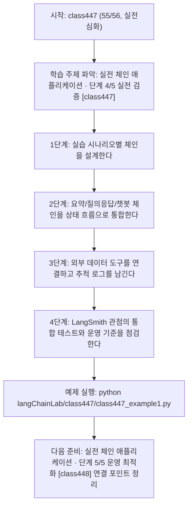
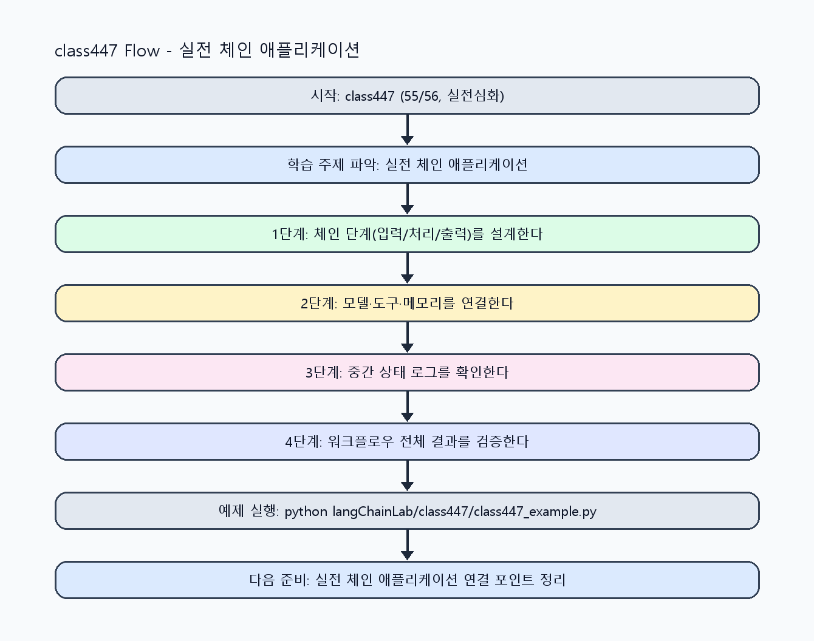

<!-- 이 파일은 www.edumgt.co.kr 의 에듀엠지티에 저작권이 있습니다 -->
# class447 자기주도 학습 가이드

## 1) 오늘의 학습 정보
- 교과목: **Langchain 활용하기**
- 학습 주제: **실전 체인 애플리케이션 · 단계 4/5 실전 검증 [class447]**
- 세부 시퀀스: **55/56**
- 일정: **Day 56 / 7교시**
- 난이도: **실전심화**

### 교과목·학습주제 어휘 해설 (IT 강사 스타일)
#### 교과목 표현 분석: `Langchain 활용하기`
- 문법 포인트: 동사 어간 + '-기' 명사형 구조입니다. 학습 행동 자체를 주제로 명사화한 표현입니다.
- 기술 포인트: 체인 기반 워크플로우를 구성해 서비스형 AI를 구현하는 교과목입니다.
| 용어 | 문법/품사 | 한글·한자 | 영어 | 기술 설명 |
| --- | --- | --- | --- | --- |
| `LangChain` | 고유명사(프레임워크명) | LangChain (한자 없음) | LangChain | LLM 애플리케이션을 체인/도구 기반으로 구성하는 프레임워크입니다. |
| `활용` | 명사/동사 어근 | 활용 (活用) | utilization | 이론이나 도구를 실제 문제 해결 맥락에 적용하는 행위입니다. |

#### 학습주제 표현 분석: `실전 체인 애플리케이션 · 단계 4/5 실전 검증 [class447]`
- 문법 포인트: 핵심 개념 명사를 중심으로 한 명사구 구조입니다.
- 기술 포인트: 이번 차시는 `실전 체인 애플리케이션` 핵심 개념을 코드 구현, 결과 해석, 점검 기준으로 연결합니다.
| 용어 | 문법/품사 | 한글·한자 | 영어 | 기술 설명 |
| --- | --- | --- | --- | --- |
| `체인` | 명사(외래어) | 체인 (한자 없음) | chain | 입력 전처리, 검색, 생성, 후처리 단계를 목적에 맞게 연결한 LLM 실행 흐름입니다. |
| `애플리케이션` | 명사(외래어) | 애플리케이션 (한자 없음) | application | 사용자 문제를 해결하기 위해 기능을 묶어 배포·운영 가능한 소프트웨어 단위입니다. |
| `LangGraph` | 영문 기술명/약어 | LangGraph (한자 없음) | LangGraph | 이번 차시 맥락: 문서 요약/질의응답/챗봇/외부연동을 통합하고 LangGraph 흐름 제어, LangSmith 추적까지 연결하는 실습 차시입니다. 이를 기준으로 `LangGraph`를 코드와 결과 해석에 연결합니다. |
| `LangSmith` | 영문 기술명/약어 | LangSmith (한자 없음) | LangSmith | 이번 차시 맥락: 문서 요약/질의응답/챗봇/외부연동을 통합하고 LangGraph 흐름 제어, LangSmith 추적까지 연결하는 실습 차시입니다. 이를 기준으로 `LangSmith`를 코드와 결과 해석에 연결합니다. |
| `통합` | 명사(주제 핵심 용어) | 통합 (한자 없음) | (topic-specific) | 이번 차시 맥락: 문서 요약/질의응답/챗봇/외부연동을 통합하고 LangGraph 흐름 제어, LangSmith 추적까지 연결하는 실습 차시입니다. 이를 기준으로 `통합`를 코드와 결과 해석에 연결합니다. |

## 2) 이전에 배운 내용 (복습)
- 이전 차시: **class446 / 실전 체인 애플리케이션 · 단계 3/5 응용 확장 [class446]** (Day 56 / 6교시)
- 복습 연결: 이전에 배운 **실전 체인 애플리케이션 · 단계 3/5 응용 확장 [class446]** 를 떠올리며, 오늘 **실전 체인 애플리케이션 · 단계 4/5 실전 검증 [class447]** 와 어떤 점이 이어지는지 비교해 보세요.

## 3) 주제를 아주 쉽게 이해하기
- 한 줄 설명: 문서 요약/질의응답/챗봇/외부연동을 통합하고 LangGraph 흐름 제어, LangSmith 추적까지 연결하는 실습 차시입니다.
- 왜 배우나요?: 실무에서는 단일 체인 구현을 넘어 분기/재시도/상태관리와 관측성(추적, 품질 기록)까지 포함한 운영형 구조가 필요합니다.

### 핵심 개념 3가지
1. `LangGraph`는 상태(state)와 노드 간 흐름(flow)을 그래프로 설계해 복잡한 분기·재시도 워크플로우를 안정화합니다.
2. `LangSmith`는 체인/에이전트 실행 추적, 프롬프트 버전 비교, 실패 케이스 분석을 지원하는 관측성 도구입니다.
3. `통합 체인 실습`은 요약/질의응답/챗봇/외부연동을 하나의 서비스 워크플로우로 묶어 운영 기준까지 점검하는 단계입니다.

### 비유로 이해하기
- 샌드위치를 만들 때 재료 준비, 굽기, 포장을 단계별로 나누는 것과 같아요.

## 4) 실습 환경 만들기 (항상 먼저)
아래 명령은 **처음 한 번** 준비해 두면 이후 학습이 쉬워집니다.

### Windows PowerShell
```powershell
cd C:\DevOps\Python-AI_Agent-Class
python -m venv .venv
.\.venv\Scripts\Activate.ps1
python -m pip install --upgrade pip
pip install -r requirements.txt
```

### Linux/macOS (bash)
```bash
cd /path/to/Python-AI_Agent-Class
python3 -m venv .venv
source .venv/bin/activate
python -m pip install --upgrade pip
pip install -r requirements.txt
```

## 5) 오늘의 예제 코드
- 예제 파일: `class447_example1.py`
- 실행 명령:
```bash
python langChainLab/class447/class447_example1.py
```

### example1~example5 단계별 테스트 확장
1. example1: 문서 요약 체인을 실행한다.
2. example2: 질의응답 체인과 간단 챗봇을 확장한다.
3. example3: 외부 데이터 연결 실패 케이스를 점검한다.
4. example4: LangGraph 스타일 분기/상태 전이를 적용해 품질을 비교한다.
5. example5: LangSmith 추적 항목 기반 운영 체크리스트를 완성한다.

<!-- AUTO-GENERATED: TECH_STACK_FLOW START -->
### 기술 스택
- 언어: `Python 3`
- 실행: `CLI` (`python langChainLab/class447/class447_example1.py`)
- 주요 문법: `체인 라우터 함수`, `상태 전이(dict state)`, `추적 로그 스키마`, `통합 리포트`
- 학습 포커스: `실전 체인 애플리케이션 · 단계 4/5 실전 검증 [class447]`

### 실습 example1.py 동작 원리 (Mermaid Flowchart)


### Flow PNG 캡처

<!-- AUTO-GENERATED: TECH_STACK_FLOW END -->

### 예제 코드를 볼 때 집중할 포인트
1. 체인 간 계약이 일관적인지 확인하기
2. LangGraph 분기/재시도 조건이 명확한지 점검하기
3. LangSmith 추적으로 실패 원인(프롬프트/도구/검색)을 분리 가능한지 확인하기

## 6) 퀴즈로 복습하기 (10문항)
- 퀴즈 파일: `class447_quiz.html`
- 브라우저에서 열기:
```bash
langChainLab/class447/class447_quiz.html
```
- 버튼 설명:
1. `채점하기`: 현재 선택한 답으로 점수를 계산해요.
2. `다시풀기`: 선택을 모두 지우고 처음부터 다시 풀어요.

## 7) 혼자 실습 순서 (초등학생 버전)
1. 코드를 한 번 그대로 실행해요.
2. 숫자/문장 값을 1개 바꿔요.
3. 결과가 왜 바뀌었는지 한 줄로 적어요.
4. 함수를 1개 더 만들어 작은 기능을 추가해요.

### 실습 미션
1. 문서 요약 체인과 질의응답 체인을 하나의 라우터 흐름으로 통합하세요.
2. 세션 메모리를 포함한 챗봇 흐름을 LangGraph 스타일의 상태 전이로 설계하세요.
3. 실행 로그를 LangSmith 추적 항목(입력/출력/지연/오류) 형태로 구조화해 기록하세요.

## 8) 스스로 점검 체크리스트
- [ ] 요약/질의응답/챗봇/외부연동 통합 시나리오를 실행했다.
- [ ] LangGraph 기반 분기/상태 전이 관점을 코드 흐름에 반영했다.
- [ ] LangSmith 기반 추적/품질 점검 항목을 정리했다.

## 9) 막히면 이렇게 해결해요
1. 에러 메시지 마지막 줄을 먼저 읽어요.
2. 함수 이름과 괄호 짝을 확인해요.
3. `print()`를 넣어 중간 값을 확인해요.
4. 그래도 안 되면 어제 성공한 코드와 한 줄씩 비교해요.

## 10) 학습 후 다음에 배울 내용
- 다음 차시: **class448 / 실전 체인 애플리케이션 · 단계 5/5 운영 최적화 [class448]** (Day 56 / 8교시)
- 미리보기: 다음 차시 전에 **실전 체인 애플리케이션 · 단계 4/5 실전 검증 [class447]** 핵심 코드 1개를 다시 실행해 두면 실전 체인 애플리케이션 · 단계 5/5 운영 최적화 [class448] 학습이 더 쉬워집니다.

## 11) 다음 차시 연결
- 과목 전체를 복습하며 LangChain + LangGraph + LangSmith 연계 설계를 포트폴리오 형태로 정리하세요.
- 오늘 코드를 복사하지 말고, 직접 다시 작성해 보세요.
