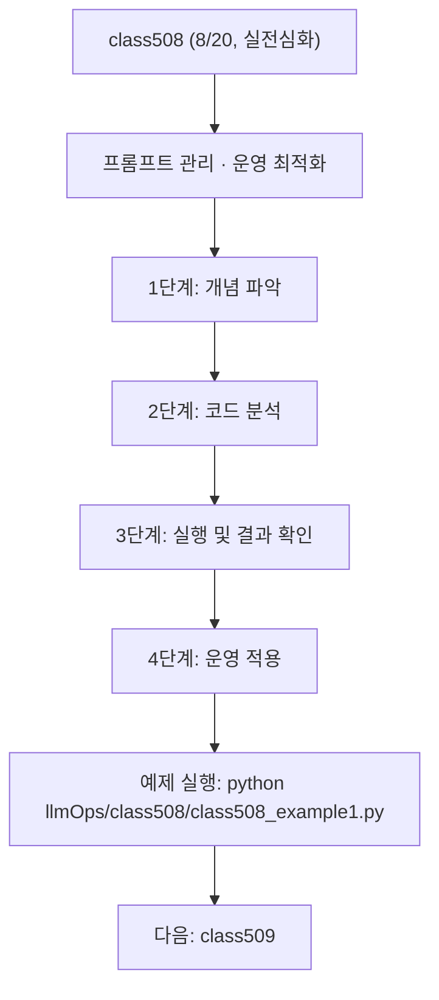

<!-- 이 파일은 www.edumgt.co.kr 의 에듀엠지티에 저작권이 있습니다 -->
# class508 자기주도 학습 가이드

## 1) 오늘의 학습 정보
- 교과목: **LLMOps**
- 학습 주제: **프롬프트 관리 · 단계 4/4 운영 최적화 [class508]**
- 세부 시퀀스: **8/20**
- 일정: **Day 64 / 8교시**
- 난이도: **실전심화**

### 교과목·학습주제 어휘 해설
| 용어 | 영어 | 기술 설명 |
| --- | --- | --- |
| `LLMOps` | LLMOps | 대규모 언어모델 기반 서비스를 설계·평가·운영하는 체계 |
| `프롬프트 관리` | (domain term) | 이번 차시 핵심 주제 영역 |

## 2) 이전에 배운 내용 (복습)
- 이전 차시: **class507** 내용을 오늘 주제와 연결해 보세요.

## 3) 주제를 아주 쉽게 이해하기
- 한 줄 설명: **프롬프트 관리** 의 운영 최적화 단계입니다.
- 왜 배우나요?: LLM 기반 서비스를 안정적으로 운영하려면 프롬프트 관리 역량이 필수입니다.

### 핵심 개념 3가지
1. LLMOps는 프롬프트·체인·에이전트의 전체 운영 생명주기를 관리합니다.
2. 프롬프트 관리은 LLMOps의 핵심 구성 축 중 하나입니다.
3. 자동화된 평가·모니터링·배포 파이프라인이 품질을 유지합니다.

## 4) 실습 환경 만들기
```bash
cd /path/to/Python-AI_Agent-Class
python3 -m venv .venv
source .venv/bin/activate
pip install -r requirements.txt
```

## 5) 오늘의 예제 코드
- 예제 파일: `class508_example1.py`
- 실행 명령:
```bash
python llmOps/class508/class508_example1.py
```

### example1~example5 단계별 테스트 확장
1. example1: 프롬프트 관리 기본 개념과 구조를 확인한다.
2. example2: 핵심 구성요소를 코드로 매핑한다.
3. example3: 실패 케이스를 재현하고 처리한다.
4. example4: 개선 전후 흐름을 비교한다.
5. example5: 운영 체크리스트를 정리한다.

<!-- AUTO-GENERATED: TECH_STACK_FLOW START -->
### 기술 스택
- 언어: `Python 3`
- 실행: `CLI` (`python llmOps/class508/class508_example1.py`)
- 학습 포커스: `프롬프트 관리 · 단계 4/4 운영 최적화 [class508]`

### 실습 흐름 (Mermaid Flowchart)


### Flow PNG 캡처

<!-- AUTO-GENERATED: TECH_STACK_FLOW END -->

## 6) 퀴즈로 복습하기
- 퀴즈 파일: `class508_quiz.html`

## 7) 혼자 실습 순서
1. 코드를 한 번 그대로 실행해요.
2. 값을 1개 바꿔서 결과 차이를 확인해요.
3. 결과가 왜 바뀌었는지 한 줄로 적어요.
4. 함수를 1개 더 만들어 작은 기능을 추가해요.

## 8) 스스로 점검 체크리스트
- [ ] 프롬프트 관리의 개념을 설명할 수 있다.
- [ ] 핵심 구성요소를 역할별로 구분할 수 있다.
- [ ] 기본 흐름을 입력→출력 구조로 설명할 수 있다.

## 9) 막히면 이렇게 해결해요
1. 에러 메시지 마지막 줄을 먼저 읽어요.
2. 함수 이름과 괄호 짝을 확인해요.
3. print()를 넣어 중간 값을 확인해요.

## 10) 학습 후 다음에 배울 내용
- 다음 차시: **class509**
