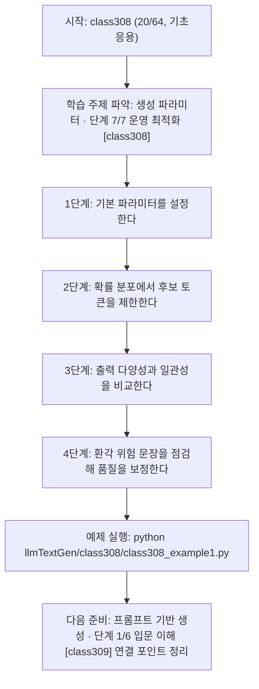
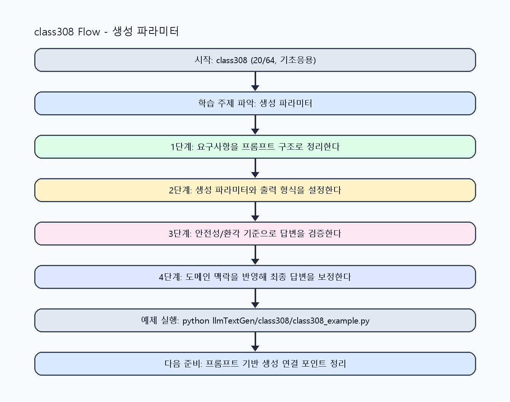

<!-- 이 파일은 www.edumgt.co.kr 의 에듀엠지티에 저작권이 있습니다 -->
# class308 자기주도 학습 가이드

## 1) 오늘의 학습 정보
- 교과목: **거대 언어 모델을 활용한 자연어 생성**
- 학습 주제: **생성 파라미터 · 단계 7/7 운영 최적화 [class308]**
- 세부 시퀀스: **20/64**
- 일정: **Day 39 / 4교시**
- 난이도: **기초응용**

### 교과목·학습주제 어휘 해설 (IT 강사 스타일)
#### 교과목 표현 분석: `거대 언어 모델을 활용한 자연어 생성`
- 문법 포인트: 목적어(…을/를) + 관형절(활용한) + 중심 명사 구조로, 적용 대상을 문법적으로 분명히 드러냅니다.
- 기술 포인트: 거대 언어 모델을 실무 도메인과 연결해 생성 품질을 높이는 교과목입니다.
| 용어 | 문법/품사 | 한글·한자 | 영어 | 기술 설명 |
| --- | --- | --- | --- | --- |
| `거대` | 관형어 | 거대 (巨大) | large-scale | 모델 파라미터와 학습 데이터 규모가 매우 큼을 나타냅니다. |
| `언어` | 명사 | 언어 (言語) | language | 의미를 전달하기 위한 기호 체계로, NLP의 분석 대상입니다. |
| `모델` | 명사(외래어) | 모델 (한자 없음) | model | 입력과 출력 관계를 수학적으로 근사한 계산 구조입니다. |
| `활용` | 명사/동사 어근 | 활용 (活用) | utilization | 이론이나 도구를 실제 문제 해결 맥락에 적용하는 행위입니다. |
| `자연어` | 명사 | 자연어 (自然語) | natural language | 사람이 일상에서 사용하는 언어 텍스트/발화를 의미합니다. |
| `생성` | 명사 | 생성 (生成) | generation | 모델이 새 텍스트/응답/콘텐츠를 출력하는 과정입니다. |

#### 학습주제 표현 분석: `생성 파라미터 · 단계 7/7 운영 최적화 [class308]`
- 문법 포인트: 핵심 개념 명사를 중심으로 한 명사구 구조입니다.
- 기술 포인트: 이번 차시는 `생성 파라미터` 핵심 개념을 코드 구현, 결과 해석, 점검 기준으로 연결합니다.
| 용어 | 문법/품사 | 한글·한자 | 영어 | 기술 설명 |
| --- | --- | --- | --- | --- |
| `생성` | 명사 | 생성 (生成) | generation | 모델이 새 텍스트/응답/콘텐츠를 출력하는 과정입니다. |
| `파라미터` | 명사(외래어) | 파라미터 (한자 없음) | parameter | 모델 동작을 제어하거나 학습으로 조정되는 수치 변수입니다. |
| `temperature` | 영문 기술명/약어 | temperature (한자 없음) | temperature | 이번 차시 맥락: 확률 기반 생성 파라미터(temperature, top-k, top-p)와 환각 위험의 관계를 다루는 차시입니다. 이를 기준으로 `temperature`를 코드와 결과 해석에 연결합니다. |
| `top-k` | 영문 기술명/약어 | top-k (한자 없음) | top-k | 이번 차시 맥락: 확률 기반 생성 파라미터(temperature, top-k, top-p)와 환각 위험의 관계를 다루는 차시입니다. 이를 기준으로 `top-k`를 코드와 결과 해석에 연결합니다. |
| `top-p` | 영문 기술명/약어 | top-p (한자 없음) | top-p | 이번 차시 맥락: 확률 기반 생성 파라미터(temperature, top-k, top-p)와 환각 위험의 관계를 다루는 차시입니다. 이를 기준으로 `top-p`를 코드와 결과 해석에 연결합니다. |
| `hallucination` | 영문 기술명/약어 | hallucination (한자 없음) | hallucination | 이번 차시 맥락: `hallucination`은 그럴듯하지만 사실이 아닌 내용을 생성하는 현상입니다. 이를 기준으로 `hallucination`를 코드와 결과 해석에 연결합니다. |

## 2) 이전에 배운 내용 (복습)
- 이전 차시: **class307 / 생성 파라미터 · 단계 6/7 실전 검증 [class307]** (Day 39 / 3교시)
- 복습 연결: 이전에 배운 **생성 파라미터 · 단계 6/7 실전 검증 [class307]** 를 떠올리며, 오늘 **생성 파라미터 · 단계 7/7 운영 최적화 [class308]** 와 어떤 점이 이어지는지 비교해 보세요.

## 3) 주제를 아주 쉽게 이해하기
- 한 줄 설명: 확률 기반 생성 파라미터(temperature, top-k, top-p)와 환각 위험의 관계를 다루는 차시입니다.
- 왜 배우나요?: 파라미터 튜닝 없이 모델을 사용하면 품질 편차와 환각 위험을 제어하기 어렵습니다.

### 핵심 개념 3가지
1. `temperature`는 확률 분포를 평탄화/집중화해 출력 창의성과 안정성을 조절합니다.
2. `top-k`, `top-p`는 후보 토큰 집합을 제한해 무작위성과 일관성을 균형화합니다.
3. `hallucination`은 그럴듯하지만 사실이 아닌 내용을 생성하는 현상입니다.

### 비유로 이해하기
- 똑똑한 조교에게 과제를 맡길 때, 목표·형식·검수 기준을 먼저 주면 결과가 정확해지는 것과 같아요.

## 4) 실습 환경 만들기 (항상 먼저)
아래 명령은 **처음 한 번** 준비해 두면 이후 학습이 쉬워집니다.

### Windows PowerShell
```powershell
cd C:\DevOps\Python-AI_Agent-Class
python -m venv .venv
.\.venv\Scripts\Activate.ps1
python -m pip install --upgrade pip
pip install -r requirements.txt
```

### Linux/macOS (bash)
```bash
cd /path/to/Python-AI_Agent-Class
python3 -m venv .venv
source .venv/bin/activate
python -m pip install --upgrade pip
pip install -r requirements.txt
```

## 5) 오늘의 예제 코드
- 예제 파일: `class308_example1.py`
- 실행 명령:
```bash
python llmTextGen/class308/class308_example1.py
```

### example1~example5 단계별 테스트 확장
1. example1: temperature/top-k/top-p 기본 조합을 실행한다.
2. example2: 확률 기반 생성 다양성/일관성을 비교한다.
3. example3: 파라미터 과도 설정 시 환각 위험을 점검한다.
4. example4: 문맥 유지와 품질 지표 trade-off를 분석한다.
5. example5: 생성 파라미터 튜닝 기준을 정리한다.

<!-- AUTO-GENERATED: TECH_STACK_FLOW START -->
### 기술 스택
- 언어: `Python 3`
- 실행: `CLI` (`python llmTextGen/class308/class308_example1.py`)
- 주요 문법: `생성 파라미터 dict`, `확률 정규화`, `top-k/top-p 필터`, `환각 탐지 함수`
- 학습 포커스: `생성 파라미터 · 단계 7/7 운영 최적화 [class308]`

### 실습 example1.py 동작 원리 (Mermaid Flowchart)


### Flow PNG 캡처

<!-- AUTO-GENERATED: TECH_STACK_FLOW END -->

### 예제 코드를 볼 때 집중할 포인트
1. 파라미터 변경 실험이 동일 프롬프트 조건에서 수행되는지 확인하기
2. 출력 품질 지표(정확성/다양성/길이)가 함께 기록되는지 점검하기
3. 환각 판단 시 근거 확인 절차가 포함되는지 확인하기

## 6) 퀴즈로 복습하기 (10문항)
- 퀴즈 파일: `class308_quiz.html`
- 브라우저에서 열기:
```bash
llmTextGen/class308/class308_quiz.html
```
- 버튼 설명:
1. `채점하기`: 현재 선택한 답으로 점수를 계산해요.
2. `다시풀기`: 선택을 모두 지우고 처음부터 다시 풀어요.

## 7) 혼자 실습 순서 (초등학생 버전)
1. 코드를 한 번 그대로 실행해요.
2. 숫자/문장 값을 1개 바꿔요.
3. 결과가 왜 바뀌었는지 한 줄로 적어요.
4. 함수를 1개 더 만들어 작은 기능을 추가해요.

### 실습 미션
1. temperature 값을 3단계로 바꿔 생성 결과 길이/반복률을 비교하세요.
2. top-k와 top-p 조합별 출력 차이를 표로 정리하세요.
3. 환각 가능 문장을 탐지하는 규칙(근거 없음/확신 표현)을 추가하세요.

## 8) 스스로 점검 체크리스트
- [ ] temperature, top-k, top-p 역할을 설명할 수 있다.
- [ ] 파라미터 조합별 결과 차이를 비교했다.
- [ ] 환각 탐지 기준을 코드에 반영했다.

## 9) 막히면 이렇게 해결해요
1. 에러 메시지 마지막 줄을 먼저 읽어요.
2. 함수 이름과 괄호 짝을 확인해요.
3. `print()`를 넣어 중간 값을 확인해요.
4. 그래도 안 되면 어제 성공한 코드와 한 줄씩 비교해요.

## 10) 학습 후 다음에 배울 내용
- 다음 차시: **class309 / 프롬프트 기반 생성 · 단계 1/6 입문 이해 [class309]** (Day 39 / 5교시)
- 미리보기: 다음 차시 전에 **생성 파라미터 · 단계 7/7 운영 최적화 [class308]** 핵심 코드 1개를 다시 실행해 두면 프롬프트 기반 생성 · 단계 1/6 입문 이해 [class309] 학습이 더 쉬워집니다.

## 11) 다음 차시 연결
- 다음 차시에서는 프롬프트 설계로 생성 작업 유형(요약/Q&A/초안)을 구현합니다.
- 오늘 코드를 복사하지 말고, 직접 다시 작성해 보세요.
