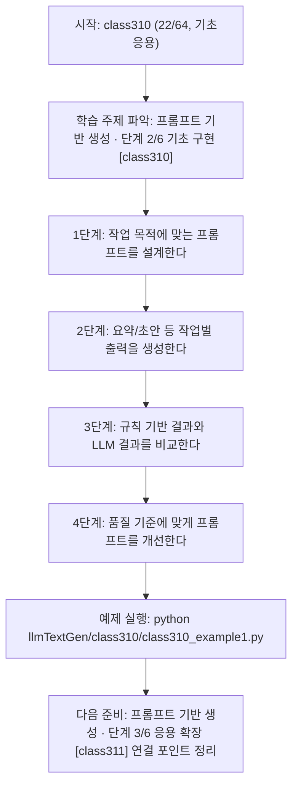
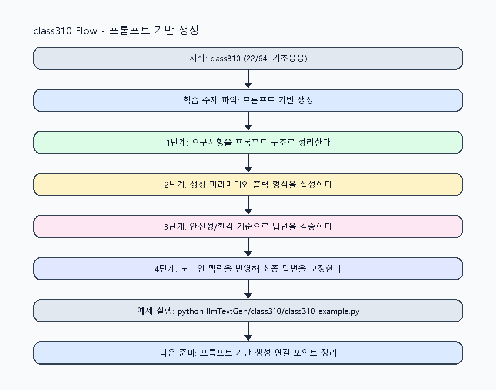

<!-- 이 파일은 www.edumgt.co.kr 의 에듀엠지티에 저작권이 있습니다 -->
# class310 자기주도 학습 가이드

## 1) 오늘의 학습 정보
- 교과목: **거대 언어 모델을 활용한 자연어 생성**
- 학습 주제: **프롬프트 기반 생성 · 단계 2/6 기초 구현 [class310]**
- 세부 시퀀스: **22/64**
- 일정: **Day 39 / 6교시**
- 난이도: **기초응용**

### 교과목·학습주제 어휘 해설 (IT 강사 스타일)
#### 교과목 표현 분석: `거대 언어 모델을 활용한 자연어 생성`
- 문법 포인트: 목적어(…을/를) + 관형절(활용한) + 중심 명사 구조로, 적용 대상을 문법적으로 분명히 드러냅니다.
- 기술 포인트: 거대 언어 모델을 실무 도메인과 연결해 생성 품질을 높이는 교과목입니다.
| 용어 | 문법/품사 | 한글·한자 | 영어 | 기술 설명 |
| --- | --- | --- | --- | --- |
| `거대` | 관형어 | 거대 (巨大) | large-scale | 모델 파라미터와 학습 데이터 규모가 매우 큼을 나타냅니다. |
| `언어` | 명사 | 언어 (言語) | language | 의미를 전달하기 위한 기호 체계로, NLP의 분석 대상입니다. |
| `모델` | 명사(외래어) | 모델 (한자 없음) | model | 입력과 출력 관계를 수학적으로 근사한 계산 구조입니다. |
| `활용` | 명사/동사 어근 | 활용 (活用) | utilization | 이론이나 도구를 실제 문제 해결 맥락에 적용하는 행위입니다. |
| `자연어` | 명사 | 자연어 (自然語) | natural language | 사람이 일상에서 사용하는 언어 텍스트/발화를 의미합니다. |
| `생성` | 명사 | 생성 (生成) | generation | 모델이 새 텍스트/응답/콘텐츠를 출력하는 과정입니다. |

#### 학습주제 표현 분석: `프롬프트 기반 생성 · 단계 2/6 기초 구현 [class310]`
- 문법 포인트: 핵심 개념 명사를 중심으로 한 명사구 구조입니다.
- 기술 포인트: 이번 차시는 `프롬프트 기반 생성 · 단계 2/6 기초 구현 [class310]` 용어를 중심으로 문제 정의, 코드 구현, 결과 검증까지 연결합니다.
| 용어 | 문법/품사 | 한글·한자 | 영어 | 기술 설명 |
| --- | --- | --- | --- | --- |
| `프롬프트` | 명사(외래어) | 프롬프트 (한자 없음) | prompt | 모델의 응답 방향을 결정하는 입력 지시문입니다. |
| `기반` | 명사(기술 개념어) | 기반 (한자 없음) | (context-specific) | 용어 `기반`: 이번 학습주제에서 정의해야 할 핵심 개념 용어입니다. |
| `생성` | 명사 | 생성 (生成) | generation | 모델이 새 텍스트/응답/콘텐츠를 출력하는 과정입니다. |
| `단계` | 명사(기술 개념어) | 단계 (한자 없음) | (context-specific) | 용어 `단계`: 이번 학습주제에서 정의해야 할 핵심 개념 용어입니다. |
| `기초` | 명사(기술 개념어) | 기초 (한자 없음) | (context-specific) | 용어 `기초`: 이번 학습주제에서 정의해야 할 핵심 개념 용어입니다. |
| `구현` | 명사 | 구현 (具現) | implementation | 설계를 실제 코드와 시스템 동작으로 구체화하는 과정입니다. |

## 2) 이전에 배운 내용 (복습)
- 이전 차시: **class309 / 프롬프트 기반 생성 · 단계 1/6 입문 이해 [class309]** (Day 39 / 5교시)
- 복습 연결: 이전에 배운 **프롬프트 기반 생성 · 단계 1/6 입문 이해 [class309]** 를 떠올리며, 오늘 **프롬프트 기반 생성 · 단계 2/6 기초 구현 [class310]** 와 어떤 점이 이어지는지 비교해 보세요.

## 3) 주제를 아주 쉽게 이해하기
- 한 줄 설명: 기본 프롬프트 설계로 텍스트 생성, 요약, 이메일/보고서 초안 생성을 실습하는 차시입니다.
- 왜 배우나요?: 프롬프트 구조가 불명확하면 같은 모델에서도 결과 품질과 재현성이 크게 떨어집니다.

### 핵심 개념 3가지
1. `기본 프롬프트`는 역할, 목표, 제약, 출력 형식을 명시해야 안정적입니다.
2. `생성 작업`은 요약, 질의응답, 문서 초안 작성처럼 목적별 템플릿이 필요합니다.
3. `규칙 기반 vs LLM 기반` 비교는 자동화 범위와 유지보수 비용 판단의 기준입니다.

### 비유로 이해하기
- 똑똑한 조교에게 과제를 맡길 때, 목표·형식·검수 기준을 먼저 주면 결과가 정확해지는 것과 같아요.

## 4) 실습 환경 만들기 (항상 먼저)
아래 명령은 **처음 한 번** 준비해 두면 이후 학습이 쉬워집니다.

### Windows PowerShell
```powershell
cd C:\DevOps\Python-AI_Agent-Class
python -m venv .venv
.\.venv\Scripts\Activate.ps1
python -m pip install --upgrade pip
pip install -r requirements.txt
```

### Linux/macOS (bash)
```bash
cd /path/to/Python-AI_Agent-Class
python3 -m venv .venv
source .venv/bin/activate
python -m pip install --upgrade pip
pip install -r requirements.txt
```

## 5) 오늘의 예제 코드
- 예제 파일: `class310_example1.py`
- 실행 명령:
```bash
python llmTextGen/class310/class310_example1.py
```

### example1~example5 단계별 테스트 확장
1. example1: 기본 프롬프트로 텍스트 생성을 실행한다.
2. example2: 문서 요약과 이메일/보고서 초안 생성을 확장한다.
3. example3: 챗봇 응답 프롬프트를 추가해 비교한다.
4. example4: 규칙 기반 vs LLM 기반 결과를 점검한다.
5. example5: 프롬프트 템플릿 운영 규칙을 정리한다.

<!-- AUTO-GENERATED: TECH_STACK_FLOW START -->
### 기술 스택
- 언어: `Python 3`
- 실행: `CLI` (`python llmTextGen/class310/class310_example1.py`)
- 주요 문법: `프롬프트 템플릿`, `작업 유형 라우팅`, `결과 비교 함수`, `출력 리포트`
- 학습 포커스: `프롬프트 기반 생성 · 단계 2/6 기초 구현 [class310]`

### 실습 example1.py 동작 원리 (Mermaid Flowchart)


### Flow PNG 캡처

<!-- AUTO-GENERATED: TECH_STACK_FLOW END -->

### 예제 코드를 볼 때 집중할 포인트
1. 프롬프트에 불필요한 모호성이 없는지 확인하기
2. 작업 유형별 출력 형식이 요구사항과 일치하는지 점검하기
3. 비교 실험에서 입력 조건을 통제하는지 확인하기

## 6) 퀴즈로 복습하기 (10문항)
- 퀴즈 파일: `class310_quiz.html`
- 브라우저에서 열기:
```bash
llmTextGen/class310/class310_quiz.html
```
- 버튼 설명:
1. `채점하기`: 현재 선택한 답으로 점수를 계산해요.
2. `다시풀기`: 선택을 모두 지우고 처음부터 다시 풀어요.

## 7) 혼자 실습 순서 (초등학생 버전)
1. 코드를 한 번 그대로 실행해요.
2. 숫자/문장 값을 1개 바꿔요.
3. 결과가 왜 바뀌었는지 한 줄로 적어요.
4. 함수를 1개 더 만들어 작은 기능을 추가해요.

### 실습 미션
1. 기본 프롬프트로 동일 입력을 3회 생성해 일관성을 비교하세요.
2. 문서 요약과 이메일/보고서 초안 프롬프트 템플릿을 작성하세요.
3. 규칙 기반 출력과 LLM 출력의 장단점을 표로 비교하세요.

## 8) 스스로 점검 체크리스트
- [ ] 역할/목표/형식이 포함된 프롬프트를 작성했다.
- [ ] 요약과 문서 초안 생성 실습을 수행했다.
- [ ] 규칙 기반과 LLM 기반 차이를 설명할 수 있다.

## 9) 막히면 이렇게 해결해요
1. 에러 메시지 마지막 줄을 먼저 읽어요.
2. 함수 이름과 괄호 짝을 확인해요.
3. `print()`를 넣어 중간 값을 확인해요.
4. 그래도 안 되면 어제 성공한 코드와 한 줄씩 비교해요.

## 10) 학습 후 다음에 배울 내용
- 다음 차시: **class311 / 프롬프트 기반 생성 · 단계 3/6 응용 확장 [class311]** (Day 39 / 7교시)
- 미리보기: 다음 차시 전에 **프롬프트 기반 생성 · 단계 2/6 기초 구현 [class310]** 핵심 코드 1개를 다시 실행해 두면 프롬프트 기반 생성 · 단계 3/6 응용 확장 [class311] 학습이 더 쉬워집니다.

## 11) 다음 차시 연결
- 다음 차시에서는 요약/분류/정보추출 등 생성 작업 유형을 확장합니다.
- 오늘 코드를 복사하지 말고, 직접 다시 작성해 보세요.
