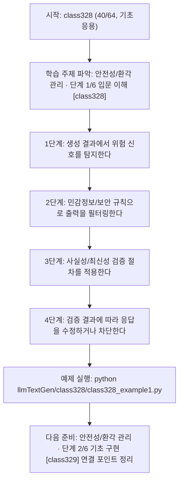
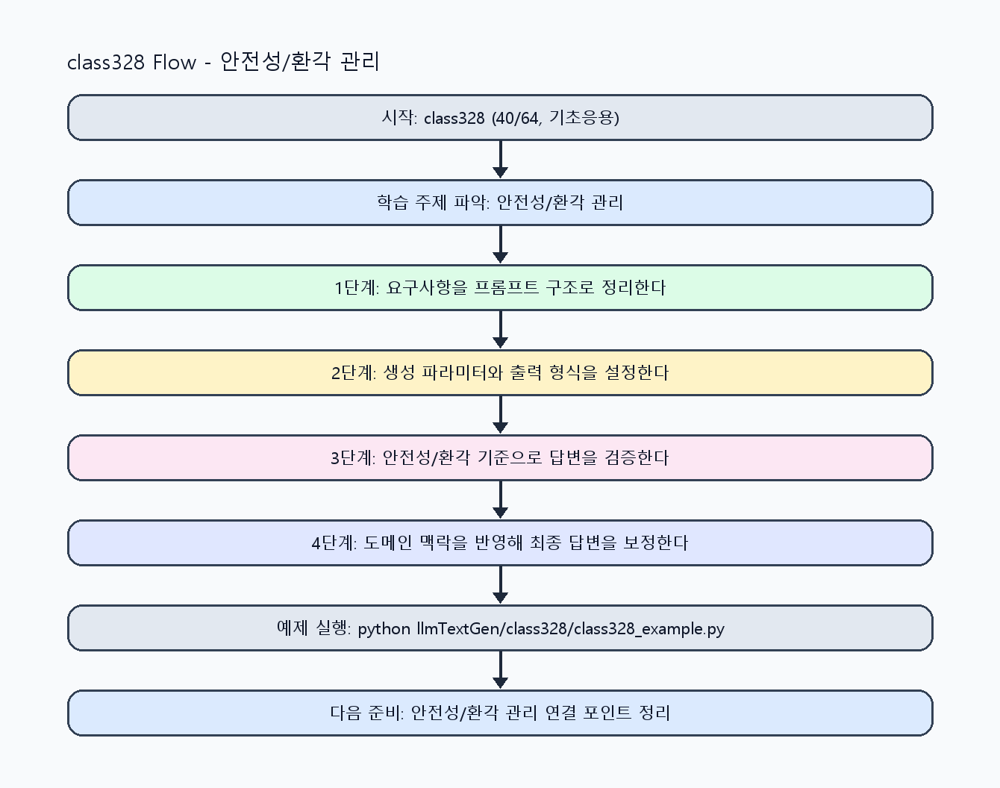

<!-- 이 파일은 www.edumgt.co.kr 의 에듀엠지티에 저작권이 있습니다 -->
# class328 자기주도 학습 가이드

## 1) 오늘의 학습 정보
- 교과목: **거대 언어 모델을 활용한 자연어 생성**
- 학습 주제: **안전성/환각 관리 · 단계 1/6 입문 이해 [class328]**
- 세부 시퀀스: **40/64**
- 일정: **Day 41 / 8교시**
- 난이도: **기초응용**

### 교과목·학습주제 어휘 해설 (IT 강사 스타일)
#### 교과목 표현 분석: `거대 언어 모델을 활용한 자연어 생성`
- 문법 포인트: 목적어(…을/를) + 관형절(활용한) + 중심 명사 구조로, 적용 대상을 문법적으로 분명히 드러냅니다.
- 기술 포인트: 거대 언어 모델을 실무 도메인과 연결해 생성 품질을 높이는 교과목입니다.
| 용어 | 문법/품사 | 한글·한자 | 영어 | 기술 설명 |
| --- | --- | --- | --- | --- |
| `거대` | 관형어 | 거대 (巨大) | large-scale | 모델 파라미터와 학습 데이터 규모가 매우 큼을 나타냅니다. |
| `언어` | 명사 | 언어 (言語) | language | 의미를 전달하기 위한 기호 체계로, NLP의 분석 대상입니다. |
| `모델` | 명사(외래어) | 모델 (한자 없음) | model | 입력과 출력 관계를 수학적으로 근사한 계산 구조입니다. |
| `활용` | 명사/동사 어근 | 활용 (活用) | utilization | 이론이나 도구를 실제 문제 해결 맥락에 적용하는 행위입니다. |
| `자연어` | 명사 | 자연어 (自然語) | natural language | 사람이 일상에서 사용하는 언어 텍스트/발화를 의미합니다. |
| `생성` | 명사 | 생성 (生成) | generation | 모델이 새 텍스트/응답/콘텐츠를 출력하는 과정입니다. |

#### 학습주제 표현 분석: `안전성/환각 관리 · 단계 1/6 입문 이해 [class328]`
- 문법 포인트: 핵심 개념 명사를 중심으로 한 명사구 구조입니다.
- 기술 포인트: 이번 차시는 `안전성/환각 관리` 핵심 개념을 코드 구현, 결과 해석, 점검 기준으로 연결합니다.
| 용어 | 문법/품사 | 한글·한자 | 영어 | 기술 설명 |
| --- | --- | --- | --- | --- |
| `안전성` | 명사 | 안전성 (安全性) | safety | 유해 출력, 오남용, 규정 위반을 줄이는 모델 운영 특성입니다. |
| `환각` | 명사 | 환각 (幻覺) | hallucination | 모델이 사실 근거 없이 그럴듯한 잘못된 답을 생성하는 현상입니다. |
| `관리` | 명사 | 관리 (管理) | management | 정책, 검증, 모니터링으로 품질을 지속 통제하는 활동입니다. |
| `사실성` | 명사(주제 핵심 용어) | 사실성 (한자 없음) | (topic-specific) | 이번 차시 맥락: 환각, 사실성 한계, 최신성 한계, 개인정보/보안 이슈를 다루는 안전성 차시입니다. 이를 기준으로 `사실성`를 코드와 결과 해석에 연결합니다. |
| `문제` | 명사(주제 핵심 용어) | 문제 (한자 없음) | (topic-specific) | 이번 차시 맥락: `사실성 문제`는 모델이 근거 없는 내용을 단정적으로 생성할 때 발생합니다. 이를 기준으로 `문제`를 코드와 결과 해석에 연결합니다. |
| `최신성` | 명사(주제 핵심 용어) | 최신성 (한자 없음) | (topic-specific) | 이번 차시 맥락: 환각, 사실성 한계, 최신성 한계, 개인정보/보안 이슈를 다루는 안전성 차시입니다. 이를 기준으로 `최신성`를 코드와 결과 해석에 연결합니다. |

## 2) 이전에 배운 내용 (복습)
- 이전 차시: **class327 / 대화형 응답 설계 · 단계 7/7 운영 최적화 [class327]** (Day 41 / 7교시)
- 복습 연결: 이전에 배운 **대화형 응답 설계 · 단계 7/7 운영 최적화 [class327]** 를 떠올리며, 오늘 **안전성/환각 관리 · 단계 1/6 입문 이해 [class328]** 와 어떤 점이 이어지는지 비교해 보세요.

## 3) 주제를 아주 쉽게 이해하기
- 한 줄 설명: 환각, 사실성 한계, 최신성 한계, 개인정보/보안 이슈를 다루는 안전성 차시입니다.
- 왜 배우나요?: 생성형 AI 결과는 검증 없이 사용하면 잘못된 정보 전달과 보안 사고로 이어질 수 있습니다.

### 핵심 개념 3가지
1. `사실성 문제`는 모델이 근거 없는 내용을 단정적으로 생성할 때 발생합니다.
2. `최신성 한계`는 학습 시점 이후 정보 부재로 인해 오래된 답을 낼 수 있음을 의미합니다.
3. `보안/개인정보`와 `프롬프트 민감성`은 서비스 적용 시 필수로 관리해야 하는 위험 요소입니다.

### 비유로 이해하기
- 똑똑한 조교에게 과제를 맡길 때, 목표·형식·검수 기준을 먼저 주면 결과가 정확해지는 것과 같아요.

## 4) 실습 환경 만들기 (항상 먼저)
아래 명령은 **처음 한 번** 준비해 두면 이후 학습이 쉬워집니다.

### Windows PowerShell
```powershell
cd C:\DevOps\Python-AI_Agent-Class
python -m venv .venv
.\.venv\Scripts\Activate.ps1
python -m pip install --upgrade pip
pip install -r requirements.txt
```

### Linux/macOS (bash)
```bash
cd /path/to/Python-AI_Agent-Class
python3 -m venv .venv
source .venv/bin/activate
python -m pip install --upgrade pip
pip install -r requirements.txt
```

## 5) 오늘의 예제 코드
- 예제 파일: `class328_example1.py`
- 실행 명령:
```bash
python llmTextGen/class328/class328_example1.py
```

### example1~example5 단계별 테스트 확장
1. example1: 환각 탐지와 사실성 점검 기본 규칙을 실행한다.
2. example2: 최신성 한계와 검증 루프를 확장한다.
3. example3: 개인정보/보안 필터링 케이스를 점검한다.
4. example4: 프롬프트 민감성으로 인한 위험 응답을 분석한다.
5. example5: 실무 검증 체크리스트를 문서화한다.

<!-- AUTO-GENERATED: TECH_STACK_FLOW START -->
### 기술 스택
- 언어: `Python 3`
- 실행: `CLI` (`python llmTextGen/class328/class328_example1.py`)
- 주요 문법: `안전성 필터 함수`, `환각 리스크 스코어`, `민감정보 마스킹`, `검증 체크리스트`
- 학습 포커스: `안전성/환각 관리 · 단계 1/6 입문 이해 [class328]`

### 실습 example1.py 동작 원리 (Mermaid Flowchart)


### Flow PNG 캡처

<!-- AUTO-GENERATED: TECH_STACK_FLOW END -->

### 예제 코드를 볼 때 집중할 포인트
1. 환각 탐지 기준이 구체적 문장 패턴으로 정의되는지 확인하기
2. 민감정보 필터가 과차단/미차단 없이 동작하는지 점검하기
3. 최종 배포 전 사람 검토 루프가 포함되는지 확인하기

## 6) 퀴즈로 복습하기 (10문항)
- 퀴즈 파일: `class328_quiz.html`
- 브라우저에서 열기:
```bash
llmTextGen/class328/class328_quiz.html
```
- 버튼 설명:
1. `채점하기`: 현재 선택한 답으로 점수를 계산해요.
2. `다시풀기`: 선택을 모두 지우고 처음부터 다시 풀어요.

## 7) 혼자 실습 순서 (초등학생 버전)
1. 코드를 한 번 그대로 실행해요.
2. 숫자/문장 값을 1개 바꿔요.
3. 결과가 왜 바뀌었는지 한 줄로 적어요.
4. 함수를 1개 더 만들어 작은 기능을 추가해요.

### 실습 미션
1. 환각 가능 문장(근거 없음, 과도한 확신 표현)을 탐지하세요.
2. 민감정보 필터링 규칙과 마스킹 출력을 적용하세요.
3. 사실 검증 체크리스트(출처 확인/재질문/사람 검토)를 작성하세요.

## 8) 스스로 점검 체크리스트
- [ ] 환각 위험 문장을 식별하고 태깅했다.
- [ ] 개인정보/보안 필터링 규칙을 적용했다.
- [ ] 실무 적용 전 검증 절차를 문서화했다.

## 9) 막히면 이렇게 해결해요
1. 에러 메시지 마지막 줄을 먼저 읽어요.
2. 함수 이름과 괄호 짝을 확인해요.
3. `print()`를 넣어 중간 값을 확인해요.
4. 그래도 안 되면 어제 성공한 코드와 한 줄씩 비교해요.

## 10) 학습 후 다음에 배울 내용
- 다음 차시: **class329 / 안전성/환각 관리 · 단계 2/6 기초 구현 [class329]** (Day 42 / 1교시)
- 미리보기: 다음 차시 전에 **안전성/환각 관리 · 단계 1/6 입문 이해 [class328]** 핵심 코드 1개를 다시 실행해 두면 안전성/환각 관리 · 단계 2/6 기초 구현 [class329] 학습이 더 쉬워집니다.

## 11) 다음 차시 연결
- 다음 차시에서는 도메인 적용 시 비용/성능/보안을 함께 최적화합니다.
- 오늘 코드를 복사하지 말고, 직접 다시 작성해 보세요.
