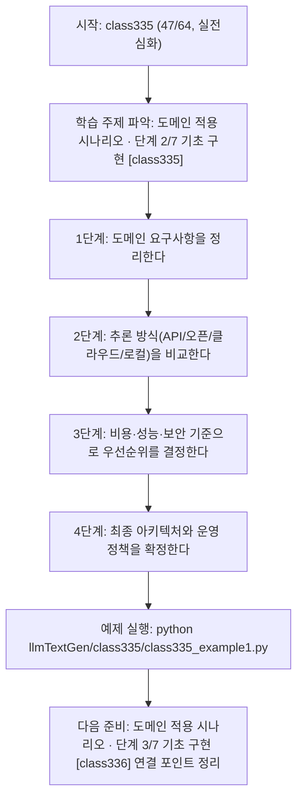
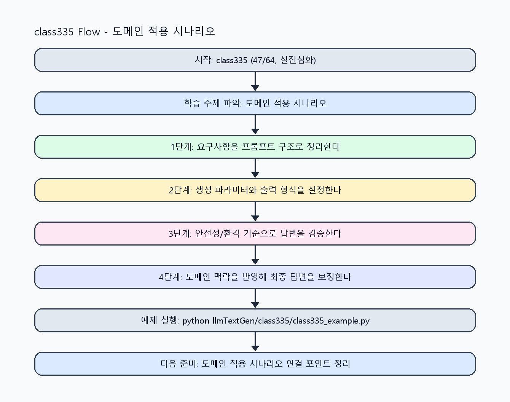

<!-- 이 파일은 www.edumgt.co.kr 의 에듀엠지티에 저작권이 있습니다 -->
# class335 자기주도 학습 가이드

## 1) 오늘의 학습 정보
- 교과목: **거대 언어 모델을 활용한 자연어 생성**
- 학습 주제: **도메인 적용 시나리오 · 단계 2/7 기초 구현 [class335]**
- 세부 시퀀스: **47/64**
- 일정: **Day 42 / 7교시**
- 난이도: **실전심화**

### 교과목·학습주제 어휘 해설 (IT 강사 스타일)
#### 교과목 표현 분석: `거대 언어 모델을 활용한 자연어 생성`
- 문법 포인트: 목적어(…을/를) + 관형절(활용한) + 중심 명사 구조로, 적용 대상을 문법적으로 분명히 드러냅니다.
- 기술 포인트: 거대 언어 모델을 실무 도메인과 연결해 생성 품질을 높이는 교과목입니다.
| 용어 | 문법/품사 | 한글·한자 | 영어 | 기술 설명 |
| --- | --- | --- | --- | --- |
| `거대` | 관형어 | 거대 (巨大) | large-scale | 모델 파라미터와 학습 데이터 규모가 매우 큼을 나타냅니다. |
| `언어` | 명사 | 언어 (言語) | language | 의미를 전달하기 위한 기호 체계로, NLP의 분석 대상입니다. |
| `모델` | 명사(외래어) | 모델 (한자 없음) | model | 입력과 출력 관계를 수학적으로 근사한 계산 구조입니다. |
| `활용` | 명사/동사 어근 | 활용 (活用) | utilization | 이론이나 도구를 실제 문제 해결 맥락에 적용하는 행위입니다. |
| `자연어` | 명사 | 자연어 (自然語) | natural language | 사람이 일상에서 사용하는 언어 텍스트/발화를 의미합니다. |
| `생성` | 명사 | 생성 (生成) | generation | 모델이 새 텍스트/응답/콘텐츠를 출력하는 과정입니다. |

#### 학습주제 표현 분석: `도메인 적용 시나리오 · 단계 2/7 기초 구현 [class335]`
- 문법 포인트: 핵심 개념 명사를 중심으로 한 명사구 구조입니다.
- 기술 포인트: 이번 차시는 `도메인 적용 시나리오` 핵심 개념을 코드 구현, 결과 해석, 점검 기준으로 연결합니다.
| 용어 | 문법/품사 | 한글·한자 | 영어 | 기술 설명 |
| --- | --- | --- | --- | --- |
| `도메인` | 명사(외래어) | 도메인 (한자 없음) | domain | 문제를 푸는 특정 업무 영역(예: 의료, 법률, 제조)을 뜻합니다. |
| `적용` | 명사/동사 어근 | 적용 (適用) | application | 일반 기술을 실제 업무 요구사항에 맞게 구현하는 단계입니다. |
| `시나리오` | 명사(외래어) | 시나리오 (한자 없음) | scenario | 사용자 행동, 입력, 예외를 포함한 실행 흐름 설계 문서입니다. |
| `API` | 약어명사 | API (한자 없음) | Application Programming Interface | 서비스 간 기능을 호출하기 위한 표준 인터페이스입니다. |
| `오픈모델` | 명사(주제 핵심 용어) | 오픈모델 (한자 없음) | (topic-specific) | 이번 차시 맥락: `API 기반`은 빠른 도입이 장점이고, `오픈모델`은 커스터마이징 유연성이 큽니다. 이를 기준으로 `오픈모델`를 코드와 결과 해석에 연결합니다. |
| `클라우드` | 명사(주제 핵심 용어) | 클라우드 (한자 없음) | (topic-specific) | 이번 차시 맥락: API, 오픈소스, 클라우드, 로컬 추론 방식을 도메인 요구사항에 맞춰 선택하는 차시입니다. 이를 기준으로 `클라우드`를 코드와 결과 해석에 연결합니다. |

## 2) 이전에 배운 내용 (복습)
- 이전 차시: **class334 / 도메인 적용 시나리오 · 단계 1/7 입문 이해 [class334]** (Day 42 / 6교시)
- 복습 연결: 이전에 배운 **도메인 적용 시나리오 · 단계 1/7 입문 이해 [class334]** 를 떠올리며, 오늘 **도메인 적용 시나리오 · 단계 2/7 기초 구현 [class335]** 와 어떤 점이 이어지는지 비교해 보세요.

## 3) 주제를 아주 쉽게 이해하기
- 한 줄 설명: API, 오픈소스, 클라우드, 로컬 추론 방식을 도메인 요구사항에 맞춰 선택하는 차시입니다.
- 왜 배우나요?: 활용 방식 선택은 품질뿐 아니라 비용, 지연, 보안, 운영 난이도를 함께 결정합니다.

### 핵심 개념 3가지
1. `API 기반`은 빠른 도입이 장점이고, `오픈모델`은 커스터마이징 유연성이 큽니다.
2. `클라우드 추론`은 확장성과 운영 편의성이 높고, `로컬 추론`은 보안/비용 통제가 유리합니다.
3. `비용/성능/보안`은 서로 trade-off가 있으므로 도메인별 우선순위를 명확히 해야 합니다.

### 비유로 이해하기
- 똑똑한 조교에게 과제를 맡길 때, 목표·형식·검수 기준을 먼저 주면 결과가 정확해지는 것과 같아요.

## 4) 실습 환경 만들기 (항상 먼저)
아래 명령은 **처음 한 번** 준비해 두면 이후 학습이 쉬워집니다.

### Windows PowerShell
```powershell
cd C:\DevOps\Python-AI_Agent-Class
python -m venv .venv
.\.venv\Scripts\Activate.ps1
python -m pip install --upgrade pip
pip install -r requirements.txt
```

### Linux/macOS (bash)
```bash
cd /path/to/Python-AI_Agent-Class
python3 -m venv .venv
source .venv/bin/activate
python -m pip install --upgrade pip
pip install -r requirements.txt
```

## 5) 오늘의 예제 코드
- 예제 파일: `class335_example1.py`
- 실행 명령:
```bash
python llmTextGen/class335/class335_example1.py
```

### example1~example5 단계별 테스트 확장
1. example1: API 기반 활용 기본 시나리오를 실행한다.
2. example2: 오픈모델/클라우드/로컬 추론 옵션을 비교한다.
3. example3: 비용/성능/보안 trade-off 케이스를 점검한다.
4. example4: 도메인별 아키텍처 선택 기준을 분석한다.
5. example5: 배포 의사결정 체크리스트를 정리한다.

<!-- AUTO-GENERATED: TECH_STACK_FLOW START -->
### 기술 스택
- 언어: `Python 3`
- 실행: `CLI` (`python llmTextGen/class335/class335_example1.py`)
- 주요 문법: `배포 옵션 카드`, `비용 추정 함수`, `보안 등급 매핑`, `의사결정 리포트`
- 학습 포커스: `도메인 적용 시나리오 · 단계 2/7 기초 구현 [class335]`

### 실습 example1.py 동작 원리 (Mermaid Flowchart)


### Flow PNG 캡처

<!-- AUTO-GENERATED: TECH_STACK_FLOW END -->

### 예제 코드를 볼 때 집중할 포인트
1. 비용 계산에 토큰/요청량 가정이 명시되는지 확인하기
2. 보안 요구사항(개인정보/망분리)이 반영되는지 점검하기
3. 선택 아키텍처의 장애 대응 계획이 포함되는지 확인하기

## 6) 퀴즈로 복습하기 (10문항)
- 퀴즈 파일: `class335_quiz.html`
- 브라우저에서 열기:
```bash
llmTextGen/class335/class335_quiz.html
```
- 버튼 설명:
1. `채점하기`: 현재 선택한 답으로 점수를 계산해요.
2. `다시풀기`: 선택을 모두 지우고 처음부터 다시 풀어요.

## 7) 혼자 실습 순서 (초등학생 버전)
1. 코드를 한 번 그대로 실행해요.
2. 숫자/문장 값을 1개 바꿔요.
3. 결과가 왜 바뀌었는지 한 줄로 적어요.
4. 함수를 1개 더 만들어 작은 기능을 추가해요.

### 실습 미션
1. API/오픈모델/클라우드/로컬 방식의 장단점을 비교표로 작성하세요.
2. 도메인 시나리오(예: 고객지원, 내부문서 요약)에 맞는 추론 방식을 선택하세요.
3. 선택 근거를 비용, 지연, 보안 항목으로 문서화하세요.

## 8) 스스로 점검 체크리스트
- [ ] 활용 방식별 장단점과 적용 조건을 설명할 수 있다.
- [ ] 도메인별 비용/성능/보안 기준을 수립했다.
- [ ] 선택한 아키텍처의 운영 리스크를 기록했다.

## 9) 막히면 이렇게 해결해요
1. 에러 메시지 마지막 줄을 먼저 읽어요.
2. 함수 이름과 괄호 짝을 확인해요.
3. `print()`를 넣어 중간 값을 확인해요.
4. 그래도 안 되면 어제 성공한 코드와 한 줄씩 비교해요.

## 10) 학습 후 다음에 배울 내용
- 다음 차시: **class336 / 도메인 적용 시나리오 · 단계 3/7 기초 구현 [class336]** (Day 42 / 8교시)
- 미리보기: 다음 차시 전에 **도메인 적용 시나리오 · 단계 2/7 기초 구현 [class335]** 핵심 코드 1개를 다시 실행해 두면 도메인 적용 시나리오 · 단계 3/7 기초 구현 [class336] 학습이 더 쉬워집니다.

## 11) 다음 차시 연결
- 다음 차시에서는 API 호출 실습과 오류 처리 패턴을 구현합니다.
- 오늘 코드를 복사하지 말고, 직접 다시 작성해 보세요.
