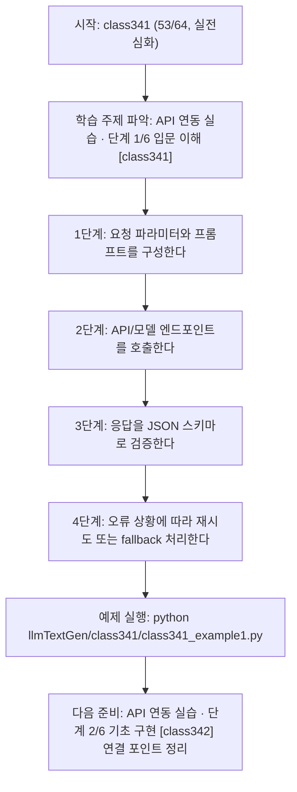
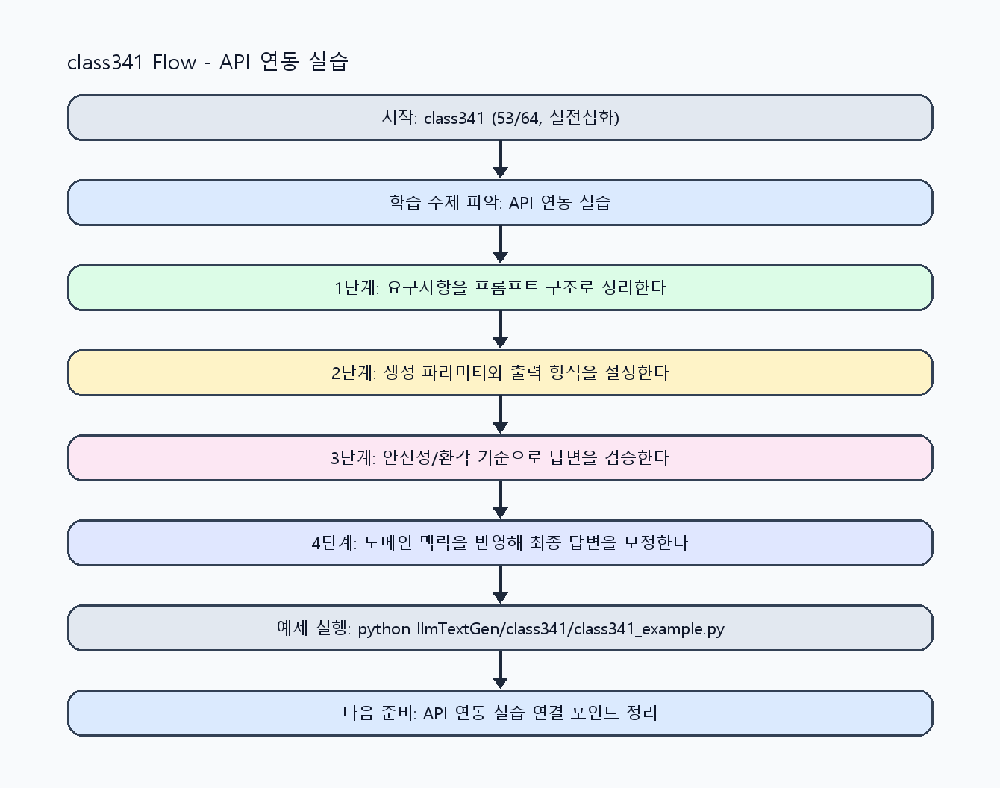

<!-- 이 파일은 www.edumgt.co.kr 의 에듀엠지티에 저작권이 있습니다 -->
# class341 자기주도 학습 가이드

## 1) 오늘의 학습 정보
- 교과목: **거대 언어 모델을 활용한 자연어 생성**
- 학습 주제: **API 연동 실습 · 단계 1/6 입문 이해 [class341]**
- 세부 시퀀스: **53/64**
- 일정: **Day 43 / 5교시**
- 난이도: **실전심화**

### 교과목·학습주제 어휘 해설 (IT 강사 스타일)
#### 교과목 표현 분석: `거대 언어 모델을 활용한 자연어 생성`
- 문법 포인트: 목적어(…을/를) + 관형절(활용한) + 중심 명사 구조로, 적용 대상을 문법적으로 분명히 드러냅니다.
- 기술 포인트: 거대 언어 모델을 실무 도메인과 연결해 생성 품질을 높이는 교과목입니다.
| 용어 | 문법/품사 | 한글·한자 | 영어 | 기술 설명 |
| --- | --- | --- | --- | --- |
| `거대` | 관형어 | 거대 (巨大) | large-scale | 모델 파라미터와 학습 데이터 규모가 매우 큼을 나타냅니다. |
| `언어` | 명사 | 언어 (言語) | language | 의미를 전달하기 위한 기호 체계로, NLP의 분석 대상입니다. |
| `모델` | 명사(외래어) | 모델 (한자 없음) | model | 입력과 출력 관계를 수학적으로 근사한 계산 구조입니다. |
| `활용` | 명사/동사 어근 | 활용 (活用) | utilization | 이론이나 도구를 실제 문제 해결 맥락에 적용하는 행위입니다. |
| `자연어` | 명사 | 자연어 (自然語) | natural language | 사람이 일상에서 사용하는 언어 텍스트/발화를 의미합니다. |
| `생성` | 명사 | 생성 (生成) | generation | 모델이 새 텍스트/응답/콘텐츠를 출력하는 과정입니다. |

#### 학습주제 표현 분석: `API 연동 실습 · 단계 1/6 입문 이해 [class341]`
- 문법 포인트: 핵심 개념 명사를 중심으로 한 명사구 구조입니다.
- 기술 포인트: 이번 차시는 `API 연동 실습` 핵심 개념을 코드 구현, 결과 해석, 점검 기준으로 연결합니다.
| 용어 | 문법/품사 | 한글·한자 | 영어 | 기술 설명 |
| --- | --- | --- | --- | --- |
| `API` | 약어명사 | API (한자 없음) | Application Programming Interface | 서비스 간 기능을 호출하기 위한 표준 인터페이스입니다. |
| `연동` | 명사 | 연동 (連動) | integration | 서로 다른 시스템을 연결해 데이터와 기능을 교환하는 과정입니다. |
| `활용` | 명사/동사 어근 | 활용 (活用) | utilization | 이론이나 도구를 실제 문제 해결 맥락에 적용하는 행위입니다. |
| `JSON` | 영문 기술명/약어 | JSON (한자 없음) | JSON | 이번 차시 맥락: `JSON 응답 강제`는 후처리 자동화와 시스템 연동 안정성을 높입니다. 이를 기준으로 `JSON`를 코드와 결과 해석에 연결합니다. |
| `응답` | 명사 | 응답 (應答) | response | 모델이 입력 프롬프트에 대해 반환하는 출력 텍스트입니다. |
| `강제` | 명사(주제 핵심 용어) | 강제 (한자 없음) | (topic-specific) | 이번 차시 맥락: `JSON 응답 강제`는 후처리 자동화와 시스템 연동 안정성을 높입니다. 이를 기준으로 `강제`를 코드와 결과 해석에 연결합니다. |

## 2) 이전에 배운 내용 (복습)
- 이전 차시: **class340 / 도메인 적용 시나리오 · 단계 7/7 운영 최적화 [class340]** (Day 43 / 4교시)
- 복습 연결: 이전에 배운 **도메인 적용 시나리오 · 단계 7/7 운영 최적화 [class340]** 를 떠올리며, 오늘 **API 연동 실습 · 단계 1/6 입문 이해 [class341]** 와 어떤 점이 이어지는지 비교해 보세요.

## 3) 주제를 아주 쉽게 이해하기
- 한 줄 설명: LLM API 또는 오픈모델 엔드포인트를 호출해 생성 기능을 구현하는 실습 차시입니다.
- 왜 배우나요?: 실제 서비스에서는 모델 품질만큼 요청/응답 포맷, 재시도, 오류 복구 로직이 중요합니다.

### 핵심 개념 3가지
1. `API 기반 활용`은 요청 payload 설계와 응답 파싱 안정성이 핵심입니다.
2. `JSON 응답 강제`는 후처리 자동화와 시스템 연동 안정성을 높입니다.
3. `오류 처리`는 타임아웃, rate limit, invalid output에 대한 재시도 정책을 포함합니다.

### 비유로 이해하기
- 똑똑한 조교에게 과제를 맡길 때, 목표·형식·검수 기준을 먼저 주면 결과가 정확해지는 것과 같아요.

## 4) 실습 환경 만들기 (항상 먼저)
아래 명령은 **처음 한 번** 준비해 두면 이후 학습이 쉬워집니다.

### Windows PowerShell
```powershell
cd C:\DevOps\Python-AI_Agent-Class
python -m venv .venv
.\.venv\Scripts\Activate.ps1
python -m pip install --upgrade pip
pip install -r requirements.txt
```

### Linux/macOS (bash)
```bash
cd /path/to/Python-AI_Agent-Class
python3 -m venv .venv
source .venv/bin/activate
python -m pip install --upgrade pip
pip install -r requirements.txt
```

## 5) 오늘의 예제 코드
- 예제 파일: `class341_example1.py`
- 실행 명령:
```bash
python llmTextGen/class341/class341_example1.py
```

### example1~example5 단계별 테스트 확장
1. example1: API 요청으로 기본 텍스트 생성을 실행한다.
2. example2: 요약/초안 작성 요청을 JSON 응답으로 확장한다.
3. example3: 에러 응답/타임아웃 처리 케이스를 점검한다.
4. example4: 오픈모델 엔드포인트 대체 경로를 검증한다.
5. example5: API 운영 로그/재시도 정책을 정리한다.

<!-- AUTO-GENERATED: TECH_STACK_FLOW START -->
### 기술 스택
- 언어: `Python 3`
- 실행: `CLI` (`python llmTextGen/class341/class341_example1.py`)
- 주요 문법: `API payload dict`, `JSON schema 검증`, `예외/재시도 핸들러`, `응답 파서`
- 학습 포커스: `API 연동 실습 · 단계 1/6 입문 이해 [class341]`

### 실습 example1.py 동작 원리 (Mermaid Flowchart)


### Flow PNG 캡처

<!-- AUTO-GENERATED: TECH_STACK_FLOW END -->

### 예제 코드를 볼 때 집중할 포인트
1. 요청 파라미터가 작업 목적과 일치하는지 확인하기
2. JSON 파싱 실패 시 안전한 fallback이 있는지 점검하기
3. 오류 로그에 재현 가능한 정보가 남는지 확인하기

## 6) 퀴즈로 복습하기 (10문항)
- 퀴즈 파일: `class341_quiz.html`
- 브라우저에서 열기:
```bash
llmTextGen/class341/class341_quiz.html
```
- 버튼 설명:
1. `채점하기`: 현재 선택한 답으로 점수를 계산해요.
2. `다시풀기`: 선택을 모두 지우고 처음부터 다시 풀어요.

## 7) 혼자 실습 순서 (초등학생 버전)
1. 코드를 한 번 그대로 실행해요.
2. 숫자/문장 값을 1개 바꿔요.
3. 결과가 왜 바뀌었는지 한 줄로 적어요.
4. 함수를 1개 더 만들어 작은 기능을 추가해요.

### 실습 미션
1. 기본 프롬프트 요청 payload를 구성하고 텍스트를 생성하세요.
2. 요약/초안 작성 요청을 JSON 출력 스키마로 강제하세요.
3. 오류 코드별 재시도/대체 응답 처리 로직을 추가하세요.

## 8) 스스로 점검 체크리스트
- [ ] API 요청/응답 구조를 구현하고 검증했다.
- [ ] JSON 응답 강제와 파싱 로직을 적용했다.
- [ ] 오류 응답 처리와 재시도 규칙을 구성했다.

## 9) 막히면 이렇게 해결해요
1. 에러 메시지 마지막 줄을 먼저 읽어요.
2. 함수 이름과 괄호 짝을 확인해요.
3. `print()`를 넣어 중간 값을 확인해요.
4. 그래도 안 되면 어제 성공한 코드와 한 줄씩 비교해요.

## 10) 학습 후 다음에 배울 내용
- 다음 차시: **class342 / API 연동 실습 · 단계 2/6 기초 구현 [class342]** (Day 43 / 6교시)
- 미리보기: 다음 차시 전에 **API 연동 실습 · 단계 1/6 입문 이해 [class341]** 핵심 코드 1개를 다시 실행해 두면 API 연동 실습 · 단계 2/6 기초 구현 [class342] 학습이 더 쉬워집니다.

## 11) 다음 차시 연결
- 다음 차시에서는 Agent 형태로 생성 기능을 통합해 서비스 흐름을 완성합니다.
- 오늘 코드를 복사하지 말고, 직접 다시 작성해 보세요.
