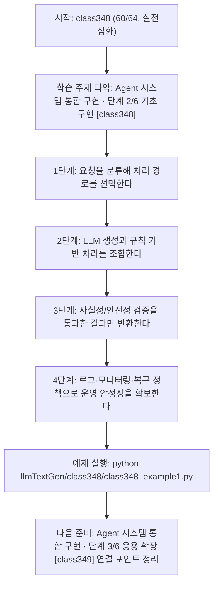
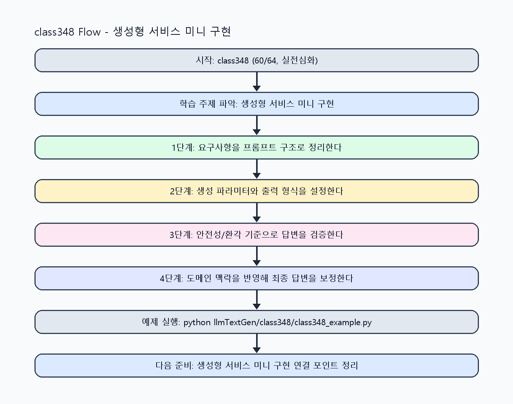

<!-- 이 파일은 www.edumgt.co.kr 의 에듀엠지티에 저작권이 있습니다 -->
# class348 자기주도 학습 가이드

## 1) 오늘의 학습 정보
- 교과목: **거대 언어 모델을 활용한 자연어 생성**
- 학습 주제: **Agent 시스템 통합 구현 · 단계 2/6 기초 구현 [class348]**
- 세부 시퀀스: **60/64**
- 일정: **Day 44 / 4교시**
- 난이도: **실전심화**

### 교과목·학습주제 어휘 해설 (IT 강사 스타일)
#### 교과목 표현 분석: `거대 언어 모델을 활용한 자연어 생성`
- 문법 포인트: 목적어(…을/를) + 관형절(활용한) + 중심 명사 구조로, 적용 대상을 문법적으로 분명히 드러냅니다.
- 기술 포인트: 거대 언어 모델을 실무 도메인과 연결해 생성 품질을 높이는 교과목입니다.
| 용어 | 문법/품사 | 한글·한자 | 영어 | 기술 설명 |
| --- | --- | --- | --- | --- |
| `거대` | 관형어 | 거대 (巨大) | large-scale | 모델 파라미터와 학습 데이터 규모가 매우 큼을 나타냅니다. |
| `언어` | 명사 | 언어 (言語) | language | 의미를 전달하기 위한 기호 체계로, NLP의 분석 대상입니다. |
| `모델` | 명사(외래어) | 모델 (한자 없음) | model | 입력과 출력 관계를 수학적으로 근사한 계산 구조입니다. |
| `활용` | 명사/동사 어근 | 활용 (活用) | utilization | 이론이나 도구를 실제 문제 해결 맥락에 적용하는 행위입니다. |
| `자연어` | 명사 | 자연어 (自然語) | natural language | 사람이 일상에서 사용하는 언어 텍스트/발화를 의미합니다. |
| `생성` | 명사 | 생성 (生成) | generation | 모델이 새 텍스트/응답/콘텐츠를 출력하는 과정입니다. |

#### 학습주제 표현 분석: `Agent 시스템 통합 구현 · 단계 2/6 기초 구현 [class348]`
- 문법 포인트: 핵심 개념 명사를 중심으로 한 명사구 구조입니다.
- 기술 포인트: 이번 차시는 `Agent 시스템 통합 구현 · 단계 2/6 기초 구현 [class348]` 용어를 중심으로 문제 정의, 코드 구현, 결과 검증까지 연결합니다.
| 용어 | 문법/품사 | 한글·한자 | 영어 | 기술 설명 |
| --- | --- | --- | --- | --- |
| `Agent` | 명사(영어) | Agent (한자 없음) | agent | 목표 달성을 위해 도구 선택과 실행 순서를 스스로 결정하는 실행자입니다. |
| `시스템` | 명사(기술 개념어) | 시스템 (한자 없음) | (context-specific) | 용어 `시스템`: 이번 학습주제에서 정의해야 할 핵심 개념 용어입니다. |
| `통합` | 명사(기술 개념어) | 통합 (한자 없음) | (context-specific) | 용어 `통합`: 이번 학습주제에서 정의해야 할 핵심 개념 용어입니다. |
| `구현` | 명사 | 구현 (具現) | implementation | 설계를 실제 코드와 시스템 동작으로 구체화하는 과정입니다. |
| `단계` | 명사(기술 개념어) | 단계 (한자 없음) | (context-specific) | 용어 `단계`: 이번 학습주제에서 정의해야 할 핵심 개념 용어입니다. |
| `기초` | 명사(기술 개념어) | 기초 (한자 없음) | (context-specific) | 용어 `기초`: 이번 학습주제에서 정의해야 할 핵심 개념 용어입니다. |

## 2) 이전에 배운 내용 (복습)
- 이전 차시: **class347 / Agent 시스템 통합 구현 · 단계 1/6 입문 이해 [class347]** (Day 44 / 3교시)
- 복습 연결: 이전에 배운 **Agent 시스템 통합 구현 · 단계 1/6 입문 이해 [class347]** 를 떠올리며, 오늘 **Agent 시스템 통합 구현 · 단계 2/6 기초 구현 [class348]** 와 어떤 점이 이어지는지 비교해 보세요.

## 3) 주제를 아주 쉽게 이해하기
- 한 줄 설명: 생성 기능을 서비스형 Agent로 통합해 라우팅, 검증, 모니터링까지 구현하는 마무리 차시입니다.
- 왜 배우나요?: 서비스형 AI 역량은 단일 생성 결과보다 전체 워크플로우를 안정적으로 운영하는 능력에서 완성됩니다.

### 핵심 개념 3가지
1. `Agent 통합`은 입력 분류, 도구 호출, 생성, 검증, 응답 반환 단계를 연결합니다.
2. `규칙 기반 + LLM 기반` 하이브리드 설계는 안정성과 유연성을 동시에 확보합니다.
3. `실무 적용`에서는 사실성 검증, 로그 추적, 보안 정책을 함께 운영해야 합니다.

### 비유로 이해하기
- 똑똑한 조교에게 과제를 맡길 때, 목표·형식·검수 기준을 먼저 주면 결과가 정확해지는 것과 같아요.

## 4) 실습 환경 만들기 (항상 먼저)
아래 명령은 **처음 한 번** 준비해 두면 이후 학습이 쉬워집니다.

### Windows PowerShell
```powershell
cd C:\DevOps\Python-AI_Agent-Class
python -m venv .venv
.\.venv\Scripts\Activate.ps1
python -m pip install --upgrade pip
pip install -r requirements.txt
```

### Linux/macOS (bash)
```bash
cd /path/to/Python-AI_Agent-Class
python3 -m venv .venv
source .venv/bin/activate
python -m pip install --upgrade pip
pip install -r requirements.txt
```

## 5) 오늘의 예제 코드
- 예제 파일: `class348_example1.py`
- 실행 명령:
```bash
python llmTextGen/class348/class348_example1.py
```

### example1~example5 단계별 테스트 확장
1. example1: Agent 입력 분류-생성-검증 흐름을 실행한다.
2. example2: 규칙 기반 vs LLM 기반 라우팅을 확장한다.
3. example3: 작업 유형(챗봇/요약/추출) 통합 케이스를 점검한다.
4. example4: 품질/안전성 검증 실패 복구를 분석한다.
5. example5: 서비스형 AI 운영 기준을 정리한다.

<!-- AUTO-GENERATED: TECH_STACK_FLOW START -->
### 기술 스택
- 언어: `Python 3`
- 실행: `CLI` (`python llmTextGen/class348/class348_example1.py`)
- 주요 문법: `라우팅 함수`, `도구 호출 스텁`, `응답 검증 체인`, `운영 로그/알림`
- 학습 포커스: `Agent 시스템 통합 구현 · 단계 2/6 기초 구현 [class348]`

### 실습 example1.py 동작 원리 (Mermaid Flowchart)


### Flow PNG 캡처

<!-- AUTO-GENERATED: TECH_STACK_FLOW END -->

### 예제 코드를 볼 때 집중할 포인트
1. 규칙 기반과 LLM 기반 경계 조건이 명확한지 확인하기
2. 검증 실패 시 사용자 안내와 재처리 경로가 있는지 점검하기
3. 운영 로그가 품질 개선 루프로 연결되는지 확인하기

## 6) 퀴즈로 복습하기 (10문항)
- 퀴즈 파일: `class348_quiz.html`
- 브라우저에서 열기:
```bash
llmTextGen/class348/class348_quiz.html
```
- 버튼 설명:
1. `채점하기`: 현재 선택한 답으로 점수를 계산해요.
2. `다시풀기`: 선택을 모두 지우고 처음부터 다시 풀어요.

## 7) 혼자 실습 순서 (초등학생 버전)
1. 코드를 한 번 그대로 실행해요.
2. 숫자/문장 값을 1개 바꿔요.
3. 결과가 왜 바뀌었는지 한 줄로 적어요.
4. 함수를 1개 더 만들어 작은 기능을 추가해요.

### 실습 미션
1. 규칙 기반 라우터와 LLM 생성기를 하나의 파이프라인으로 연결하세요.
2. 챗봇 응답, 문서 요약, 정보추출 기능을 Agent 워크플로우에 통합하세요.
3. 운영 로그/알림/검증 체크를 포함한 서비스 점검표를 작성하세요.

## 8) 스스로 점검 체크리스트
- [ ] Agent 워크플로우(입력-처리-검증-응답)를 구현했다.
- [ ] 규칙 기반 vs LLM 기반 처리 경계를 명확히 정의했다.
- [ ] 실무 적용 전 검증/보안/모니터링 절차를 포함했다.

## 9) 막히면 이렇게 해결해요
1. 에러 메시지 마지막 줄을 먼저 읽어요.
2. 함수 이름과 괄호 짝을 확인해요.
3. `print()`를 넣어 중간 값을 확인해요.
4. 그래도 안 되면 어제 성공한 코드와 한 줄씩 비교해요.

## 10) 학습 후 다음에 배울 내용
- 다음 차시: **class349 / Agent 시스템 통합 구현 · 단계 3/6 응용 확장 [class349]** (Day 44 / 5교시)
- 미리보기: 다음 차시 전에 **Agent 시스템 통합 구현 · 단계 2/6 기초 구현 [class348]** 핵심 코드 1개를 다시 실행해 두면 Agent 시스템 통합 구현 · 단계 3/6 응용 확장 [class349] 학습이 더 쉬워집니다.

## 11) 다음 차시 연결
- 과목 전체를 복습하며 도메인별 생성형 AI 서비스 설계 원칙을 정리하세요.
- 오늘 코드를 복사하지 말고, 직접 다시 작성해 보세요.
