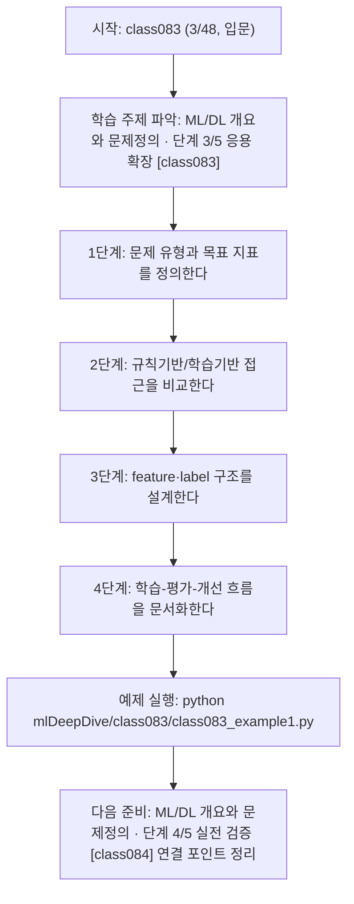
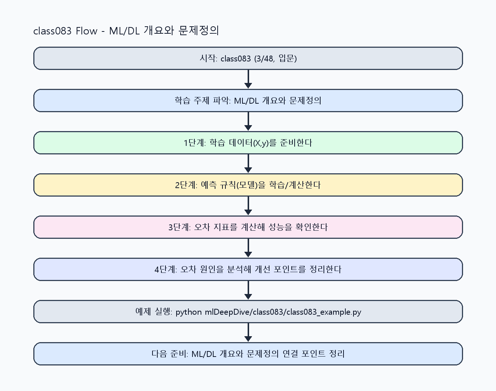

<!-- 이 파일은 www.edumgt.co.kr 의 에듀엠지티에 저작권이 있습니다 -->
# class083 자기주도 학습 가이드

## 1) 오늘의 학습 정보
- 교과목: **머신러닝과 딥러닝**
- 학습 주제: **ML/DL 개요와 문제정의 · 단계 3/5 응용 확장 [class083]**
- 세부 시퀀스: **3/48**
- 일정: **Day 11 / 3교시**
- 난이도: **입문**

### 교과목·학습주제 어휘 해설 (IT 강사 스타일)
#### 교과목 표현 분석: `머신러닝과 딥러닝`
- 문법 포인트: 명사와 명사를 대등하게 묶는 병렬 명사구 구조입니다.
- 기술 포인트: 모델 학습과 성능 평가를 통해 예측 시스템을 설계하는 교과목입니다.
| 용어 | 문법/품사 | 한글·한자 | 영어 | 기술 설명 |
| --- | --- | --- | --- | --- |
| `머신러닝` | 명사(외래어) | 머신러닝 (한자 없음) | machine learning | 데이터에서 패턴을 학습해 예측 규칙을 만드는 기술입니다. |
| `딥러닝` | 명사(외래어) | 딥러닝 (한자 없음) | deep learning | 다층 신경망으로 복잡한 패턴을 학습하는 머신러닝 하위 분야입니다. |

#### 학습주제 표현 분석: `ML/DL 개요와 문제정의 · 단계 3/5 응용 확장 [class083]`
- 문법 포인트: 명사와 명사를 대등하게 묶는 병렬 명사구 구조입니다.
- 기술 포인트: 이번 차시는 `ML/DL 개요와 문제정의` 핵심 개념을 코드 구현, 결과 해석, 점검 기준으로 연결합니다.
| 용어 | 문법/품사 | 한글·한자 | 영어 | 기술 설명 |
| --- | --- | --- | --- | --- |
| `ML` | 약어명사 | ML (한자 없음) | Machine Learning | 데이터 기반 학습으로 예측 규칙을 만드는 방법론입니다. |
| `DL` | 약어명사 | DL (한자 없음) | Deep Learning | 심층 신경망으로 표현학습을 수행하는 방법론입니다. |
| `문제 정의` | 명사구 | 문제 정의 (問題定義) | problem definition | 해결할 목표, 입력·출력, 성공 지표를 명확히 정해 모델/코드 방향을 고정하는 단계입니다. |
| `AI` | 영문 기술명/약어 | AI (한자 없음) | AI | 이번 차시 맥락: AI, 머신러닝, 딥러닝의 차이와 문제정의 방법을 정리하는 시작 차시입니다. 이를 기준으로 `AI`를 코드와 결과 해석에 연결합니다. |
| `규칙기반` | 명사(주제 핵심 용어) | 규칙기반 (한자 없음) | (topic-specific) | 이번 차시 맥락: 규칙기반 방식과 학습기반 방식의 차이를 이해해야 어떤 문제에 ML/DL을 적용할지 올바르게 판단할 수 있습니다. 이를 기준으로 `규칙기반`를 코드와 결과 해석에 연결합니다. |
| `학습기반` | 명사(주제 핵심 용어) | 학습기반 (한자 없음) | (topic-specific) | 이번 차시 맥락: 규칙기반 방식과 학습기반 방식의 차이를 이해해야 어떤 문제에 ML/DL을 적용할지 올바르게 판단할 수 있습니다. 이를 기준으로 `학습기반`를 코드와 결과 해석에 연결합니다. |

## 2) 이전에 배운 내용 (복습)
- 이전 차시: **class082 / ML/DL 개요와 문제정의 · 단계 2/5 기초 구현 [class082]** (Day 11 / 2교시)
- 복습 연결: 이전에 배운 **ML/DL 개요와 문제정의 · 단계 2/5 기초 구현 [class082]** 를 떠올리며, 오늘 **ML/DL 개요와 문제정의 · 단계 3/5 응용 확장 [class083]** 와 어떤 점이 이어지는지 비교해 보세요.

## 3) 주제를 아주 쉽게 이해하기
- 한 줄 설명: AI, 머신러닝, 딥러닝의 차이와 문제정의 방법을 정리하는 시작 차시입니다.
- 왜 배우나요?: 규칙기반 방식과 학습기반 방식의 차이를 이해해야 어떤 문제에 ML/DL을 적용할지 올바르게 판단할 수 있습니다.

### 핵심 개념 3가지
1. `AI/ML/DL`은 포함 관계이며 학습 데이터/특징(feature)/라벨(label)이 모델 성능을 좌우합니다.
2. `규칙기반`은 사람이 규칙을 직접 작성하고, `학습기반`은 데이터로 규칙을 학습합니다.
3. `모델 학습 흐름`은 문제 정의 -> 데이터 준비 -> 학습 -> 평가 -> 개선 순서로 진행됩니다.

### 비유로 이해하기
- 농구 슛 연습에서 '던진 거리와 결과'를 보고 감을 조절하는 것과 비슷해요.

## 4) 실습 환경 만들기 (항상 먼저)
아래 명령은 **처음 한 번** 준비해 두면 이후 학습이 쉬워집니다.

### Windows PowerShell
```powershell
cd C:\DevOps\Python-AI_Agent-Class
python -m venv .venv
.\.venv\Scripts\Activate.ps1
python -m pip install --upgrade pip
pip install -r requirements.txt
```

### Linux/macOS (bash)
```bash
cd /path/to/Python-AI_Agent-Class
python3 -m venv .venv
source .venv/bin/activate
python -m pip install --upgrade pip
pip install -r requirements.txt
```

## 5) 오늘의 예제 코드
- 예제 파일: `class083_example1.py`
- 실행 명령:
```bash
python mlDeepDive/class083/class083_example1.py
```

### example1~example5 단계별 테스트 확장
1. example1: AI/ML/DL 개념 차이와 데이터 구조(feature/label)를 확인한다.
2. example2: 규칙기반과 학습기반 접근을 비교한다.
3. example3: 문제정의 템플릿(입력/출력/지표)을 확장한다.
4. example4: 학습 흐름(데이터-학습-평가)을 시뮬레이션한다.
5. example5: 운영 점검(모델 버전/롤백 기준)까지 정리한다.

<!-- AUTO-GENERATED: TECH_STACK_FLOW START -->
### 기술 스택
- 언어: `Python 3`
- 실행: `CLI` (`python mlDeepDive/class083/class083_example1.py`)
- 주요 문법: `함수`, `리스트 컴프리헨션`, `오차 계산`, `출력(print)`
- 학습 포커스: `ML/DL 개요와 문제정의 · 단계 3/5 응용 확장 [class083]`

### 실습 example1.py 동작 원리 (Mermaid Flowchart)


### Flow PNG 캡처

<!-- AUTO-GENERATED: TECH_STACK_FLOW END -->

### 예제 코드를 볼 때 집중할 포인트
1. 문제정의가 예측/분류/군집 중 무엇인지 명확한지 확인하기
2. feature와 label 분리가 누락 없이 정의됐는지 점검하기
3. 규칙기반 대비 학습기반 장단점을 근거로 설명하는지 확인하기

## 6) 퀴즈로 복습하기 (10문항)
- 퀴즈 파일: `class083_quiz.html`
- 브라우저에서 열기:
```bash
mlDeepDive/class083/class083_quiz.html
```
- 버튼 설명:
1. `채점하기`: 현재 선택한 답으로 점수를 계산해요.
2. `다시풀기`: 선택을 모두 지우고 처음부터 다시 풀어요.

## 7) 혼자 실습 순서 (초등학생 버전)
1. 코드를 한 번 그대로 실행해요.
2. 숫자/문장 값을 1개 바꿔요.
3. 결과가 왜 바뀌었는지 한 줄로 적어요.
4. 함수를 1개 더 만들어 작은 기능을 추가해요.

### 실습 미션
1. 같은 문제를 규칙기반 방식과 학습기반 방식으로 각각 설명해 보세요.
2. 학습 데이터, feature, label을 분리해 표로 정리하세요.
3. ML/DL 학습 흐름을 단계별 체크리스트로 작성하세요.

## 8) 스스로 점검 체크리스트
- [ ] AI/ML/DL 차이를 예시와 함께 설명할 수 있다.
- [ ] feature와 label을 구분해 데이터 구조를 설계할 수 있다.
- [ ] 모델 학습 흐름을 단계별로 설명할 수 있다.

## 9) 막히면 이렇게 해결해요
1. 에러 메시지 마지막 줄을 먼저 읽어요.
2. 함수 이름과 괄호 짝을 확인해요.
3. `print()`를 넣어 중간 값을 확인해요.
4. 그래도 안 되면 어제 성공한 코드와 한 줄씩 비교해요.

## 10) 학습 후 다음에 배울 내용
- 다음 차시: **class084 / ML/DL 개요와 문제정의 · 단계 4/5 실전 검증 [class084]** (Day 11 / 4교시)
- 미리보기: 다음 차시 전에 **ML/DL 개요와 문제정의 · 단계 3/5 응용 확장 [class083]** 핵심 코드 1개를 다시 실행해 두면 ML/DL 개요와 문제정의 · 단계 4/5 실전 검증 [class084] 학습이 더 쉬워집니다.

## 11) 다음 차시 연결
- 다음 차시에서는 지도학습/비지도학습과 훈련·검증·테스트 분할을 본격적으로 다룹니다.
- 오늘 코드를 복사하지 말고, 직접 다시 작성해 보세요.
