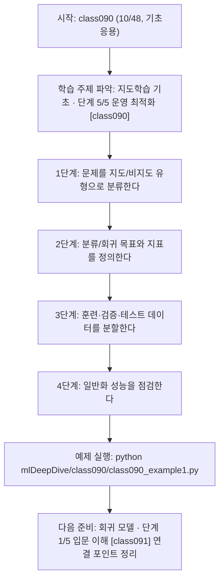
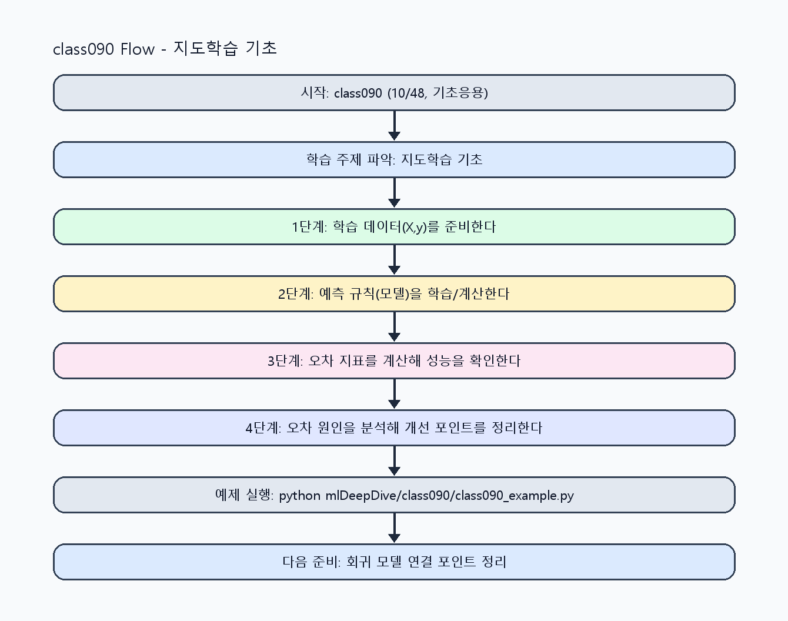

<!-- 이 파일은 www.edumgt.co.kr 의 에듀엠지티에 저작권이 있습니다 -->
# class090 자기주도 학습 가이드

## 1) 오늘의 학습 정보
- 교과목: **머신러닝과 딥러닝**
- 학습 주제: **지도학습 기초 · 단계 5/5 운영 최적화 [class090]**
- 세부 시퀀스: **10/48**
- 일정: **Day 12 / 2교시**
- 난이도: **기초응용**

### 교과목·학습주제 어휘 해설 (IT 강사 스타일)
#### 교과목 표현 분석: `머신러닝과 딥러닝`
- 문법 포인트: 명사와 명사를 대등하게 묶는 병렬 명사구 구조입니다.
- 기술 포인트: 모델 학습과 성능 평가를 통해 예측 시스템을 설계하는 교과목입니다.
| 용어 | 문법/품사 | 한글·한자 | 영어 | 기술 설명 |
| --- | --- | --- | --- | --- |
| `머신러닝` | 명사(외래어) | 머신러닝 (한자 없음) | machine learning | 데이터에서 패턴을 학습해 예측 규칙을 만드는 기술입니다. |
| `딥러닝` | 명사(외래어) | 딥러닝 (한자 없음) | deep learning | 다층 신경망으로 복잡한 패턴을 학습하는 머신러닝 하위 분야입니다. |

#### 학습주제 표현 분석: `지도학습 기초 · 단계 5/5 운영 최적화 [class090]`
- 문법 포인트: 핵심 개념 명사를 중심으로 한 명사구 구조입니다.
- 기술 포인트: 이번 차시는 `지도학습 기초 · 단계 5/5 운영 최적화 [class090]` 용어를 중심으로 문제 정의, 코드 구현, 결과 검증까지 연결합니다.
| 용어 | 문법/품사 | 한글·한자 | 영어 | 기술 설명 |
| --- | --- | --- | --- | --- |
| `지도학습` | 명사(기술 개념어) | 지도학습 (한자 없음) | (context-specific) | 용어 `지도학습`: 이번 학습주제에서 정의해야 할 핵심 개념 용어입니다. |
| `기초` | 명사(기술 개념어) | 기초 (한자 없음) | (context-specific) | 용어 `기초`: 이번 학습주제에서 정의해야 할 핵심 개념 용어입니다. |
| `단계` | 명사(기술 개념어) | 단계 (한자 없음) | (context-specific) | 용어 `단계`: 이번 학습주제에서 정의해야 할 핵심 개념 용어입니다. |
| `운영` | 명사(기술 개념어) | 운영 (한자 없음) | (context-specific) | 용어 `운영`: 이번 학습주제에서 정의해야 할 핵심 개념 용어입니다. |
| `최적화` | 명사(기술 개념어) | 최적화 (한자 없음) | (context-specific) | 용어 `최적화`: 이번 학습주제에서 정의해야 할 핵심 개념 용어입니다. |
| `class090` | 영문 기술명/약어 | class090 (한자 없음) | class090 | 용어 `class090`: 이번 차시에서 쓰이는 핵심 기술 용어입니다. |

## 2) 이전에 배운 내용 (복습)
- 이전 차시: **class089 / 지도학습 기초 · 단계 4/5 실전 검증 [class089]** (Day 12 / 1교시)
- 복습 연결: 이전에 배운 **지도학습 기초 · 단계 4/5 실전 검증 [class089]** 를 떠올리며, 오늘 **지도학습 기초 · 단계 5/5 운영 최적화 [class090]** 와 어떤 점이 이어지는지 비교해 보세요.

## 3) 주제를 아주 쉽게 이해하기
- 한 줄 설명: 지도학습과 비지도학습, 분류/회귀, 데이터 분할과 일반화 개념을 다루는 차시입니다.
- 왜 배우나요?: 훈련/검증/테스트를 분리하지 않으면 모델 성능을 과대평가하고 실서비스에서 실패할 가능성이 커집니다.

### 핵심 개념 3가지
1. `지도학습/비지도학습` 구분은 라벨 유무에 따라 결정됩니다.
2. `분류/회귀` 문제 유형에 따라 모델과 평가 지표가 달라집니다.
3. `과적합/일반화`를 이해하고 훈련·검증·테스트 분할을 유지해야 합니다.

### 비유로 이해하기
- 농구 슛 연습에서 '던진 거리와 결과'를 보고 감을 조절하는 것과 비슷해요.

## 4) 실습 환경 만들기 (항상 먼저)
아래 명령은 **처음 한 번** 준비해 두면 이후 학습이 쉬워집니다.

### Windows PowerShell
```powershell
cd C:\DevOps\Python-AI_Agent-Class
python -m venv .venv
.\.venv\Scripts\Activate.ps1
python -m pip install --upgrade pip
pip install -r requirements.txt
```

### Linux/macOS (bash)
```bash
cd /path/to/Python-AI_Agent-Class
python3 -m venv .venv
source .venv/bin/activate
python -m pip install --upgrade pip
pip install -r requirements.txt
```

## 5) 오늘의 예제 코드
- 예제 파일: `class090_example1.py`
- 실행 명령:
```bash
python mlDeepDive/class090/class090_example1.py
```

### example1~example5 단계별 테스트 확장
1. example1: 지도학습 기본 흐름을 실행한다.
2. example2: train/valid/test 분할을 적용한다.
3. example3: 비지도 학습(군집) 비교 케이스를 추가한다.
4. example4: 분류/회귀 문제를 구분해 실험한다.
5. example5: 과적합 신호를 점검한다.

<!-- AUTO-GENERATED: TECH_STACK_FLOW START -->
### 기술 스택
- 언어: `Python 3`
- 실행: `CLI` (`python mlDeepDive/class090/class090_example1.py`)
- 주요 문법: `함수`, `리스트 컴프리헨션`, `오차 계산`, `출력(print)`
- 학습 포커스: `지도학습 기초 · 단계 5/5 운영 최적화 [class090]`

### 실습 example1.py 동작 원리 (Mermaid Flowchart)


### Flow PNG 캡처

<!-- AUTO-GENERATED: TECH_STACK_FLOW END -->

### 예제 코드를 볼 때 집중할 포인트
1. 분할된 데이터가 누출(leakage) 없이 분리됐는지 확인하기
2. 문제 유형과 평가 지표가 일치하는지 점검하기
3. 훈련 성능과 검증 성능 차이를 함께 보는지 확인하기

## 6) 퀴즈로 복습하기 (10문항)
- 퀴즈 파일: `class090_quiz.html`
- 브라우저에서 열기:
```bash
mlDeepDive/class090/class090_quiz.html
```
- 버튼 설명:
1. `채점하기`: 현재 선택한 답으로 점수를 계산해요.
2. `다시풀기`: 선택을 모두 지우고 처음부터 다시 풀어요.

## 7) 혼자 실습 순서 (초등학생 버전)
1. 코드를 한 번 그대로 실행해요.
2. 숫자/문장 값을 1개 바꿔요.
3. 결과가 왜 바뀌었는지 한 줄로 적어요.
4. 함수를 1개 더 만들어 작은 기능을 추가해요.

### 실습 미션
1. 예시 문제를 지도학습/비지도학습으로 분류해 보세요.
2. 분류/회귀 문제를 각각 1개씩 정의하고 목표 지표를 정하세요.
3. train/valid/test 분할 비율을 바꿔 성능 차이를 기록하세요.

## 8) 스스로 점검 체크리스트
- [ ] 지도/비지도와 분류/회귀를 정확히 구분할 수 있다.
- [ ] 훈련/검증/테스트 데이터 분할 이유를 설명할 수 있다.
- [ ] 과적합 징후와 일반화 실패 신호를 식별할 수 있다.

## 9) 막히면 이렇게 해결해요
1. 에러 메시지 마지막 줄을 먼저 읽어요.
2. 함수 이름과 괄호 짝을 확인해요.
3. `print()`를 넣어 중간 값을 확인해요.
4. 그래도 안 되면 어제 성공한 코드와 한 줄씩 비교해요.

## 10) 학습 후 다음에 배울 내용
- 다음 차시: **class091 / 회귀 모델 · 단계 1/5 입문 이해 [class091]** (Day 12 / 3교시)
- 미리보기: 다음 차시 전에 **지도학습 기초 · 단계 5/5 운영 최적화 [class090]** 핵심 코드 1개를 다시 실행해 두면 회귀 모델 · 단계 1/5 입문 이해 [class091] 학습이 더 쉬워집니다.

## 11) 다음 차시 연결
- 다음 차시에서는 scikit-learn으로 기본 모델 학습과 예측 파이프라인을 실습합니다.
- 오늘 코드를 복사하지 말고, 직접 다시 작성해 보세요.
