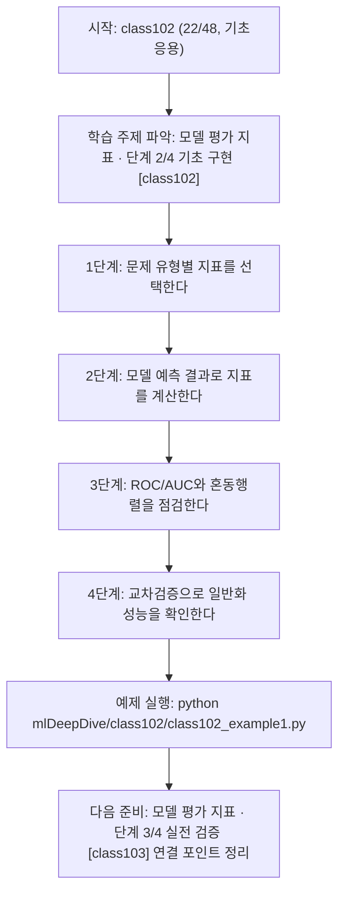
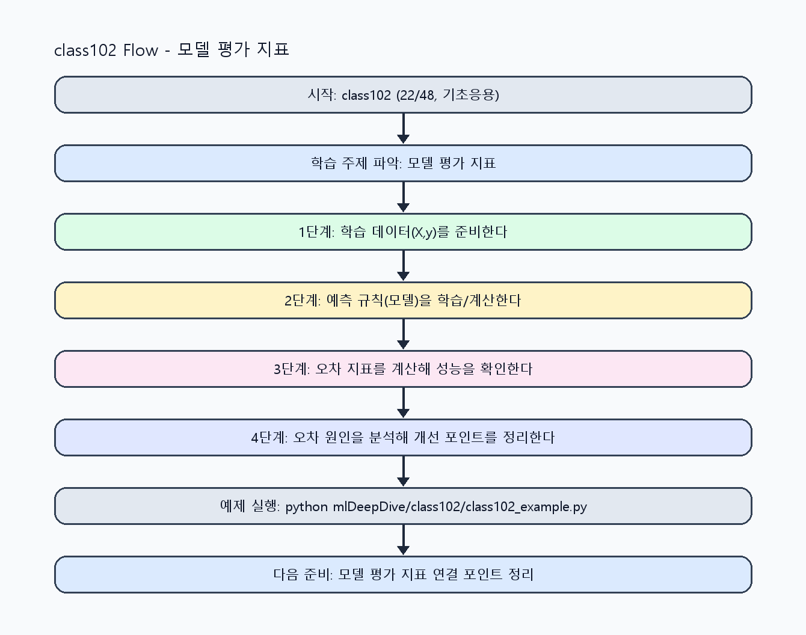

<!-- 이 파일은 www.edumgt.co.kr 의 에듀엠지티에 저작권이 있습니다 -->
# class102 자기주도 학습 가이드

## 1) 오늘의 학습 정보
- 교과목: **머신러닝과 딥러닝**
- 학습 주제: **모델 평가 지표 · 단계 2/4 기초 구현 [class102]**
- 세부 시퀀스: **22/48**
- 일정: **Day 13 / 6교시**
- 난이도: **기초응용**

### 교과목·학습주제 어휘 해설 (IT 강사 스타일)
#### 교과목 표현 분석: `머신러닝과 딥러닝`
- 문법 포인트: 명사와 명사를 대등하게 묶는 병렬 명사구 구조입니다.
- 기술 포인트: 모델 학습과 성능 평가를 통해 예측 시스템을 설계하는 교과목입니다.
| 용어 | 문법/품사 | 한글·한자 | 영어 | 기술 설명 |
| --- | --- | --- | --- | --- |
| `머신러닝` | 명사(외래어) | 머신러닝 (한자 없음) | machine learning | 데이터에서 패턴을 학습해 예측 규칙을 만드는 기술입니다. |
| `딥러닝` | 명사(외래어) | 딥러닝 (한자 없음) | deep learning | 다층 신경망으로 복잡한 패턴을 학습하는 머신러닝 하위 분야입니다. |

#### 학습주제 표현 분석: `모델 평가 지표 · 단계 2/4 기초 구현 [class102]`
- 문법 포인트: 핵심 개념 명사를 중심으로 한 명사구 구조입니다.
- 기술 포인트: 이번 차시는 `모델 평가 지표` 핵심 개념을 코드 구현, 결과 해석, 점검 기준으로 연결합니다.
| 용어 | 문법/품사 | 한글·한자 | 영어 | 기술 설명 |
| --- | --- | --- | --- | --- |
| `모델` | 명사(외래어) | 모델 (한자 없음) | model | 입력과 출력 관계를 수학적으로 근사한 계산 구조입니다. |
| `평가` | 명사 | 평가 (評價) | evaluation | 지표 기반으로 모델이나 결과물 품질을 측정하는 단계입니다. |
| `지표` | 명사 | 지표 (指標) | metric | 정확도, F1, MAE처럼 성능을 수치화하는 기준값입니다. |
| `회귀` | 명사 | 회귀 (回歸) | regression | 연속형 수치를 예측하는 지도학습 문제 유형입니다. |
| `분류` | 명사 | 분류 (分類) | classification | 입력을 사전 정의된 카테고리로 할당하는 지도학습 과제입니다. |
| `ROC` | 영문 기술명/약어 | ROC (한자 없음) | ROC | 이번 차시 맥락: 회귀/분류 평가 지표와 ROC/AUC, 교차검증 기초를 다루는 차시입니다. 이를 기준으로 `ROC`를 코드와 결과 해석에 연결합니다. |

## 2) 이전에 배운 내용 (복습)
- 이전 차시: **class101 / 모델 평가 지표 · 단계 1/4 입문 이해 [class101]** (Day 13 / 5교시)
- 복습 연결: 이전에 배운 **모델 평가 지표 · 단계 1/4 입문 이해 [class101]** 를 떠올리며, 오늘 **모델 평가 지표 · 단계 2/4 기초 구현 [class102]** 와 어떤 점이 이어지는지 비교해 보세요.

## 3) 주제를 아주 쉽게 이해하기
- 한 줄 설명: 회귀/분류 평가 지표와 ROC/AUC, 교차검증 기초를 다루는 차시입니다.
- 왜 배우나요?: 문제 유형별로 올바른 지표를 선택하지 않으면 모델 개선 방향을 잘못 잡게 됩니다.

### 핵심 개념 3가지
1. `회귀 평가`는 MAE, MSE, RMSE, R²를 함께 확인해야 합니다.
2. `분류 평가`는 Accuracy, Precision, Recall, F1-score, Confusion Matrix가 핵심입니다.
3. `ROC/AUC`와 `교차검증`은 일반화 성능을 안정적으로 추정하는 도구입니다.

### 비유로 이해하기
- 농구 슛 연습에서 '던진 거리와 결과'를 보고 감을 조절하는 것과 비슷해요.

## 4) 실습 환경 만들기 (항상 먼저)
아래 명령은 **처음 한 번** 준비해 두면 이후 학습이 쉬워집니다.

### Windows PowerShell
```powershell
cd C:\DevOps\Python-AI_Agent-Class
python -m venv .venv
.\.venv\Scripts\Activate.ps1
python -m pip install --upgrade pip
pip install -r requirements.txt
```

### Linux/macOS (bash)
```bash
cd /path/to/Python-AI_Agent-Class
python3 -m venv .venv
source .venv/bin/activate
python -m pip install --upgrade pip
pip install -r requirements.txt
```

## 5) 오늘의 예제 코드
- 예제 파일: `class102_example1.py`
- 실행 명령:
```bash
python mlDeepDive/class102/class102_example1.py
```

### example1~example5 단계별 테스트 확장
1. example1: 회귀/분류 기본 지표를 계산한다.
2. example2: Confusion Matrix와 ROC/AUC를 확인한다.
3. example3: 교차검증으로 일반화 성능을 점검한다.
4. example4: 지표 trade-off를 비교한다.
5. example5: 최종 지표 리포트를 자동화한다.

<!-- AUTO-GENERATED: TECH_STACK_FLOW START -->
### 기술 스택
- 언어: `Python 3`
- 실행: `CLI` (`python mlDeepDive/class102/class102_example1.py`)
- 주요 문법: `함수`, `리스트 컴프리헨션`, `오차 계산`, `출력(print)`
- 학습 포커스: `모델 평가 지표 · 단계 2/4 기초 구현 [class102]`

### 실습 example1.py 동작 원리 (Mermaid Flowchart)


### Flow PNG 캡처

<!-- AUTO-GENERATED: TECH_STACK_FLOW END -->

### 예제 코드를 볼 때 집중할 포인트
1. 지표 선택이 업무 목표와 일치하는지 확인하기
2. 교차검증 없이 단일 split 성능만 믿지 않는지 점검하기
3. 지표 간 trade-off를 설명할 수 있는지 확인하기

## 6) 퀴즈로 복습하기 (10문항)
- 퀴즈 파일: `class102_quiz.html`
- 브라우저에서 열기:
```bash
mlDeepDive/class102/class102_quiz.html
```
- 버튼 설명:
1. `채점하기`: 현재 선택한 답으로 점수를 계산해요.
2. `다시풀기`: 선택을 모두 지우고 처음부터 다시 풀어요.

## 7) 혼자 실습 순서 (초등학생 버전)
1. 코드를 한 번 그대로 실행해요.
2. 숫자/문장 값을 1개 바꿔요.
3. 결과가 왜 바뀌었는지 한 줄로 적어요.
4. 함수를 1개 더 만들어 작은 기능을 추가해요.

### 실습 미션
1. 회귀/분류 예제 각각에서 평가 지표를 계산하세요.
2. Confusion Matrix와 ROC/AUC를 함께 시각화하거나 기록하세요.
3. 교차검증(k-fold) 점수 평균과 편차를 비교하세요.

## 8) 스스로 점검 체크리스트
- [ ] 회귀/분류 지표를 상황에 맞게 선택할 수 있다.
- [ ] Confusion Matrix와 ROC/AUC 해석을 설명할 수 있다.
- [ ] 교차검증 결과로 과적합 가능성을 점검했다.

## 9) 막히면 이렇게 해결해요
1. 에러 메시지 마지막 줄을 먼저 읽어요.
2. 함수 이름과 괄호 짝을 확인해요.
3. `print()`를 넣어 중간 값을 확인해요.
4. 그래도 안 되면 어제 성공한 코드와 한 줄씩 비교해요.

## 10) 학습 후 다음에 배울 내용
- 다음 차시: **class103 / 모델 평가 지표 · 단계 3/4 실전 검증 [class103]** (Day 13 / 7교시)
- 미리보기: 다음 차시 전에 **모델 평가 지표 · 단계 2/4 기초 구현 [class102]** 핵심 코드 1개를 다시 실행해 두면 모델 평가 지표 · 단계 3/4 실전 검증 [class103] 학습이 더 쉬워집니다.

## 11) 다음 차시 연결
- 다음 차시에서는 특성공학과 하이퍼파라미터 튜닝으로 모델을 개선합니다.
- 오늘 코드를 복사하지 말고, 직접 다시 작성해 보세요.
