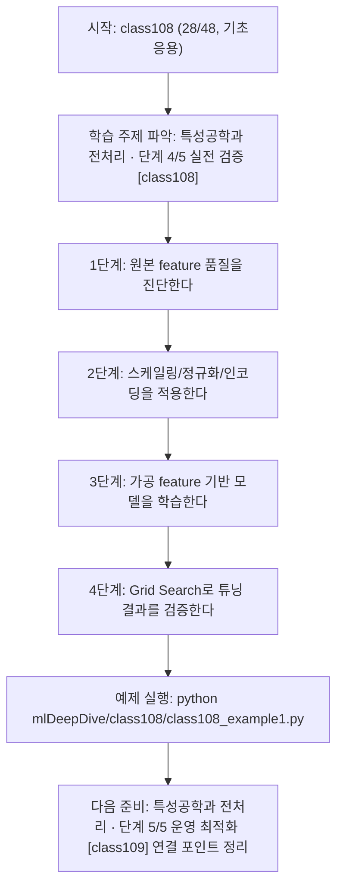
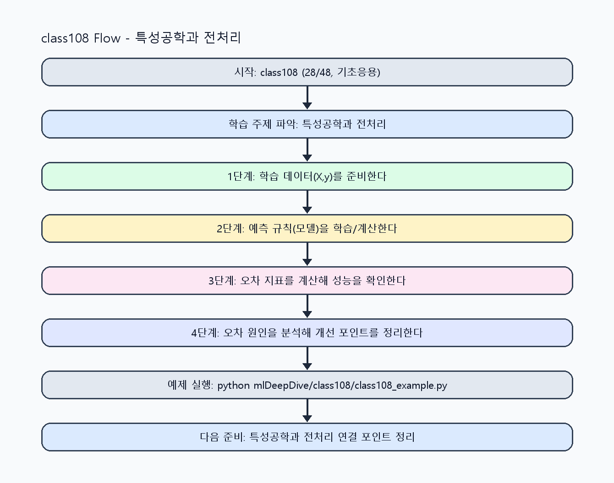

<!-- 이 파일은 www.edumgt.co.kr 의 에듀엠지티에 저작권이 있습니다 -->
# class108 자기주도 학습 가이드

## 1) 오늘의 학습 정보
- 교과목: **머신러닝과 딥러닝**
- 학습 주제: **특성공학과 전처리 · 단계 4/5 실전 검증 [class108]**
- 세부 시퀀스: **28/48**
- 일정: **Day 14 / 4교시**
- 난이도: **기초응용**

### 교과목·학습주제 어휘 해설 (IT 강사 스타일)
#### 교과목 표현 분석: `머신러닝과 딥러닝`
- 문법 포인트: 명사와 명사를 대등하게 묶는 병렬 명사구 구조입니다.
- 기술 포인트: 모델 학습과 성능 평가를 통해 예측 시스템을 설계하는 교과목입니다.
| 용어 | 문법/품사 | 한글·한자 | 영어 | 기술 설명 |
| --- | --- | --- | --- | --- |
| `머신러닝` | 명사(외래어) | 머신러닝 (한자 없음) | machine learning | 데이터에서 패턴을 학습해 예측 규칙을 만드는 기술입니다. |
| `딥러닝` | 명사(외래어) | 딥러닝 (한자 없음) | deep learning | 다층 신경망으로 복잡한 패턴을 학습하는 머신러닝 하위 분야입니다. |

#### 학습주제 표현 분석: `특성공학과 전처리 · 단계 4/5 실전 검증 [class108]`
- 문법 포인트: 명사와 명사를 대등하게 묶는 병렬 명사구 구조입니다.
- 기술 포인트: 이번 차시는 `특성공학과 전처리` 핵심 개념을 코드 구현, 결과 해석, 점검 기준으로 연결합니다.
| 용어 | 문법/품사 | 한글·한자 | 영어 | 기술 설명 |
| --- | --- | --- | --- | --- |
| `특성공학` | 명사 | 특성공학 (特性工學) | feature engineering | 모델 성능 향상을 위해 입력 특성을 설계·가공하는 작업입니다. |
| `전처리` | 명사 | 전처리 (前處理) | preprocessing | 원시 데이터를 모델이 다루기 쉬운 형태로 정리하는 단계입니다. |
| `Feature` | 영문 기술명/약어 | Feature (한자 없음) | Feature | 이번 차시 맥락: 좋은 feature와 일관된 전처리 없이는 복잡한 모델을 써도 성능 향상이 제한됩니다. 이를 기준으로 `Feature`를 코드와 결과 해석에 연결합니다. |
| `engineering` | 영문 기술명/약어 | engineering (한자 없음) | engineering | 이번 차시 맥락: `Feature engineering`은 문제에 맞는 정보 표현을 만드는 과정입니다. 이를 기준으로 `engineering`를 코드와 결과 해석에 연결합니다. |
| `스케일링` | 명사(주제 핵심 용어) | 스케일링 (한자 없음) | (topic-specific) | 이번 차시 맥락: 특성 공학과 전처리(스케일링·정규화·인코딩)로 모델 성능을 개선하는 차시입니다. 이를 기준으로 `스케일링`를 코드와 결과 해석에 연결합니다. |
| `정규화` | 명사(주제 핵심 용어) | 정규화 (한자 없음) | (topic-specific) | 이번 차시 맥락: 특성 공학과 전처리(스케일링·정규화·인코딩)로 모델 성능을 개선하는 차시입니다. 이를 기준으로 `정규화`를 코드와 결과 해석에 연결합니다. |

## 2) 이전에 배운 내용 (복습)
- 이전 차시: **class107 / 특성공학과 전처리 · 단계 3/5 응용 확장 [class107]** (Day 14 / 3교시)
- 복습 연결: 이전에 배운 **특성공학과 전처리 · 단계 3/5 응용 확장 [class107]** 를 떠올리며, 오늘 **특성공학과 전처리 · 단계 4/5 실전 검증 [class108]** 와 어떤 점이 이어지는지 비교해 보세요.

## 3) 주제를 아주 쉽게 이해하기
- 한 줄 설명: 특성 공학과 전처리(스케일링·정규화·인코딩)로 모델 성능을 개선하는 차시입니다.
- 왜 배우나요?: 좋은 feature와 일관된 전처리 없이는 복잡한 모델을 써도 성능 향상이 제한됩니다.

### 핵심 개념 3가지
1. `Feature engineering`은 문제에 맞는 정보 표현을 만드는 과정입니다.
2. `스케일링/정규화/인코딩`은 모델 입력 품질과 학습 안정성을 높입니다.
3. `하이퍼파라미터 튜닝`과 `Grid Search`는 성능 개선의 기본 루틴입니다.

### 비유로 이해하기
- 농구 슛 연습에서 '던진 거리와 결과'를 보고 감을 조절하는 것과 비슷해요.

## 4) 실습 환경 만들기 (항상 먼저)
아래 명령은 **처음 한 번** 준비해 두면 이후 학습이 쉬워집니다.

### Windows PowerShell
```powershell
cd C:\DevOps\Python-AI_Agent-Class
python -m venv .venv
.\.venv\Scripts\Activate.ps1
python -m pip install --upgrade pip
pip install -r requirements.txt
```

### Linux/macOS (bash)
```bash
cd /path/to/Python-AI_Agent-Class
python3 -m venv .venv
source .venv/bin/activate
python -m pip install --upgrade pip
pip install -r requirements.txt
```

## 5) 오늘의 예제 코드
- 예제 파일: `class108_example1.py`
- 실행 명령:
```bash
python mlDeepDive/class108/class108_example1.py
```

### example1~example5 단계별 테스트 확장
1. example1: baseline feature로 모델을 학습한다.
2. example2: 스케일링/정규화/인코딩을 적용한다.
3. example3: 파생 feature를 추가해 성능 변화를 확인한다.
4. example4: Pipeline으로 전처리와 모델을 결합한다.
5. example5: Grid Search로 튜닝 결과를 비교한다.

<!-- AUTO-GENERATED: TECH_STACK_FLOW START -->
### 기술 스택
- 언어: `Python 3`
- 실행: `CLI` (`python mlDeepDive/class108/class108_example1.py`)
- 주요 문법: `함수`, `리스트 컴프리헨션`, `오차 계산`, `출력(print)`
- 학습 포커스: `특성공학과 전처리 · 단계 4/5 실전 검증 [class108]`

### 실습 example1.py 동작 원리 (Mermaid Flowchart)


### Flow PNG 캡처

<!-- AUTO-GENERATED: TECH_STACK_FLOW END -->

### 예제 코드를 볼 때 집중할 포인트
1. 전처리 과정이 train/test 누출 없이 분리되는지 확인하기
2. feature 추가가 과적합을 유발하지 않는지 점검하기
3. 튜닝 결과를 baseline과 동일 조건에서 비교하는지 확인하기

## 6) 퀴즈로 복습하기 (10문항)
- 퀴즈 파일: `class108_quiz.html`
- 브라우저에서 열기:
```bash
mlDeepDive/class108/class108_quiz.html
```
- 버튼 설명:
1. `채점하기`: 현재 선택한 답으로 점수를 계산해요.
2. `다시풀기`: 선택을 모두 지우고 처음부터 다시 풀어요.

## 7) 혼자 실습 순서 (초등학생 버전)
1. 코드를 한 번 그대로 실행해요.
2. 숫자/문장 값을 1개 바꿔요.
3. 결과가 왜 바뀌었는지 한 줄로 적어요.
4. 함수를 1개 더 만들어 작은 기능을 추가해요.

### 실습 미션
1. 원본 feature와 가공 feature를 비교해 성능 변화를 확인하세요.
2. 스케일링/정규화/인코딩을 Pipeline에 연결해 학습하세요.
3. Grid Search로 기본 하이퍼파라미터를 탐색하세요.

## 8) 스스로 점검 체크리스트
- [ ] feature engineering 전후 성능 차이를 수치로 제시했다.
- [ ] 전처리와 모델을 Pipeline으로 연결해 재현성을 확보했다.
- [ ] Grid Search 결과(best params)를 기록했다.

## 9) 막히면 이렇게 해결해요
1. 에러 메시지 마지막 줄을 먼저 읽어요.
2. 함수 이름과 괄호 짝을 확인해요.
3. `print()`를 넣어 중간 값을 확인해요.
4. 그래도 안 되면 어제 성공한 코드와 한 줄씩 비교해요.

## 10) 학습 후 다음에 배울 내용
- 다음 차시: **class109 / 특성공학과 전처리 · 단계 5/5 운영 최적화 [class109]** (Day 14 / 5교시)
- 미리보기: 다음 차시 전에 **특성공학과 전처리 · 단계 4/5 실전 검증 [class108]** 핵심 코드 1개를 다시 실행해 두면 특성공학과 전처리 · 단계 5/5 운영 최적화 [class109] 학습이 더 쉬워집니다.

## 11) 다음 차시 연결
- 다음 차시에서는 과적합과 일반화 관점으로 튜닝 결과를 검증합니다.
- 오늘 코드를 복사하지 말고, 직접 다시 작성해 보세요.
