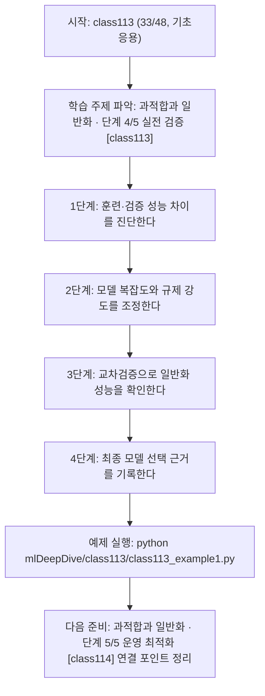
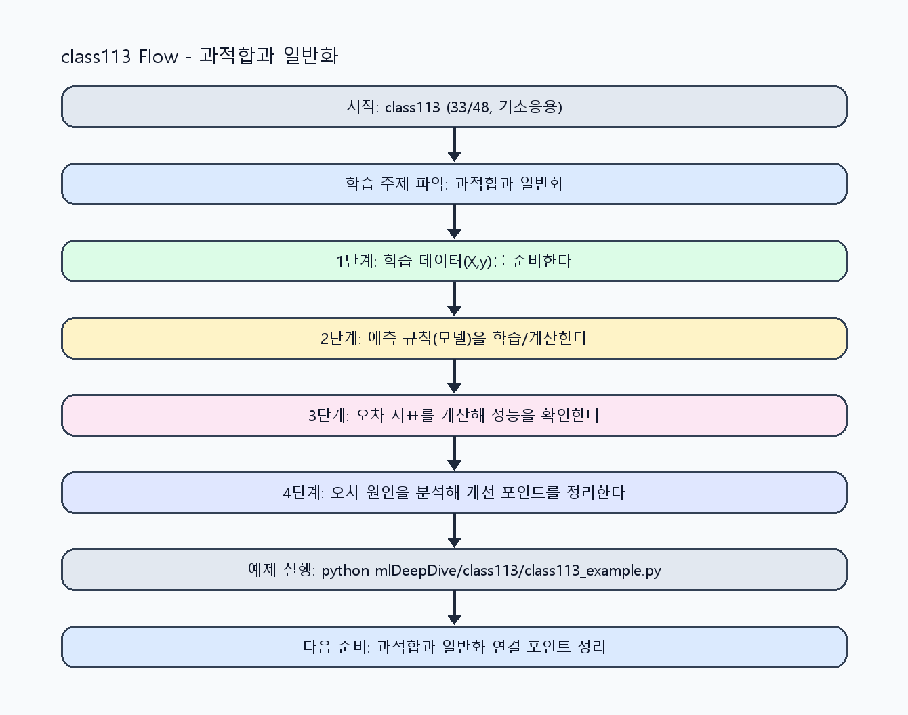

<!-- 이 파일은 www.edumgt.co.kr 의 에듀엠지티에 저작권이 있습니다 -->
# class113 자기주도 학습 가이드

## 1) 오늘의 학습 정보
- 교과목: **머신러닝과 딥러닝**
- 학습 주제: **과적합과 일반화 · 단계 4/5 실전 검증 [class113]**
- 세부 시퀀스: **33/48**
- 일정: **Day 15 / 1교시**
- 난이도: **기초응용**

### 교과목·학습주제 어휘 해설 (IT 강사 스타일)
#### 교과목 표현 분석: `머신러닝과 딥러닝`
- 문법 포인트: 명사와 명사를 대등하게 묶는 병렬 명사구 구조입니다.
- 기술 포인트: 모델 학습과 성능 평가를 통해 예측 시스템을 설계하는 교과목입니다.
| 용어 | 문법/품사 | 한글·한자 | 영어 | 기술 설명 |
| --- | --- | --- | --- | --- |
| `머신러닝` | 명사(외래어) | 머신러닝 (한자 없음) | machine learning | 데이터에서 패턴을 학습해 예측 규칙을 만드는 기술입니다. |
| `딥러닝` | 명사(외래어) | 딥러닝 (한자 없음) | deep learning | 다층 신경망으로 복잡한 패턴을 학습하는 머신러닝 하위 분야입니다. |

#### 학습주제 표현 분석: `과적합과 일반화 · 단계 4/5 실전 검증 [class113]`
- 문법 포인트: 명사와 명사를 대등하게 묶는 병렬 명사구 구조입니다.
- 기술 포인트: 이번 차시는 `과적합과 일반화 · 단계 4/5 실전 검증 [class113]` 용어를 중심으로 문제 정의, 코드 구현, 결과 검증까지 연결합니다.
| 용어 | 문법/품사 | 한글·한자 | 영어 | 기술 설명 |
| --- | --- | --- | --- | --- |
| `과적합` | 명사 | 과적합 (過適合) | overfitting | 학습 데이터에 과도하게 맞춰 일반화 성능이 떨어지는 현상입니다. |
| `일반화` | 명사 | 일반화 (一般化) | generalization | 보지 못한 데이터에서도 성능을 유지하는 모델 능력입니다. |
| `단계` | 명사(기술 개념어) | 단계 (한자 없음) | (context-specific) | 용어 `단계`: 이번 학습주제에서 정의해야 할 핵심 개념 용어입니다. |
| `실전` | 명사(기술 개념어) | 실전 (한자 없음) | (context-specific) | 용어 `실전`: 이번 학습주제에서 정의해야 할 핵심 개념 용어입니다. |
| `검증` | 명사 | 검증 (檢證) | validation | 결과가 요구사항과 기준을 만족하는지 확인하는 절차입니다. |
| `class113` | 영문 기술명/약어 | class113 (한자 없음) | class113 | 용어 `class113`: 이번 차시에서 쓰이는 핵심 기술 용어입니다. |

## 2) 이전에 배운 내용 (복습)
- 이전 차시: **class112 / 과적합과 일반화 · 단계 3/5 응용 확장 [class112]** (Day 14 / 8교시)
- 복습 연결: 이전에 배운 **과적합과 일반화 · 단계 3/5 응용 확장 [class112]** 를 떠올리며, 오늘 **과적합과 일반화 · 단계 4/5 실전 검증 [class113]** 와 어떤 점이 이어지는지 비교해 보세요.

## 3) 주제를 아주 쉽게 이해하기
- 한 줄 설명: 과적합 신호를 찾고 일반화 성능을 높이는 전략을 다루는 차시입니다.
- 왜 배우나요?: 훈련 성능만 높은 모델은 실제 운영 데이터에서 성능이 급격히 떨어질 수 있습니다.

### 핵심 개념 3가지
1. `과적합`은 훈련 데이터에 과도하게 맞춘 상태이며 일반화 실패를 유발합니다.
2. `일반화`는 보지 못한 데이터에서도 성능을 유지하는 능력입니다.
3. `검증 전략(교차검증/정규화/모델 단순화)`은 과적합 완화 핵심입니다.

### 비유로 이해하기
- 농구 슛 연습에서 '던진 거리와 결과'를 보고 감을 조절하는 것과 비슷해요.

## 4) 실습 환경 만들기 (항상 먼저)
아래 명령은 **처음 한 번** 준비해 두면 이후 학습이 쉬워집니다.

### Windows PowerShell
```powershell
cd C:\DevOps\Python-AI_Agent-Class
python -m venv .venv
.\.venv\Scripts\Activate.ps1
python -m pip install --upgrade pip
pip install -r requirements.txt
```

### Linux/macOS (bash)
```bash
cd /path/to/Python-AI_Agent-Class
python3 -m venv .venv
source .venv/bin/activate
python -m pip install --upgrade pip
pip install -r requirements.txt
```

## 5) 오늘의 예제 코드
- 예제 파일: `class113_example1.py`
- 실행 명령:
```bash
python mlDeepDive/class113/class113_example1.py
```

### example1~example5 단계별 테스트 확장
1. example1: baseline 모델의 train/test 성능을 비교한다.
2. example2: 모델 복잡도를 높여 과적합을 재현한다.
3. example3: 규제/검증 전략으로 일반화를 개선한다.
4. example4: 교차검증 결과를 비교한다.
5. example5: 최종 모델 선택 근거를 문서화한다.

<!-- AUTO-GENERATED: TECH_STACK_FLOW START -->
### 기술 스택
- 언어: `Python 3`
- 실행: `CLI` (`python mlDeepDive/class113/class113_example1.py`)
- 주요 문법: `함수`, `리스트 컴프리헨션`, `오차 계산`, `출력(print)`
- 학습 포커스: `과적합과 일반화 · 단계 4/5 실전 검증 [class113]`

### 실습 example1.py 동작 원리 (Mermaid Flowchart)


### Flow PNG 캡처

<!-- AUTO-GENERATED: TECH_STACK_FLOW END -->

### 예제 코드를 볼 때 집중할 포인트
1. 훈련 성능 향상이 검증 성능 악화로 이어지지 않는지 확인하기
2. 일반화 전략 적용 전후를 동일 지표로 비교하는지 점검하기
3. 최종 모델 선택 기준이 명확한지 확인하기

## 6) 퀴즈로 복습하기 (10문항)
- 퀴즈 파일: `class113_quiz.html`
- 브라우저에서 열기:
```bash
mlDeepDive/class113/class113_quiz.html
```
- 버튼 설명:
1. `채점하기`: 현재 선택한 답으로 점수를 계산해요.
2. `다시풀기`: 선택을 모두 지우고 처음부터 다시 풀어요.

## 7) 혼자 실습 순서 (초등학생 버전)
1. 코드를 한 번 그대로 실행해요.
2. 숫자/문장 값을 1개 바꿔요.
3. 결과가 왜 바뀌었는지 한 줄로 적어요.
4. 함수를 1개 더 만들어 작은 기능을 추가해요.

### 실습 미션
1. 훈련/검증 성능 곡선을 비교해 과적합 여부를 확인하세요.
2. 모델 복잡도(깊이/규제)를 바꿔 일반화 성능을 비교하세요.
3. 교차검증으로 분할 의존성을 줄여 보세요.

## 8) 스스로 점검 체크리스트
- [ ] 과적합 징후를 수치(훈련 vs 검증)로 설명할 수 있다.
- [ ] 일반화 성능 개선 전략 2개 이상을 적용했다.
- [ ] 검증 결과 기반으로 모델 선택 근거를 남겼다.

## 9) 막히면 이렇게 해결해요
1. 에러 메시지 마지막 줄을 먼저 읽어요.
2. 함수 이름과 괄호 짝을 확인해요.
3. `print()`를 넣어 중간 값을 확인해요.
4. 그래도 안 되면 어제 성공한 코드와 한 줄씩 비교해요.

## 10) 학습 후 다음에 배울 내용
- 다음 차시: **class114 / 과적합과 일반화 · 단계 5/5 운영 최적화 [class114]** (Day 15 / 2교시)
- 미리보기: 다음 차시 전에 **과적합과 일반화 · 단계 4/5 실전 검증 [class113]** 핵심 코드 1개를 다시 실행해 두면 과적합과 일반화 · 단계 5/5 운영 최적화 [class114] 학습이 더 쉬워집니다.

## 11) 다음 차시 연결
- 다음 차시에서는 신경망 기초와 딥러닝 프레임워크 실습으로 넘어갑니다.
- 오늘 코드를 복사하지 말고, 직접 다시 작성해 보세요.
