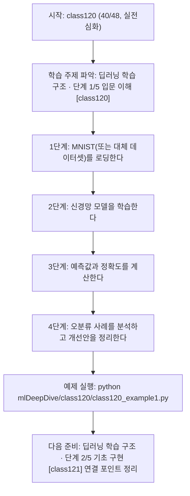
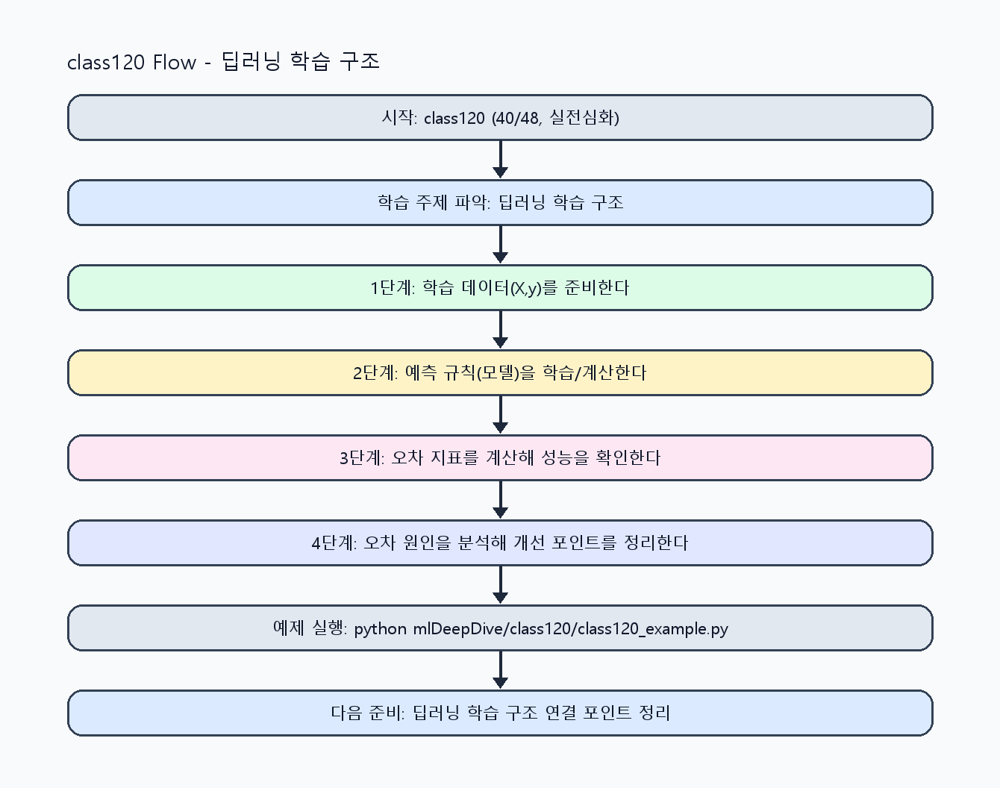

<!-- 이 파일은 www.edumgt.co.kr 의 에듀엠지티에 저작권이 있습니다 -->
# class120 자기주도 학습 가이드

## 1) 오늘의 학습 정보
- 교과목: **머신러닝과 딥러닝**
- 학습 주제: **딥러닝 학습 구조 · 단계 1/5 입문 이해 [class120]**
- 세부 시퀀스: **40/48**
- 일정: **Day 15 / 8교시**
- 난이도: **실전심화**

### 교과목·학습주제 어휘 해설 (IT 강사 스타일)
#### 교과목 표현 분석: `머신러닝과 딥러닝`
- 문법 포인트: 명사와 명사를 대등하게 묶는 병렬 명사구 구조입니다.
- 기술 포인트: 모델 학습과 성능 평가를 통해 예측 시스템을 설계하는 교과목입니다.
| 용어 | 문법/품사 | 한글·한자 | 영어 | 기술 설명 |
| --- | --- | --- | --- | --- |
| `머신러닝` | 명사(외래어) | 머신러닝 (한자 없음) | machine learning | 데이터에서 패턴을 학습해 예측 규칙을 만드는 기술입니다. |
| `딥러닝` | 명사(외래어) | 딥러닝 (한자 없음) | deep learning | 다층 신경망으로 복잡한 패턴을 학습하는 머신러닝 하위 분야입니다. |

#### 학습주제 표현 분석: `딥러닝 학습 구조 · 단계 1/5 입문 이해 [class120]`
- 문법 포인트: 핵심 개념 명사를 중심으로 한 명사구 구조입니다.
- 기술 포인트: 이번 차시는 `딥러닝 학습 구조` 핵심 개념을 코드 구현, 결과 해석, 점검 기준으로 연결합니다.
| 용어 | 문법/품사 | 한글·한자 | 영어 | 기술 설명 |
| --- | --- | --- | --- | --- |
| `딥러닝` | 명사(외래어) | 딥러닝 (한자 없음) | deep learning | 다층 신경망으로 복잡한 패턴을 학습하는 머신러닝 하위 분야입니다. |
| `학습` | 명사 | 학습 (學習) | training/learning | 데이터로부터 모델 파라미터를 조정하는 과정입니다. |
| `구조` | 명사(주제 핵심 용어) | 구조 (한자 없음) | (topic-specific) | `구조`는 `딥러닝 학습 구조` 주제에서 모델 성능과 일반화 결과를 판단할 때 기준이 되는 용어입니다. |
| `MNIST` | 영문 기술명/약어 | MNIST (한자 없음) | MNIST | 이번 차시 맥락: MNIST(가능 시) 기반 분류 실습으로 예측, 시각화, 오분류 분석을 수행하는 차시입니다. 이를 기준으로 `MNIST`를 코드와 결과 해석에 연결합니다. |
| `손글씨` | 명사(주제 핵심 용어) | 손글씨 (한자 없음) | (topic-specific) | 이번 차시 맥락: `MNIST 손글씨 분류`는 딥러닝 입문에서 가장 널리 쓰이는 기본 예제입니다. 이를 기준으로 `손글씨`를 코드와 결과 해석에 연결합니다. |
| `분류` | 명사 | 분류 (分類) | classification | 입력을 사전 정의된 카테고리로 할당하는 지도학습 과제입니다. |

## 2) 이전에 배운 내용 (복습)
- 이전 차시: **class119 / 신경망 기초 · 단계 5/5 운영 최적화 [class119]** (Day 15 / 7교시)
- 복습 연결: 이전에 배운 **신경망 기초 · 단계 5/5 운영 최적화 [class119]** 를 떠올리며, 오늘 **딥러닝 학습 구조 · 단계 1/5 입문 이해 [class120]** 와 어떤 점이 이어지는지 비교해 보세요.

## 3) 주제를 아주 쉽게 이해하기
- 한 줄 설명: MNIST(가능 시) 기반 분류 실습으로 예측, 시각화, 오분류 분석을 수행하는 차시입니다.
- 왜 배우나요?: 실제 이미지 분류 예제를 통해 학습 루프와 평가 결과를 실무형으로 연결할 수 있습니다.

### 핵심 개념 3가지
1. `MNIST 손글씨 분류`는 딥러닝 입문에서 가장 널리 쓰이는 기본 예제입니다.
2. `학습 루프`를 통해 epoch/batch/optimizer 설정이 성능에 미치는 영향을 관찰합니다.
3. `오분류 사례 분석`은 모델 개선 포인트를 찾는 핵심 단계입니다.

### 비유로 이해하기
- 농구 슛 연습에서 '던진 거리와 결과'를 보고 감을 조절하는 것과 비슷해요.

## 4) 실습 환경 만들기 (항상 먼저)
아래 명령은 **처음 한 번** 준비해 두면 이후 학습이 쉬워집니다.

### Windows PowerShell
```powershell
cd C:\DevOps\Python-AI_Agent-Class
python -m venv .venv
.\.venv\Scripts\Activate.ps1
python -m pip install --upgrade pip
pip install -r requirements.txt
```

### Linux/macOS (bash)
```bash
cd /path/to/Python-AI_Agent-Class
python3 -m venv .venv
source .venv/bin/activate
python -m pip install --upgrade pip
pip install -r requirements.txt
```

## 5) 오늘의 예제 코드
- 예제 파일: `class120_example1.py`
- 실행 명령:
```bash
python mlDeepDive/class120/class120_example1.py
```

### example1~example5 단계별 테스트 확장
1. example1: MNIST(또는 대체 digits) 분류 baseline을 학습한다.
2. example2: 학습 하이퍼파라미터를 바꿔 결과를 비교한다.
3. example3: 예측값 샘플과 정확도를 점검한다.
4. example4: 결과 시각화와 오분류 사례를 분석한다.
5. example5: 개선 포인트와 운영 체크리스트를 정리한다.

<!-- AUTO-GENERATED: TECH_STACK_FLOW START -->
### 기술 스택
- 언어: `Python 3`
- 실행: `CLI` (`python mlDeepDive/class120/class120_example1.py`)
- 주요 문법: `함수`, `리스트 컴프리헨션`, `오차 계산`, `출력(print)`
- 학습 포커스: `딥러닝 학습 구조 · 단계 1/5 입문 이해 [class120]`

### 실습 example1.py 동작 원리 (Mermaid Flowchart)


### Flow PNG 캡처

<!-- AUTO-GENERATED: TECH_STACK_FLOW END -->

### 예제 코드를 볼 때 집중할 포인트
1. 데이터셋 전처리(정규화/reshape)가 일관된지 확인하기
2. 예측 결과를 수치와 샘플 사례로 함께 점검하는지 확인하기
3. 오분류 원인을 데이터/모델 관점에서 구분하는지 점검하기

## 6) 퀴즈로 복습하기 (10문항)
- 퀴즈 파일: `class120_quiz.html`
- 브라우저에서 열기:
```bash
mlDeepDive/class120/class120_quiz.html
```
- 버튼 설명:
1. `채점하기`: 현재 선택한 답으로 점수를 계산해요.
2. `다시풀기`: 선택을 모두 지우고 처음부터 다시 풀어요.

## 7) 혼자 실습 순서 (초등학생 버전)
1. 코드를 한 번 그대로 실행해요.
2. 숫자/문장 값을 1개 바꿔요.
3. 결과가 왜 바뀌었는지 한 줄로 적어요.
4. 함수를 1개 더 만들어 작은 기능을 추가해요.

### 실습 미션
1. MNIST(또는 대체 digits) 데이터로 분류 모델을 학습하세요.
2. 예측 결과를 시각화하고 정확도를 확인하세요.
3. 오분류 사례를 최소 3건 이상 추출해 원인을 기록하세요.

## 8) 스스로 점검 체크리스트
- [ ] 기본 분류 모델 학습과 예측 실행을 완료했다.
- [ ] 결과 시각화와 예측값 확인 과정을 재현했다.
- [ ] 오분류 사례를 분석해 개선 아이디어를 제시했다.

## 9) 막히면 이렇게 해결해요
1. 에러 메시지 마지막 줄을 먼저 읽어요.
2. 함수 이름과 괄호 짝을 확인해요.
3. `print()`를 넣어 중간 값을 확인해요.
4. 그래도 안 되면 어제 성공한 코드와 한 줄씩 비교해요.

## 10) 학습 후 다음에 배울 내용
- 다음 차시: **class121 / 딥러닝 학습 구조 · 단계 2/5 기초 구현 [class121]** (Day 16 / 1교시)
- 미리보기: 다음 차시 전에 **딥러닝 학습 구조 · 단계 1/5 입문 이해 [class120]** 핵심 코드 1개를 다시 실행해 두면 딥러닝 학습 구조 · 단계 2/5 기초 구현 [class121] 학습이 더 쉬워집니다.

## 11) 다음 차시 연결
- 다음 차시에서는 모델 운영 관점의 통합 실습으로 연결됩니다.
- 오늘 코드를 복사하지 말고, 직접 다시 작성해 보세요.
