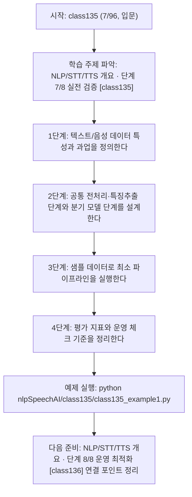
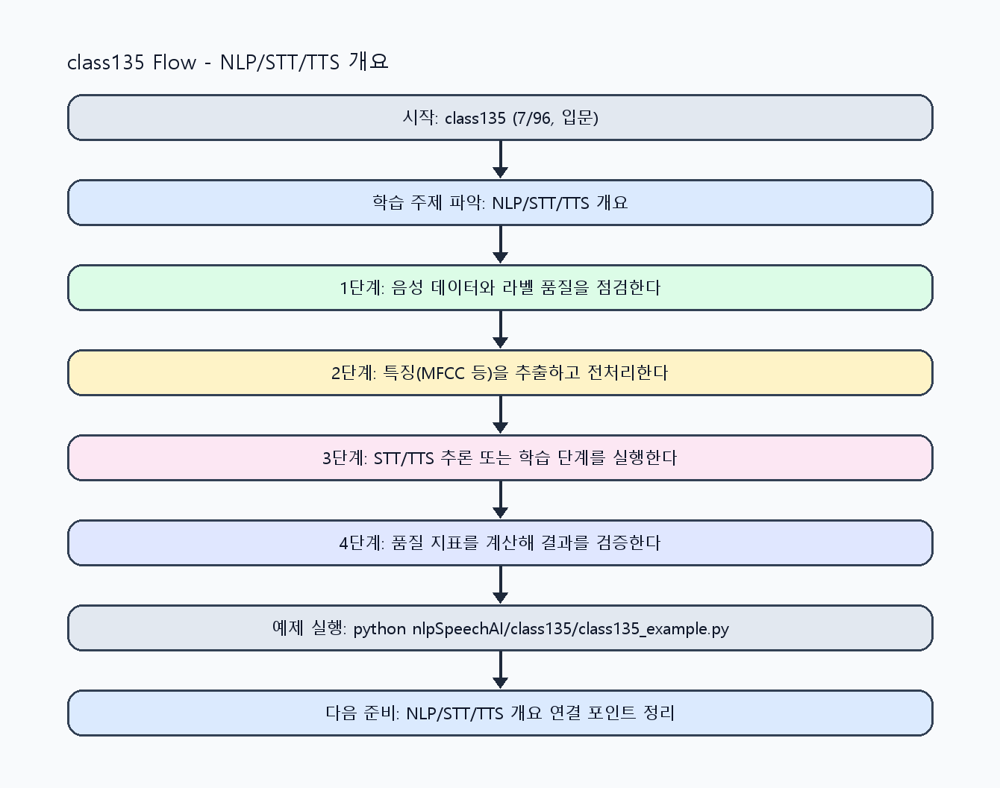

<!-- 이 파일은 www.edumgt.co.kr 의 에듀엠지티에 저작권이 있습니다 -->
# class135 자기주도 학습 가이드

## 1) 오늘의 학습 정보
- 교과목: **자연어 및 음성 데이터 활용 및 모델 개발**
- 학습 주제: **NLP/STT/TTS 개요 · 단계 7/8 실전 검증 [class135]**
- 세부 시퀀스: **7/96**
- 일정: **Day 17 / 7교시**
- 난이도: **입문**

### 교과목·학습주제 어휘 해설 (IT 강사 스타일)
#### 교과목 표현 분석: `자연어 및 음성 데이터 활용 및 모델 개발`
- 문법 포인트: 명사구를 연결어 '및'으로 병렬 연결한 구조입니다. 동등한 학습 범위를 함께 제시합니다.
- 기술 포인트: 음성 신호를 정제하고 STT/TTS 모델로 연결하는 음성 AI 교과목입니다.
| 용어 | 문법/품사 | 한글·한자 | 영어 | 기술 설명 |
| --- | --- | --- | --- | --- |
| `자연어` | 명사 | 자연어 (自然語) | natural language | 사람이 일상에서 사용하는 언어 텍스트/발화를 의미합니다. |
| `음성` | 명사 | 음성 (音聲) | speech/audio | 사람의 발화 신호를 디지털로 표현한 데이터입니다. |
| `데이터` | 명사(외래어) | 데이터 (한자 없음) | data | 분석, 학습, 추론의 입력이 되는 관측값 집합입니다. |
| `활용` | 명사/동사 어근 | 활용 (活用) | utilization | 이론이나 도구를 실제 문제 해결 맥락에 적용하는 행위입니다. |
| `모델` | 명사(외래어) | 모델 (한자 없음) | model | 입력과 출력 관계를 수학적으로 근사한 계산 구조입니다. |
| `개발` | 명사 | 개발 (開發) | development | 기능 기획, 구현, 검증을 통해 소프트웨어를 완성하는 과정입니다. |

#### 학습주제 표현 분석: `NLP/STT/TTS 개요 · 단계 7/8 실전 검증 [class135]`
- 문법 포인트: 핵심 개념 명사를 중심으로 한 명사구 구조입니다.
- 기술 포인트: 이번 차시는 `NLP/STT/TTS 개요 · 단계 7/8 실전 검증 [class135]` 용어를 중심으로 문제 정의, 코드 구현, 결과 검증까지 연결합니다.
| 용어 | 문법/품사 | 한글·한자 | 영어 | 기술 설명 |
| --- | --- | --- | --- | --- |
| `NLP` | 약어명사 | NLP (한자 없음) | Natural Language Processing | 자연어를 분석·이해·생성하는 인공지능 분야입니다. |
| `STT` | 약어명사 | STT (한자 없음) | Speech-to-Text | 음성 신호를 텍스트로 변환하는 기술입니다. |
| `TTS` | 약어명사 | TTS (한자 없음) | Text-to-Speech | 텍스트를 자연스러운 음성으로 합성하는 기술입니다. |
| `개요` | 명사(기술 개념어) | 개요 (한자 없음) | (context-specific) | 용어 `개요`: 이번 학습주제에서 정의해야 할 핵심 개념 용어입니다. |
| `단계` | 명사(기술 개념어) | 단계 (한자 없음) | (context-specific) | 용어 `단계`: 이번 학습주제에서 정의해야 할 핵심 개념 용어입니다. |
| `실전` | 명사(기술 개념어) | 실전 (한자 없음) | (context-specific) | 용어 `실전`: 이번 학습주제에서 정의해야 할 핵심 개념 용어입니다. |

## 2) 이전에 배운 내용 (복습)
- 이전 차시: **class134 / NLP/STT/TTS 개요 · 단계 6/8 실전 검증 [class134]** (Day 17 / 6교시)
- 복습 연결: 이전에 배운 **NLP/STT/TTS 개요 · 단계 6/8 실전 검증 [class134]** 를 떠올리며, 오늘 **NLP/STT/TTS 개요 · 단계 7/8 실전 검증 [class135]** 와 어떤 점이 이어지는지 비교해 보세요.

## 3) 주제를 아주 쉽게 이해하기
- 한 줄 설명: 자연어·음성 데이터 특성과 NLP/STT/TTS 전체 개발 흐름을 한 번에 정리하는 시작 차시입니다.
- 왜 배우나요?: 텍스트와 음성의 데이터 특성을 동시에 이해해야 실제 AI 응용 프로젝트에서 파이프라인을 끊김 없이 설계할 수 있습니다.

### 핵심 개념 3가지
1. `NLP`는 텍스트 이해/분석/생성을 다루고, `STT/TTS`는 음성과 텍스트를 상호 변환하는 기술입니다.
2. `학습 데이터-전처리-특징추출-모델학습-평가-배포` 흐름이 NLP/Speech 공통 개발 사이클입니다.
3. `데이터 품질`(라벨 정확도·잡음·누락)은 모델 품질과 운영 안정성에 직접 영향을 줍니다.

### 비유로 이해하기
- 노래 경연 점수를 매길 때 음정, 박자, 발음을 항목별로 보는 것과 비슷해요.

## 4) 실습 환경 만들기 (항상 먼저)
아래 명령은 **처음 한 번** 준비해 두면 이후 학습이 쉬워집니다.

### Windows PowerShell
```powershell
cd C:\DevOps\Python-AI_Agent-Class
python -m venv .venv
.\.venv\Scripts\Activate.ps1
python -m pip install --upgrade pip
pip install -r requirements.txt
```

### Linux/macOS (bash)
```bash
cd /path/to/Python-AI_Agent-Class
python3 -m venv .venv
source .venv/bin/activate
python -m pip install --upgrade pip
pip install -r requirements.txt
```

## 5) 오늘의 예제 코드
- 예제 파일: `class135_example1.py`
- 실행 명령:
```bash
python nlpSpeechAI/class135/class135_example1.py
```

### example1~example5 단계별 테스트 확장
1. example1: NLP/STT/TTS 전체 흐름과 데이터 입력 구조를 확인한다.
2. example2: 텍스트/음성 데이터 유형별 차이를 비교한다.
3. example3: 품질 이슈(잡음/누락/라벨 오류) 케이스를 점검한다.
4. example4: 통합 파이프라인(전처리-특징-모델) 연결을 검증한다.
5. example5: 운영 기준(지연/정확도/복구) 체크리스트를 정리한다.

<!-- AUTO-GENERATED: TECH_STACK_FLOW START -->
### 기술 스택
- 언어: `Python 3`
- 실행: `CLI` (`python nlpSpeechAI/class135/class135_example1.py`)
- 주요 문법: `텍스트 토큰 처리`, `오디오 메타데이터(dict)`, `파이프라인 함수 분리`, `리포트 출력(print)`
- 학습 포커스: `NLP/STT/TTS 개요 · 단계 7/8 실전 검증 [class135]`

### 실습 example1.py 동작 원리 (Mermaid Flowchart)


### Flow PNG 캡처

<!-- AUTO-GENERATED: TECH_STACK_FLOW END -->

### 예제 코드를 볼 때 집중할 포인트
1. 텍스트와 음성 입력 스키마가 명확히 분리됐는지 확인하기
2. 전처리 단계와 모델 단계가 함수 경계로 분리되는지 점검하기
3. 서비스 구조에서 데이터 품질 검증 지점이 포함됐는지 확인하기

## 6) 퀴즈로 복습하기 (10문항)
- 퀴즈 파일: `class135_quiz.html`
- 브라우저에서 열기:
```bash
nlpSpeechAI/class135/class135_quiz.html
```
- 버튼 설명:
1. `채점하기`: 현재 선택한 답으로 점수를 계산해요.
2. `다시풀기`: 선택을 모두 지우고 처음부터 다시 풀어요.

## 7) 혼자 실습 순서 (초등학생 버전)
1. 코드를 한 번 그대로 실행해요.
2. 숫자/문장 값을 1개 바꿔요.
3. 결과가 왜 바뀌었는지 한 줄로 적어요.
4. 함수를 1개 더 만들어 작은 기능을 추가해요.

### 실습 미션
1. 텍스트 파이프라인과 음성 파이프라인의 입력/출력 단계를 표로 비교하세요.
2. STT, TTS, 텍스트 분류 각 태스크의 입력 데이터와 평가 지표를 정의하세요.
3. 전체 서비스 흐름(수집-전처리-모델-API)을 다이어그램으로 정리하세요.

## 8) 스스로 점검 체크리스트
- [ ] NLP/STT/TTS 차이와 연결 지점을 설명할 수 있다.
- [ ] 데이터 전처리와 모델 평가 단계가 어떻게 연결되는지 설명할 수 있다.
- [ ] AI 서비스 구현을 위한 최소 파이프라인을 순서대로 제시할 수 있다.

## 9) 막히면 이렇게 해결해요
1. 에러 메시지 마지막 줄을 먼저 읽어요.
2. 함수 이름과 괄호 짝을 확인해요.
3. `print()`를 넣어 중간 값을 확인해요.
4. 그래도 안 되면 어제 성공한 코드와 한 줄씩 비교해요.

## 10) 학습 후 다음에 배울 내용
- 다음 차시: **class136 / NLP/STT/TTS 개요 · 단계 8/8 운영 최적화 [class136]** (Day 17 / 8교시)
- 미리보기: 다음 차시 전에 **NLP/STT/TTS 개요 · 단계 7/8 실전 검증 [class135]** 핵심 코드 1개를 다시 실행해 두면 NLP/STT/TTS 개요 · 단계 8/8 운영 최적화 [class136] 학습이 더 쉬워집니다.

## 11) 다음 차시 연결
- 다음 차시에서는 텍스트 데이터 유형과 품질 이슈를 더 세밀하게 다룹니다.
- 오늘 코드를 복사하지 말고, 직접 다시 작성해 보세요.
