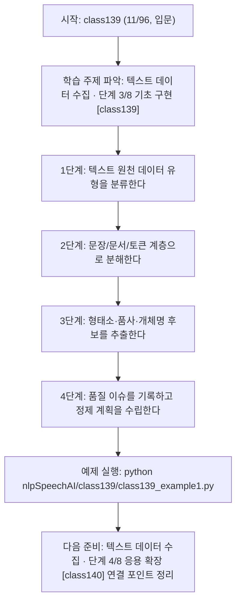
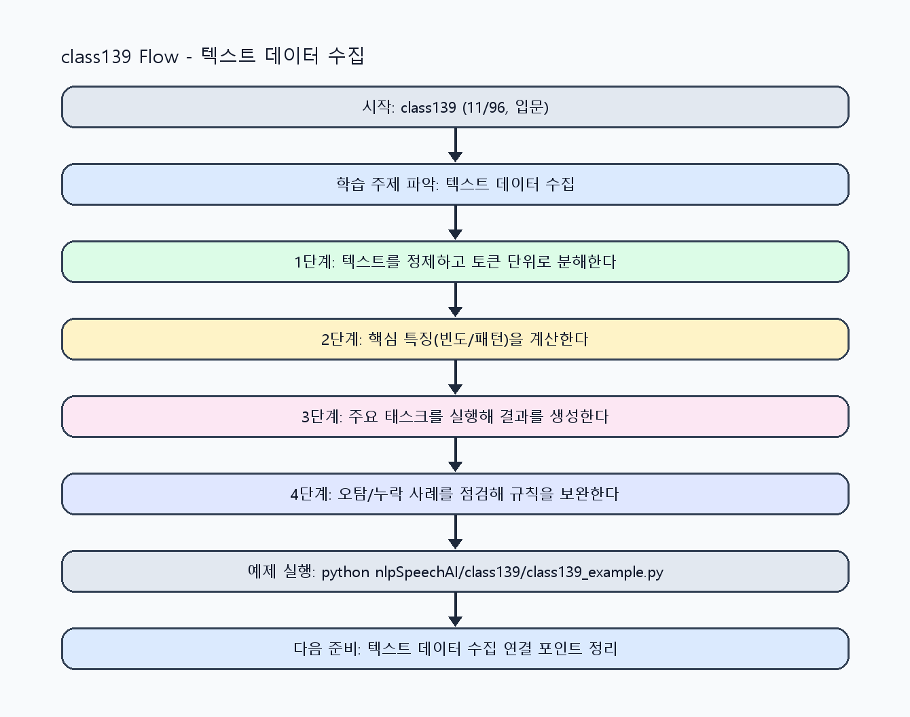

<!-- 이 파일은 www.edumgt.co.kr 의 에듀엠지티에 저작권이 있습니다 -->
# class139 자기주도 학습 가이드

## 1) 오늘의 학습 정보
- 교과목: **자연어 및 음성 데이터 활용 및 모델 개발**
- 학습 주제: **텍스트 데이터 수집 · 단계 3/8 기초 구현 [class139]**
- 세부 시퀀스: **11/96**
- 일정: **Day 18 / 3교시**
- 난이도: **입문**

### 교과목·학습주제 어휘 해설 (IT 강사 스타일)
#### 교과목 표현 분석: `자연어 및 음성 데이터 활용 및 모델 개발`
- 문법 포인트: 명사구를 연결어 '및'으로 병렬 연결한 구조입니다. 동등한 학습 범위를 함께 제시합니다.
- 기술 포인트: 텍스트를 계산 가능한 단위로 바꿔 의미를 다루는 자연어 처리 교과목입니다.
| 용어 | 문법/품사 | 한글·한자 | 영어 | 기술 설명 |
| --- | --- | --- | --- | --- |
| `자연어` | 명사 | 자연어 (自然語) | natural language | 사람이 일상에서 사용하는 언어 텍스트/발화를 의미합니다. |
| `음성` | 명사 | 음성 (音聲) | speech/audio | 사람의 발화 신호를 디지털로 표현한 데이터입니다. |
| `데이터` | 명사(외래어) | 데이터 (한자 없음) | data | 분석, 학습, 추론의 입력이 되는 관측값 집합입니다. |
| `활용` | 명사/동사 어근 | 활용 (活用) | utilization | 이론이나 도구를 실제 문제 해결 맥락에 적용하는 행위입니다. |
| `모델` | 명사(외래어) | 모델 (한자 없음) | model | 입력과 출력 관계를 수학적으로 근사한 계산 구조입니다. |
| `개발` | 명사 | 개발 (開發) | development | 기능 기획, 구현, 검증을 통해 소프트웨어를 완성하는 과정입니다. |

#### 학습주제 표현 분석: `텍스트 데이터 수집 · 단계 3/8 기초 구현 [class139]`
- 문법 포인트: 핵심 개념 명사를 중심으로 한 명사구 구조입니다.
- 기술 포인트: 이번 차시는 `텍스트 데이터 수집 · 단계 3/8 기초 구현 [class139]` 용어를 중심으로 문제 정의, 코드 구현, 결과 검증까지 연결합니다.
| 용어 | 문법/품사 | 한글·한자 | 영어 | 기술 설명 |
| --- | --- | --- | --- | --- |
| `텍스트` | 명사(기술 개념어) | 텍스트 (한자 없음) | (context-specific) | 용어 `텍스트`: 이번 학습주제에서 정의해야 할 핵심 개념 용어입니다. |
| `데이터` | 명사(외래어) | 데이터 (한자 없음) | data | 분석, 학습, 추론의 입력이 되는 관측값 집합입니다. |
| `수집` | 명사(기술 개념어) | 수집 (한자 없음) | (context-specific) | 용어 `수집`: 이번 학습주제에서 정의해야 할 핵심 개념 용어입니다. |
| `단계` | 명사(기술 개념어) | 단계 (한자 없음) | (context-specific) | 용어 `단계`: 이번 학습주제에서 정의해야 할 핵심 개념 용어입니다. |
| `기초` | 명사(기술 개념어) | 기초 (한자 없음) | (context-specific) | 용어 `기초`: 이번 학습주제에서 정의해야 할 핵심 개념 용어입니다. |
| `구현` | 명사 | 구현 (具現) | implementation | 설계를 실제 코드와 시스템 동작으로 구체화하는 과정입니다. |

## 2) 이전에 배운 내용 (복습)
- 이전 차시: **class138 / 텍스트 데이터 수집 · 단계 2/8 기초 구현 [class138]** (Day 18 / 2교시)
- 복습 연결: 이전에 배운 **텍스트 데이터 수집 · 단계 2/8 기초 구현 [class138]** 를 떠올리며, 오늘 **텍스트 데이터 수집 · 단계 3/8 기초 구현 [class139]** 와 어떤 점이 이어지는지 비교해 보세요.

## 3) 주제를 아주 쉽게 이해하기
- 한 줄 설명: 문장·문서·토큰 단위와 텍스트 데이터 유형을 분리해 NLP 입력 구조를 이해하는 차시입니다.
- 왜 배우나요?: 텍스트 타입(뉴스/리뷰/대화)과 품질 이슈를 구분하지 않으면 형태소/품사/개체명 분석 결과 해석이 흔들립니다.

### 핵심 개념 3가지
1. `문장(sentence)`, `문서(document)`, `토큰(token)`은 NLP 처리 단위의 기본 계층입니다.
2. `형태소·품사·개체명` 정보는 분류·검색·추출 과업에서 핵심 특징으로 사용됩니다.
3. `품질 이슈`(중복, 노이즈, 라벨 오류, 빈 문장)는 데이터 수집 단계에서 먼저 관리해야 합니다.

### 비유로 이해하기
- 긴 문장을 단어 카드로 잘라서 분류하는 놀이와 같아요.

## 4) 실습 환경 만들기 (항상 먼저)
아래 명령은 **처음 한 번** 준비해 두면 이후 학습이 쉬워집니다.

### Windows PowerShell
```powershell
cd C:\DevOps\Python-AI_Agent-Class
python -m venv .venv
.\.venv\Scripts\Activate.ps1
python -m pip install --upgrade pip
pip install -r requirements.txt
```

### Linux/macOS (bash)
```bash
cd /path/to/Python-AI_Agent-Class
python3 -m venv .venv
source .venv/bin/activate
python -m pip install --upgrade pip
pip install -r requirements.txt
```

## 5) 오늘의 예제 코드
- 예제 파일: `class139_example1.py`
- 실행 명령:
```bash
python nlpSpeechAI/class139/class139_example1.py
```

### example1~example5 단계별 테스트 확장
1. example1: 문장/문서/토큰 단위를 분리해 기본 구조를 확인한다.
2. example2: 텍스트 데이터 유형(뉴스/리뷰/대화)을 확장해 비교한다.
3. example3: 형태소/품사/개체명 규칙 기반 태깅을 점검한다.
4. example4: 품질 이슈(중복/빈문장/노이즈) 탐지 규칙을 강화한다.
5. example5: 수집-검증-정제 기준을 운영 체크리스트로 문서화한다.

<!-- AUTO-GENERATED: TECH_STACK_FLOW START -->
### 기술 스택
- 언어: `Python 3`
- 실행: `CLI` (`python nlpSpeechAI/class139/class139_example1.py`)
- 주요 문법: `문자열 정규식`, `문장 분리`, `토큰 리스트`, `품질 검증 조건문`
- 학습 포커스: `텍스트 데이터 수집 · 단계 3/8 기초 구현 [class139]`

### 실습 example1.py 동작 원리 (Mermaid Flowchart)


### Flow PNG 캡처

<!-- AUTO-GENERATED: TECH_STACK_FLOW END -->

### 예제 코드를 볼 때 집중할 포인트
1. 텍스트 단위(문장/문서/토큰) 분해 기준이 일관적인지 확인하기
2. 형태소·품사·개체명 태깅 기준이 명시됐는지 점검하기
3. 수집 단계 품질 이슈 로그가 누락 없이 남는지 확인하기

## 6) 퀴즈로 복습하기 (10문항)
- 퀴즈 파일: `class139_quiz.html`
- 브라우저에서 열기:
```bash
nlpSpeechAI/class139/class139_quiz.html
```
- 버튼 설명:
1. `채점하기`: 현재 선택한 답으로 점수를 계산해요.
2. `다시풀기`: 선택을 모두 지우고 처음부터 다시 풀어요.

## 7) 혼자 실습 순서 (초등학생 버전)
1. 코드를 한 번 그대로 실행해요.
2. 숫자/문장 값을 1개 바꿔요.
3. 결과가 왜 바뀌었는지 한 줄로 적어요.
4. 함수를 1개 더 만들어 작은 기능을 추가해요.

### 실습 미션
1. 뉴스/리뷰/대화 샘플을 문장·문서·토큰 단위로 분해해 보세요.
2. 형태소/품사/개체명 후보를 규칙 기반으로 태깅해 보세요.
3. 텍스트 품질 이슈(빈값/중복/기호 잡음)를 탐지하는 검증 규칙을 작성하세요.

## 8) 스스로 점검 체크리스트
- [ ] 텍스트 데이터 종류와 처리 목적을 매핑할 수 있다.
- [ ] 문장/문서/토큰 구조를 코드 결과로 확인했다.
- [ ] 품질 이슈를 최소 2가지 이상 탐지하고 분류했다.

## 9) 막히면 이렇게 해결해요
1. 에러 메시지 마지막 줄을 먼저 읽어요.
2. 함수 이름과 괄호 짝을 확인해요.
3. `print()`를 넣어 중간 값을 확인해요.
4. 그래도 안 되면 어제 성공한 코드와 한 줄씩 비교해요.

## 10) 학습 후 다음에 배울 내용
- 다음 차시: **class140 / 텍스트 데이터 수집 · 단계 4/8 응용 확장 [class140]** (Day 18 / 4교시)
- 미리보기: 다음 차시 전에 **텍스트 데이터 수집 · 단계 3/8 기초 구현 [class139]** 핵심 코드 1개를 다시 실행해 두면 텍스트 데이터 수집 · 단계 4/8 응용 확장 [class140] 학습이 더 쉬워집니다.

## 11) 다음 차시 연결
- 다음 차시에서는 정제·토큰화·불용어 제거·문장 분리를 실제 코드로 수행합니다.
- 오늘 코드를 복사하지 말고, 직접 다시 작성해 보세요.
