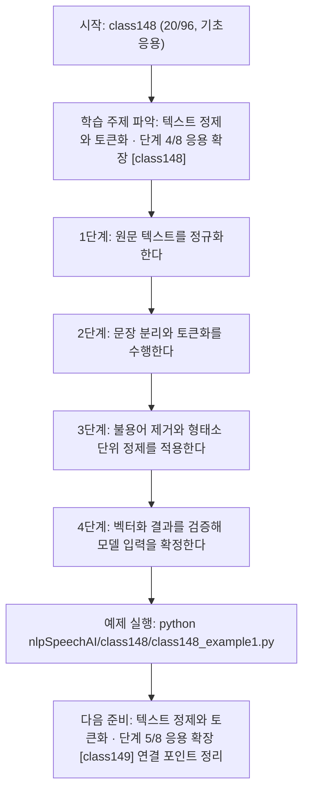
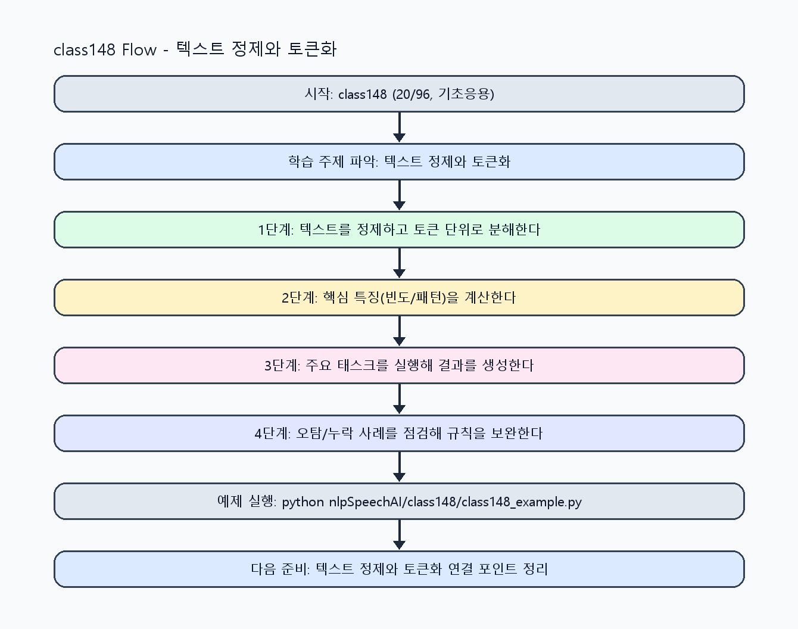

<!-- 이 파일은 www.edumgt.co.kr 의 에듀엠지티에 저작권이 있습니다 -->
# class148 자기주도 학습 가이드

## 1) 오늘의 학습 정보
- 교과목: **자연어 및 음성 데이터 활용 및 모델 개발**
- 학습 주제: **텍스트 정제와 토큰화 · 단계 4/8 응용 확장 [class148]**
- 세부 시퀀스: **20/96**
- 일정: **Day 19 / 4교시**
- 난이도: **기초응용**

### 교과목·학습주제 어휘 해설 (IT 강사 스타일)
#### 교과목 표현 분석: `자연어 및 음성 데이터 활용 및 모델 개발`
- 문법 포인트: 명사구를 연결어 '및'으로 병렬 연결한 구조입니다. 동등한 학습 범위를 함께 제시합니다.
- 기술 포인트: 텍스트를 계산 가능한 단위로 바꿔 의미를 다루는 자연어 처리 교과목입니다.
| 용어 | 문법/품사 | 한글·한자 | 영어 | 기술 설명 |
| --- | --- | --- | --- | --- |
| `자연어` | 명사 | 자연어 (自然語) | natural language | 사람이 일상에서 사용하는 언어 텍스트/발화를 의미합니다. |
| `음성` | 명사 | 음성 (音聲) | speech/audio | 사람의 발화 신호를 디지털로 표현한 데이터입니다. |
| `데이터` | 명사(외래어) | 데이터 (한자 없음) | data | 분석, 학습, 추론의 입력이 되는 관측값 집합입니다. |
| `활용` | 명사/동사 어근 | 활용 (活用) | utilization | 이론이나 도구를 실제 문제 해결 맥락에 적용하는 행위입니다. |
| `모델` | 명사(외래어) | 모델 (한자 없음) | model | 입력과 출력 관계를 수학적으로 근사한 계산 구조입니다. |
| `개발` | 명사 | 개발 (開發) | development | 기능 기획, 구현, 검증을 통해 소프트웨어를 완성하는 과정입니다. |

#### 학습주제 표현 분석: `텍스트 정제와 토큰화 · 단계 4/8 응용 확장 [class148]`
- 문법 포인트: 명사와 명사를 대등하게 묶는 병렬 명사구 구조입니다.
- 기술 포인트: 이번 차시는 `텍스트 정제와 토큰화` 핵심 개념을 코드 구현, 결과 해석, 점검 기준으로 연결합니다.
| 용어 | 문법/품사 | 한글·한자 | 영어 | 기술 설명 |
| --- | --- | --- | --- | --- |
| `텍스트` | 명사(외래어) | 텍스트 (한자 없음) | text | 문자열 기반 데이터로, 요약·분류·추출·생성 작업의 기본 입력/출력 단위입니다. |
| `정제` | 명사(주제 핵심 용어) | 정제 (한자 없음) | (topic-specific) | 이번 차시 맥락: `정제/정규화`는 공백·특수문자·대소문자 규칙을 통일해 분석 노이즈를 줄입니다. 이를 기준으로 `정제`를 코드와 결과 해석에 연결합니다. |
| `토큰화` | 명사 | 토큰화 (토큰化) | tokenization | 문장을 모델 입력 단위로 분해해 벡터화/임베딩 가능한 형태로 바꾸는 과정입니다. |
| `정규화` | 명사(주제 핵심 용어) | 정규화 (한자 없음) | (topic-specific) | 이번 차시 맥락: 텍스트 정규화부터 토큰화, 불용어 제거, 형태소 분석, 벡터화 기초까지 연결하는 전처리 핵심 차시입니다. 이를 기준으로 `정규화`를 코드와 결과 해석에 연결합니다. |
| `문장` | 명사(주제 핵심 용어) | 문장 (한자 없음) | (topic-specific) | 이번 차시 맥락: `토큰화/문장 분리/불용어 제거`는 의미 단위를 안정적으로 추출하는 기본 단계입니다. 이를 기준으로 `문장`를 코드와 결과 해석에 연결합니다. |
| `분리` | 명사(주제 핵심 용어) | 분리 (한자 없음) | (topic-specific) | 이번 차시 맥락: `토큰화/문장 분리/불용어 제거`는 의미 단위를 안정적으로 추출하는 기본 단계입니다. 이를 기준으로 `분리`를 코드와 결과 해석에 연결합니다. |

## 2) 이전에 배운 내용 (복습)
- 이전 차시: **class147 / 텍스트 정제와 토큰화 · 단계 3/8 기초 구현 [class147]** (Day 19 / 3교시)
- 복습 연결: 이전에 배운 **텍스트 정제와 토큰화 · 단계 3/8 기초 구현 [class147]** 를 떠올리며, 오늘 **텍스트 정제와 토큰화 · 단계 4/8 응용 확장 [class148]** 와 어떤 점이 이어지는지 비교해 보세요.

## 3) 주제를 아주 쉽게 이해하기
- 한 줄 설명: 텍스트 정규화부터 토큰화, 불용어 제거, 형태소 분석, 벡터화 기초까지 연결하는 전처리 핵심 차시입니다.
- 왜 배우나요?: 전처리 품질이 낮으면 BoW/TF-IDF/임베딩 기반 모델 성능이 급격히 떨어집니다.

### 핵심 개념 3가지
1. `정제/정규화`는 공백·특수문자·대소문자 규칙을 통일해 분석 노이즈를 줄입니다.
2. `토큰화/문장 분리/불용어 제거`는 의미 단위를 안정적으로 추출하는 기본 단계입니다.
3. `형태소 분석`과 `텍스트 벡터화 기초`는 후속 분류·유사도 모델의 입력 품질을 좌우합니다.

### 비유로 이해하기
- 긴 문장을 단어 카드로 잘라서 분류하는 놀이와 같아요.

## 4) 실습 환경 만들기 (항상 먼저)
아래 명령은 **처음 한 번** 준비해 두면 이후 학습이 쉬워집니다.

### Windows PowerShell
```powershell
cd C:\DevOps\Python-AI_Agent-Class
python -m venv .venv
.\.venv\Scripts\Activate.ps1
python -m pip install --upgrade pip
pip install -r requirements.txt
```

### Linux/macOS (bash)
```bash
cd /path/to/Python-AI_Agent-Class
python3 -m venv .venv
source .venv/bin/activate
python -m pip install --upgrade pip
pip install -r requirements.txt
```

## 5) 오늘의 예제 코드
- 예제 파일: `class148_example1.py`
- 실행 명령:
```bash
python nlpSpeechAI/class148/class148_example1.py
```

### example1~example5 단계별 테스트 확장
1. example1: 정제·문장분리·토큰화 기본 파이프라인을 실행한다.
2. example2: 불용어 제거와 형태소 단위 정제를 확장한다.
3. example3: 품질 낮은 텍스트(특수문자/빈값) 예외 케이스를 점검한다.
4. example4: 벡터화(BOW/TF-IDF) 전처리 결과를 비교한다.
5. example5: 전처리 품질 지표와 회귀 테스트 기준을 정리한다.

<!-- AUTO-GENERATED: TECH_STACK_FLOW START -->
### 기술 스택
- 언어: `Python 3`
- 실행: `CLI` (`python nlpSpeechAI/class148/class148_example1.py`)
- 주요 문법: `정규표현식`, `토큰 필터링`, `딕셔너리 빈도 집계`, `TF-IDF 계산`
- 학습 포커스: `텍스트 정제와 토큰화 · 단계 4/8 응용 확장 [class148]`

### 실습 example1.py 동작 원리 (Mermaid Flowchart)


### Flow PNG 캡처

<!-- AUTO-GENERATED: TECH_STACK_FLOW END -->

### 예제 코드를 볼 때 집중할 포인트
1. 정제 규칙이 도메인 용어를 과도하게 삭제하지 않는지 확인하기
2. 토큰화 결과가 문장 경계와 일치하는지 점검하기
3. 벡터화 차원이 데이터 품질 변화와 연결되는지 확인하기

## 6) 퀴즈로 복습하기 (10문항)
- 퀴즈 파일: `class148_quiz.html`
- 브라우저에서 열기:
```bash
nlpSpeechAI/class148/class148_quiz.html
```
- 버튼 설명:
1. `채점하기`: 현재 선택한 답으로 점수를 계산해요.
2. `다시풀기`: 선택을 모두 지우고 처음부터 다시 풀어요.

## 7) 혼자 실습 순서 (초등학생 버전)
1. 코드를 한 번 그대로 실행해요.
2. 숫자/문장 값을 1개 바꿔요.
3. 결과가 왜 바뀌었는지 한 줄로 적어요.
4. 함수를 1개 더 만들어 작은 기능을 추가해요.

### 실습 미션
1. 정제 전/후 문장을 비교하고 토큰 수 변화를 기록하세요.
2. 불용어 제거 규칙을 바꿔 빈도 상위 단어가 어떻게 바뀌는지 확인하세요.
3. BoW 벡터와 간단 TF-IDF 벡터를 계산해 차이를 비교하세요.

## 8) 스스로 점검 체크리스트
- [ ] 정제-문장분리-토큰화-불용어 제거 순서를 설명할 수 있다.
- [ ] 형태소/품사 단서를 활용해 토큰 품질을 점검했다.
- [ ] 벡터화 기초 결과(BOW/TF-IDF)를 수치로 비교했다.

## 9) 막히면 이렇게 해결해요
1. 에러 메시지 마지막 줄을 먼저 읽어요.
2. 함수 이름과 괄호 짝을 확인해요.
3. `print()`를 넣어 중간 값을 확인해요.
4. 그래도 안 되면 어제 성공한 코드와 한 줄씩 비교해요.

## 10) 학습 후 다음에 배울 내용
- 다음 차시: **class149 / 텍스트 정제와 토큰화 · 단계 5/8 응용 확장 [class149]** (Day 19 / 5교시)
- 미리보기: 다음 차시 전에 **텍스트 정제와 토큰화 · 단계 4/8 응용 확장 [class148]** 핵심 코드 1개를 다시 실행해 두면 텍스트 정제와 토큰화 · 단계 5/8 응용 확장 [class149] 학습이 더 쉬워집니다.

## 11) 다음 차시 연결
- 다음 차시에서는 BoW/TF-IDF와 임베딩 관점의 표현 학습으로 넘어갑니다.
- 오늘 코드를 복사하지 말고, 직접 다시 작성해 보세요.
