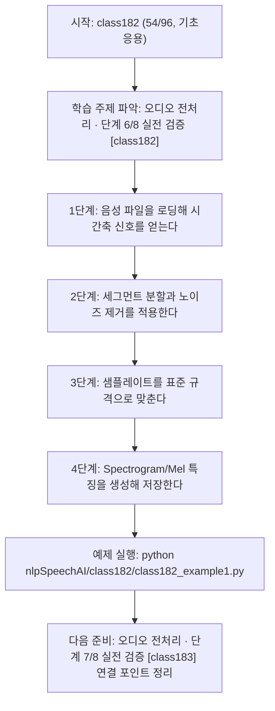
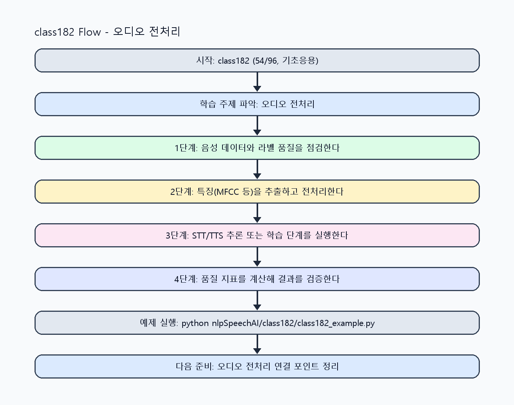

<!-- 이 파일은 www.edumgt.co.kr 의 에듀엠지티에 저작권이 있습니다 -->
# class182 자기주도 학습 가이드

## 1) 오늘의 학습 정보
- 교과목: **자연어 및 음성 데이터 활용 및 모델 개발**
- 학습 주제: **오디오 전처리 · 단계 6/8 실전 검증 [class182]**
- 세부 시퀀스: **54/96**
- 일정: **Day 23 / 6교시**
- 난이도: **기초응용**

### 교과목·학습주제 어휘 해설 (IT 강사 스타일)
#### 교과목 표현 분석: `자연어 및 음성 데이터 활용 및 모델 개발`
- 문법 포인트: 명사구를 연결어 '및'으로 병렬 연결한 구조입니다. 동등한 학습 범위를 함께 제시합니다.
- 기술 포인트: 음성 신호를 정제하고 STT/TTS 모델로 연결하는 음성 AI 교과목입니다.
| 용어 | 문법/품사 | 한글·한자 | 영어 | 기술 설명 |
| --- | --- | --- | --- | --- |
| `자연어` | 명사 | 자연어 (自然語) | natural language | 사람이 일상에서 사용하는 언어 텍스트/발화를 의미합니다. |
| `음성` | 명사 | 음성 (音聲) | speech/audio | 사람의 발화 신호를 디지털로 표현한 데이터입니다. |
| `데이터` | 명사(외래어) | 데이터 (한자 없음) | data | 분석, 학습, 추론의 입력이 되는 관측값 집합입니다. |
| `활용` | 명사/동사 어근 | 활용 (活用) | utilization | 이론이나 도구를 실제 문제 해결 맥락에 적용하는 행위입니다. |
| `모델` | 명사(외래어) | 모델 (한자 없음) | model | 입력과 출력 관계를 수학적으로 근사한 계산 구조입니다. |
| `개발` | 명사 | 개발 (開發) | development | 기능 기획, 구현, 검증을 통해 소프트웨어를 완성하는 과정입니다. |

#### 학습주제 표현 분석: `오디오 전처리 · 단계 6/8 실전 검증 [class182]`
- 문법 포인트: 핵심 개념 명사를 중심으로 한 명사구 구조입니다.
- 기술 포인트: 이번 차시는 `오디오 전처리 · 단계 6/8 실전 검증 [class182]` 용어를 중심으로 문제 정의, 코드 구현, 결과 검증까지 연결합니다.
| 용어 | 문법/품사 | 한글·한자 | 영어 | 기술 설명 |
| --- | --- | --- | --- | --- |
| `오디오` | 명사(외래어) | 오디오 (한자 없음) | audio | 디지털 음성 신호 파일/스트림 데이터를 의미합니다. |
| `전처리` | 명사 | 전처리 (前處理) | preprocessing | 원시 데이터를 모델이 다루기 쉬운 형태로 정리하는 단계입니다. |
| `단계` | 명사(기술 개념어) | 단계 (한자 없음) | (context-specific) | 용어 `단계`: 이번 학습주제에서 정의해야 할 핵심 개념 용어입니다. |
| `실전` | 명사(기술 개념어) | 실전 (한자 없음) | (context-specific) | 용어 `실전`: 이번 학습주제에서 정의해야 할 핵심 개념 용어입니다. |
| `검증` | 명사 | 검증 (檢證) | validation | 결과가 요구사항과 기준을 만족하는지 확인하는 절차입니다. |
| `class182` | 영문 기술명/약어 | class182 (한자 없음) | class182 | 용어 `class182`: 이번 차시에서 쓰이는 핵심 기술 용어입니다. |

## 2) 이전에 배운 내용 (복습)
- 이전 차시: **class181 / 오디오 전처리 · 단계 5/8 응용 확장 [class181]** (Day 23 / 5교시)
- 복습 연결: 이전에 배운 **오디오 전처리 · 단계 5/8 응용 확장 [class181]** 를 떠올리며, 오늘 **오디오 전처리 · 단계 6/8 실전 검증 [class182]** 와 어떤 점이 이어지는지 비교해 보세요.

## 3) 주제를 아주 쉽게 이해하기
- 한 줄 설명: 음성 파일 로딩부터 구간 분할, 잡음 제거, 샘플레이트 변환, Spectrogram/Mel 변환까지 다루는 차시입니다.
- 왜 배우나요?: 전처리 규격이 흔들리면 같은 모델이라도 성능 편차가 커집니다.

### 핵심 개념 3가지
1. `구간 분할(segmentation)`은 긴 발화를 학습 가능한 단위로 나누는 핵심 단계입니다.
2. `잡음 제거`와 `샘플레이트 변환`은 모델 입력 품질을 통일하는 기본 절차입니다.
3. `Spectrogram/Mel-Spectrogram`은 시간영역 음성을 주파수 특징으로 바꾸는 표준 표현입니다.

### 비유로 이해하기
- 노래 경연 점수를 매길 때 음정, 박자, 발음을 항목별로 보는 것과 비슷해요.

## 4) 실습 환경 만들기 (항상 먼저)
아래 명령은 **처음 한 번** 준비해 두면 이후 학습이 쉬워집니다.

### Windows PowerShell
```powershell
cd C:\DevOps\Python-AI_Agent-Class
python -m venv .venv
.\.venv\Scripts\Activate.ps1
python -m pip install --upgrade pip
pip install -r requirements.txt
```

### Linux/macOS (bash)
```bash
cd /path/to/Python-AI_Agent-Class
python3 -m venv .venv
source .venv/bin/activate
python -m pip install --upgrade pip
pip install -r requirements.txt
```

## 5) 오늘의 예제 코드
- 예제 파일: `class182_example1.py`
- 실행 명령:
```bash
python nlpSpeechAI/class182/class182_example1.py
```

### example1~example5 단계별 테스트 확장
1. example1: 오디오 파일 로딩과 구간 분할을 실행한다.
2. example2: 잡음 제거/샘플레이트 변환 케이스를 확장한다.
3. example3: 전처리 실패 케이스(포맷/길이/품질)를 점검한다.
4. example4: Spectrogram/Mel-Spectrogram 결과를 비교한다.
5. example5: 전처리 품질 기준과 복구 절차를 정리한다.

<!-- AUTO-GENERATED: TECH_STACK_FLOW START -->
### 기술 스택
- 언어: `Python 3`
- 실행: `CLI` (`python nlpSpeechAI/class182/class182_example1.py`)
- 주요 문법: `세그먼트 루프`, `노이즈 필터`, `리샘플링`, `스펙트럼 특징 계산`
- 학습 포커스: `오디오 전처리 · 단계 6/8 실전 검증 [class182]`

### 실습 example1.py 동작 원리 (Mermaid Flowchart)


### Flow PNG 캡처

<!-- AUTO-GENERATED: TECH_STACK_FLOW END -->

### 예제 코드를 볼 때 집중할 포인트
1. 세그먼트 길이가 과업(STT/TTS)에 맞는지 확인하기
2. 리샘플링 후 왜곡이나 정보 손실이 과도하지 않은지 점검하기
3. 특징 추출 결과 차원과 값 범위를 검증하는지 확인하기

## 6) 퀴즈로 복습하기 (10문항)
- 퀴즈 파일: `class182_quiz.html`
- 브라우저에서 열기:
```bash
nlpSpeechAI/class182/class182_quiz.html
```
- 버튼 설명:
1. `채점하기`: 현재 선택한 답으로 점수를 계산해요.
2. `다시풀기`: 선택을 모두 지우고 처음부터 다시 풀어요.

## 7) 혼자 실습 순서 (초등학생 버전)
1. 코드를 한 번 그대로 실행해요.
2. 숫자/문장 값을 1개 바꿔요.
3. 결과가 왜 바뀌었는지 한 줄로 적어요.
4. 함수를 1개 더 만들어 작은 기능을 추가해요.

### 실습 미션
1. 오디오를 구간 분할한 뒤 구간별 길이를 비교하세요.
2. 잡음 제거 전/후 에너지 지표를 계산해 품질 변화를 확인하세요.
3. 샘플레이트를 통일하고 Spectrogram/Mel 특징을 출력하세요.

## 8) 스스로 점검 체크리스트
- [ ] 구간 분할 기준(길이/겹침)을 설명할 수 있다.
- [ ] 샘플레이트 변환 전후 데이터 길이 변화를 검증했다.
- [ ] Spectrogram과 Mel-Spectrogram 차이를 설명할 수 있다.

## 9) 막히면 이렇게 해결해요
1. 에러 메시지 마지막 줄을 먼저 읽어요.
2. 함수 이름과 괄호 짝을 확인해요.
3. `print()`를 넣어 중간 값을 확인해요.
4. 그래도 안 되면 어제 성공한 코드와 한 줄씩 비교해요.

## 10) 학습 후 다음에 배울 내용
- 다음 차시: **class183 / 오디오 전처리 · 단계 7/8 실전 검증 [class183]** (Day 23 / 7교시)
- 미리보기: 다음 차시 전에 **오디오 전처리 · 단계 6/8 실전 검증 [class182]** 핵심 코드 1개를 다시 실행해 두면 오디오 전처리 · 단계 7/8 실전 검증 [class183] 학습이 더 쉬워집니다.

## 11) 다음 차시 연결
- 다음 차시에서는 MFCC 기반 특징 추출과 음성 모델 기초를 실습합니다.
- 오늘 코드를 복사하지 말고, 직접 다시 작성해 보세요.
