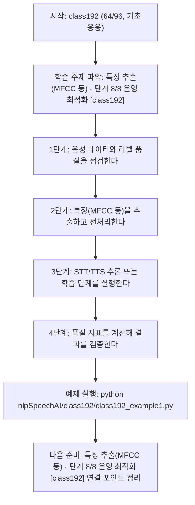
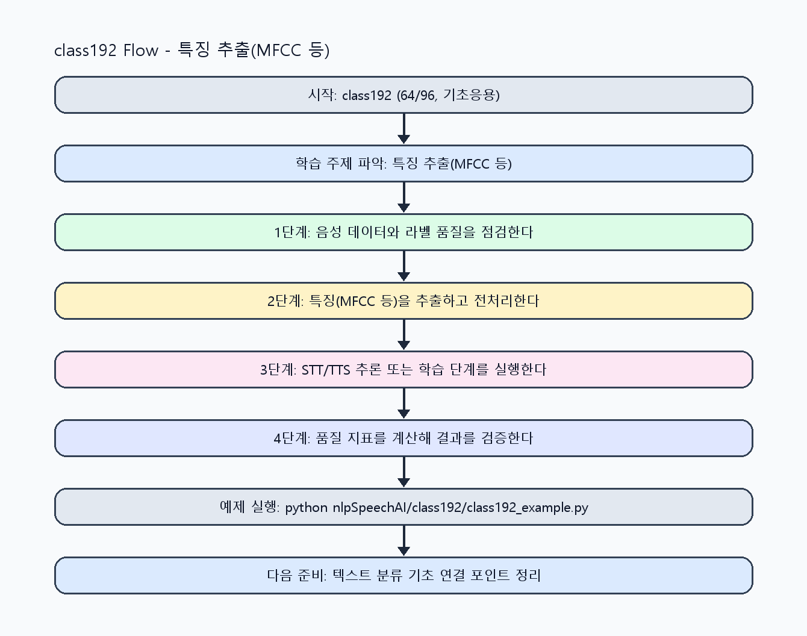

<!-- 이 파일은 www.edumgt.co.kr 의 에듀엠지티에 저작권이 있습니다 -->
# class192 자기주도 학습 가이드

## 1) 오늘의 학습 정보
- 교과목: **자연어 및 음성 데이터 활용 및 모델 개발**
- 학습 주제: **특징 추출(MFCC 등) · 단계 8/8 운영 최적화 [class192]**
- 학습 주제 진행: **특징 추출(MFCC 등) · 단계 8/8 운영 최적화 [class192] (총 8시간 중 8시간차)**
- 세부 시퀀스: **64/96**
- 일정: **Day 24 / 8교시**
- 최종 목표: **Agent 폴더의 실제 시스템 구성요소를 구현·연동·운영할 수 있는 개발자 역량 확보**
- 난이도: **기초응용**

### 교과목·학습주제 어휘 해설 (IT 강사 스타일)
#### 교과목 표현 분석: `자연어 및 음성 데이터 활용 및 모델 개발`
- 문법 포인트: 명사구를 연결어 '및'으로 병렬 연결한 구조입니다. 동등한 학습 범위를 함께 제시합니다.
- 기술 포인트: 음성 신호를 정제하고 STT/TTS 모델로 연결하는 음성 AI 교과목입니다.
| 용어 | 문법/품사 | 한글·한자 | 영어 | 기술 설명 |
| --- | --- | --- | --- | --- |
| `자연어` | 명사 | 자연어 (自然語) | natural language | 사람이 일상에서 사용하는 언어 텍스트/발화를 의미합니다. |
| `음성` | 명사 | 음성 (音聲) | speech/audio | 사람의 발화 신호를 디지털로 표현한 데이터입니다. |
| `데이터` | 명사(외래어) | 데이터 (한자 없음) | data | 분석, 학습, 추론의 입력이 되는 관측값 집합입니다. |
| `활용` | 명사/동사 어근 | 활용 (活用) | utilization | 이론이나 도구를 실제 문제 해결 맥락에 적용하는 행위입니다. |
| `모델` | 명사(외래어) | 모델 (한자 없음) | model | 입력과 출력 관계를 수학적으로 근사한 계산 구조입니다. |
| `개발` | 명사 | 개발 (開發) | development | 기능 기획, 구현, 검증을 통해 소프트웨어를 완성하는 과정입니다. |

#### 학습주제 표현 분석: `특징 추출(MFCC 등) · 단계 8/8 운영 최적화 [class192]`
- 문법 포인트: 핵심 개념 명사를 중심으로 한 명사구 구조입니다.
- 기술 포인트: 이번 차시는 `특징 추출(MFCC 등) · 단계 8/8 운영 최적화 [class192]`를 중심으로 같은 주제 내에서 단계적으로 고도화된 구현을 수행합니다.
| 용어 | 문법/품사 | 한글·한자 | 영어 | 기술 설명 |
| --- | --- | --- | --- | --- |
| `특징` | 명사 | 특징 (特徵) | feature | 모델이 학습에 사용하는 입력 속성값입니다. |
| `추출` | 명사 | 추출 (抽出) | extraction | 원문에서 필요한 구조화 정보만 뽑아내는 작업입니다. |
| `MFCC` | 약어명사 | MFCC (한자 없음) | Mel-Frequency Cepstral Coefficients | 음성 스펙트럼 특성을 요약하는 대표 음향 특징 벡터입니다. |

## 2) 이전에 배운 내용 (복습)
- 이전 차시: **class191 / 특징 추출(MFCC 등) · 단계 7/8 실전 검증 [class191]** (Day 24 / 7교시)
- 복습 연결: 이전에 배운 **특징 추출(MFCC 등) · 단계 7/8 실전 검증 [class191]** 를 떠올리며, 오늘 **특징 추출(MFCC 등) · 품질 검증 예외 흐름 정의 (차시 64) [class192]** 와 어떤 점이 이어지는지 비교해 보세요.

## 3) 주제를 아주 쉽게 이해하기
- 한 줄 설명: 특징 추출(MFCC 등)를 단계 8/8(운영 최적화) 수준으로 고도화해 구현하는 차시입니다.
- 왜 배우나요?: 동일 주제를 반복하더라도 단계별 난이도를 높여 실무 수준의 문제 해결력을 만들기 위해서입니다.

### 핵심 개념 3가지
1. `특징 추출(MFCC 등)`의 핵심 입력/출력 구조를 단계 8/8 기준으로 명확히 정의합니다.
2. `운영 최적화` 수준에서 필요한 구현 패턴(검증, 예외, 로깅, 성능)을 코드에 반영합니다.
3. 이전 단계 결과를 재사용해 다음 단계로 확장 가능한 구조로 리팩터링합니다.

### 비유로 이해하기
- 기초 공정에서 시작해 품질검사와 운영튜닝까지 단계적으로 완성도를 올리는 제조 라인과 같습니다.
## 4) 실습 환경 만들기 (항상 먼저)
아래 명령은 **처음 한 번** 준비해 두면 이후 학습이 쉬워집니다.

### Windows PowerShell
```powershell
cd C:\DevOps\Python-AI_Agent-Class
python -m venv .venv
.\.venv\Scripts\Activate.ps1
python -m pip install --upgrade pip
pip install -r requirements.txt
```

### Linux/macOS (bash)
```bash
cd /path/to/Python-AI_Agent-Class
python3 -m venv .venv
source .venv/bin/activate
python -m pip install --upgrade pip
pip install -r requirements.txt
```

## 5) 오늘의 예제 코드
- 예제 파일: `class192_example1.py`
- 실행 명령:
```bash
python nlpSpeechAI/class192/class192_example1.py
```


<!-- AUTO-GENERATED: OS_COMMANDS START -->
## 5-1) 운영체제별 실행 명령 예시
### PowerShell (Windows)
```powershell
cd C:\DevOps\Python-AI_Agent-Class
python .\nlpSpeechAI\class192\class192.py
python .\nlpSpeechAI\class192\class192_example1.py
python .\nlpSpeechAI\class192\class192_assignment.py
start .\nlpSpeechAI\class192\class192_quiz.html
```

### WSL Ubuntu (bash)
```bash
cd /mnt/c/DevOps/Python-AI_Agent-Class
python3 nlpSpeechAI/class192/class192.py
python3 nlpSpeechAI/class192/class192_example1.py
python3 nlpSpeechAI/class192/class192_assignment.py
explorer.exe "$(wslpath -w 'nlpSpeechAI/class192/class192_quiz.html')"
```

### run_class/run_day 스크립트 연동 (WSL bash)
```bash
./run_class.sh class192
./run_day.sh 24 launcher
```
<!-- AUTO-GENERATED: OS_COMMANDS END -->

<!-- AUTO-GENERATED: TECH_STACK_FLOW START -->
### 기술 스택
- 언어: `Python 3`
- 실행: `CLI` (`python nlpSpeechAI/class192/class192_example1.py`)
- 주요 문법: `리스트/딕셔너리`, `조건 필터링`, `통계 계산`, `출력(print)`
- 학습 포커스: `특징 추출(MFCC 등) · 단계 8/8 운영 최적화 [class192]`

### 실습 example1.py 동작 원리 (Mermaid Flowchart)


### Flow PNG 캡처

<!-- AUTO-GENERATED: TECH_STACK_FLOW END -->

### 예제 코드를 볼 때 집중할 포인트
1. 입력이 무엇인지 먼저 찾기
2. 처리 규칙(함수/조건/반복) 확인하기
3. 출력 결과가 목표와 맞는지 점검하기

## 6) 퀴즈로 복습하기 (5문항)
- 퀴즈 파일: `class192_quiz.html`
- 브라우저에서 열기:
```bash
nlpSpeechAI/class192/class192_quiz.html
```
- 버튼 설명:
1. `채점하기`: 현재 선택한 답으로 점수를 계산해요.
2. `다시풀기`: 선택을 모두 지우고 처음부터 다시 풀어요.

## 7) 혼자 실습 순서 (초등학생 버전)
1. 코드를 한 번 그대로 실행해요.
2. 숫자/문장 값을 1개 바꿔요.
3. 결과가 왜 바뀌었는지 한 줄로 적어요.
4. 함수를 1개 더 만들어 작은 기능을 추가해요.

### 실습 미션
1. `특징 추출(MFCC 등)` 단계 8/8 목표 기능을 코드로 구현하고 실행 로그를 남기세요.
2. `운영 최적화` 관점에서 실패 케이스 1개 이상을 재현하고 대응 코드를 추가하세요.
3. 이전 단계 코드와 비교해 변경점(입력/처리/출력)을 3줄로 정리하세요.

## 8) 스스로 점검 체크리스트
- [ ] 음성 샘플 하나를 데이터 항목으로 설명할 수 있다.
- [ ] 필터링 조건을 바꿔 결과 변화를 확인했다.
- [ ] 품질 확인용 숫자 지표를 1개 이상 계산했다.

## 9) 막히면 이렇게 해결해요
1. 에러 메시지 마지막 줄을 먼저 읽어요.
2. 함수 이름과 괄호 짝을 확인해요.
3. `print()`를 넣어 중간 값을 확인해요.
4. 그래도 안 되면 어제 성공한 코드와 한 줄씩 비교해요.

## 10) 학습 후 다음에 배울 내용
- 다음 차시: **class193 / 텍스트 분류 기초 · 단계 1/8 입문 이해 [class193]** (Day 25 / 1교시)
- 미리보기: 다음 차시 전에 **특징 추출(MFCC 등) · 단계 8/8 운영 최적화 [class192]** 핵심 코드 1개를 다시 실행해 두면 텍스트 분류 기초 · 단계 1/8 입문 이해 [class193] 학습이 더 쉬워집니다.

## 11) 다음 차시 연결
- 다음 차시에서는 텍스트와 음성을 연결하는 파이프라인을 다뤄요.
- 오늘 코드를 복사하지 말고, 직접 다시 작성해 보세요.
