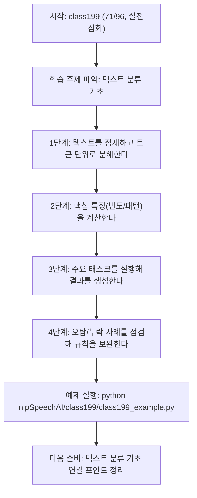
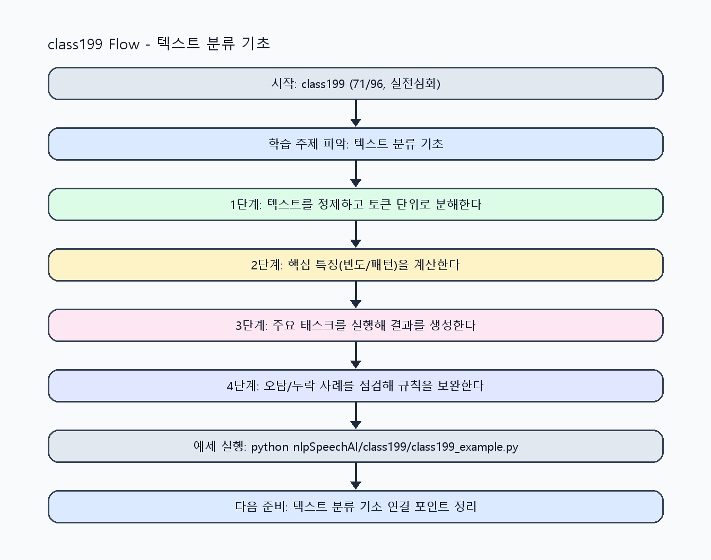

<!-- 이 파일은 www.edumgt.co.kr 의 에듀엠지티에 저작권이 있습니다 -->
# class199 자기주도 학습 가이드

## 1) 오늘의 학습 정보
- 교과목: **자연어 및 음성 데이터 활용 및 모델 개발**
- 학습 주제: **텍스트 분류 기초**
- 세부 시퀀스: **71/96**
- 일정: **Day 25 / 7교시**
- 난이도: **실전심화**

### 교과목·학습주제 어휘 해설 (IT 강사 스타일)
#### 교과목 표현 분석: `자연어 및 음성 데이터 활용 및 모델 개발`
- 문법 포인트: 명사구를 연결어 '및'으로 병렬 연결한 구조입니다. 동등한 학습 범위를 함께 제시합니다.
- 기술 포인트: 텍스트를 계산 가능한 단위로 바꿔 의미를 다루는 자연어 처리 교과목입니다.
| 용어 | 문법/품사 | 한글·한자 | 영어 | 기술 설명 |
| --- | --- | --- | --- | --- |
| `자연어` | 명사 | 자연어 (自然語) | natural language | 사람이 일상에서 사용하는 언어 텍스트/발화를 의미합니다. |
| `음성` | 명사 | 음성 (音聲) | speech/audio | 사람의 발화 신호를 디지털로 표현한 데이터입니다. |
| `데이터` | 명사(외래어) | 데이터 (한자 없음) | data | 분석, 학습, 추론의 입력이 되는 관측값 집합입니다. |
| `활용` | 명사/동사 어근 | 활용 (活用) | utilization | 이론이나 도구를 실제 문제 해결 맥락에 적용하는 행위입니다. |
| `모델` | 명사(외래어) | 모델 (한자 없음) | model | 입력과 출력 관계를 수학적으로 근사한 계산 구조입니다. |
| `개발` | 명사 | 개발 (開發) | development | 기능 기획, 구현, 검증을 통해 소프트웨어를 완성하는 과정입니다. |

#### 학습주제 표현 분석: `텍스트 분류 기초`
- 문법 포인트: 핵심 개념 명사를 중심으로 한 명사구 구조입니다.
- 기술 포인트: 이번 차시는 `텍스트 분류 기초` 용어를 중심으로 문제 정의, 코드 구현, 결과 검증까지 연결합니다.
| 용어 | 문법/품사 | 한글·한자 | 영어 | 기술 설명 |
| --- | --- | --- | --- | --- |
| `텍스트` | 명사(기술 개념어) | 텍스트 (한자 없음) | (context-specific) | 용어 `텍스트`: 이번 학습주제에서 정의해야 할 핵심 개념 용어입니다. |
| `분류` | 명사 | 분류 (分類) | classification | 입력을 사전 정의된 카테고리로 할당하는 지도학습 과제입니다. |
| `기초` | 명사(기술 개념어) | 기초 (한자 없음) | (context-specific) | 용어 `기초`: 이번 학습주제에서 정의해야 할 핵심 개념 용어입니다. |

## 2) 이전에 배운 내용 (복습)
- 이전 차시: **class198 / 텍스트 분류 기초** (Day 25 / 6교시)
- 복습 연결: 이전에 배운 **텍스트 분류 기초** 를 떠올리며, 오늘 **텍스트 분류 기초** 와 어떤 점이 이어지는지 비교해 보세요.

## 3) 주제를 아주 쉽게 이해하기
- 한 줄 설명: 문장을 컴퓨터가 다루기 쉬운 형태(단어, 토큰)로 바꾸는 방법을 배워요.
- 왜 배우나요?: 문장을 숫자/토큰으로 바꾸면 검색, 분류, 요약 같은 작업을 자동화할 수 있어요.

### 핵심 개념 3가지
1. 텍스트 전처리로 공백/기호를 정리해요.
2. 토큰화로 문장을 작은 단위로 나눠요.
3. 단어 빈도 계산으로 중요한 단어를 찾을 수 있어요.

### 비유로 이해하기
- 긴 문장을 단어 카드로 잘라서 분류하는 놀이와 같아요.

## 4) 실습 환경 만들기 (항상 먼저)
아래 명령은 **처음 한 번** 준비해 두면 이후 학습이 쉬워집니다.

### Windows PowerShell
```powershell
cd C:\DevOps\Python-AI_Agent-Class
python -m venv .venv
.\.venv\Scripts\Activate.ps1
python -m pip install --upgrade pip
pip install -r requirements.txt
```

### Linux/macOS (bash)
```bash
cd /path/to/Python-AI_Agent-Class
python3 -m venv .venv
source .venv/bin/activate
python -m pip install --upgrade pip
pip install -r requirements.txt
```

## 5) 오늘의 예제 코드
- 예제 파일: `class199_example.py`
- 실행 명령:
```bash
python nlpSpeechAI/class199/class199_example.py
```


<!-- AUTO-GENERATED: OS_COMMANDS START -->
## 5-1) 운영체제별 실행 명령 예시
### PowerShell (Windows)
```powershell
cd C:\DevOps\Python-AI_Agent-Class
python .\nlpSpeechAI\class199\class199.py
python .\nlpSpeechAI\class199\class199_example.py
python .\nlpSpeechAI\class199\class199_assignment.py
start .\nlpSpeechAI\class199\class199_quiz.html
```

### WSL Ubuntu (bash)
```bash
cd /mnt/c/DevOps/Python-AI_Agent-Class
python3 nlpSpeechAI/class199/class199.py
python3 nlpSpeechAI/class199/class199_example.py
python3 nlpSpeechAI/class199/class199_assignment.py
explorer.exe "$(wslpath -w 'nlpSpeechAI/class199/class199_quiz.html')"
```

### run_class/run_day 스크립트 연동 (WSL bash)
```bash
./run_class.sh class199
./run_day.sh 25 launcher
```
<!-- AUTO-GENERATED: OS_COMMANDS END -->

<!-- AUTO-GENERATED: TECH_STACK_FLOW START -->
### 기술 스택
- 언어: `Python 3`
- 실행: `CLI` (`python nlpSpeechAI/class199/class199_example.py`)
- 주요 문법: `문자열 처리`, `토큰화`, `딕셔너리 집계`, `출력(print)`
- 학습 포커스: `텍스트 분류 기초`

### 실습 example.py 동작 원리 (Mermaid Flowchart)


### Flow PNG 캡처

<!-- AUTO-GENERATED: TECH_STACK_FLOW END -->

### 예제 코드를 볼 때 집중할 포인트
1. 입력이 무엇인지 먼저 찾기
2. 처리 규칙(함수/조건/반복) 확인하기
3. 출력 결과가 목표와 맞는지 점검하기

## 6) 퀴즈로 복습하기 (5문항)
- 퀴즈 파일: `class199_quiz.html`
- 브라우저에서 열기:
```bash
nlpSpeechAI/class199/class199_quiz.html
```
- 버튼 설명:
1. `채점하기`: 현재 선택한 답으로 점수를 계산해요.
2. `다시풀기`: 선택을 모두 지우고 처음부터 다시 풀어요.

## 7) 혼자 실습 순서 (초등학생 버전)
1. 코드를 한 번 그대로 실행해요.
2. 숫자/문장 값을 1개 바꿔요.
3. 결과가 왜 바뀌었는지 한 줄로 적어요.
4. 함수를 1개 더 만들어 작은 기능을 추가해요.

### 실습 미션
1. 예제 문장을 토큰 리스트로 바꿔 결과를 확인해요.
2. 가장 자주 나온 단어를 찾아 이유를 말해요.
3. 문장을 1개 추가하고 빈도 순위가 바뀌는지 확인해요.

## 8) 스스로 점검 체크리스트
- [ ] 토큰화 전/후 차이를 설명할 수 있다.
- [ ] 불필요한 기호 제거 이유를 설명할 수 있다.
- [ ] 빈도 상위 단어를 3개 이상 찾았다.

## 9) 막히면 이렇게 해결해요
1. 에러 메시지 마지막 줄을 먼저 읽어요.
2. 함수 이름과 괄호 짝을 확인해요.
3. `print()`를 넣어 중간 값을 확인해요.
4. 그래도 안 되면 어제 성공한 코드와 한 줄씩 비교해요.

## 10) 학습 후 다음에 배울 내용
- 다음 차시: **class200 / 텍스트 분류 기초** (Day 25 / 8교시)
- 미리보기: 다음 차시 전에 **텍스트 분류 기초** 핵심 코드 1개를 다시 실행해 두면 텍스트 분류 기초 학습이 더 쉬워집니다.

## 11) 다음 차시 연결
- 다음 차시에서는 토큰을 숫자 벡터로 바꿔 모델에 넣어 볼 거예요.
- 오늘 코드를 복사하지 말고, 직접 다시 작성해 보세요.
