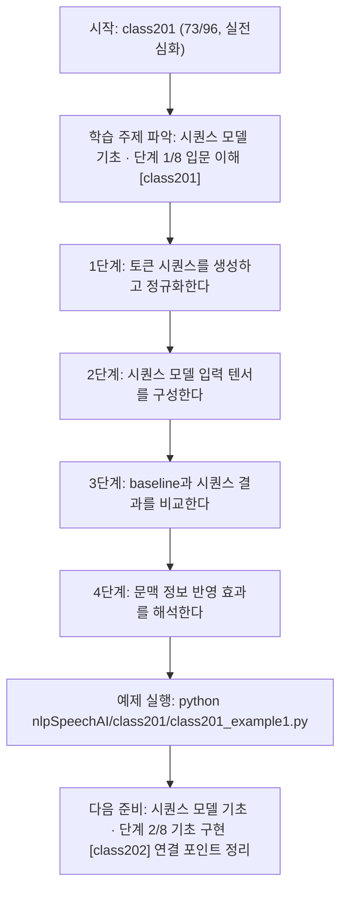
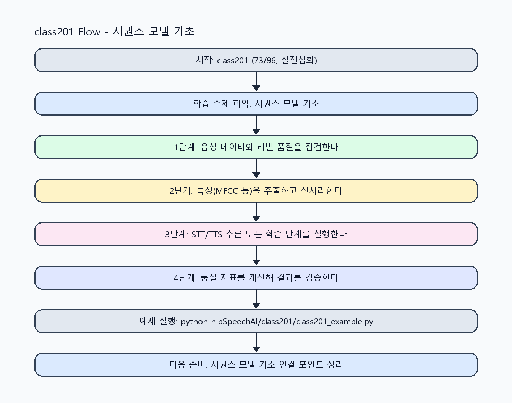

<!-- 이 파일은 www.edumgt.co.kr 의 에듀엠지티에 저작권이 있습니다 -->
# class201 자기주도 학습 가이드

## 1) 오늘의 학습 정보
- 교과목: **자연어 및 음성 데이터 활용 및 모델 개발**
- 학습 주제: **시퀀스 모델 기초 · 단계 1/8 입문 이해 [class201]**
- 세부 시퀀스: **73/96**
- 일정: **Day 26 / 1교시**
- 난이도: **실전심화**

### 교과목·학습주제 어휘 해설 (IT 강사 스타일)
#### 교과목 표현 분석: `자연어 및 음성 데이터 활용 및 모델 개발`
- 문법 포인트: 명사구를 연결어 '및'으로 병렬 연결한 구조입니다. 동등한 학습 범위를 함께 제시합니다.
- 기술 포인트: 음성 신호를 정제하고 STT/TTS 모델로 연결하는 음성 AI 교과목입니다.
| 용어 | 문법/품사 | 한글·한자 | 영어 | 기술 설명 |
| --- | --- | --- | --- | --- |
| `자연어` | 명사 | 자연어 (自然語) | natural language | 사람이 일상에서 사용하는 언어 텍스트/발화를 의미합니다. |
| `음성` | 명사 | 음성 (音聲) | speech/audio | 사람의 발화 신호를 디지털로 표현한 데이터입니다. |
| `데이터` | 명사(외래어) | 데이터 (한자 없음) | data | 분석, 학습, 추론의 입력이 되는 관측값 집합입니다. |
| `활용` | 명사/동사 어근 | 활용 (活用) | utilization | 이론이나 도구를 실제 문제 해결 맥락에 적용하는 행위입니다. |
| `모델` | 명사(외래어) | 모델 (한자 없음) | model | 입력과 출력 관계를 수학적으로 근사한 계산 구조입니다. |
| `개발` | 명사 | 개발 (開發) | development | 기능 기획, 구현, 검증을 통해 소프트웨어를 완성하는 과정입니다. |

#### 학습주제 표현 분석: `시퀀스 모델 기초 · 단계 1/8 입문 이해 [class201]`
- 문법 포인트: 핵심 개념 명사를 중심으로 한 명사구 구조입니다.
- 기술 포인트: 이번 차시는 `시퀀스 모델 기초` 핵심 개념을 코드 구현, 결과 해석, 점검 기준으로 연결합니다.
| 용어 | 문법/품사 | 한글·한자 | 영어 | 기술 설명 |
| --- | --- | --- | --- | --- |
| `시퀀스` | 명사(주제 핵심 용어) | 시퀀스 (한자 없음) | (topic-specific) | 이번 차시 맥락: 토큰 시퀀스 기반 입력과 순차 모델 아이디어를 적용해 NLP 표현을 확장하는 차시입니다. 이를 기준으로 `시퀀스`를 코드와 결과 해석에 연결합니다. |
| `모델` | 명사(외래어) | 모델 (한자 없음) | model | 입력과 출력 관계를 수학적으로 근사한 계산 구조입니다. |
| `길이` | 명사(주제 핵심 용어) | 길이 (한자 없음) | (topic-specific) | 이번 차시 맥락: `입력 길이 정규화`와 `패딩`은 배치 학습 안정성의 핵심입니다. 이를 기준으로 `길이`를 코드와 결과 해석에 연결합니다. |
| `정규화` | 명사(주제 핵심 용어) | 정규화 (한자 없음) | (topic-specific) | 이번 차시 맥락: `입력 길이 정규화`와 `패딩`은 배치 학습 안정성의 핵심입니다. 이를 기준으로 `정규화`를 코드와 결과 해석에 연결합니다. |
| `패딩` | 명사(주제 핵심 용어) | 패딩 (한자 없음) | (topic-specific) | 이번 차시 맥락: `입력 길이 정규화`와 `패딩`은 배치 학습 안정성의 핵심입니다. 이를 기준으로 `패딩`를 코드와 결과 해석에 연결합니다. |
| `문장` | 명사(주제 핵심 용어) | 문장 (한자 없음) | (topic-specific) | 이번 차시 맥락: `문장 임베딩`과 시퀀스 표현을 결합하면 분류/유사도 성능 개선이 가능합니다. 이를 기준으로 `문장`를 코드와 결과 해석에 연결합니다. |

## 2) 이전에 배운 내용 (복습)
- 이전 차시: **class200 / 텍스트 분류 기초 · 단계 8/8 운영 최적화 [class200]** (Day 25 / 8교시)
- 복습 연결: 이전에 배운 **텍스트 분류 기초 · 단계 8/8 운영 최적화 [class200]** 를 떠올리며, 오늘 **시퀀스 모델 기초 · 단계 1/8 입문 이해 [class201]** 와 어떤 점이 이어지는지 비교해 보세요.

## 3) 주제를 아주 쉽게 이해하기
- 한 줄 설명: 토큰 시퀀스 기반 입력과 순차 모델 아이디어를 적용해 NLP 표현을 확장하는 차시입니다.
- 왜 배우나요?: 문맥 순서를 반영해야 문서 분류/유사도 품질이 더 안정적으로 향상됩니다.

### 핵심 개념 3가지
1. `시퀀스 모델`은 토큰 순서를 고려해 문맥 정보를 학습합니다.
2. `입력 길이 정규화`와 `패딩`은 배치 학습 안정성의 핵심입니다.
3. `문장 임베딩`과 시퀀스 표현을 결합하면 분류/유사도 성능 개선이 가능합니다.

### 비유로 이해하기
- 노래 경연 점수를 매길 때 음정, 박자, 발음을 항목별로 보는 것과 비슷해요.

## 4) 실습 환경 만들기 (항상 먼저)
아래 명령은 **처음 한 번** 준비해 두면 이후 학습이 쉬워집니다.

### Windows PowerShell
```powershell
cd C:\DevOps\Python-AI_Agent-Class
python -m venv .venv
.\.venv\Scripts\Activate.ps1
python -m pip install --upgrade pip
pip install -r requirements.txt
```

### Linux/macOS (bash)
```bash
cd /path/to/Python-AI_Agent-Class
python3 -m venv .venv
source .venv/bin/activate
python -m pip install --upgrade pip
pip install -r requirements.txt
```

## 5) 오늘의 예제 코드
- 예제 파일: `class201_example1.py`
- 실행 명령:
```bash
python nlpSpeechAI/class201/class201_example1.py
```

### example1~example5 단계별 테스트 확장
1. example1: 시퀀스 입력 구조와 baseline을 실행한다.
2. example2: 길이/패딩 정책을 바꿔 결과를 비교한다.
3. example3: 순서 정보 손실 케이스를 점검한다.
4. example4: 시퀀스 모델과 일반 분류 결과를 비교한다.
5. example5: 일반화/운영 기준 체크를 정리한다.

<!-- AUTO-GENERATED: TECH_STACK_FLOW START -->
### 기술 스택
- 언어: `Python 3`
- 실행: `CLI` (`python nlpSpeechAI/class201/class201_example1.py`)
- 주요 문법: `시퀀스 인코딩`, `패딩/마스킹`, `배치 구성`, `결과 비교 리포트`
- 학습 포커스: `시퀀스 모델 기초 · 단계 1/8 입문 이해 [class201]`

### 실습 example1.py 동작 원리 (Mermaid Flowchart)


### Flow PNG 캡처

<!-- AUTO-GENERATED: TECH_STACK_FLOW END -->

### 예제 코드를 볼 때 집중할 포인트
1. 시퀀스 길이 처리로 정보 손실이 과도하지 않은지 확인하기
2. 패딩/마스킹 정책이 추론 단계에서도 일관적인지 점검하기
3. 모델 비교 기준(지표/데이터 분할)이 동일한지 확인하기

## 6) 퀴즈로 복습하기 (10문항)
- 퀴즈 파일: `class201_quiz.html`
- 브라우저에서 열기:
```bash
nlpSpeechAI/class201/class201_quiz.html
```
- 버튼 설명:
1. `채점하기`: 현재 선택한 답으로 점수를 계산해요.
2. `다시풀기`: 선택을 모두 지우고 처음부터 다시 풀어요.

## 7) 혼자 실습 순서 (초등학생 버전)
1. 코드를 한 번 그대로 실행해요.
2. 숫자/문장 값을 1개 바꿔요.
3. 결과가 왜 바뀌었는지 한 줄로 적어요.
4. 함수를 1개 더 만들어 작은 기능을 추가해요.

### 실습 미션
1. 토큰 시퀀스 길이를 정규화하고 배치 입력을 구성하세요.
2. 순차 표현과 bag-of-words 표현 결과를 비교하세요.
3. 간단 시퀀스 분류 결과와 baseline 분류 결과를 대조하세요.

## 8) 스스로 점검 체크리스트
- [ ] 시퀀스 입력 구조와 길이 처리 규칙을 설명할 수 있다.
- [ ] 순서 정보가 분류 결과에 주는 영향을 확인했다.
- [ ] baseline 대비 개선/악화 원인을 기록했다.

## 9) 막히면 이렇게 해결해요
1. 에러 메시지 마지막 줄을 먼저 읽어요.
2. 함수 이름과 괄호 짝을 확인해요.
3. `print()`를 넣어 중간 값을 확인해요.
4. 그래도 안 되면 어제 성공한 코드와 한 줄씩 비교해요.

## 10) 학습 후 다음에 배울 내용
- 다음 차시: **class202 / 시퀀스 모델 기초 · 단계 2/8 기초 구현 [class202]** (Day 26 / 2교시)
- 미리보기: 다음 차시 전에 **시퀀스 모델 기초 · 단계 1/8 입문 이해 [class201]** 핵심 코드 1개를 다시 실행해 두면 시퀀스 모델 기초 · 단계 2/8 기초 구현 [class202] 학습이 더 쉬워집니다.

## 11) 다음 차시 연결
- 다음 차시에서는 텍스트와 음성 특징을 결합하는 멀티모달 단계로 확장합니다.
- 오늘 코드를 복사하지 말고, 직접 다시 작성해 보세요.
