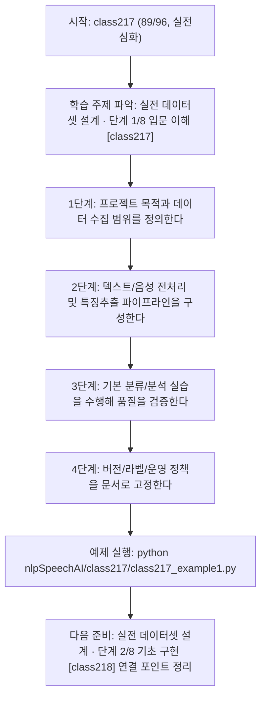
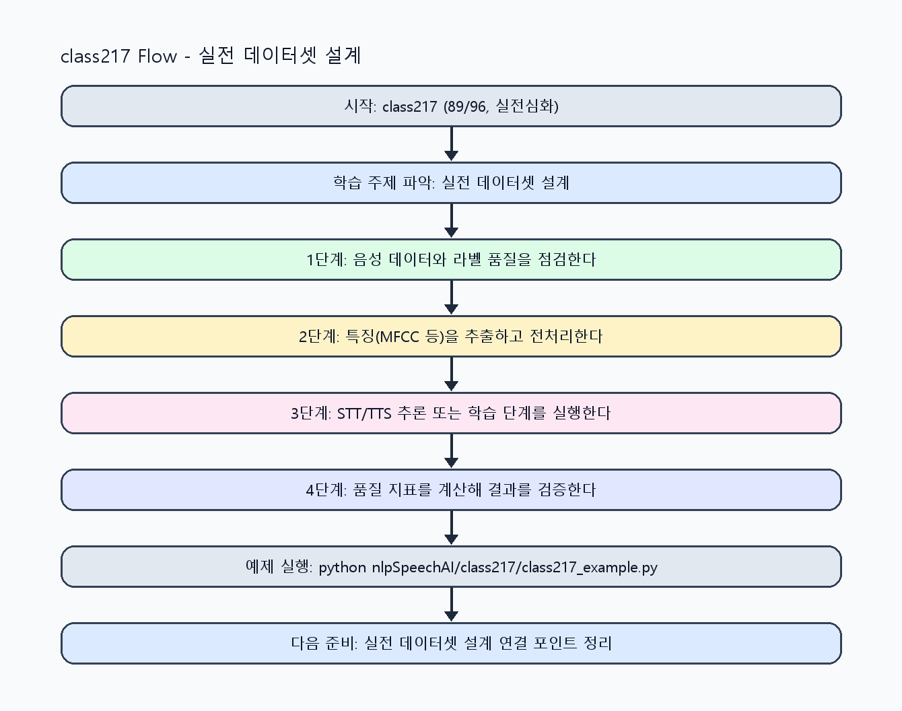

<!-- 이 파일은 www.edumgt.co.kr 의 에듀엠지티에 저작권이 있습니다 -->
# class217 자기주도 학습 가이드

## 1) 오늘의 학습 정보
- 교과목: **자연어 및 음성 데이터 활용 및 모델 개발**
- 학습 주제: **실전 데이터셋 설계 · 단계 1/8 입문 이해 [class217]**
- 세부 시퀀스: **89/96**
- 일정: **Day 28 / 1교시**
- 난이도: **실전심화**

### 교과목·학습주제 어휘 해설 (IT 강사 스타일)
#### 교과목 표현 분석: `자연어 및 음성 데이터 활용 및 모델 개발`
- 문법 포인트: 명사구를 연결어 '및'으로 병렬 연결한 구조입니다. 동등한 학습 범위를 함께 제시합니다.
- 기술 포인트: 음성 신호를 정제하고 STT/TTS 모델로 연결하는 음성 AI 교과목입니다.
| 용어 | 문법/품사 | 한글·한자 | 영어 | 기술 설명 |
| --- | --- | --- | --- | --- |
| `자연어` | 명사 | 자연어 (自然語) | natural language | 사람이 일상에서 사용하는 언어 텍스트/발화를 의미합니다. |
| `음성` | 명사 | 음성 (音聲) | speech/audio | 사람의 발화 신호를 디지털로 표현한 데이터입니다. |
| `데이터` | 명사(외래어) | 데이터 (한자 없음) | data | 분석, 학습, 추론의 입력이 되는 관측값 집합입니다. |
| `활용` | 명사/동사 어근 | 활용 (活用) | utilization | 이론이나 도구를 실제 문제 해결 맥락에 적용하는 행위입니다. |
| `모델` | 명사(외래어) | 모델 (한자 없음) | model | 입력과 출력 관계를 수학적으로 근사한 계산 구조입니다. |
| `개발` | 명사 | 개발 (開發) | development | 기능 기획, 구현, 검증을 통해 소프트웨어를 완성하는 과정입니다. |

#### 학습주제 표현 분석: `실전 데이터셋 설계 · 단계 1/8 입문 이해 [class217]`
- 문법 포인트: 핵심 개념 명사를 중심으로 한 명사구 구조입니다.
- 기술 포인트: 이번 차시는 `실전 데이터셋 설계 · 단계 1/8 입문 이해 [class217]` 용어를 중심으로 문제 정의, 코드 구현, 결과 검증까지 연결합니다.
| 용어 | 문법/품사 | 한글·한자 | 영어 | 기술 설명 |
| --- | --- | --- | --- | --- |
| `실전` | 명사(기술 개념어) | 실전 (한자 없음) | (context-specific) | 용어 `실전`: 이번 학습주제에서 정의해야 할 핵심 개념 용어입니다. |
| `데이터셋` | 명사(기술 개념어) | 데이터셋 (한자 없음) | (context-specific) | 용어 `데이터셋`: 이번 학습주제에서 정의해야 할 핵심 개념 용어입니다. |
| `설계` | 명사(기술 개념어) | 설계 (한자 없음) | (context-specific) | 용어 `설계`: 이번 학습주제에서 정의해야 할 핵심 개념 용어입니다. |
| `단계` | 명사(기술 개념어) | 단계 (한자 없음) | (context-specific) | 용어 `단계`: 이번 학습주제에서 정의해야 할 핵심 개념 용어입니다. |
| `입문` | 명사(기술 개념어) | 입문 (한자 없음) | (context-specific) | 용어 `입문`: 이번 학습주제에서 정의해야 할 핵심 개념 용어입니다. |
| `이해` | 명사(기술 개념어) | 이해 (한자 없음) | (context-specific) | 용어 `이해`: 이번 학습주제에서 정의해야 할 핵심 개념 용어입니다. |

## 2) 이전에 배운 내용 (복습)
- 이전 차시: **class216 / 멀티모달 데이터 연결 · 단계 8/8 운영 최적화 [class216]** (Day 27 / 8교시)
- 복습 연결: 이전에 배운 **멀티모달 데이터 연결 · 단계 8/8 운영 최적화 [class216]** 를 떠올리며, 오늘 **실전 데이터셋 설계 · 단계 1/8 입문 이해 [class217]** 와 어떤 점이 이어지는지 비교해 보세요.

## 3) 주제를 아주 쉽게 이해하기
- 한 줄 설명: 뉴스/리뷰 텍스트와 오디오 샘플을 함께 다루는 프로젝트형 데이터셋 설계 차시입니다.
- 왜 배우나요?: AI 응용 프로젝트에서는 데이터 정의·전처리·품질검증·라벨링 정책을 한 번에 설계해야 재현성이 확보됩니다.

### 핵심 개념 3가지
1. `실전 데이터셋`은 데이터 수집 기준, 라벨 규칙, 품질 임계치를 함께 정의해야 합니다.
2. `실습 예시`로 뉴스/리뷰 전처리, 기본 텍스트 분류, 오디오 파일 분석, 음성 특징 추출을 통합합니다.
3. `운영 관점`에서 데이터 버전관리와 재학습 트리거를 설계해야 지속 개선이 가능합니다.

### 비유로 이해하기
- 노래 경연 점수를 매길 때 음정, 박자, 발음을 항목별로 보는 것과 비슷해요.

## 4) 실습 환경 만들기 (항상 먼저)
아래 명령은 **처음 한 번** 준비해 두면 이후 학습이 쉬워집니다.

### Windows PowerShell
```powershell
cd C:\DevOps\Python-AI_Agent-Class
python -m venv .venv
.\.venv\Scripts\Activate.ps1
python -m pip install --upgrade pip
pip install -r requirements.txt
```

### Linux/macOS (bash)
```bash
cd /path/to/Python-AI_Agent-Class
python3 -m venv .venv
source .venv/bin/activate
python -m pip install --upgrade pip
pip install -r requirements.txt
```

## 5) 오늘의 예제 코드
- 예제 파일: `class217_example1.py`
- 실행 명령:
```bash
python nlpSpeechAI/class217/class217_example1.py
```

### example1~example5 단계별 테스트 확장
1. example1: 뉴스/리뷰 전처리와 기본 분류를 통합 실행한다.
2. example2: 오디오 파일 분석과 특징 추출을 확장한다.
3. example3: 라벨/메타데이터 오류 시나리오를 점검한다.
4. example4: 데이터 품질 기준과 샘플링 전략을 비교한다.
5. example5: 프로젝트형 데이터셋 운영 기준(버전/재학습)을 정리한다.

<!-- AUTO-GENERATED: TECH_STACK_FLOW START -->
### 기술 스택
- 언어: `Python 3`
- 실행: `CLI` (`python nlpSpeechAI/class217/class217_example1.py`)
- 주요 문법: `데이터 스키마`, `품질 기준 함수`, `통합 실습 스크립트`, `버전 메타데이터`
- 학습 포커스: `실전 데이터셋 설계 · 단계 1/8 입문 이해 [class217]`

### 실습 example1.py 동작 원리 (Mermaid Flowchart)


### Flow PNG 캡처

<!-- AUTO-GENERATED: TECH_STACK_FLOW END -->

### 예제 코드를 볼 때 집중할 포인트
1. 실습 데이터가 목표 과업(분류/인식/합성)에 맞게 구성됐는지 확인하기
2. 품질 기준 미달 데이터의 처리 정책이 정의됐는지 점검하기
3. 재현 가능한 실험 로그와 버전 메타가 남는지 확인하기

## 6) 퀴즈로 복습하기 (10문항)
- 퀴즈 파일: `class217_quiz.html`
- 브라우저에서 열기:
```bash
nlpSpeechAI/class217/class217_quiz.html
```
- 버튼 설명:
1. `채점하기`: 현재 선택한 답으로 점수를 계산해요.
2. `다시풀기`: 선택을 모두 지우고 처음부터 다시 풀어요.

## 7) 혼자 실습 순서 (초등학생 버전)
1. 코드를 한 번 그대로 실행해요.
2. 숫자/문장 값을 1개 바꿔요.
3. 결과가 왜 바뀌었는지 한 줄로 적어요.
4. 함수를 1개 더 만들어 작은 기능을 추가해요.

### 실습 미션
1. 뉴스/리뷰 텍스트 전처리와 기본 분류 파이프라인을 구성하세요.
2. 오디오 샘플 분석 후 MFCC 기반 특징 추출 결과를 리포트하세요.
3. 데이터셋 버전/라벨 정책/품질 기준 문서를 작성하세요.

## 8) 스스로 점검 체크리스트
- [ ] 텍스트/음성 통합 데이터셋 설계를 문서화했다.
- [ ] 기본 텍스트 분류와 음성 특징 추출 실습을 모두 수행했다.
- [ ] 품질 기준과 재학습 트리거를 명시했다.

## 9) 막히면 이렇게 해결해요
1. 에러 메시지 마지막 줄을 먼저 읽어요.
2. 함수 이름과 괄호 짝을 확인해요.
3. `print()`를 넣어 중간 값을 확인해요.
4. 그래도 안 되면 어제 성공한 코드와 한 줄씩 비교해요.

## 10) 학습 후 다음에 배울 내용
- 다음 차시: **class218 / 실전 데이터셋 설계 · 단계 2/8 기초 구현 [class218]** (Day 28 / 2교시)
- 미리보기: 다음 차시 전에 **실전 데이터셋 설계 · 단계 1/8 입문 이해 [class217]** 핵심 코드 1개를 다시 실행해 두면 실전 데이터셋 설계 · 단계 2/8 기초 구현 [class218] 학습이 더 쉬워집니다.

## 11) 다음 차시 연결
- 다음 과목에서는 음성 모델 심화(STT/TTS) 관점으로 품질 개선 루프를 확장합니다.
- 오늘 코드를 복사하지 말고, 직접 다시 작성해 보세요.
