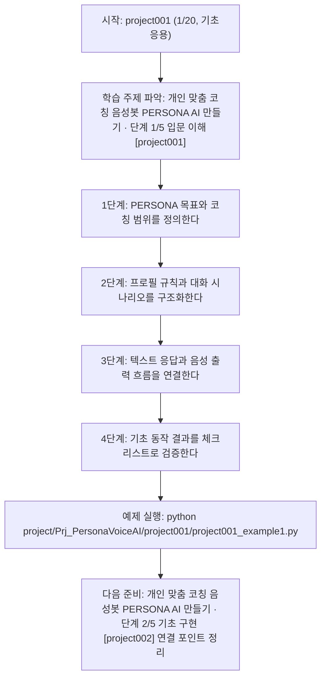

<!-- 이 파일은 www.edumgt.co.kr 의 에듀엠지티에 저작권이 있습니다 -->
# project001 자기주도 학습 가이드

## 1) 오늘의 학습 정보
- 교과목: **프로젝트**
- 학습 주제: **개인 맞춤 코칭 음성봇 PERSONA AI 만들기 · 단계 1/5 입문 이해 [project001]**
- 세부 시퀀스: **1/20**
- 일정: **Day 63 / 5교시**
- 난이도: **기초응용**

### 교과목·학습주제 어휘 해설 (IT 강사 스타일)
#### 교과목 표현 분석: `프로젝트`
- 문법 포인트: 핵심 개념 명사를 중심으로 한 명사구 구조입니다.
- 기술 포인트: 핵심 용어를 기능 단위로 분해해 구현까지 연결하는 실습 중심 교과목입니다.
| 용어 | 문법/품사 | 한글·한자 | 영어 | 기술 설명 |
| --- | --- | --- | --- | --- |
| `프로젝트` | 명사(주제 핵심 용어) | 프로젝트 (한자 없음) | (topic-specific) | 이번 차시 맥락: 개인 맞춤 코칭 음성봇 PERSONA AI를 기초부터 설계하는 프로젝트 시작 구간입니다. 이를 기준으로 `프로젝트`를 코드와 결과 해석에 연결합니다. |

#### 학습주제 표현 분석: `개인 맞춤 코칭 음성봇 PERSONA AI 만들기 · 단계 1/5 입문 이해 [project001]`
- 문법 포인트: 핵심 개념 명사를 중심으로 한 명사구 구조입니다.
- 기술 포인트: 이번 차시는 `개인 맞춤 코칭 음성봇 PERSONA AI 만들기` 핵심 개념을 코드 구현, 결과 해석, 점검 기준으로 연결합니다.
| 용어 | 문법/품사 | 한글·한자 | 영어 | 기술 설명 |
| --- | --- | --- | --- | --- |
| `개인` | 명사(주제 핵심 용어) | 개인 (한자 없음) | (topic-specific) | 이번 차시 맥락: 개인 맞춤 코칭 음성봇 PERSONA AI를 기초부터 설계하는 프로젝트 시작 구간입니다. 이를 기준으로 `개인`를 코드와 결과 해석에 연결합니다. |
| `맞춤` | 명사(주제 핵심 용어) | 맞춤 (한자 없음) | (topic-specific) | 이번 차시 맥락: 개인 맞춤 코칭 음성봇 PERSONA AI를 기초부터 설계하는 프로젝트 시작 구간입니다. 이를 기준으로 `맞춤`를 코드와 결과 해석에 연결합니다. |
| `코칭` | 명사(주제 핵심 용어) | 코칭 (한자 없음) | (topic-specific) | 이번 차시 맥락: 개인 맞춤 코칭 음성봇 PERSONA AI를 기초부터 설계하는 프로젝트 시작 구간입니다. 이를 기준으로 `코칭`를 코드와 결과 해석에 연결합니다. |
| `음성봇` | 명사(주제 핵심 용어) | 음성봇 (한자 없음) | (topic-specific) | 이번 차시 맥락: 개인 맞춤 코칭 음성봇 PERSONA AI를 기초부터 설계하는 프로젝트 시작 구간입니다. 이를 기준으로 `음성봇`를 코드와 결과 해석에 연결합니다. |
| `PERSONA` | 고유명사(프로필 개념) | PERSONA (한자 없음) | persona | 목표 화자의 말투·톤·스타일·금지 규칙을 구조화해 모델 응답 일관성을 유지하는 프로필입니다. |
| `AI` | 영문 기술명/약어 | AI (한자 없음) | AI | 이번 차시 맥락: 개인 맞춤 코칭 음성봇 PERSONA AI를 기초부터 설계하는 프로젝트 시작 구간입니다. 이를 기준으로 `AI`를 코드와 결과 해석에 연결합니다. |

## 2) 이전에 배운 내용 (복습)
- 이전 차시가 없습니다. 이 차시는 전체 과정의 시작점입니다.
- 오늘은 학습 규칙과 기본 흐름을 만드는 데 집중하세요.

## 3) 주제를 아주 쉽게 이해하기
- 한 줄 설명: 개인 맞춤 코칭 음성봇 PERSONA AI를 기초부터 설계하는 프로젝트 시작 구간입니다.
- 왜 배우나요?: 이미지 요구사항의 1축인 개인 맞춤 코칭 음성봇 PERSONA AI 기초 구축을 구현하려면 페르소나 정의와 코칭 시나리오가 먼저 고정돼야 합니다.

### 핵심 개념 3가지
1. `PERSONA 프로필`은 톤, 말속도, 코칭 스타일, 금지 표현을 구조화해 일관된 음성 응답을 만드는 기준입니다.
2. `코칭 시나리오`는 목표-질문-피드백 흐름을 단계별로 설계해 사용자 경험을 안정화합니다.
3. `기초 파이프라인`은 입력 텍스트 -> 응답 생성 -> 음성 출력 흐름을 최소 기능으로 연결하는 작업입니다.

### 비유로 이해하기
- 큰 퍼즐을 색깔별로 나눠 맞추는 방법과 같아요.

## 4) 실습 환경 만들기 (항상 먼저)
아래 명령은 **처음 한 번** 준비해 두면 이후 학습이 쉬워집니다.

### Windows PowerShell
```powershell
cd C:\DevOps\Python-AI_Agent-Class
python -m venv .venv
.\.venv\Scripts\Activate.ps1
python -m pip install --upgrade pip
pip install -r requirements.txt
```

### Linux/macOS (bash)
```bash
cd /path/to/Python-AI_Agent-Class
python3 -m venv .venv
source .venv/bin/activate
python -m pip install --upgrade pip
pip install -r requirements.txt
```

## 5) 오늘의 예제 코드
- 예제 파일: `project001_example1.py`
- 실행 명령:
```bash
python project/Prj_PersonaVoiceAI/project001/project001_example1.py
```

### example1~example5 단계별 테스트 확장
1. example1: PERSONA 프로필과 기본 코칭 시나리오를 정의한다.
2. example2: 입력 유형(목표/톤/길이)을 확장해 응답 일관성을 점검한다.
3. example3: 금지 표현/빈 입력 등 실패 케이스를 재현한다.
4. example4: 코칭 응답 품질 지표를 비교해 규칙을 개선한다.
5. example5: 운영 체크리스트(로그/알림/롤백)를 반영한다.

<!-- AUTO-GENERATED: TECH_STACK_FLOW START -->
### 기술 스택
- 언어: `Python 3`
- 실행: `CLI` (`python project/Prj_PersonaVoiceAI/project001/project001_example1.py`)
- 주요 문법: `프로필 dict`, `규칙 기반 라우팅`, `코칭 시나리오 함수`, `실행 로그 출력`
- 학습 포커스: `개인 맞춤 코칭 음성봇 PERSONA AI 만들기 · 단계 1/5 입문 이해 [project001]`

### 실습 example1.py 동작 원리 (Mermaid Flowchart)


### Flow PNG 캡처

<!-- AUTO-GENERATED: TECH_STACK_FLOW END -->

### 예제 코드를 볼 때 집중할 포인트
1. 페르소나 규칙이 구체적이고 충돌 없이 정의됐는지 확인하기
2. 코칭 응답이 과도한 일반 답변으로 흐르지 않는지 점검하기
3. 실패 케이스 로그(금지 표현/빈 입력)를 남기는지 확인하기

## 6) 퀴즈로 복습하기 (10문항)
- 퀴즈 파일: `project001_quiz.html`
- 브라우저에서 열기:
```bash
project/Prj_PersonaVoiceAI/project001/project001_quiz.html
```
- 버튼 설명:
1. `채점하기`: 현재 선택한 답으로 점수를 계산해요.
2. `다시풀기`: 선택을 모두 지우고 처음부터 다시 풀어요.

## 7) 혼자 실습 순서 (초등학생 버전)
1. 코드를 한 번 그대로 실행해요.
2. 숫자/문장 값을 1개 바꿔요.
3. 결과가 왜 바뀌었는지 한 줄로 적어요.
4. 함수를 1개 더 만들어 작은 기능을 추가해요.

### 실습 미션
1. 페르소나 프로필(JSON)을 작성해 톤/속도/스타일 규칙을 정의하세요.
2. 기본 코칭 대화 3턴을 설계하고 실패 문장(금지 표현) 필터를 추가하세요.
3. 텍스트 응답을 음성 출력 규칙으로 변환하는 baseline 함수를 구현하세요.

## 8) 스스로 점검 체크리스트
- [ ] PERSONA 프로필(톤/스타일/금지 규칙)을 작성했다.
- [ ] 코칭 대화 흐름(질문-피드백-다음 행동)을 정의했다.
- [ ] 최소 동작 파이프라인을 실행하고 로그를 남겼다.

## 9) 막히면 이렇게 해결해요
1. 에러 메시지 마지막 줄을 먼저 읽어요.
2. 함수 이름과 괄호 짝을 확인해요.
3. `print()`를 넣어 중간 값을 확인해요.
4. 그래도 안 되면 어제 성공한 코드와 한 줄씩 비교해요.

## 10) 학습 후 다음에 배울 내용
- 다음 차시: **project002 / 개인 맞춤 코칭 음성봇 PERSONA AI 만들기 · 단계 2/5 기초 구현 [project002]** (Day 63 / 6교시)
- 미리보기: 다음 차시 전에 **개인 맞춤 코칭 음성봇 PERSONA AI 만들기 · 단계 1/5 입문 이해 [project001]** 핵심 코드 1개를 다시 실행해 두면 개인 맞춤 코칭 음성봇 PERSONA AI 만들기 · 단계 2/5 기초 구현 [project002] 학습이 더 쉬워집니다.

## 11) 다음 차시 연결
- 다음 구간에서는 STT↔LLM↔TTS 실시간 루프로 코칭 대화를 고도화합니다.
- 오늘 코드를 복사하지 말고, 직접 다시 작성해 보세요.
