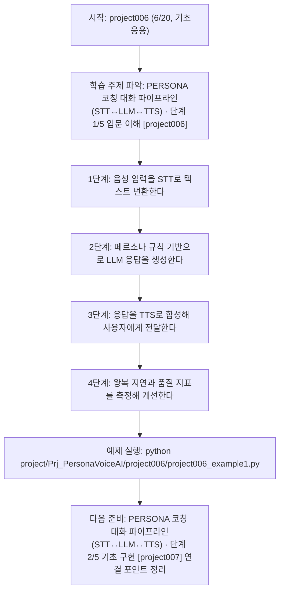

<!-- 이 파일은 www.edumgt.co.kr 의 에듀엠지티에 저작권이 있습니다 -->
# project006 자기주도 학습 가이드

## 1) 오늘의 학습 정보
- 교과목: **프로젝트**
- 학습 주제: **PERSONA 코칭 대화 파이프라인(STT↔LLM↔TTS) · 단계 1/5 입문 이해 [project006]**
- 세부 시퀀스: **6/20**
- 일정: **Day 64 / 2교시**
- 난이도: **기초응용**

### 교과목·학습주제 어휘 해설 (IT 강사 스타일)
#### 교과목 표현 분석: `프로젝트`
- 문법 포인트: 핵심 개념 명사를 중심으로 한 명사구 구조입니다.
- 기술 포인트: 핵심 용어를 기능 단위로 분해해 구현까지 연결하는 실습 중심 교과목입니다.
| 용어 | 문법/품사 | 한글·한자 | 영어 | 기술 설명 |
| --- | --- | --- | --- | --- |
| `프로젝트` | 명사(주제 핵심 용어) | 프로젝트 (한자 없음) | (topic-specific) | `프로젝트`는 `PERSONA 코칭 대화 파이프라인(STT↔LLM↔TTS)` 주제에서 구현/검증 흐름을 이해하기 위해 먼저 정의해야 할 용어입니다. |

#### 학습주제 표현 분석: `PERSONA 코칭 대화 파이프라인(STT↔LLM↔TTS) · 단계 1/5 입문 이해 [project006]`
- 문법 포인트: 핵심 개념 명사를 중심으로 한 명사구 구조입니다.
- 기술 포인트: 이번 차시는 `PERSONA 코칭 대화 파이프라인(STT↔LLM↔TTS)` 핵심 개념을 코드 구현, 결과 해석, 점검 기준으로 연결합니다.
| 용어 | 문법/품사 | 한글·한자 | 영어 | 기술 설명 |
| --- | --- | --- | --- | --- |
| `PERSONA` | 고유명사(프로필 개념) | PERSONA (한자 없음) | persona | 목표 화자의 말투·톤·스타일·금지 규칙을 구조화해 모델 응답 일관성을 유지하는 프로필입니다. |
| `코칭` | 명사(주제 핵심 용어) | 코칭 (한자 없음) | (topic-specific) | 이번 차시 맥락: 음성 입력(STT)과 생성(LLM), 음성 출력(TTS)을 묶어 코칭 루프를 완성하는 구간입니다. 이를 기준으로 `코칭`를 코드와 결과 해석에 연결합니다. |
| `대화` | 명사(주제 핵심 용어) | 대화 (한자 없음) | (topic-specific) | `대화`는 `PERSONA 코칭 대화 파이프라인(STT↔LLM↔TTS)` 주제에서 구현/검증 흐름을 이해하기 위해 먼저 정의해야 할 용어입니다. |
| `파이프라인` | 명사(외래어) | 파이프라인 (한자 없음) | pipeline | 여러 처리 단계를 자동으로 연결한 실행 흐름입니다. |
| `STT` | 약어명사 | STT (한자 없음) | Speech-to-Text | 음성 신호를 텍스트로 변환하는 기술입니다. |
| `LLM` | 약어명사 | LLM (한자 없음) | Large Language Model | 대규모 텍스트로 사전학습된 생성형 언어 모델입니다. |

## 2) 이전에 배운 내용 (복습)
- 이전 차시: **project005 / 개인 맞춤 코칭 음성봇 PERSONA AI 만들기 · 단계 5/5 운영 최적화 [project005]** (Day 64 / 1교시)
- 복습 연결: 이전에 배운 **개인 맞춤 코칭 음성봇 PERSONA AI 만들기 · 단계 5/5 운영 최적화 [project005]** 를 떠올리며, 오늘 **PERSONA 코칭 대화 파이프라인(STT↔LLM↔TTS) · 단계 1/5 입문 이해 [project006]** 와 어떤 점이 이어지는지 비교해 보세요.

## 3) 주제를 아주 쉽게 이해하기
- 한 줄 설명: 음성 입력(STT)과 생성(LLM), 음성 출력(TTS)을 묶어 코칭 루프를 완성하는 구간입니다.
- 왜 배우나요?: 개인 코칭봇을 서비스처럼 쓰려면 단일 모델이 아니라 `STT→LLM→TTS` 왕복 지연과 품질을 함께 제어해야 합니다.

### 핵심 개념 3가지
1. `STT 품질`은 코칭 의도 인식 정확도에 직접 영향해 오인식 대응 로직이 필요합니다.
2. `LLM 응답 제어`는 페르소나 규칙과 안전 정책을 함께 반영해야 일관성이 유지됩니다.
3. `TTS 출력 조절`은 말속도·억양·길이를 상황별로 조정해 사용자 피드백 수용도를 높입니다.

### 비유로 이해하기
- 큰 퍼즐을 색깔별로 나눠 맞추는 방법과 같아요.

## 4) 실습 환경 만들기 (항상 먼저)
아래 명령은 **처음 한 번** 준비해 두면 이후 학습이 쉬워집니다.

### Windows PowerShell
```powershell
cd C:\DevOps\Python-AI_Agent-Class
python -m venv .venv
.\.venv\Scripts\Activate.ps1
python -m pip install --upgrade pip
pip install -r requirements.txt
```

### Linux/macOS (bash)
```bash
cd /path/to/Python-AI_Agent-Class
python3 -m venv .venv
source .venv/bin/activate
python -m pip install --upgrade pip
pip install -r requirements.txt
```

## 5) 오늘의 예제 코드
- 예제 파일: `project006_example1.py`
- 실행 명령:
```bash
python project/Prj_PersonaVoiceAI/project006/project006_example1.py
```

### example1~example5 단계별 테스트 확장
1. example1: STT→LLM→TTS 기본 루프를 실행한다.
2. example2: STT 신뢰도 기준과 재질문 fallback을 적용한다.
3. example3: LLM 톤 이탈/환각 시나리오를 점검한다.
4. example4: TTS 속도/톤 파라미터 조합별 품질을 비교한다.
5. example5: 왕복 지연과 안정성 지표 기반 운영 기준을 정리한다.

<!-- AUTO-GENERATED: TECH_STACK_FLOW START -->
### 기술 스택
- 언어: `Python 3`
- 실행: `CLI` (`python project/Prj_PersonaVoiceAI/project006/project006_example1.py`)
- 주요 문법: `STT 결과 스코어`, `프롬프트 가드레일`, `TTS 파라미터 설정`, `파이프라인 상태 로그`
- 학습 포커스: `PERSONA 코칭 대화 파이프라인(STT↔LLM↔TTS) · 단계 1/5 입문 이해 [project006]`

### 실습 example1.py 동작 원리 (Mermaid Flowchart)


### Flow PNG 캡처

<!-- AUTO-GENERATED: TECH_STACK_FLOW END -->

### 예제 코드를 볼 때 집중할 포인트
1. STT 오류 시 재시도/재질문 정책이 있는지 확인하기
2. LLM 응답이 PERSONA 스타일을 유지하는지 점검하기
3. TTS 길이/속도/톤 조합이 과도하지 않은지 확인하기

## 6) 퀴즈로 복습하기 (10문항)
- 퀴즈 파일: `project006_quiz.html`
- 브라우저에서 열기:
```bash
project/Prj_PersonaVoiceAI/project006/project006_quiz.html
```
- 버튼 설명:
1. `채점하기`: 현재 선택한 답으로 점수를 계산해요.
2. `다시풀기`: 선택을 모두 지우고 처음부터 다시 풀어요.

## 7) 혼자 실습 순서 (초등학생 버전)
1. 코드를 한 번 그대로 실행해요.
2. 숫자/문장 값을 1개 바꿔요.
3. 결과가 왜 바뀌었는지 한 줄로 적어요.
4. 함수를 1개 더 만들어 작은 기능을 추가해요.

### 실습 미션
1. STT 결과 신뢰도 임계치를 정하고 재질문 fallback을 구현하세요.
2. LLM 응답에 PERSONA 규칙 프롬프트를 주입해 톤 일관성을 비교하세요.
3. TTS 속도/톤 파라미터를 바꿔 코칭 문장 샘플을 테스트하세요.

## 8) 스스로 점검 체크리스트
- [ ] STT 오인식 대응(재질문/정정)을 적용했다.
- [ ] LLM 응답에 페르소나 규칙을 강제했다.
- [ ] TTS 출력 품질(톤/속도/자연스러움)을 비교 기록했다.

## 9) 막히면 이렇게 해결해요
1. 에러 메시지 마지막 줄을 먼저 읽어요.
2. 함수 이름과 괄호 짝을 확인해요.
3. `print()`를 넣어 중간 값을 확인해요.
4. 그래도 안 되면 어제 성공한 코드와 한 줄씩 비교해요.

## 10) 학습 후 다음에 배울 내용
- 다음 차시: **project007 / PERSONA 코칭 대화 파이프라인(STT↔LLM↔TTS) · 단계 2/5 기초 구현 [project007]** (Day 64 / 3교시)
- 미리보기: 다음 차시 전에 **PERSONA 코칭 대화 파이프라인(STT↔LLM↔TTS) · 단계 1/5 입문 이해 [project006]** 핵심 코드 1개를 다시 실행해 두면 PERSONA 코칭 대화 파이프라인(STT↔LLM↔TTS) · 단계 2/5 기초 구현 [project007] 학습이 더 쉬워집니다.

## 11) 다음 차시 연결
- 다음 구간에서는 사전 데이터 기반으로 페르소나 품질을 안정화합니다.
- 오늘 코드를 복사하지 말고, 직접 다시 작성해 보세요.
