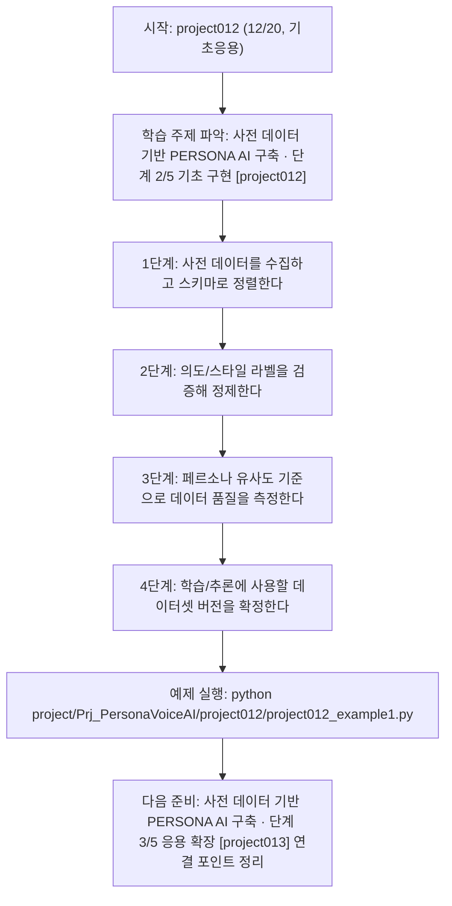

<!-- 이 파일은 www.edumgt.co.kr 의 에듀엠지티에 저작권이 있습니다 -->
# project012 자기주도 학습 가이드

## 1) 오늘의 학습 정보
- 교과목: **프로젝트**
- 학습 주제: **사전 데이터 기반 PERSONA AI 구축 · 단계 2/5 기초 구현 [project012]**
- 세부 시퀀스: **12/20**
- 일정: **Day 64 / 8교시**
- 난이도: **기초응용**

### 교과목·학습주제 어휘 해설 (IT 강사 스타일)
#### 교과목 표현 분석: `프로젝트`
- 문법 포인트: 핵심 개념 명사를 중심으로 한 명사구 구조입니다.
- 기술 포인트: 핵심 용어를 기능 단위로 분해해 구현까지 연결하는 실습 중심 교과목입니다.
| 용어 | 문법/품사 | 한글·한자 | 영어 | 기술 설명 |
| --- | --- | --- | --- | --- |
| `프로젝트` | 명사(주제 핵심 용어) | 프로젝트 (한자 없음) | (topic-specific) | `프로젝트`는 `사전 데이터 기반 PERSONA AI 구축` 주제에서 구현/검증 흐름을 이해하기 위해 먼저 정의해야 할 용어입니다. |

#### 학습주제 표현 분석: `사전 데이터 기반 PERSONA AI 구축 · 단계 2/5 기초 구현 [project012]`
- 문법 포인트: 핵심 개념 명사를 중심으로 한 명사구 구조입니다.
- 기술 포인트: 이번 차시는 `사전 데이터 기반 PERSONA AI 구축` 핵심 개념을 코드 구현, 결과 해석, 점검 기준으로 연결합니다.
| 용어 | 문법/품사 | 한글·한자 | 영어 | 기술 설명 |
| --- | --- | --- | --- | --- |
| `사전` | 명사(주제 핵심 용어) | 사전 (한자 없음) | (topic-specific) | 이번 차시 맥락: 사전 데이터(대화 스크립트/음성 샘플/라벨)를 기반으로 PERSONA AI를 학습용 구조로 정리하는 구간입니다. 이를 기준으로 `사전`를 코드와 결과 해석에 연결합니다. |
| `데이터` | 명사(외래어) | 데이터 (한자 없음) | data | 분석, 학습, 추론의 입력이 되는 관측값 집합입니다. |
| `PERSONA` | 고유명사(프로필 개념) | PERSONA (한자 없음) | persona | 목표 화자의 말투·톤·스타일·금지 규칙을 구조화해 모델 응답 일관성을 유지하는 프로필입니다. |
| `AI` | 영문 기술명/약어 | AI (한자 없음) | AI | 이번 차시 맥락: 사전 데이터(대화 스크립트/음성 샘플/라벨)를 기반으로 PERSONA AI를 학습용 구조로 정리하는 구간입니다. 이를 기준으로 `AI`를 코드와 결과 해석에 연결합니다. |
| `구축` | 명사(주제 핵심 용어) | 구축 (한자 없음) | (topic-specific) | 이번 차시 맥락: 이미지 요구사항의 2축인 사전 데이터 기반 PERSONA AI 구축과 지속학습을 위해선 데이터셋 품질과 라벨 정책이 먼저 갖춰져야 합니다. 이를 기준으로 `구축`를 코드와 결과 해석에 연결합니다. |
| `데이터셋` | 명사(주제 핵심 용어) | 데이터셋 (한자 없음) | (topic-specific) | 이번 차시 맥락: 이미지 요구사항의 2축인 사전 데이터 기반 PERSONA AI 구축과 지속학습을 위해선 데이터셋 품질과 라벨 정책이 먼저 갖춰져야 합니다. 이를 기준으로 `데이터셋`를 코드와 결과 해석에 연결합니다. |

## 2) 이전에 배운 내용 (복습)
- 이전 차시: **project011 / 사전 데이터 기반 PERSONA AI 구축 · 단계 1/5 입문 이해 [project011]** (Day 64 / 7교시)
- 복습 연결: 이전에 배운 **사전 데이터 기반 PERSONA AI 구축 · 단계 1/5 입문 이해 [project011]** 를 떠올리며, 오늘 **사전 데이터 기반 PERSONA AI 구축 · 단계 2/5 기초 구현 [project012]** 와 어떤 점이 이어지는지 비교해 보세요.

## 3) 주제를 아주 쉽게 이해하기
- 한 줄 설명: 사전 데이터(대화 스크립트/음성 샘플/라벨)를 기반으로 PERSONA AI를 학습용 구조로 정리하는 구간입니다.
- 왜 배우나요?: 이미지 요구사항의 2축인 사전 데이터 기반 PERSONA AI 구축과 지속학습을 위해선 데이터셋 품질과 라벨 정책이 먼저 갖춰져야 합니다.

### 핵심 개념 3가지
1. `사전 데이터셋`은 대화 의도, 코칭 답변, 음성 샘플을 연결한 학습 자산입니다.
2. `라벨 일관성`은 같은 상황에서 같은 의도/피드백 라벨이 유지되도록 관리하는 품질 기준입니다.
3. `페르소나 유사도`는 생성 응답이 목표 화자 스타일을 얼마나 따르는지 측정하는 지표입니다.

### 비유로 이해하기
- 큰 퍼즐을 색깔별로 나눠 맞추는 방법과 같아요.

## 4) 실습 환경 만들기 (항상 먼저)
아래 명령은 **처음 한 번** 준비해 두면 이후 학습이 쉬워집니다.

### Windows PowerShell
```powershell
cd C:\DevOps\Python-AI_Agent-Class
python -m venv .venv
.\.venv\Scripts\Activate.ps1
python -m pip install --upgrade pip
pip install -r requirements.txt
```

### Linux/macOS (bash)
```bash
cd /path/to/Python-AI_Agent-Class
python3 -m venv .venv
source .venv/bin/activate
python -m pip install --upgrade pip
pip install -r requirements.txt
```

## 5) 오늘의 예제 코드
- 예제 파일: `project012_example1.py`
- 실행 명령:
```bash
python project/Prj_PersonaVoiceAI/project012/project012_example1.py
```

### example1~example5 단계별 테스트 확장
1. example1: 코칭 데이터 스키마(intent/response/style)를 정의한다.
2. example2: 라벨 분포와 누락 데이터를 점검한다.
3. example3: 라벨 충돌/잡음 데이터를 정제한다.
4. example4: 페르소나 유사도 지표를 계산해 비교한다.
5. example5: 데이터셋 버전 관리와 재학습 후보 큐를 구성한다.

<!-- AUTO-GENERATED: TECH_STACK_FLOW START -->
### 기술 스택
- 언어: `Python 3`
- 실행: `CLI` (`python project/Prj_PersonaVoiceAI/project012/project012_example1.py`)
- 주요 문법: `데이터 스키마 dict`, `라벨 검증 함수`, `유사도 점수 계산`, `품질 리포트`
- 학습 포커스: `사전 데이터 기반 PERSONA AI 구축 · 단계 2/5 기초 구현 [project012]`

### 실습 example1.py 동작 원리 (Mermaid Flowchart)


### Flow PNG 캡처

<!-- AUTO-GENERATED: TECH_STACK_FLOW END -->

### 예제 코드를 볼 때 집중할 포인트
1. 라벨 충돌/누락 데이터를 탐지하는지 확인하기
2. 데이터 버전과 변경 이력을 남기는지 점검하기
3. 유사도 지표가 단일 값이 아닌 복수 항목으로 구성됐는지 확인하기

## 6) 퀴즈로 복습하기 (10문항)
- 퀴즈 파일: `project012_quiz.html`
- 브라우저에서 열기:
```bash
project/Prj_PersonaVoiceAI/project012/project012_quiz.html
```
- 버튼 설명:
1. `채점하기`: 현재 선택한 답으로 점수를 계산해요.
2. `다시풀기`: 선택을 모두 지우고 처음부터 다시 풀어요.

## 7) 혼자 실습 순서 (초등학생 버전)
1. 코드를 한 번 그대로 실행해요.
2. 숫자/문장 값을 1개 바꿔요.
3. 결과가 왜 바뀌었는지 한 줄로 적어요.
4. 함수를 1개 더 만들어 작은 기능을 추가해요.

### 실습 미션
1. 코칭 대화 데이터를 intent/response/style 태그로 분할 정리하세요.
2. 라벨 충돌 샘플을 찾아 정정 규칙을 문서화하세요.
3. 샘플 응답의 페르소나 유사도 기준(톤/단어/길이)을 정의하세요.

## 8) 스스로 점검 체크리스트
- [ ] 학습용 대화·음성 데이터 스키마를 확정했다.
- [ ] 라벨 일관성 점검표를 작성했다.
- [ ] 페르소나 유사도 측정 기준을 정리했다.

## 9) 막히면 이렇게 해결해요
1. 에러 메시지 마지막 줄을 먼저 읽어요.
2. 함수 이름과 괄호 짝을 확인해요.
3. `print()`를 넣어 중간 값을 확인해요.
4. 그래도 안 되면 어제 성공한 코드와 한 줄씩 비교해요.

## 10) 학습 후 다음에 배울 내용
- 다음 차시: **project013 / 사전 데이터 기반 PERSONA AI 구축 · 단계 3/5 응용 확장 [project013]** (Day 65 / 1교시)
- 미리보기: 다음 차시 전에 **사전 데이터 기반 PERSONA AI 구축 · 단계 2/5 기초 구현 [project012]** 핵심 코드 1개를 다시 실행해 두면 사전 데이터 기반 PERSONA AI 구축 · 단계 3/5 응용 확장 [project013] 학습이 더 쉬워집니다.

## 11) 다음 차시 연결
- 다음 구간에서는 지속학습 루프와 운영 품질관리까지 완성합니다.
- 오늘 코드를 복사하지 말고, 직접 다시 작성해 보세요.
