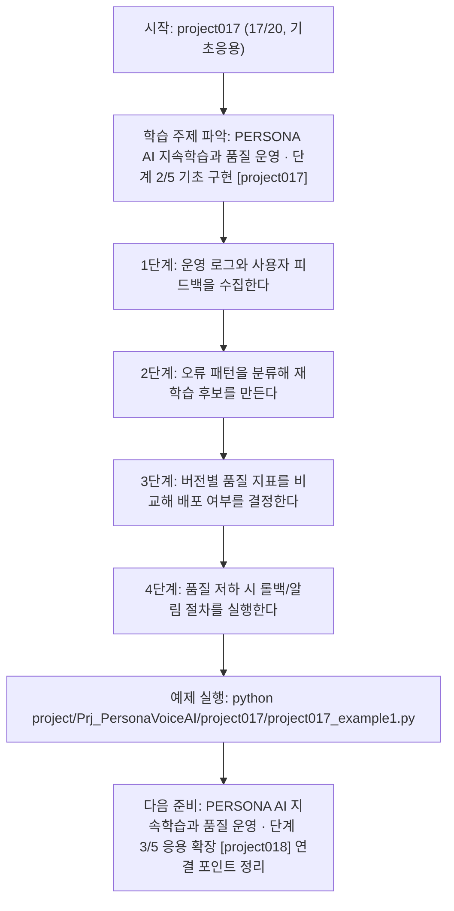

<!-- 이 파일은 www.edumgt.co.kr 의 에듀엠지티에 저작권이 있습니다 -->
# project017 자기주도 학습 가이드

## 1) 오늘의 학습 정보
- 교과목: **프로젝트**
- 학습 주제: **PERSONA AI 지속학습과 품질 운영 · 단계 2/5 기초 구현 [project017]**
- 세부 시퀀스: **17/20**
- 일정: **Day 65 / 5교시**
- 난이도: **기초응용**

### 교과목·학습주제 어휘 해설 (IT 강사 스타일)
#### 교과목 표현 분석: `프로젝트`
- 문법 포인트: 핵심 개념 명사를 중심으로 한 명사구 구조입니다.
- 기술 포인트: 핵심 용어를 기능 단위로 분해해 구현까지 연결하는 실습 중심 교과목입니다.
| 용어 | 문법/품사 | 한글·한자 | 영어 | 기술 설명 |
| --- | --- | --- | --- | --- |
| `프로젝트` | 명사(주제 핵심 용어) | 프로젝트 (한자 없음) | (topic-specific) | `프로젝트`는 `PERSONA AI 지속학습과 품질 운영` 주제에서 구현/검증 흐름을 이해하기 위해 먼저 정의해야 할 용어입니다. |

#### 학습주제 표현 분석: `PERSONA AI 지속학습과 품질 운영 · 단계 2/5 기초 구현 [project017]`
- 문법 포인트: 명사와 명사를 대등하게 묶는 병렬 명사구 구조입니다.
- 기술 포인트: 이번 차시는 `PERSONA AI 지속학습과 품질 운영` 핵심 개념을 코드 구현, 결과 해석, 점검 기준으로 연결합니다.
| 용어 | 문법/품사 | 한글·한자 | 영어 | 기술 설명 |
| --- | --- | --- | --- | --- |
| `PERSONA` | 고유명사(프로필 개념) | PERSONA (한자 없음) | persona | 목표 화자의 말투·톤·스타일·금지 규칙을 구조화해 모델 응답 일관성을 유지하는 프로필입니다. |
| `AI` | 영문 기술명/약어 | AI (한자 없음) | AI | 이번 차시 맥락: 배포 후 피드백 데이터를 이용해 PERSONA AI를 지속학습하고 품질을 운영하는 마무리 구간입니다. 이를 기준으로 `AI`를 코드와 결과 해석에 연결합니다. |
| `지속학습` | 명사(주제 핵심 용어) | 지속학습 (한자 없음) | (topic-specific) | 이번 차시 맥락: 배포 후 피드백 데이터를 이용해 PERSONA AI를 지속학습하고 품질을 운영하는 마무리 구간입니다. 이를 기준으로 `지속학습`를 코드와 결과 해석에 연결합니다. |
| `품질` | 명사 | 품질 (品質) | quality | 정확도, 일관성, 안정성처럼 결과가 요구사항을 만족하는 정도를 나타내는 기준입니다. |
| `루프` | 명사(주제 핵심 용어) | 루프 (한자 없음) | (topic-specific) | 이번 차시 맥락: 실제 서비스에서는 초기 모델보다 운영 중 수집되는 피드백을 반영하는 지속학습 루프가 성능과 만족도를 좌우합니다. 이를 기준으로 `루프`를 코드와 결과 해석에 연결합니다. |
| `지표` | 명사 | 지표 (指標) | metric | 정확도, F1, MAE처럼 성능을 수치화하는 기준값입니다. |

## 2) 이전에 배운 내용 (복습)
- 이전 차시: **project016 / PERSONA AI 지속학습과 품질 운영 · 단계 1/5 입문 이해 [project016]** (Day 65 / 4교시)
- 복습 연결: 이전에 배운 **PERSONA AI 지속학습과 품질 운영 · 단계 1/5 입문 이해 [project016]** 를 떠올리며, 오늘 **PERSONA AI 지속학습과 품질 운영 · 단계 2/5 기초 구현 [project017]** 와 어떤 점이 이어지는지 비교해 보세요.

## 3) 주제를 아주 쉽게 이해하기
- 한 줄 설명: 배포 후 피드백 데이터를 이용해 PERSONA AI를 지속학습하고 품질을 운영하는 마무리 구간입니다.
- 왜 배우나요?: 실제 서비스에서는 초기 모델보다 운영 중 수집되는 피드백을 반영하는 지속학습 루프가 성능과 만족도를 좌우합니다.

### 핵심 개념 3가지
1. `지속학습 루프`는 로그 수집 -> 오류 분류 -> 재학습 -> 재배포를 반복하는 개선 구조입니다.
2. `품질 운영 지표`는 응답 만족도, 페르소나 유지율, 지연시간, 실패율을 함께 봐야 합니다.
3. `운영 안전장치`는 롤백, 알림, 수동 검수 큐를 통해 품질 하락을 빠르게 차단합니다.

### 비유로 이해하기
- 큰 퍼즐을 색깔별로 나눠 맞추는 방법과 같아요.

## 4) 실습 환경 만들기 (항상 먼저)
아래 명령은 **처음 한 번** 준비해 두면 이후 학습이 쉬워집니다.

### Windows PowerShell
```powershell
cd C:\DevOps\Python-AI_Agent-Class
python -m venv .venv
.\.venv\Scripts\Activate.ps1
python -m pip install --upgrade pip
pip install -r requirements.txt
```

### Linux/macOS (bash)
```bash
cd /path/to/Python-AI_Agent-Class
python3 -m venv .venv
source .venv/bin/activate
python -m pip install --upgrade pip
pip install -r requirements.txt
```

## 5) 오늘의 예제 코드
- 예제 파일: `project017_example1.py`
- 실행 명령:
```bash
python project/Prj_PersonaVoiceAI/project017/project017_example1.py
```

### example1~example5 단계별 테스트 확장
1. example1: 운영 로그 기반 품질 지표 대시보드를 구성한다.
2. example2: 실패 패턴(STT 오류/톤 이탈/지연)을 분류한다.
3. example3: 재학습 전후 버전 성능을 비교한다.
4. example4: 드리프트 감지와 알림 정책을 적용한다.
5. example5: 롤백/재배포 runbook으로 운영 마무리를 수행한다.

<!-- AUTO-GENERATED: TECH_STACK_FLOW START -->
### 기술 스택
- 언어: `Python 3`
- 실행: `CLI` (`python project/Prj_PersonaVoiceAI/project017/project017_example1.py`)
- 주요 문법: `운영 로그 파서`, `지표 집계 함수`, `재학습 후보 큐`, `롤백 조건문`
- 학습 포커스: `PERSONA AI 지속학습과 품질 운영 · 단계 2/5 기초 구현 [project017]`

### 실습 example1.py 동작 원리 (Mermaid Flowchart)


### Flow PNG 캡처

<!-- AUTO-GENERATED: TECH_STACK_FLOW END -->

### 예제 코드를 볼 때 집중할 포인트
1. 지속학습 주기와 데이터 기준이 명확한지 확인하기
2. 배포 전후 지표 비교가 자동화됐는지 점검하기
3. 문제 발생 시 즉시 복귀 가능한 롤백 경로가 있는지 확인하기

## 6) 퀴즈로 복습하기 (10문항)
- 퀴즈 파일: `project017_quiz.html`
- 브라우저에서 열기:
```bash
project/Prj_PersonaVoiceAI/project017/project017_quiz.html
```
- 버튼 설명:
1. `채점하기`: 현재 선택한 답으로 점수를 계산해요.
2. `다시풀기`: 선택을 모두 지우고 처음부터 다시 풀어요.

## 7) 혼자 실습 순서 (초등학생 버전)
1. 코드를 한 번 그대로 실행해요.
2. 숫자/문장 값을 1개 바꿔요.
3. 결과가 왜 바뀌었는지 한 줄로 적어요.
4. 함수를 1개 더 만들어 작은 기능을 추가해요.

### 실습 미션
1. 운영 로그에서 실패 패턴(STT 오류/톤 이탈/지연)을 분류하세요.
2. 재학습 후보 데이터를 선별하고 버전별 지표를 비교하세요.
3. 품질 저하 시 롤백/알림 절차를 체크리스트로 자동화하세요.

## 8) 스스로 점검 체크리스트
- [ ] 지속학습 파이프라인(수집-분류-재학습-배포)을 설계했다.
- [ ] 운영 품질 지표 대시보드 항목을 정의했다.
- [ ] 롤백/알림 등 장애 대응 절차를 문서화했다.

## 9) 막히면 이렇게 해결해요
1. 에러 메시지 마지막 줄을 먼저 읽어요.
2. 함수 이름과 괄호 짝을 확인해요.
3. `print()`를 넣어 중간 값을 확인해요.
4. 그래도 안 되면 어제 성공한 코드와 한 줄씩 비교해요.

## 10) 학습 후 다음에 배울 내용
- 다음 차시: **project018 / PERSONA AI 지속학습과 품질 운영 · 단계 3/5 응용 확장 [project018]** (Day 65 / 6교시)
- 미리보기: 다음 차시 전에 **PERSONA AI 지속학습과 품질 운영 · 단계 2/5 기초 구현 [project017]** 핵심 코드 1개를 다시 실행해 두면 PERSONA AI 지속학습과 품질 운영 · 단계 3/5 응용 확장 [project018] 학습이 더 쉬워집니다.

## 11) 다음 차시 연결
- 전체 프로젝트 결과를 포트폴리오(설계서+지표+데모) 형태로 정리해 보세요.
- 오늘 코드를 복사하지 말고, 직접 다시 작성해 보세요.
