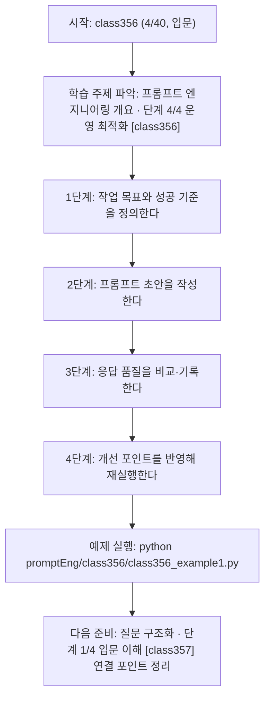
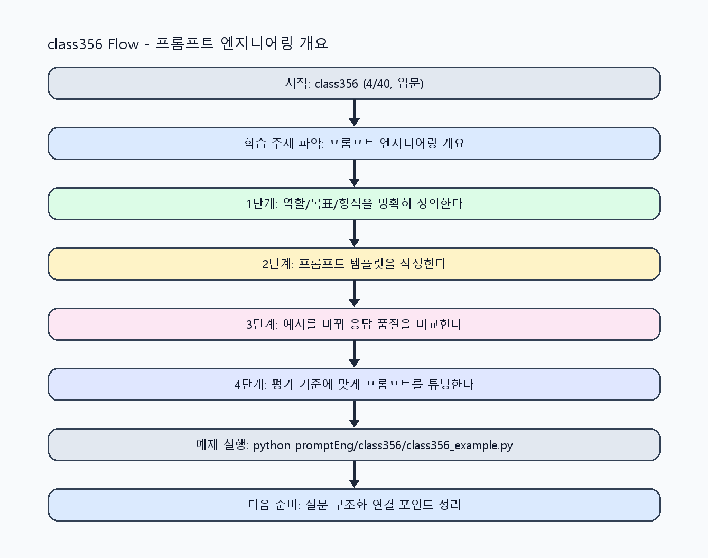

<!-- 이 파일은 www.edumgt.co.kr 의 에듀엠지티에 저작권이 있습니다 -->
# class356 자기주도 학습 가이드

## 1) 오늘의 학습 정보
- 교과목: **프롬프트 엔지니어링**
- 학습 주제: **프롬프트 엔지니어링 개요 · 단계 4/4 운영 최적화 [class356]**
- 세부 시퀀스: **4/40**
- 일정: **Day 45 / 4교시**
- 난이도: **입문**

### 교과목·학습주제 어휘 해설 (IT 강사 스타일)
#### 교과목 표현 분석: `프롬프트 엔지니어링`
- 문법 포인트: 핵심 개념 명사를 중심으로 한 명사구 구조입니다.
- 기술 포인트: 프롬프트 설계로 모델 응답 품질을 제어하는 생성형 AI 교과목입니다.
| 용어 | 문법/품사 | 한글·한자 | 영어 | 기술 설명 |
| --- | --- | --- | --- | --- |
| `프롬프트` | 명사(외래어) | 프롬프트 (한자 없음) | prompt | 모델의 응답 방향을 결정하는 입력 지시문입니다. |
| `엔지니어링` | 명사(외래어) | 엔지니어링 (한자 없음) | engineering | 재현 가능한 품질을 목표로 설계·검증하는 공학적 접근입니다. |

#### 학습주제 표현 분석: `프롬프트 엔지니어링 개요 · 단계 4/4 운영 최적화 [class356]`
- 문법 포인트: 핵심 개념 명사를 중심으로 한 명사구 구조입니다.
- 기술 포인트: 이번 차시는 `프롬프트 엔지니어링 개요` 핵심 개념을 코드 구현, 결과 해석, 점검 기준으로 연결합니다.
| 용어 | 문법/품사 | 한글·한자 | 영어 | 기술 설명 |
| --- | --- | --- | --- | --- |
| `프롬프트` | 명사(외래어) | 프롬프트 (한자 없음) | prompt | 모델의 응답 방향을 결정하는 입력 지시문입니다. |
| `엔지니어링` | 명사(외래어) | 엔지니어링 (한자 없음) | engineering | 재현 가능한 품질을 목표로 설계·검증하는 공학적 접근입니다. |
| `역할` | 명사(주제 핵심 용어) | 역할 (한자 없음) | (topic-specific) | 이번 차시 맥락: `프롬프트의 역할`은 모델에게 작업 목표·맥락·검증 기준을 전달하는 것입니다. 이를 기준으로 `역할`를 코드와 결과 해석에 연결합니다. |
| `품질` | 명사 | 품질 (品質) | quality | 정확도, 일관성, 안정성처럼 결과가 요구사항을 만족하는 정도를 나타내는 기준입니다. |
| `차이` | 명사(주제 핵심 용어) | 차이 (한자 없음) | (topic-specific) | 이번 차시 맥락: `품질 차이의 원인`은 모호한 지시, 누락된 맥락, 불명확한 출력 형식에서 자주 발생합니다. 이를 기준으로 `차이`를 코드와 결과 해석에 연결합니다. |
| `원인` | 명사(주제 핵심 용어) | 원인 (한자 없음) | (topic-specific) | 이번 차시 맥락: `품질 차이의 원인`은 모호한 지시, 누락된 맥락, 불명확한 출력 형식에서 자주 발생합니다. 이를 기준으로 `원인`를 코드와 결과 해석에 연결합니다. |

## 2) 이전에 배운 내용 (복습)
- 이전 차시: **class355 / 프롬프트 엔지니어링 개요 · 단계 3/4 실전 검증 [class355]** (Day 45 / 3교시)
- 복습 연결: 이전에 배운 **프롬프트 엔지니어링 개요 · 단계 3/4 실전 검증 [class355]** 를 떠올리며, 오늘 **프롬프트 엔지니어링 개요 · 단계 4/4 운영 최적화 [class356]** 와 어떤 점이 이어지는지 비교해 보세요.

## 3) 주제를 아주 쉽게 이해하기
- 한 줄 설명: 프롬프트 품질이 왜 달라지는지 원리를 이해하고, 원하는 결과를 얻기 위한 설계 기준을 세우는 시작 차시입니다.
- 왜 배우나요?: 같은 LLM이라도 지시문의 명확성, 맥락, 제약조건에 따라 출력 품질과 안정성이 크게 달라집니다.

### 핵심 개념 3가지
1. `프롬프트의 역할`은 모델에게 작업 목표·맥락·검증 기준을 전달하는 것입니다.
2. `품질 차이의 원인`은 모호한 지시, 누락된 맥락, 불명확한 출력 형식에서 자주 발생합니다.
3. `학습 목표`는 프롬프트 패턴 이해와 응답 제어 기술 확보입니다.

### 비유로 이해하기
- 친구에게 길을 물을 때 목적지와 조건을 정확히 말해야 정확한 답을 듣는 것과 같아요.

## 4) 실습 환경 만들기 (항상 먼저)
아래 명령은 **처음 한 번** 준비해 두면 이후 학습이 쉬워집니다.

### Windows PowerShell
```powershell
cd C:\DevOps\Python-AI_Agent-Class
python -m venv .venv
.\.venv\Scripts\Activate.ps1
python -m pip install --upgrade pip
pip install -r requirements.txt
```

### Linux/macOS (bash)
```bash
cd /path/to/Python-AI_Agent-Class
python3 -m venv .venv
source .venv/bin/activate
python -m pip install --upgrade pip
pip install -r requirements.txt
```

## 5) 오늘의 예제 코드
- 예제 파일: `class356_example1.py`
- 실행 명령:
```bash
python promptEng/class356/class356_example1.py
```

### example1~example5 단계별 테스트 확장
1. example1: 모호한 프롬프트와 명확한 프롬프트를 비교한다.
2. example2: 명확성/맥락/제약조건 체크리스트를 적용한다.
3. example3: 동일 질문의 품질 편차를 재현해 기록한다.
4. example4: 개선 전후 결과를 정량 기준으로 비교한다.
5. example5: 과목 학습 목표 기반 점검표를 완성한다.

<!-- AUTO-GENERATED: TECH_STACK_FLOW START -->
### 기술 스택
- 언어: `Python 3`
- 실행: `CLI` (`python promptEng/class356/class356_example1.py`)
- 주요 문법: `요구사항 요약 함수`, `프롬프트 문자열 템플릿`, `품질 비교 출력`, `체크리스트 dict`
- 학습 포커스: `프롬프트 엔지니어링 개요 · 단계 4/4 운영 최적화 [class356]`

### 실습 example1.py 동작 원리 (Mermaid Flowchart)


### Flow PNG 캡처

<!-- AUTO-GENERATED: TECH_STACK_FLOW END -->

### 예제 코드를 볼 때 집중할 포인트
1. 질문 의도와 프롬프트 목표가 1:1로 대응되는지 확인하기
2. 모호한 표현(적당히/대충)을 제거했는지 점검하기
3. 품질 평가 기준이 문서화되어 재현 가능한지 확인하기

## 6) 퀴즈로 복습하기 (10문항)
- 퀴즈 파일: `class356_quiz.html`
- 브라우저에서 열기:
```bash
promptEng/class356/class356_quiz.html
```
- 버튼 설명:
1. `채점하기`: 현재 선택한 답으로 점수를 계산해요.
2. `다시풀기`: 선택을 모두 지우고 처음부터 다시 풀어요.

## 7) 혼자 실습 순서 (초등학생 버전)
1. 코드를 한 번 그대로 실행해요.
2. 숫자/문장 값을 1개 바꿔요.
3. 결과가 왜 바뀌었는지 한 줄로 적어요.
4. 함수를 1개 더 만들어 작은 기능을 추가해요.

### 실습 미션
1. 동일 질문을 모호한 프롬프트와 명확한 프롬프트로 각각 실행해 비교하세요.
2. 명확성/맥락/제약조건 체크리스트로 프롬프트를 진단하세요.
3. 출력 품질 차이를 재현 가능한 기준으로 문서화하세요.

## 8) 스스로 점검 체크리스트
- [ ] 프롬프트 역할과 품질 차이 원인을 설명할 수 있다.
- [ ] 명확성·맥락·제약조건 3요소를 프롬프트에 반영했다.
- [ ] 개선 전후 결과를 근거와 함께 비교했다.

## 9) 막히면 이렇게 해결해요
1. 에러 메시지 마지막 줄을 먼저 읽어요.
2. 함수 이름과 괄호 짝을 확인해요.
3. `print()`를 넣어 중간 값을 확인해요.
4. 그래도 안 되면 어제 성공한 코드와 한 줄씩 비교해요.

## 10) 학습 후 다음에 배울 내용
- 다음 차시: **class357 / 질문 구조화 · 단계 1/4 입문 이해 [class357]** (Day 45 / 5교시)
- 미리보기: 다음 차시 전에 **프롬프트 엔지니어링 개요 · 단계 4/4 운영 최적화 [class356]** 핵심 코드 1개를 다시 실행해 두면 질문 구조화 · 단계 1/4 입문 이해 [class357] 학습이 더 쉬워집니다.

## 11) 다음 차시 연결
- 다음 차시에서는 역할/목표/입력/출력형식/제약조건을 포함한 기본 구조를 고정합니다.
- 오늘 코드를 복사하지 말고, 직접 다시 작성해 보세요.
