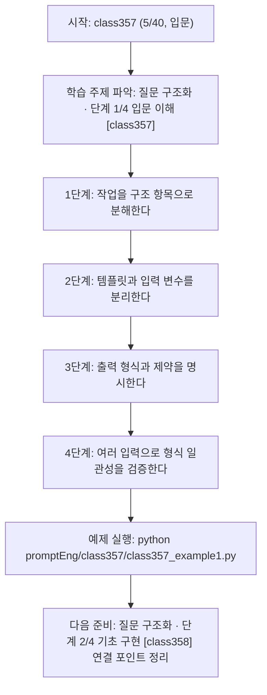
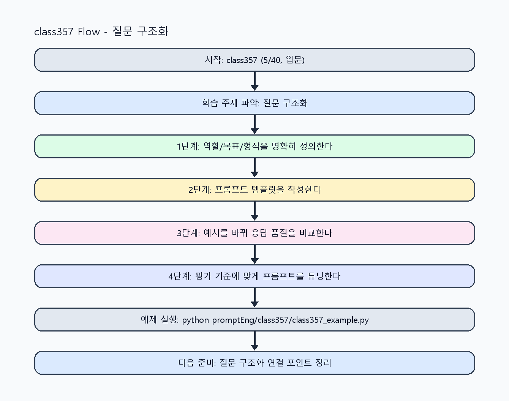

<!-- 이 파일은 www.edumgt.co.kr 의 에듀엠지티에 저작권이 있습니다 -->
# class357 자기주도 학습 가이드

## 1) 오늘의 학습 정보
- 교과목: **프롬프트 엔지니어링**
- 학습 주제: **질문 구조화 · 단계 1/4 입문 이해 [class357]**
- 세부 시퀀스: **5/40**
- 일정: **Day 45 / 5교시**
- 난이도: **입문**

### 교과목·학습주제 어휘 해설 (IT 강사 스타일)
#### 교과목 표현 분석: `프롬프트 엔지니어링`
- 문법 포인트: 핵심 개념 명사를 중심으로 한 명사구 구조입니다.
- 기술 포인트: 프롬프트 설계로 모델 응답 품질을 제어하는 생성형 AI 교과목입니다.
| 용어 | 문법/품사 | 한글·한자 | 영어 | 기술 설명 |
| --- | --- | --- | --- | --- |
| `프롬프트` | 명사(외래어) | 프롬프트 (한자 없음) | prompt | 모델의 응답 방향을 결정하는 입력 지시문입니다. |
| `엔지니어링` | 명사(외래어) | 엔지니어링 (한자 없음) | engineering | 재현 가능한 품질을 목표로 설계·검증하는 공학적 접근입니다. |

#### 학습주제 표현 분석: `질문 구조화 · 단계 1/4 입문 이해 [class357]`
- 문법 포인트: 핵심 개념 명사를 중심으로 한 명사구 구조입니다.
- 기술 포인트: 이번 차시는 `질문 구조화` 핵심 개념을 코드 구현, 결과 해석, 점검 기준으로 연결합니다.
| 용어 | 문법/품사 | 한글·한자 | 영어 | 기술 설명 |
| --- | --- | --- | --- | --- |
| `질문` | 명사(주제 핵심 용어) | 질문 (한자 없음) | (topic-specific) | `질문`는 `질문 구조화`에서 응답 형식과 품질을 일관되게 제어하기 위한 설계 단위입니다. |
| `구조화` | 명사(주제 핵심 용어) | 구조화 (한자 없음) | (topic-specific) | `구조화`는 `질문 구조화`에서 응답 형식과 품질을 일관되게 제어하기 위한 설계 단위입니다. |
| `구조` | 명사(주제 핵심 용어) | 구조 (한자 없음) | (topic-specific) | 이번 차시 맥락: 역할 부여, 목표 명시, 입력 데이터, 출력 형식, 제약조건으로 프롬프트 기본 구조를 설계하는 차시입니다. 이를 기준으로 `구조`를 코드와 결과 해석에 연결합니다. |
| `데이터` | 명사(외래어) | 데이터 (한자 없음) | data | 분석, 학습, 추론의 입력이 되는 관측값 집합입니다. |
| `분리` | 명사(주제 핵심 용어) | 분리 (한자 없음) | (topic-specific) | 이번 차시 맥락: `입력 데이터 분리`는 템플릿 재사용성과 테스트 가능성을 높입니다. 이를 기준으로 `분리`를 코드와 결과 해석에 연결합니다. |
| `제약조건` | 명사(주제 핵심 용어) | 제약조건 (한자 없음) | (topic-specific) | 이번 차시 맥락: 역할 부여, 목표 명시, 입력 데이터, 출력 형식, 제약조건으로 프롬프트 기본 구조를 설계하는 차시입니다. 이를 기준으로 `제약조건`를 코드와 결과 해석에 연결합니다. |

## 2) 이전에 배운 내용 (복습)
- 이전 차시: **class356 / 프롬프트 엔지니어링 개요 · 단계 4/4 운영 최적화 [class356]** (Day 45 / 4교시)
- 복습 연결: 이전에 배운 **프롬프트 엔지니어링 개요 · 단계 4/4 운영 최적화 [class356]** 를 떠올리며, 오늘 **질문 구조화 · 단계 1/4 입문 이해 [class357]** 와 어떤 점이 이어지는지 비교해 보세요.

## 3) 주제를 아주 쉽게 이해하기
- 한 줄 설명: 역할 부여, 목표 명시, 입력 데이터, 출력 형식, 제약조건으로 프롬프트 기본 구조를 설계하는 차시입니다.
- 왜 배우나요?: 구조가 없는 프롬프트는 재사용이 어렵고 출력 형식이 흔들려 자동화 파이프라인에 연결하기 어렵습니다.

### 핵심 개념 3가지
1. `기본 구조`는 role -> goal -> input -> output format -> constraints 순서로 정리합니다.
2. `입력 데이터 분리`는 템플릿 재사용성과 테스트 가능성을 높입니다.
3. `제약조건 명시`는 길이·금지규칙·톤 제어의 기준점입니다.

### 비유로 이해하기
- 친구에게 길을 물을 때 목적지와 조건을 정확히 말해야 정확한 답을 듣는 것과 같아요.

## 4) 실습 환경 만들기 (항상 먼저)
아래 명령은 **처음 한 번** 준비해 두면 이후 학습이 쉬워집니다.

### Windows PowerShell
```powershell
cd C:\DevOps\Python-AI_Agent-Class
python -m venv .venv
.\.venv\Scripts\Activate.ps1
python -m pip install --upgrade pip
pip install -r requirements.txt
```

### Linux/macOS (bash)
```bash
cd /path/to/Python-AI_Agent-Class
python3 -m venv .venv
source .venv/bin/activate
python -m pip install --upgrade pip
pip install -r requirements.txt
```

## 5) 오늘의 예제 코드
- 예제 파일: `class357_example1.py`
- 실행 명령:
```bash
python promptEng/class357/class357_example1.py
```

### example1~example5 단계별 테스트 확장
1. example1: 역할/목표/입력/형식/제약 5요소를 분리한다.
2. example2: 입력 변수를 바꿔 템플릿 재사용성을 검증한다.
3. example3: 구조 누락 시 발생하는 실패 응답을 점검한다.
4. example4: 구조화 전후 출력 일관성을 비교한다.
5. example5: 표준 프롬프트 구조 템플릿을 확정한다.

<!-- AUTO-GENERATED: TECH_STACK_FLOW START -->
### 기술 스택
- 언어: `Python 3`
- 실행: `CLI` (`python promptEng/class357/class357_example1.py`)
- 주요 문법: `템플릿 문자열`, `입력 변수 dict`, `출력 형식 지정`, `제약조건 리스트`
- 학습 포커스: `질문 구조화 · 단계 1/4 입문 이해 [class357]`

### 실습 example1.py 동작 원리 (Mermaid Flowchart)


### Flow PNG 캡처

<!-- AUTO-GENERATED: TECH_STACK_FLOW END -->

### 예제 코드를 볼 때 집중할 포인트
1. 구조 항목 간 중복/충돌 지시가 없는지 확인하기
2. 입력 데이터가 프롬프트 본문과 분리되는지 점검하기
3. 형식/제약 누락 시 실패 패턴을 기록하는지 확인하기

## 6) 퀴즈로 복습하기 (10문항)
- 퀴즈 파일: `class357_quiz.html`
- 브라우저에서 열기:
```bash
promptEng/class357/class357_quiz.html
```
- 버튼 설명:
1. `채점하기`: 현재 선택한 답으로 점수를 계산해요.
2. `다시풀기`: 선택을 모두 지우고 처음부터 다시 풀어요.

## 7) 혼자 실습 순서 (초등학생 버전)
1. 코드를 한 번 그대로 실행해요.
2. 숫자/문장 값을 1개 바꿔요.
3. 결과가 왜 바뀌었는지 한 줄로 적어요.
4. 함수를 1개 더 만들어 작은 기능을 추가해요.

### 실습 미션
1. 동일 작업을 구조 없는 프롬프트와 구조화 프롬프트로 비교하세요.
2. 입력 변수(질문, 문서, 조건)를 분리한 템플릿을 작성하세요.
3. 출력 형식과 제약조건을 명시해 재실행 일관성을 확인하세요.

## 8) 스스로 점검 체크리스트
- [ ] 역할/목표/입력/형식/제약 5요소를 포함한 템플릿을 작성했다.
- [ ] 입력 변수 변경 시 템플릿이 재사용 가능하다.
- [ ] 출력 형식 누락 없이 일관된 응답을 얻었다.

## 9) 막히면 이렇게 해결해요
1. 에러 메시지 마지막 줄을 먼저 읽어요.
2. 함수 이름과 괄호 짝을 확인해요.
3. `print()`를 넣어 중간 값을 확인해요.
4. 그래도 안 되면 어제 성공한 코드와 한 줄씩 비교해요.

## 10) 학습 후 다음에 배울 내용
- 다음 차시: **class358 / 질문 구조화 · 단계 2/4 기초 구현 [class358]** (Day 45 / 6교시)
- 미리보기: 다음 차시 전에 **질문 구조화 · 단계 1/4 입문 이해 [class357]** 핵심 코드 1개를 다시 실행해 두면 질문 구조화 · 단계 2/4 기초 구현 [class358] 학습이 더 쉬워집니다.

## 11) 다음 차시 연결
- 다음 차시에서는 역할과 맥락 설정을 세분화해 문맥 품질을 높입니다.
- 오늘 코드를 복사하지 말고, 직접 다시 작성해 보세요.
