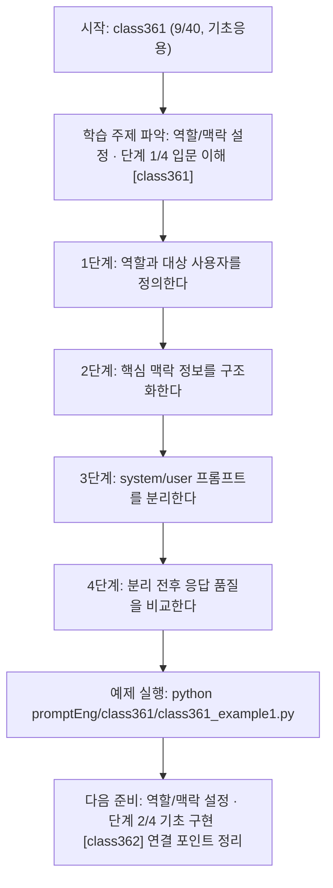
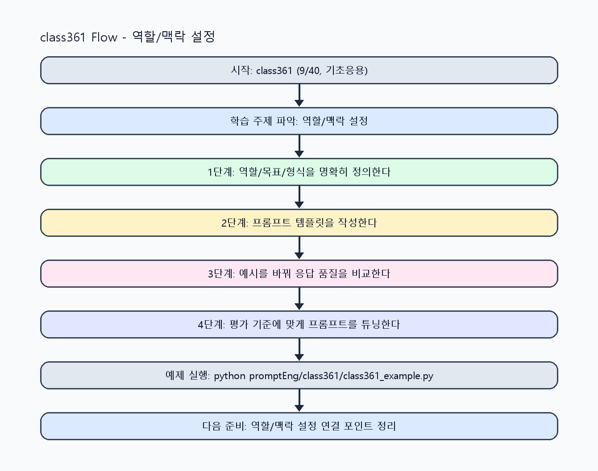

<!-- 이 파일은 www.edumgt.co.kr 의 에듀엠지티에 저작권이 있습니다 -->
# class361 자기주도 학습 가이드

## 1) 오늘의 학습 정보
- 교과목: **프롬프트 엔지니어링**
- 학습 주제: **역할/맥락 설정 · 단계 1/4 입문 이해 [class361]**
- 세부 시퀀스: **9/40**
- 일정: **Day 46 / 1교시**
- 난이도: **기초응용**

### 교과목·학습주제 어휘 해설 (IT 강사 스타일)
#### 교과목 표현 분석: `프롬프트 엔지니어링`
- 문법 포인트: 핵심 개념 명사를 중심으로 한 명사구 구조입니다.
- 기술 포인트: 프롬프트 설계로 모델 응답 품질을 제어하는 생성형 AI 교과목입니다.
| 용어 | 문법/품사 | 한글·한자 | 영어 | 기술 설명 |
| --- | --- | --- | --- | --- |
| `프롬프트` | 명사(외래어) | 프롬프트 (한자 없음) | prompt | 모델의 응답 방향을 결정하는 입력 지시문입니다. |
| `엔지니어링` | 명사(외래어) | 엔지니어링 (한자 없음) | engineering | 재현 가능한 품질을 목표로 설계·검증하는 공학적 접근입니다. |

#### 학습주제 표현 분석: `역할/맥락 설정 · 단계 1/4 입문 이해 [class361]`
- 문법 포인트: 핵심 개념 명사를 중심으로 한 명사구 구조입니다.
- 기술 포인트: 이번 차시는 `역할/맥락 설정 · 단계 1/4 입문 이해 [class361]` 용어를 중심으로 문제 정의, 코드 구현, 결과 검증까지 연결합니다.
| 용어 | 문법/품사 | 한글·한자 | 영어 | 기술 설명 |
| --- | --- | --- | --- | --- |
| `역할` | 명사(기술 개념어) | 역할 (한자 없음) | (context-specific) | 용어 `역할`: 이번 학습주제에서 정의해야 할 핵심 개념 용어입니다. |
| `맥락` | 명사(기술 개념어) | 맥락 (한자 없음) | (context-specific) | 용어 `맥락`: 이번 학습주제에서 정의해야 할 핵심 개념 용어입니다. |
| `설정` | 명사(기술 개념어) | 설정 (한자 없음) | (context-specific) | 용어 `설정`: 이번 학습주제에서 정의해야 할 핵심 개념 용어입니다. |
| `단계` | 명사(기술 개념어) | 단계 (한자 없음) | (context-specific) | 용어 `단계`: 이번 학습주제에서 정의해야 할 핵심 개념 용어입니다. |
| `입문` | 명사(기술 개념어) | 입문 (한자 없음) | (context-specific) | 용어 `입문`: 이번 학습주제에서 정의해야 할 핵심 개념 용어입니다. |
| `이해` | 명사(기술 개념어) | 이해 (한자 없음) | (context-specific) | 용어 `이해`: 이번 학습주제에서 정의해야 할 핵심 개념 용어입니다. |

## 2) 이전에 배운 내용 (복습)
- 이전 차시: **class360 / 질문 구조화 · 단계 4/4 운영 최적화 [class360]** (Day 45 / 8교시)
- 복습 연결: 이전에 배운 **질문 구조화 · 단계 4/4 운영 최적화 [class360]** 를 떠올리며, 오늘 **역할/맥락 설정 · 단계 1/4 입문 이해 [class361]** 와 어떤 점이 이어지는지 비교해 보세요.

## 3) 주제를 아주 쉽게 이해하기
- 한 줄 설명: 시스템 역할과 사용자 맥락을 분리해 답변 품질과 일관성을 높이는 차시입니다.
- 왜 배우나요?: 역할과 맥락이 섞이면 모델이 우선순위를 혼동해 답변 톤·범위·정확도가 흔들릴 수 있습니다.

### 핵심 개념 3가지
1. `역할 부여`는 모델의 답변 관점(교사, 상담사, 개발자)을 고정합니다.
2. `맥락 제공`은 배경정보, 대상 사용자, 목적을 명확히 전달합니다.
3. `시스템/사용자 프롬프트 분리`는 정책 지시와 작업 지시 충돌을 줄입니다.

### 비유로 이해하기
- 친구에게 길을 물을 때 목적지와 조건을 정확히 말해야 정확한 답을 듣는 것과 같아요.

## 4) 실습 환경 만들기 (항상 먼저)
아래 명령은 **처음 한 번** 준비해 두면 이후 학습이 쉬워집니다.

### Windows PowerShell
```powershell
cd C:\DevOps\Python-AI_Agent-Class
python -m venv .venv
.\.venv\Scripts\Activate.ps1
python -m pip install --upgrade pip
pip install -r requirements.txt
```

### Linux/macOS (bash)
```bash
cd /path/to/Python-AI_Agent-Class
python3 -m venv .venv
source .venv/bin/activate
python -m pip install --upgrade pip
pip install -r requirements.txt
```

## 5) 오늘의 예제 코드
- 예제 파일: `class361_example1.py`
- 실행 명령:
```bash
python promptEng/class361/class361_example1.py
```

### example1~example5 단계별 테스트 확장
1. example1: 역할만 변경해 응답 톤 차이를 확인한다.
2. example2: 맥락 정보를 단계적으로 추가해 품질 변화를 비교한다.
3. example3: system/user 프롬프트 분리 전후 충돌 케이스를 점검한다.
4. example4: 역할·맥락 조합별 베스트 패턴을 도출한다.
5. example5: 서비스 적용용 역할/맥락 가이드를 정리한다.

<!-- AUTO-GENERATED: TECH_STACK_FLOW START -->
### 기술 스택
- 언어: `Python 3`
- 실행: `CLI` (`python promptEng/class361/class361_example1.py`)
- 주요 문법: `system_prompt`, `user_prompt`, `context 블록`, `역할별 톤 프리셋`
- 학습 포커스: `역할/맥락 설정 · 단계 1/4 입문 이해 [class361]`

### 실습 example1.py 동작 원리 (Mermaid Flowchart)


### Flow PNG 캡처

<!-- AUTO-GENERATED: TECH_STACK_FLOW END -->

### 예제 코드를 볼 때 집중할 포인트
1. 역할 지시가 모호하지 않고 단일한지 확인하기
2. 맥락 정보가 과도하거나 부족하지 않은지 점검하기
3. 시스템 지시와 사용자 요청 충돌 시 우선순위를 명시했는지 확인하기

## 6) 퀴즈로 복습하기 (10문항)
- 퀴즈 파일: `class361_quiz.html`
- 브라우저에서 열기:
```bash
promptEng/class361/class361_quiz.html
```
- 버튼 설명:
1. `채점하기`: 현재 선택한 답으로 점수를 계산해요.
2. `다시풀기`: 선택을 모두 지우고 처음부터 다시 풀어요.

## 7) 혼자 실습 순서 (초등학생 버전)
1. 코드를 한 번 그대로 실행해요.
2. 숫자/문장 값을 1개 바꿔요.
3. 결과가 왜 바뀌었는지 한 줄로 적어요.
4. 함수를 1개 더 만들어 작은 기능을 추가해요.

### 실습 미션
1. 같은 질문에 역할만 바꿔 응답 톤 변화를 비교하세요.
2. 맥락 정보를 단계적으로 추가해 답변 품질 차이를 기록하세요.
3. system/user 프롬프트를 분리한 템플릿을 작성하세요.

## 8) 스스로 점검 체크리스트
- [ ] 역할과 맥락을 별도 필드로 설계했다.
- [ ] system/user 프롬프트 분리 개념을 코드로 반영했다.
- [ ] 역할/맥락 변경에 따른 출력 차이를 설명할 수 있다.

## 9) 막히면 이렇게 해결해요
1. 에러 메시지 마지막 줄을 먼저 읽어요.
2. 함수 이름과 괄호 짝을 확인해요.
3. `print()`를 넣어 중간 값을 확인해요.
4. 그래도 안 되면 어제 성공한 코드와 한 줄씩 비교해요.

## 10) 학습 후 다음에 배울 내용
- 다음 차시: **class362 / 역할/맥락 설정 · 단계 2/4 기초 구현 [class362]** (Day 46 / 2교시)
- 미리보기: 다음 차시 전에 **역할/맥락 설정 · 단계 1/4 입문 이해 [class361]** 핵심 코드 1개를 다시 실행해 두면 역할/맥락 설정 · 단계 2/4 기초 구현 [class362] 학습이 더 쉬워집니다.

## 11) 다음 차시 연결
- 다음 차시에서는 표/JSON/길이/어조/금지규칙 중심으로 출력 제어를 강화합니다.
- 오늘 코드를 복사하지 말고, 직접 다시 작성해 보세요.
