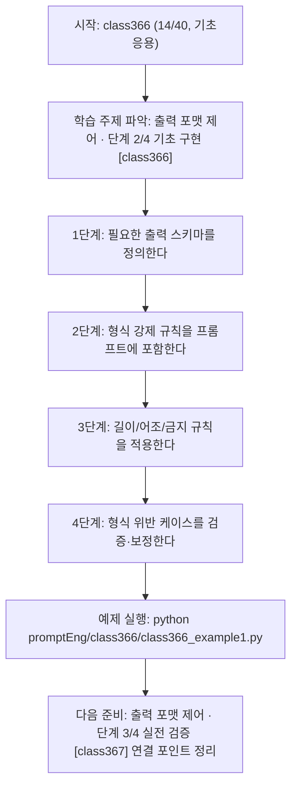
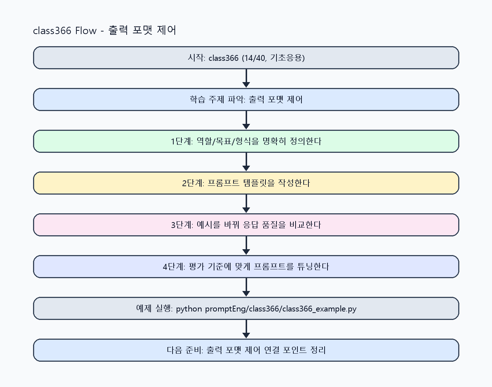

<!-- 이 파일은 www.edumgt.co.kr 의 에듀엠지티에 저작권이 있습니다 -->
# class366 자기주도 학습 가이드

## 1) 오늘의 학습 정보
- 교과목: **프롬프트 엔지니어링**
- 학습 주제: **출력 포맷 제어 · 단계 2/4 기초 구현 [class366]**
- 세부 시퀀스: **14/40**
- 일정: **Day 46 / 6교시**
- 난이도: **기초응용**

### 교과목·학습주제 어휘 해설 (IT 강사 스타일)
#### 교과목 표현 분석: `프롬프트 엔지니어링`
- 문법 포인트: 핵심 개념 명사를 중심으로 한 명사구 구조입니다.
- 기술 포인트: 프롬프트 설계로 모델 응답 품질을 제어하는 생성형 AI 교과목입니다.
| 용어 | 문법/품사 | 한글·한자 | 영어 | 기술 설명 |
| --- | --- | --- | --- | --- |
| `프롬프트` | 명사(외래어) | 프롬프트 (한자 없음) | prompt | 모델의 응답 방향을 결정하는 입력 지시문입니다. |
| `엔지니어링` | 명사(외래어) | 엔지니어링 (한자 없음) | engineering | 재현 가능한 품질을 목표로 설계·검증하는 공학적 접근입니다. |

#### 학습주제 표현 분석: `출력 포맷 제어 · 단계 2/4 기초 구현 [class366]`
- 문법 포인트: 핵심 개념 명사를 중심으로 한 명사구 구조입니다.
- 기술 포인트: 이번 차시는 `출력 포맷 제어` 핵심 개념을 코드 구현, 결과 해석, 점검 기준으로 연결합니다.
| 용어 | 문법/품사 | 한글·한자 | 영어 | 기술 설명 |
| --- | --- | --- | --- | --- |
| `포맷` | 명사(주제 핵심 용어) | 포맷 (한자 없음) | (topic-specific) | `포맷`는 `출력 포맷 제어`에서 응답 형식과 품질을 일관되게 제어하기 위한 설계 단위입니다. |
| `제어` | 명사(주제 핵심 용어) | 제어 (한자 없음) | (topic-specific) | 이번 차시 맥락: 표 형식, JSON 형식, 길이 제한, 어조 제어, 금지 규칙으로 출력 형식을 안정화하는 차시입니다. 이를 기준으로 `제어`를 코드와 결과 해석에 연결합니다. |
| `표` | 명사(주제 핵심 용어) | 표 (한자 없음) | (topic-specific) | 이번 차시 맥락: 표 형식, JSON 형식, 길이 제한, 어조 제어, 금지 규칙으로 출력 형식을 안정화하는 차시입니다. 이를 기준으로 `표`를 코드와 결과 해석에 연결합니다. |
| `JSON` | 영문 기술명/약어 | JSON (한자 없음) | JSON | 이번 차시 맥락: 표 형식, JSON 형식, 길이 제한, 어조 제어, 금지 규칙으로 출력 형식을 안정화하는 차시입니다. 이를 기준으로 `JSON`를 코드와 결과 해석에 연결합니다. |
| `길이·톤·스타일` | 명사(주제 핵심 용어) | 길이·톤·스타일 (한자 없음) | (topic-specific) | 이번 차시 맥락: `길이·톤·스타일 제어`는 사용자 경험과 운영 정책을 동시에 맞춥니다. 이를 기준으로 `길이·톤·스타일`를 코드와 결과 해석에 연결합니다. |
| `금지` | 명사(주제 핵심 용어) | 금지 (한자 없음) | (topic-specific) | 이번 차시 맥락: 표 형식, JSON 형식, 길이 제한, 어조 제어, 금지 규칙으로 출력 형식을 안정화하는 차시입니다. 이를 기준으로 `금지`를 코드와 결과 해석에 연결합니다. |

## 2) 이전에 배운 내용 (복습)
- 이전 차시: **class365 / 출력 포맷 제어 · 단계 1/4 입문 이해 [class365]** (Day 46 / 5교시)
- 복습 연결: 이전에 배운 **출력 포맷 제어 · 단계 1/4 입문 이해 [class365]** 를 떠올리며, 오늘 **출력 포맷 제어 · 단계 2/4 기초 구현 [class366]** 와 어떤 점이 이어지는지 비교해 보세요.

## 3) 주제를 아주 쉽게 이해하기
- 한 줄 설명: 표 형식, JSON 형식, 길이 제한, 어조 제어, 금지 규칙으로 출력 형식을 안정화하는 차시입니다.
- 왜 배우나요?: 실무 자동화에서는 사람이 읽기 쉬운 답변보다 파싱 가능한 구조와 형식 일관성이 더 중요합니다.

### 핵심 개념 3가지
1. `표/JSON 출력`은 후처리 자동화와 데이터 검증을 쉽게 만듭니다.
2. `길이·톤·스타일 제어`는 사용자 경험과 운영 정책을 동시에 맞춥니다.
3. `금지 규칙`은 허용되지 않는 표현/내용을 사전에 차단합니다.

### 비유로 이해하기
- 친구에게 길을 물을 때 목적지와 조건을 정확히 말해야 정확한 답을 듣는 것과 같아요.

## 4) 실습 환경 만들기 (항상 먼저)
아래 명령은 **처음 한 번** 준비해 두면 이후 학습이 쉬워집니다.

### Windows PowerShell
```powershell
cd C:\DevOps\Python-AI_Agent-Class
python -m venv .venv
.\.venv\Scripts\Activate.ps1
python -m pip install --upgrade pip
pip install -r requirements.txt
```

### Linux/macOS (bash)
```bash
cd /path/to/Python-AI_Agent-Class
python3 -m venv .venv
source .venv/bin/activate
python -m pip install --upgrade pip
pip install -r requirements.txt
```

## 5) 오늘의 예제 코드
- 예제 파일: `class366_example1.py`
- 실행 명령:
```bash
python promptEng/class366/class366_example1.py
```

### example1~example5 단계별 테스트 확장
1. example1: 표 형식과 JSON 형식 출력을 각각 생성한다.
2. example2: 길이 제한과 어조 제어를 적용해 비교한다.
3. example3: 금지 규칙 위반 응답 케이스를 점검한다.
4. example4: 형식 강제 실패 복구 로직을 검증한다.
5. example5: 구조화 출력 운영 기준을 문서화한다.

<!-- AUTO-GENERATED: TECH_STACK_FLOW START -->
### 기술 스택
- 언어: `Python 3`
- 실행: `CLI` (`python promptEng/class366/class366_example1.py`)
- 주요 문법: `JSON schema`, `표 변환 함수`, `길이 제한 옵션`, `금지어 필터`
- 학습 포커스: `출력 포맷 제어 · 단계 2/4 기초 구현 [class366]`

### 실습 example1.py 동작 원리 (Mermaid Flowchart)


### Flow PNG 캡처

<!-- AUTO-GENERATED: TECH_STACK_FLOW END -->

### 예제 코드를 볼 때 집중할 포인트
1. JSON 키 누락·타입 오류를 점검하는지 확인하기
2. 길이 제한이 핵심 정보 누락을 만들지 않는지 점검하기
3. 금지 규칙이 과차단/미차단 없이 동작하는지 확인하기

## 6) 퀴즈로 복습하기 (10문항)
- 퀴즈 파일: `class366_quiz.html`
- 브라우저에서 열기:
```bash
promptEng/class366/class366_quiz.html
```
- 버튼 설명:
1. `채점하기`: 현재 선택한 답으로 점수를 계산해요.
2. `다시풀기`: 선택을 모두 지우고 처음부터 다시 풀어요.

## 7) 혼자 실습 순서 (초등학생 버전)
1. 코드를 한 번 그대로 실행해요.
2. 숫자/문장 값을 1개 바꿔요.
3. 결과가 왜 바뀌었는지 한 줄로 적어요.
4. 함수를 1개 더 만들어 작은 기능을 추가해요.

### 실습 미션
1. 같은 입력을 표 형식과 JSON 형식으로 각각 생성해 비교하세요.
2. 요약 길이 제한(문장 수/토큰 수)을 적용해 안정성을 점검하세요.
3. 금지 규칙을 추가해 위반 응답이 줄어드는지 확인하세요.

## 8) 스스로 점검 체크리스트
- [ ] 구조화 출력(JSON 또는 표)을 안정적으로 생성했다.
- [ ] 길이/어조/문체 제어 규칙을 적용했다.
- [ ] 금지 규칙 위반 케이스를 탐지·처리했다.

## 9) 막히면 이렇게 해결해요
1. 에러 메시지 마지막 줄을 먼저 읽어요.
2. 함수 이름과 괄호 짝을 확인해요.
3. `print()`를 넣어 중간 값을 확인해요.
4. 그래도 안 되면 어제 성공한 코드와 한 줄씩 비교해요.

## 10) 학습 후 다음에 배울 내용
- 다음 차시: **class367 / 출력 포맷 제어 · 단계 3/4 실전 검증 [class367]** (Day 46 / 7교시)
- 미리보기: 다음 차시 전에 **출력 포맷 제어 · 단계 2/4 기초 구현 [class366]** 핵심 코드 1개를 다시 실행해 두면 출력 포맷 제어 · 단계 3/4 실전 검증 [class367] 학습이 더 쉬워집니다.

## 11) 다음 차시 연결
- 다음 차시에서는 zero/one/few-shot 예시 기반 기법으로 정확도를 높입니다.
- 오늘 코드를 복사하지 말고, 직접 다시 작성해 보세요.
